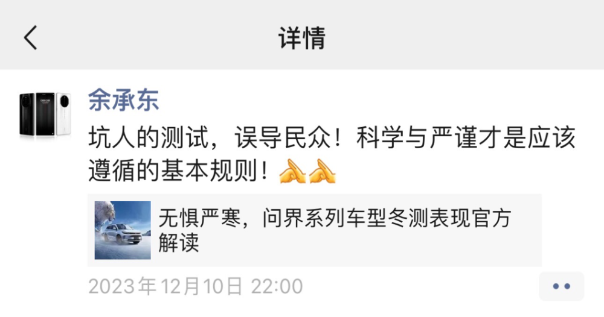

# “大嘴”余承东归来：怒怼小米抄袭，华为急需翻身仗

作者：张睿 程潇熠

编辑：康晓

出品丨深网·腾讯新闻小满工作室

曾经的“大嘴”余承东又回来了。

与何小鹏的口水战刚刚告一段落，朋友圈怒怼“懂车帝”的余波还未消散，华为终端BG CEO余承东又陷入和小米的舆论风波中。

起因是，余承东在2023花粉年会指出，友商抄袭华为的知识产权，把华为折叠手机中使用的双旋水滴铰链直接变成龙骨铰链。虽然余承东没直接点明友商的名字，但龙骨转轴恰好是小米发布MIX
Fold 3 手机时宣传的重点。

对此，小米公司官方微博于12日中午发布声明称，余承东无端针对龙骨转轴技术发布不实言论，与事实严重不符，并对小米“龙骨转轴”专利和双旋水滴铰链专利进行详细的分解。

小米集团董事长特别助理徐洁云解释，“这个声明仅针对余承东先生个人，而非华为。”截至发稿前，华为并没有对小米的公开声明回复。

余承东是整个华为高层中比较另类的存在，多年之前，余承东就以“大嘴”被业界熟知。

余承东从2011年开始负责华为消费者业务，2012年3月，靠一条“要推出一款比iPhone5要强大很多的旗舰手机”的微博而一炮而红。为了给华为手机造势，余承东多次提出“打败三星、苹果”的激进言论。

不过，在华为手机10多年的发展历程中，余承东吹过的牛一一实现。“如果不是因为制裁，华为手机早就做到世界第一了。”余承东曾在2021年1月的内部信中写道。

因为美国制裁，华为手机要做世界第一的梦想被搁浅，华为终端业务迅速陷入低谷，曾经活跃社交媒体上的余承东也随之沉寂。

两年后，mate 60终于强势归来，合作汽车品牌问界销量也起死回生，但华为终端要想在中国手机市场和新能源车市场彻底扳回局面，仍面临诸多挑战。

在当下市场竞争的关键时期，也就不难理解，余承东为何重回“大嘴”本色。

华为折叠手机地位遭遇挑战

在8月29日华为Mate60系列手机带着5G速度回归之前，华为在手机市场的地位主要靠折叠手机支撑。截至2021年年底，华为折叠屏手机累计销量过百万台，市场份额为10%，排名在三星之后。

而此次备受争议的铰链则是折叠手机的重要零部件。铰链等机械结构影响折叠屏手机的开合及折痕控制，目前主流的折叠屏铰链分为U型铰链和水滴铰链等。

小米究竟是否涉嫌抄袭华为？

**据定焦数码研究，小米龙骨转轴对应专利号CN212297248，华为水滴转轴对应专利号CN116074415A，从构型来看，双方确实存在设计上的差异，虽然都呈现水滴型结构，但小米的下端结构件是支杆，华为的下端结构件用到的是旋钮。**

**但亦有分析人士指出，虽然二者技术上存在差异，但基本原理相似。**

2021年底之前，国内手机厂商折叠手机阵营仅有华为的Mate Xs及小米的MIX FOLD。

据IDC公布的数据显示，在2021年国内折叠屏手机市场中，华为折叠屏手机占比高达49.3%，占据了近半数的市场份额，三星市场占比为
28.8%，小米市场占比为13.2%，

2021年12月，OPPO推出折叠手机Find
N，首发起售价7699元，把折叠屏手机售价拉到了1万元以内。在此后的两年内，折叠屏手机成为目前国产手机品牌在高端市场对抗苹果唯一的竞争力。随着折叠手机续航、重量、大小屏融合、APP适配等问题的持续解决，折叠手机新品已经成为头部手机厂商重点竞争领域。

据CINNO
Research数据显示，2023年第三季度，中国市场折叠屏手机销量达198万部。其中，华为折叠屏市占率28.6%，排名第一。其次为荣耀（15.7%）、vivo（15.4%）、三星（13.9%）、OPPO（11.7%）、小米（8.7%）、MOTO（5.8%）。

**从市占率上看，华为依然稳居国内折叠手机市场第一的位置，但市场份额已经从2021年的49.3%下滑至2023年Q3的28.6%。**

在折叠手机行业竞争中，小米折叠屏是华为不可小觑的对手。据小米官方数据显示，其8月发布的小米MIX Fold 3销量是上一代产品的2.25倍。

更重要的是，与华为Mate X3和X5动辄上万、且供货不足很难抢到相比，起售价8999元的小米MIX Fold 3有价格和供货优势。

眼下，虽然小米和华为关于铰链专利的争论还没定论，但这也不耽误华为和小米折叠手机靠这一点再赚一波流量。

问界急需翻身仗

折叠手机第一的位置受到挑战、Mate60系列产能的恢复还需要时间，卖车成了华为填补利润下滑的重要方案。

从2021年中旬开始，门店级别达标的华为高端体验店可以售卖问界汽车。“一个月完成8——10台的销售量就算达标。受华为品牌的加持，2022年售卖问界确实给门店带来部分利润。”曾有华为大商对《深网》透露。

转折点发生在今年年初。

2023年1月，问界销量断崖式下跌，从2022年下半年的月销量在万辆左右徘徊，下跌至不到4500辆。今年1-8月，问界始终未能回归去年下半年销量水平，月销量在5000附近徘徊，最低月销仅3505辆。业内曾称，“问界已到生死存亡时刻”。

略显迷茫的华为汽车业务难以找到新着力点，而华为Mate60 Pro的发布带来了新转机。

**Mate60 系列上市半个月后，问界新M7系列正式上市。靠着Mate60系列“遥遥领先”的品牌加持，问界新M7一经上市就销售火爆。**

据车Fans数据，问界新M7上市后进店量暴涨300%，9月16日问界新增订单量创历史新高。

车Fans创始人孙少军称，“9月上半个月，新问界M7就像黑洞一样吸走了所有流量，门店也是人山人海，订单捷报频传。”

“10月6日单日订单创新高达7000台。”余承东曾在朋友圈发布战报。

**据问界汽车官方数据，公司10月交付新车 12700 辆，其中问界新 M7 交付新车 10547
辆，单车型单月交付破万。而据乘联会11月销量数据显示，问界M7这个月以17039辆的销量超越超理想L7。**

11月27日，余承东在朋友圈透露，“问界新M7 大定突破十万辆，只用了短短两个半月。”

就在问界M7销量火箭式爬升之际，懂车帝的一纸报告却给问界泼了一盆冷水。面对懂车帝“问界M7以31.60%的纯电续航达成率排名倒数第一”的结论，余承东亲自下场，在朋友圈怒怼懂车帝“误导民众”。

在华为手机和车业务双双爬坡的关键时刻，跨过低谷、重拾信心的余承东显然不会放过任何一场“口水战”。

