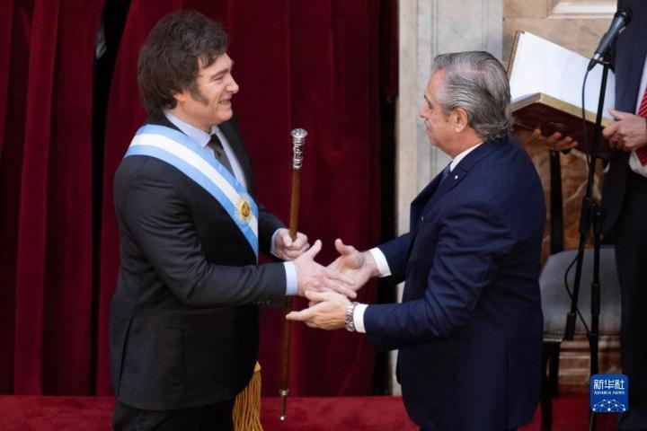

# “电锯总统”砍掉9个政府部门，米莱能“让阿根廷再次伟大”吗

潮新闻客户端 记者 肖暖暖

据新华社报道，当地时间12月10日，阿根廷新总统米莱在首都布宜诺斯艾利斯宣誓就职，正式开启为期4年的总统任期。阿根廷新一届政府也在同日正式就职。

当天，米莱在阿根廷国会向宪法宣誓，并从前任总统费尔南德斯手中接过绶带和权杖。

_12月10日，在阿根廷首都布宜诺斯艾利斯，阿根廷新总统米莱（左）在阿根廷国会从前任总统费尔南德斯手中接过绶带和权杖。 图源：新华社_

宣誓仪式后，米莱在演讲中表示，将努力推动变革，以结束衰退、重建繁荣。他向支持者说，“我们将使国家重新站起来，让阿根廷再次伟大。”

_12月10日，在阿根廷首都布宜诺斯艾利斯，阿根廷新总统米莱在总统府玫瑰宫阳台上向民众发表演说。 图源：新华社_

据观察者网报道，当地时间10日晚间，阿根廷总统办公室在社交平台X（原推特平台）上发布了一张米莱的工作照，并配文表示，“阿根廷共和国总统哈维尔·米莱签署总统令，该法令将现有政府部门的数量减少至9个。”

据悉，米莱领导的新一届阿根廷政府，共包括1名内阁首席部长和9名部长。

裁撤9个部门，或为快速实施改革

据《环球时报》援引阿根廷《民族报》报道，根据法令内容，原来的能源和矿业部将被划入经济部；而社会发展、教育、劳动、妇女和文化部将被纳入人力资本部。

此前，米莱还考虑过将卫生部整合进人力资本部，但最后该部作为独立部门被保留。

该法令还称，为了优化阿根廷的公共工程、住房、通信和交通，政府将整合创建基础设施部。与此同时，旅游环境和可持续发展部将纳入内政部的组织架构内。

_阿根廷总统办公室表示，米莱签署总统令将现有政府部门的数量减少至9个。 图源:观察者网_

“米莱在就职首日裁撤9个部门，反映出他的政府重组计划旨在精简政府结构，提高行政效率。”安徽大学拉丁美洲研究所所长、博士生导师范和生告诉潮新闻记者，米莱此举可能源于其竞选时承诺的减少政府开支和官僚主义的立场。他表示，通过减少部门数量，米莱似乎在尝试实现更为集中和高效的政府管理模式，这也可能是对国家经济状况的直接回应，意在快速实施改革。

阿根廷政府现存的9个部门分别是经济部、安全部、国防部、内政部、外交部、司法部、基础设施部、卫生部以及人力资本部。为什么留存的是这9个部门？

范和生分析，在米莱的裁撤行动中，保留的9个部门是国家运作的关键领域，新成立的人力资本部集中了劳工、教育和社会发展等原部门的职能。“这些部门的保留显示了新政府对于国家核心职能的重视，同时也可能是为了确保政府在转型期间能够维持基本的国家机能和社会稳定。”

激进主张后态度转变，政策效果仍有待观察

据观察者网报道，现年53岁的米莱拥有经济学文凭，他在2018年总计接受了235次采访，成为当年接受电视采访次数最多的经济学家。2021年，米莱组建极右翼的“自由前进党”，并当选阿根廷国会众议员。

竞选总统期间，米莱提出了可谓颠覆性的竞选纲领。

他主张关闭央行，取消本国货币比索、改用美元，取消关税和外汇管制，实现彻底的资金与货物自由流动；裁并大部分政府机构，包括教育、医疗、国企乃至社会保障机制等在内的公共服务部门大幅私有化。同时，他反对堕胎、同性婚姻和安乐死，放松枪支管控、赞成器官自由交易；而在外交上则全面倒向美国、西方世界和以色列。

 _11月19日，米莱在首都布宜诺斯艾利斯的竞选总部外向民众致意。 图源：新华社_

8月初，米莱在阿根廷第一轮大选取得票数优势之后曾表示，阿根廷将拒绝加入金砖国家，以及，“我们将不会同任何共产主义国家结盟。”

然而，据《环球时报》援引阿根廷TN新闻电视台11月25日文章，米莱将允许阿根廷作为不太活跃的成员加入金砖国家。米莱团队表示，目前对于阿根廷来说，金砖国家提供“机会而不是风险”。

当选总统后，米莱也感谢中国祝贺他当选，并称不打算终止与中国的外交关系。

如何评价米莱的政治主张及其态度转变？

范和生指出，自竞选总统以来，米莱的政治主张具有显著的自由市场和个人自由倾向，他提出了一系列激进的改革措施，包括废除中央银行、使用美元代替阿根廷比索、以及强化与美国和以色列的联盟关系。“然而，当选后，米莱显示出政策和态度上的灵活性，他对中国和巴西的温和表态以及对金砖国家的积极评价，表明他在实际政治行动中愿意调整其立场，以适应国际和国内的实际情况。”

那么，米莱的政治主张能否完成选民期待，“让阿根廷再次伟大”？

范和生对此持保留态度。他表示，米莱的政治主张预计将在一定程度上推动阿根廷的经济改革和政府效率提升，但能否实现“让阿根廷再次伟大”的目标，还取决于他的政策如何在实践中得以执行，以及他能否在国内外政策上取得平衡。

范和生对此评价道，“鉴于米莱已经表现出一定的政策调整能力，这为他实现竞选承诺并赢得更广泛支持提供了可能。不过，考虑到阿根廷深层次的经济和社会挑战，米莱的政策效果仍然是未来几年内国内外观察者密切关注的焦点。”

“转载请注明出处”

