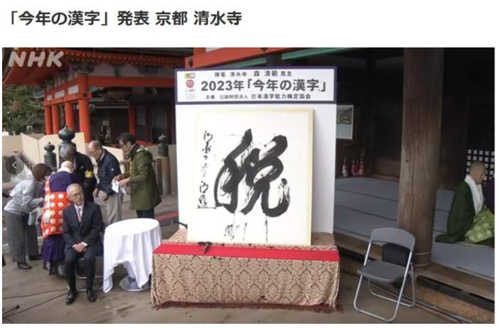

# “税”字当选日本2023年年度汉字，日媒：反映民众不安

中新网12月12日电 综合日媒报道，当地时间12日下午，日本汉字能力检定协会宣布，“税”字当选为2023年年度汉字。

_图片来源：日本放送协会(NHK)报道截图_

据报道，发布会在位于京都的清水寺举行，清水寺住持森清范挥毫写下了“税”字。

日本《京都新闻》报道称，“税”字反映了日本民众这一年来围绕增税和减税的不安与烦恼。

报道称，“暑”字和“战”字分列二、三位。

“今年的汉字”活动自1995年开始，2023年为第29届。2022年的年度汉字为“战”。

