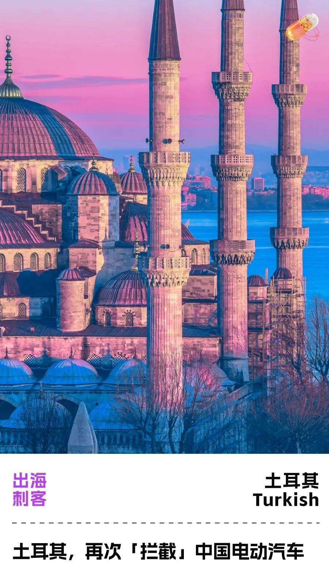
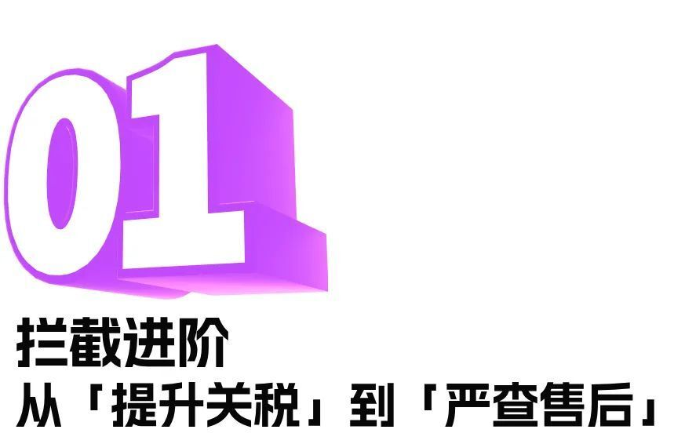
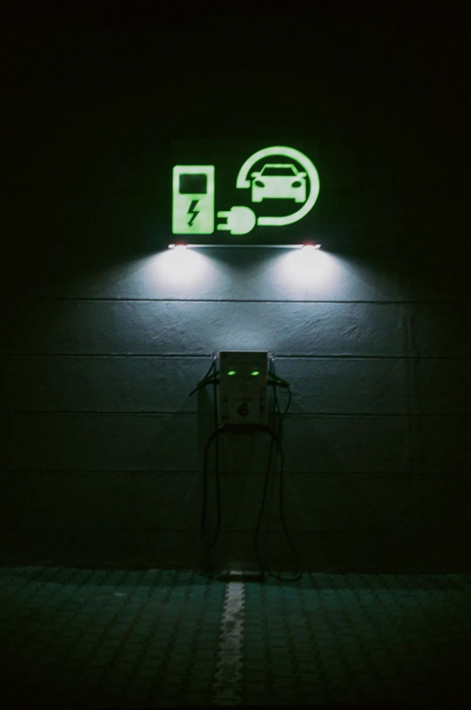
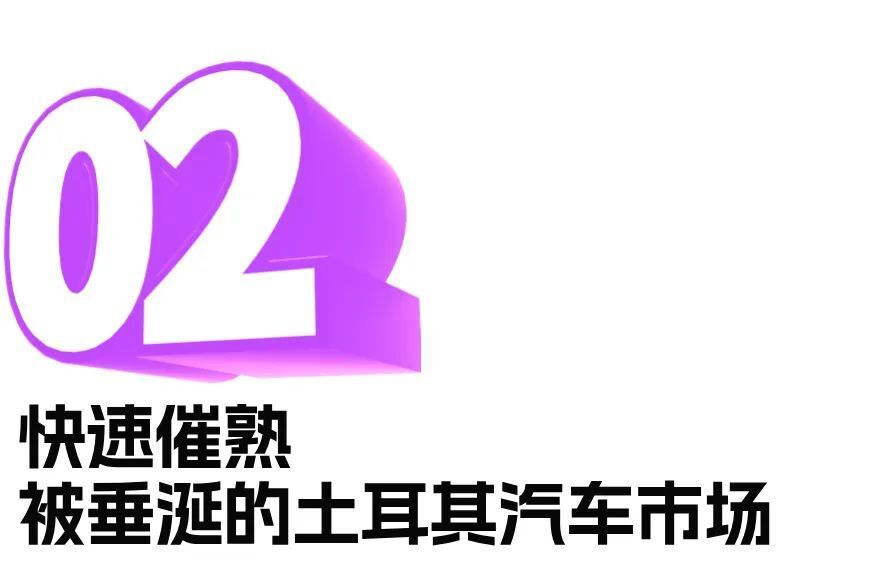
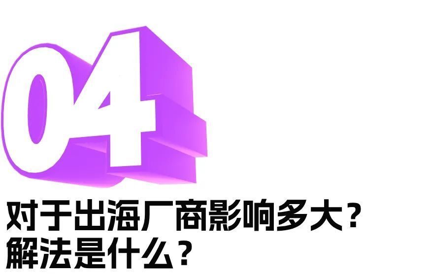

# 土耳其，再次“拦截”中国电动汽车

本文来自微信公众号：新商业Tech（ID：NBTechX），作者：玛丽莲梦呐，题图来自：视觉中国

“除了符合赦免条件，否则自海外申报进口的新能源汽车，必须 **额外获得许可文件才能进入土耳其市场** 。”

“获得许可文件，需满足土耳其对新能源车品牌的售后体系要求。例如，出口电动汽车到土耳其，必须在该国拥有至少 **140家授权服务站**
……每个电动汽车品牌，需要开设 **一个呼叫中心** ……”

这项土耳其工业和技术部11月29日刚刚推出的新政，被业内普遍认为是在“为难”来自中国的电动汽车厂商。原因也很简单：

一、凡是与土耳其有 **自由贸易协定的欧盟国家** 进口的电动汽车， **不受该法令限制** 。

二、今年前 10 个月， **中国在土耳其销售了 1.84 亿美元的电动汽车** ，咱们是不符合赦免条件的“大户”。

而据土耳其要求，相关厂商必须 **在12月底之前遵守上述规定，否则将无法进口到土耳其** 。

伊斯坦布尔当地的汽车咨询公司EBS首席执行官Erol Sahin分析，这项规定对许多中国汽车公司来说，几乎是不可能的。

彭博社报道称，目前多家公司正在寻求让政府 **修改这一规定，或推迟执行** 。但是， **从土耳其接受采访的官员态度来看，并不乐观。**

事实上，这并不是土耳其第一次“为难”中国汽车厂商了。早在今年年初，就对中国生产的纯电动汽车提出 **加征40%的关税** ，而对其他国家征收
**10%的关税** 。

关于这一而再的「拦截」，背后有哪些细节动机变化，土耳其电动汽车市场到底如何？对出海厂商有多大影响？笔者梳理了近几年的媒体信息，略分析一二。

如前文所述，今年3月，土耳其发布了提高关税的政策。当时土国内外都有反对声音，认为增加关税的方式，会让原本产业链条并不完整，自主技术相对落后的土耳其，在新能源车领域的发展放缓。

时隔不到10个月，这次的新政，虽然矛头同样是中国，但能看出土耳其调整了其「拦截」策略——与其杀敌1000自损800，不如通过便利国内配套售后体系发展的形式，来阻碍过于迅猛的中国汽车厂商。

从毕马威总结的新政策细节中，我们不难发现起「拦截」背后的真正目的，是要车企能够为土耳其完善产业链条、售后体系——对于不符合赦免条件的新能源汽车，要获得许可文件，需同时满足多项要求，以衡量新能源汽车品牌在土耳其的售后体系是否完善，要求具体如下：

\- 进口商在 **7个地理区域建立至少20个获得TSE认证的进口新能源汽车售后维保中心** ，并满足TS 12047 与TSE K 646 标准；

\- 负责 **新能源汽车采购、销售、维保的自然人** 必须持有TSE或职业资格认证机构的相应资格证书；

\- 针对每个进口新能源汽车品牌，在土耳其 **建立土耳其语电话服务中心** ，并 **至少拥有40名员工** ；

\- **新能源汽车制造商必须在土耳其国内拥有一名授权代表** ；

\- 进口商对负责新能源汽车电池系统的监控、管理及检查提交书面承诺。

而反观土耳其境内的新能源配套设施，确实还处于较为落后的阶段。我们以充电网点为例，2021年第三季度，其境内的充电网点刚刚超过1200个，土耳其近78.3万平方公里的国土面积，换算下来平均650平方公里1个充电桩。而180kW快充桩，在当时更是刚刚开始增设。

所以这也不难理解，特斯拉进军土耳其时，在官宣的同时就给出了着手建造超级充电站网络的计划——将在土耳其10个省份，包括伊斯坦布尔，安卡拉，İzmir,
Bursa, Edirne, Balıkesir，安塔利亚，艾丁，科尼亚和亨德克区西北部的萨卡亚省建立超级充电站。

2023年最新的土耳其官方数据显示，土耳其81个省份共有10100个公共充电点，其中2800个支持快速充电。

将许可批准的条件聚焦在售后服务体系的完善上，显然与美国《通胀削减法案》针对新能源汽车的补贴及税收优惠形式，以及欧盟双反调查的贸易壁垒形式不是一个路数，而这样的方式对土耳其来说有，
**既能刺激厂商在土耳其本土的投资和建设，也能鼓励厂商与当地经销商、代理商合作，最终都能加速土耳其产业链条的拓展。**

土耳其的电动汽车市场，真的是眼瞅着被快速催熟。

3年前（2020），土耳其电动汽车年售数据仅有800辆。2021年这个数据就变成了4000辆。 去年1-10
月，电动汽车销售4939辆，混合动力汽车销售4790辆。

土耳其官方刚刚公布的数据中显示，2023年1-10月，电动汽车销量为48883辆， **销量增幅889.7%。**
而电动汽车和混合动力汽车（78387辆）的销量之和，甚至 **首次超过了柴油汽车的销量** （111354辆）。

土耳其当地行业协会分析，催熟市场的力量有三股， **本国新能源野心、特斯拉进军和中国品牌出海** 。

2017年土耳其宣布要举全国之力做国产新能源汽车，一举带动了整个土耳其从上到下对电动汽车的关注氛围，关于「亲儿子」项目，我们在下一个Part展开说一说。

笔者认为其国产新能源汽车计划在近几年主要起到一个气氛组的作用（毕竟今年才正式有车挂牌上路），真正撬动市场拐点的：

**一是2022年1月正式进军土耳其的特斯拉** ，当时正式任命Kemal
Geçer为土耳其总经理负责该国业务，拉开进入土耳其市场的序幕，现在特斯拉已经是土耳其电动汽车销量第一。

**二是持续不断的中国汽车品牌出海土耳其**
，伊斯坦布尔街头越来越多的创维、名爵电动车型，甚至是屡屡传出单月销冠的好成绩，再到近两年，比亚迪、哪吒也宣布进入土耳其市场。

根据ODMD数据，2023年10月，土耳其境内销售电动汽车的品牌数量增至27个， **其中有6个中国品牌** ，占比超过1/5。

问题来了，土耳其的市场到底会有多大呢？

能源分析机构SHURA能源转型中心曾指出，预计到2030年， **土耳其电动汽车的保有量将突破250万辆** 。政府报告则称，
**未来三年内土耳其市场将增加约20万辆电动汽车需求** ，全球汽车业巨头公司纷纷看准这一机遇，积极将他们的产品迅速投放到这个市场。

简单梳理一下土耳其的「亲儿子」项目，其实讨论声音已经很多了，之所以在这里再赘述，主要因为土耳其这些新政「拦截」的关键目的之一，还在于保护其本土的新能源汽车品牌——「TOGG」（国产新能源汽车研发项目）。

2017年，这项目由土耳其总统亲自宣布筹资220亿里拉(当时约合12亿美元)正式启动，为期13年，紧接着就是一路开绿灯：

“破天荒“地 **减税、免租金、低借贷成本和每年包购3万辆整车，一直到2035年底** 。

这个国产新能源汽车项目由阿纳多卢、BMC、KOC等 **土耳其商界五巨头共同注资组建** ，就连位于马尔马拉海滨盖姆利克的 **总装生产线**
，占地1.2平方公里，都 **来自军方划拨转让** 。

现任的高管也多是从 **博世、通用、大众、雷诺** 等业界巨头“挖墙脚”来的精英高管。

从2018年逐渐露脸，到五年后的今年5月，首款纯电智能 SUV 车型 TOGG T10X
终于正式挂牌上路。土耳其的新闻媒体定调——标志着土耳其已正式成为中东首个具备新能源汽车自主研发生产能力的国家。

据报道，该电动汽车一问世就在当地汽车零售市场引起热烈反响，不到一个月的时间已收获超过 17 万张订单。为满足消费者需求，厂家已将2023年生产计划由原定的
12000 辆提升到 20000 辆。

土耳其政府预期，TOGG 旗下系列车型至 2025 年将基本满足土耳其市场需求并出口海外， **总产量到 2030 年有望突破百万大关。**

可见一而再再而三的「拦截」，最终是为了力保新能源汽车市场能掌握在自己的手中。因为土耳其政府还寄希望于， **新能源汽车产业在未来 15
年内至少为土耳其经济作出 500 亿美元贡献，并为其财政减少 70 亿美元赤字。**

先来看看有可能受到影响的车企有哪些（人工梳理，可能未穷尽，欢迎补充）：

数据显示，今年10个月土耳其汽车市场最畅销的电动汽车车型是特斯拉Model Y，销量达1.07万辆。随后是土耳其国产电动汽车Togg
T10X，销量为9171辆，日产Qashqai e-Power销量为4498辆。 **名爵MG4以 2167辆的销量排名第四** ，雷诺Megane
e-Tech以2093辆的销量排名第五。

从2023年的销量数据来看，首当其冲影响的可能就是 **名爵**
。与此同时，天美汽车生产商创维也在发力土耳其、以色列市场，据悉在土耳其市场一度做到了第一。除此之外，从土耳其街头常见的品牌来看，还有较早进入市场的
**奇瑞** ，以及今年新进的 **比亚迪** 、 **哪吒** 。

实际上， **从土耳其当前的市场容量来看，笔者认为对于国内汽车厂商直接影响并没有太大。只是在诸多出海枷锁中，又多了一道罢了：**

以今年前10个月为例，土耳其的汽油车销量是50万，柴油车11万，加之混合动力、电动汽车的12万，73万的年总销售量，即使全换成新能源，
**对比国内来看，也就相当于两个上海的新能源汽车销量（2022年上海新能源汽车销量33.5万）。**

对于有计划进入土耳其市场的车企，应根据新政要求，重新审视自身供应链情况，并结合自身出海战略、市场规划，多角度分析和优化未来海外生产、销售等决策。

一般情况下，进入海外市场多有当地的授权经销商、代理商， **可以从合作方下手，寻找本地的资源优势，解决土新政对于售后体系的严格要求。**
比如创维在今年6月与土耳其Ulubaşlar集团决定合资开设电池厂，比亚迪也在今年与ALJ
Turkey签署意向书，后者将成为其电动乘用车和轻型商用车在土耳其的经销商。

此外，未来出海土耳其新能源汽车市场，或许可以参考类似德国、法国、意大利等汽车大厂在土耳其的投资模式，土耳其或许能成为中国出口欧盟电动汽车的组装地。
**毕竟土耳其与欧盟的关系，相当于墨西哥与美国的关系，「墨西哥路径」或许也未尝不可。**

