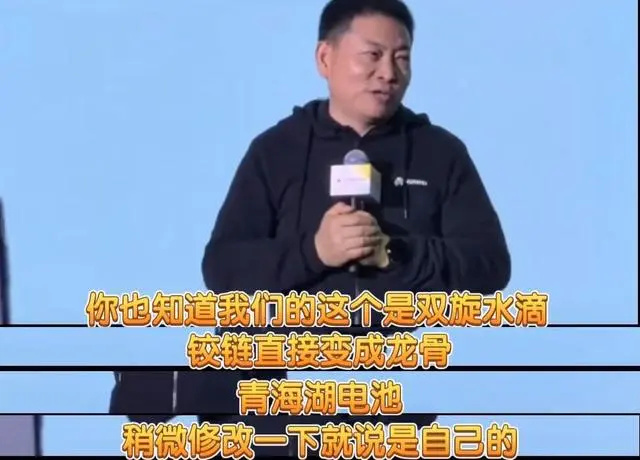
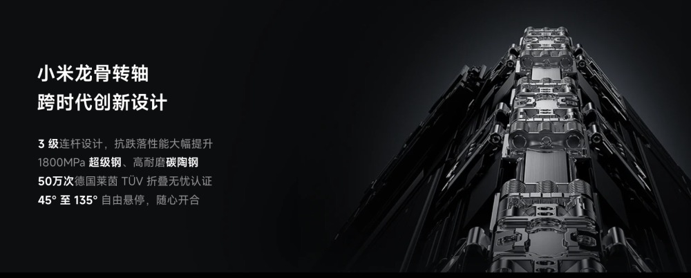
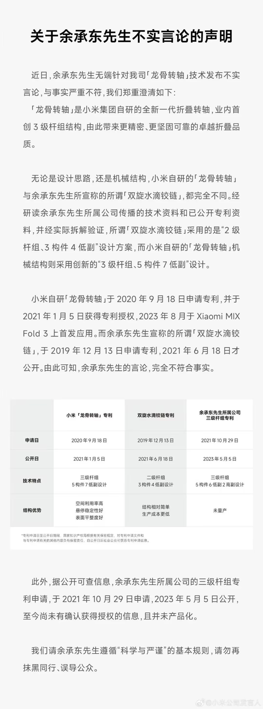

# 小米：余承东无端针对我司龙骨转轴技术发布不实言论，与事实严重不符

腾讯科技讯
12月12日消息，据小米公司发言人官方微博发布声明称，近日，余承东先生无端针对我司龙骨转轴技术发布不实言论，与事实严重不符。我们请余承东先生遵循“科学与严谨”的基本规则，请勿再抹黑同行、误导公众。

在近日的2023花粉年会上，余承东称，“友商抄袭时称不太尊重我们（华为）的知识产权，拿过去随便编个名字就说自己的。双旋水滴铰链直接变成龙骨铰链，龙骨是不存在的。”虽然没提厂商名字，但业内猜测很可能是针对小米公司做的这番表态。小米今年发布的MIX
Fold 3新机，宣传称采用了龙骨转轴的“跨时代创新设计”。

以下为小米声明全文：

