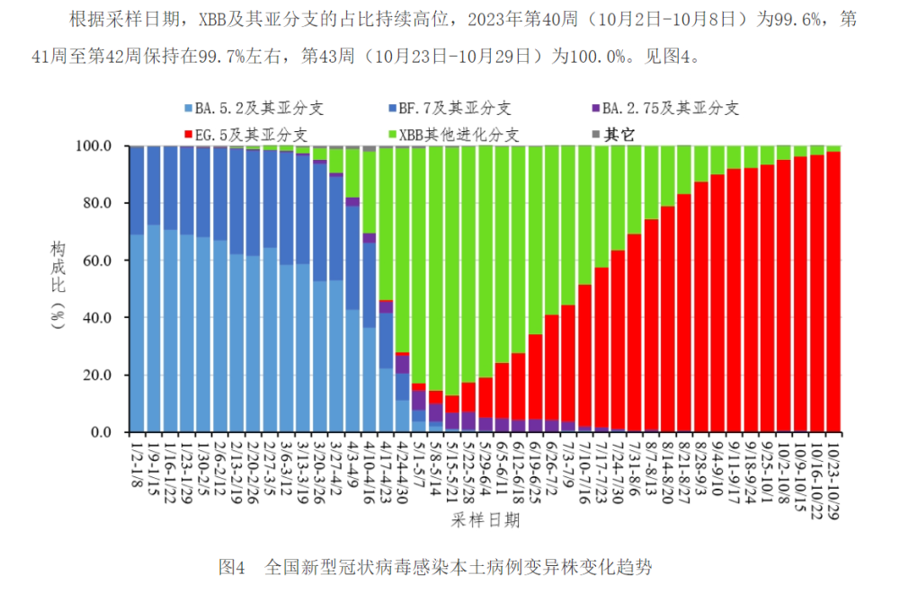

# 新冠JN.1变异株尚未大规模传至国内 专家称暂无证据表明其致病性增加

界面新闻记者 | 黄华

界面新闻编辑 | 谢欣

当前，新冠病毒JN.1变异株在社交媒体上引发广泛关注。

当地时间12月8日，美国疾病控制与预防中心（CDC）于官网宣布，新冠病毒变异株JN.1已经成为目前美国增长最快的新冠变异株。具体而言，截至今年12月8日，JN.1变异株在美国流行的新冠变异株中占比约15-29%，并且JN.1变异株的比例还将继续增加。

需要说明的是，“15-29%”是美国疾病预防与控制中心的预测数据，该机构认为，目前大约21%的流行株是JN.1。不过，该机构也承认，早期的预测也存在不可靠的因素，因为它们仅仅依赖于检查少数的序列。尽管如此，激增的数据占比还是在国内引发了关注。

若是再向前追溯，JN.1变异株于今年9月在美国首次被发现。并且，在截至10月底，它在新冠变异株的的比例还不到0.1%；此前，在新冠病毒的数据跟踪过程中，JN.1变异株与BA.2.86变异株被分为一类。

与国内大众更熟悉的XBB变异株相比，BA.2.86系列是另一个不同的进化分支和方向。也就是，JN.1变异株不是XBB的分支。

虽然，JN.1变异株当前在社交媒体引起广泛讨论，但据中国疾控预防中心的国内本土病例病毒变异监测数据显示，国内当前的主流病毒依旧是EG.5变异株。简单理解，EG.5变异株是XBB变异株的一种，它具体是新冠病毒奥密克戎XBB.1.9.2的一个亚分支，最早于今年2月17日在印度尼西亚被发现。

中国疾控预防中心数据显示，今年10月1日-10月31日，全国31个省（自治区、直辖市）及新疆生产建设兵团共报送7646例本土病例新冠病毒基因组有效序列，均为奥密克戎变异株，涵盖73个进化分支，主要流行株为XBB系列变异株，占比前三位的分别为XBB.1.9及其亚分支、XBB.1.22及其亚分支、XBB.1.16及其亚分支。

_图片截取自中国疾病预防控制中心，数据更新至10月29日_

随着新变异株的出现，公众的担忧普遍集中在两个方向。一是，是否会引发新一轮疫情海啸；二是，新变异株的致病性是否增加。

目前，美国疾病控制与预防中心认为，没有证据能证明JN.1变异株的出现会给公共卫生安全带来超过其他变异株的风险；也没有迹象能表明人体感染JN.1变异株后要承担更严重的疾病风险，但不清楚JN.1变异株的感染是否会产生其他症状。

美国疾病控制与预防中心认为，与其他变异株相比，JN.1变异株的快速增长只引发一个问题——它的流行是否会导致感染增加。该机构表示，美国的新冠感染正在增加，他们做此推测是基于新冠病毒会在夏末和新年前后达到感染高峰的流行模式。

眼下，美国疾病控制与预防中心无法判断JN.1变异株在多大程度上促成了美国新冠感染人数的增长，也不确定在12月剩下的时光中是否会爆发类似于往年的疾病感染情况。美国疾病预防与控制中心表态将密切监测新冠病毒的传播情况。

在病毒溯源方面，美国疾病控制与预防中心介绍，JN.1变异株与BA.2.86变异株密切相关，后者自8月以来就被跟踪观察；尽管由于命名差异的存在，JN.1变异株与BA.2.86变异株听起来非常不同，但其实它们的刺突蛋白只有一个变化。

12月12日，深圳市第三人民医院党委副书记、院长卢洪洲向界面新闻记者介绍，JN.1突变株是新冠病毒BA.2.86突变株的亚分支，其RBD区域具有一个额外的L455S突变。早期的研究表明BA.2.86与XBB系列突变株的免疫逃逸能力相当；而最近的研究发现JN.1突变株的L455S突变进一步增强了其免疫逃避能力，对XBB.1.5突破感染诱导的体液免疫具有一定的逃逸能力。

卢洪洲也认为，尽管JN.1的免疫逃逸能力有所增加，但是目前没有证据表明JN.1变异株的致病性增加。

美国疾病控制与预防中心在官网提示，通常情况下，不同变异株的感染往往带来的是相似的症状，而症状的类型和严重程度更多地取决于一个人的免疫系统功能和整体健康状况，而不是由哪种变异引起感染。

此外，卢洪洲提出，自去年12月份以来，新冠病毒与其他呼吸道病原在中国一直处于共流行状态，目前国内居民普遍经历了2次感染甚至3次感染。已有的研究数据表明，这样的感染经历能够使感染个体产生较强且广谱的针对奥密克戎不同亚突变株的中和抗体。基于此，他推测，JN.1变异株未来在国内的流行可能会短期内使新冠感染患者增加，从而加重医院的医疗负担，但是不会对国内正在经历的呼吸道疾病感染潮造成太大影响。

