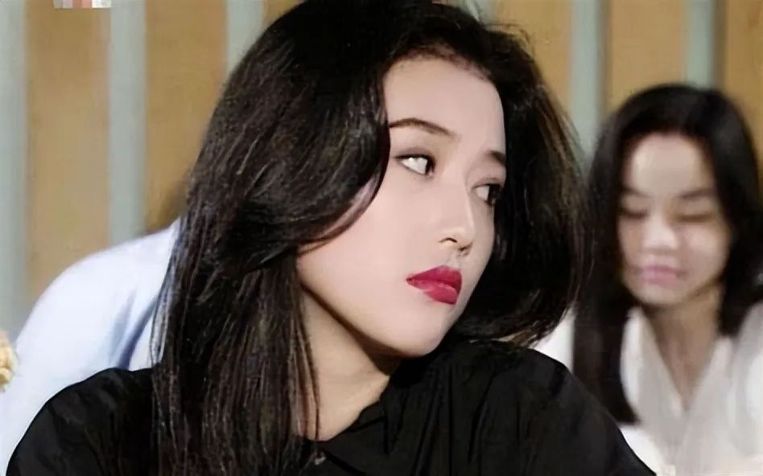
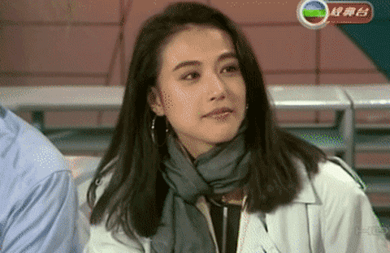
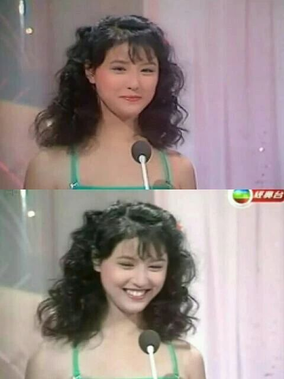
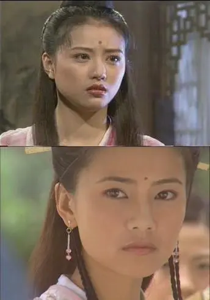
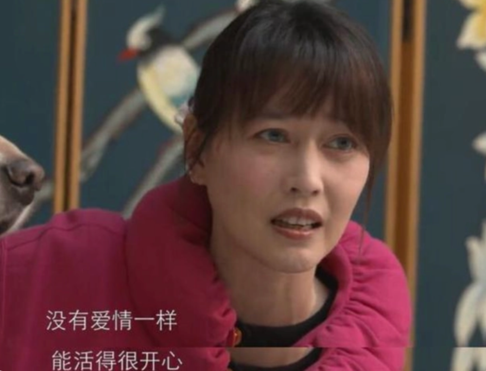
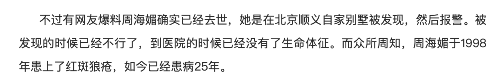
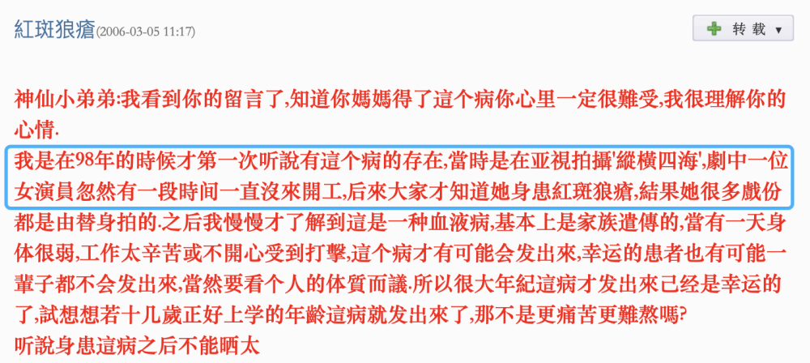

# 网传“最美周芷若”周海媚离世？制作人谭飞辟谣：并未过世，正在抢救

12月11日晚，#周海媚#三个字冲上了微博热搜第一，这个名字承载了一整个时代的芳华与美丽，也一度被大众所遗忘，如今又因居高不下的热度而迅速成为爆词。

点进热搜去看，里面赫然是网友对周海媚意外离世的爆料。寥寥12个字不知真假，却已经草率地宣告了一代经典港星的离世，而明明在不久前的12月6日，周海媚刚过完57岁的生日。

在爆料发出后，周海媚的平台账号还在更新，有多家媒体记者试图联系周海媚工作室的工作人员以求证真相，还有周海媚的友人试图联系周海媚本人，但也始终无果。

更多的相关爆料不断流出，有人说周海媚疑因患红斑狼疮而性命垂危，有人说她已经脱离了危险，而百度搜索则显示“送医后已无生命迹象”。

迟迟未能出现的真相让网友们为之悬心，直到0:20，娱乐圈知名监制、制作人、影评人谭飞发博替周海媚澄清，称她并未过世，请各界勿以讹传讹。

虽然谣言已破，但周海媚本人确实正在医院抢救。无论如何，为了周海媚而悬心的网友们终于可以睡个好觉了，希望周海媚能够坚强平安地度过这一难关，早早地、快快地康复起来。

回顾周海媚：TVB公认的当家花旦，金庸最爱的周芷若

也许对于95后、00后的年轻人们来说，周海媚还是个不怎么熟悉的名字。但对于看着港剧长大的一代来说，这个名字所代表的，是那个活色生香的旧时光里，一段不会褪色的美好记忆。

周海媚于1966年出生于中国香港，而她的演艺生涯开始于1985年，那一年她19岁。当时她的父亲帮她报名了香港小姐的竞选，虽然最终并未取得名次，但漂亮灵气的周海媚被无线看中，选入了无线的艺员训练班，从此成为了一名演员。

_周海媚参加香港小姐竞选_

上世纪90年代，周海媚成为TVB一线花旦，风头正劲的她在1990-1993连续三年被评为“香港地区最受欢迎女演员”。

而一提起“周海媚”这个名字，大多数人首先想到的或许是1994年版《倚天屠龙记》里的周芷若。据报道称，金庸对这位“周芷若”十分中意，用他亲笔的签名换取了她的相册，甚至想为她改写结局，成全她与张无忌在一起。

作为金庸笔下最复杂的女性形象之一，周芷若的性格和心理变化相当大，从前期的柔弱温婉到后期的癫狂、疯魔与悲凉，对于演员外在表演的技法和内在揣摩的悟性都有很高的要求。而周海媚对角色的把控和表现都颇为自如，她演的周芷若完全是个“书中人”，黑化时也不需要烟熏浓妆来加持，单从眼神的变化就能看出角色心境的转变。

因为扮相漂亮再加之演技到位，周海媚在《倚天屠龙记》里的经典扮相，也成为了其后的周芷若演员们的造型范本。尤其是2003年版的《倚天屠龙记》，其中高圆圆饰演的周芷若是以周海媚的扮相为基础进行妆造的叠加与创新，可见周海媚对周芷若的塑造之深入人心。

94版的《倚天屠龙记》让周海媚走上了事业巅峰，然而她却在激流之际选择北上发展。时间证明了周海媚的前瞻性，随着她的离开，香港影坛也逐渐走向没落，而内地的影视剧却方兴未艾，渐渐形成一片大好之势。

转战内地后，周海媚一连接拍了许多挑战性极高的反派角色，如《武媚娘传奇》里的杨淑妃、新版《倚天屠龙记》中的灭绝师太、《香蜜》中让人恨得牙痒痒的反派天后……

因为演反派演得太好，周海媚本人也遭到了许多偏激网友的围攻，甚至发展到了对她进行人身攻击和无脑谩骂。最终，周海媚选择退出了微博。

_周海媚微博截图_

随后，周海媚也渐渐淡出了影视圈，转而在抖音上开辟起了一方怡然自得的小天地。她的抖音全是真实而亲切的日常分享，纯素颜出镜、晒自己和狗狗的有爱日常、分享烹饪小技巧……

年过50仍未婚未育的周海媚，独居生活依然多姿多彩、乐天享受，像一位亲切的朋友一般隔着网络与网友们互相陪伴，不时输出一些清醒而理性的观点，言行间都是恣意轻松的生活态度。

在这次关于她离世的消息爆料出来前，她的宠物视频账号也还在照常更新。只是以往周海媚都会在评论区和网友们互动，而这次却迟迟没有回复网友们焦急的评论。

好在谣言已经得到澄清，周海媚并未过世，但确实正在医院抢救。希望大家可以多给周海媚一些祝福，也希望她能够快点好起来，再次抱着她最爱的狗狗出镜，和大家一起高高兴兴地聊聊天。

罹患红斑狼疮，最新爆料称在医院抢救

关于这次的爆料，有网友称周海媚是因患上红斑狼疮而导致。据多家媒体的报道和多位网友的爆料，周海媚已经身患红斑狼疮多年，疑似在1998年就已经患上了这种疾病。

 _根据凤凰网报道_

而最早关于周海媚患上红斑狼疮的爆料，是杨恭如在博客中披露的。据媒体称，杨恭如最早在博文里直接写出了周海媚的名字，被网友们炮轰之后才改成了将其“一位女演员”。根据多家媒体的报道，也正是由于这次被曝光的行径，周海媚和杨恭如的关系开始交恶。

_杨恭如博客内容_

在这次爆料事件发酵后，根据谭飞的辟谣微博，可知周海媚本人确实正在医院抢救中，但是否是红斑狼疮导致的入院目前还未可知。唯一可以确定的是，此前的一系列用生命开玩笑的假爆料是毫无底线和良知的行为。

结语

无论世事如何更迭，总有些人和事不会轻易改变。正如周海媚，永远都是我们记忆中那个眉目如画、风情万种的港风美人。

都说岁月从不败美人，我们更加希望岁月晚些带走这些在旧时光里闪闪发光的、作为曾经的黄金时代化身的美人。希望周海媚顺利度过危险期、早日康复，希望所有以讹传讹的坏消息都随风消散，希望姐姐一切都好。

