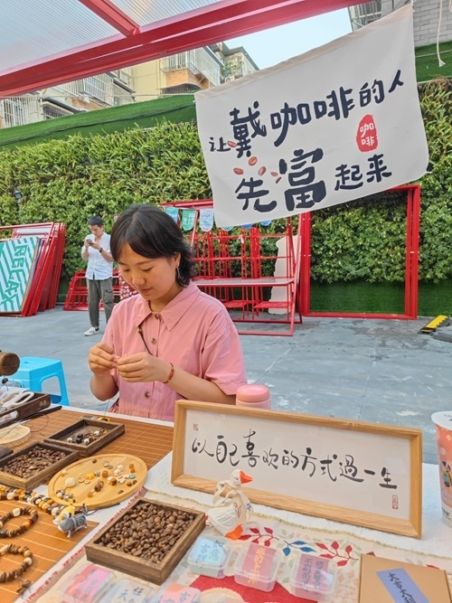
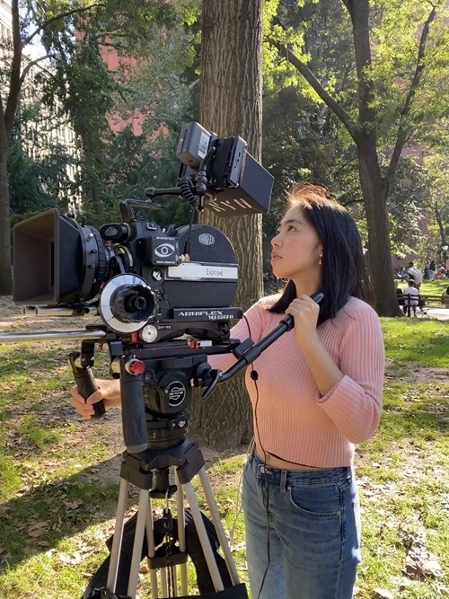

# 那些不停换工作的年轻人

_牛娜娜在成都摆摊。受访者供图_

_李佳宜在纽约进行拍摄。受访者供图_

28岁的牛娜娜前不久第20次裸辞，带着两只猫，搬进了成都一个农家小院，开启摆摊生活。

12年干了21份工作，34岁的刘智去年8月辞职，从事向往的自由职业，她说，“人生没有白走的路，每一步都算数。”

今年是33岁的罗鸥工作的第10年，从贸易、互联网、媒体到医疗，在不停换工作后，他下决心“深耕”现在的岗位。

当前不少青年把职业体验当作人生体验的组成部分，他们在寻找不同的事业发展方向，也在探寻不同的人生可能。不过，用人单位往往会重视求职者对企业的忠诚度、对行业的了解深度。

那些频繁跳槽的年轻人付出时间和试错成本后，职业竞争力提升了吗？他们会后悔吗？

**离热爱更近**

27岁的熊飞云2019年毕业于苏州大学汉语言文学专业，现在是一所公立小学的语文教师，这是她工作4年来继新媒体、教培、策展、销售、保险、外贸后的第7份工作，而她心里明确的职业最终站——成为一名小说家并不在其中。

熊飞云总结，每次换工作的具体原因有：不适合自己、看不到未来前景、不值得长期干……在她的朋友眼里，她是“累了、难受了、被PUA（精神控制的行为）了就辞职，没钱花了就找工作迅速上岗”的自由洒脱、勇敢无畏的人。

“我没有那么勇敢。”熊飞云指的是“不敢直接成为小说家”。因顾及家人对于她“工作稳定”的要求，也因“没有强大到独自摸黑走小说家的路”，虽然她目标明确，但是一直在“职业最终站外”徘徊。

熊飞云把每一次职业经历都看作一种探索。大学毕业后，熊飞云的第一份工作是在一家地产公司负责公众号内容。一段时间后，她发现自己的写作风格不适合公司要求，“‘短平快’的写作不适合我，以后不会找这种工作了”。

她考虑考研，“想踏踏实实学习写作”。但是为了养活自己，熊飞云应聘当上了外贸业务员，负责平台开发和维护客户。然而受新冠疫情影响，外贸公司业务不稳定，她决定离开。

熊飞云用4个字概括自己的职业经历：都是素材。“哪怕只在一个行业里探了探头、略懂皮毛，但当写小说时，你就会发现你已经比别人多了一些专业知识。”

28岁的李佳宜也有明确的职业目标。快餐店服务生、建筑设计师、演员、电影美术、空间设计师、策展人、数媒艺术工作者、剧照师、摄影师、剪辑师、电影制片人、游戏公司员工、场记、广告导演、电影导演……在接受中青报·中青网记者采访时，她对自己的16份工作如数家珍。

“很多事需要情绪高涨时才能做出来，我经常去做新尝试。”李佳宜本科毕业于皇家墨尔本理工大学建筑设计专业，后来发现自己对电影行业感兴趣，于是她的脑海中始终有“明确的主线任务”：做独立电影导演、编剧或演员。

面对不喜欢的工作，开始时李佳宜的心态会“不太平衡”，但投入后还是会制定高标准来挑战自己，提高收入的同时获得进步，“我是很拼命的人，只要我接了活儿就不能浪费这段时间，不能砸自己的招牌”。

她坦言进入游戏公司工作就是因为新冠疫情时电影行业受到影响。不过她在进入游戏公司后见到了很多出色的从业者，比如，一名专门负责写故事线的年轻人负责做游戏粒子特效，为此还专门修了物理博士学位。她说，“心态很重要，如果改变不了现状，不能一直苦闷着浪费时间，要尽早学到一门可以谋生的本领，该焦虑还是会焦虑，唯一的办法就是继续做事情。”

白天上课，晚上10点下课后处理国内两份远程工作直到凌晨3点，上午8点起床再去上课，如果还有时间就尽量多写剧本、多看电影，这是目前李佳宜雷打不动的日程安排，“我宁可让自己累一点、少睡一点，也要让自己不会因为心里没底而不开心”。

她清楚地知道，“很多工作对我来说都是一些‘支线任务’，可能是遇到了好的机会就去做了，但大部分都是与‘主线任务’相关或有帮助的”。

“离热爱更近一点。”李佳宜担心自己没有天赋，也担心自己有限的生活阅历不足以做出好的电影，所以她选择去北京电影学院读电影进修班、拍短片、写剧本、做广告导演等，慢慢她觉得“原来拍电影和拍短片没有想象中那么难，没有那么可望不可及了”。

为了让自己有更多选择，刘智通过多种途径尽可能体验不同职业：主业、副业、兼职、积极参加义工等。

在工作了10年的老东家，她觉得自己是“万金油”般的存在，“哪里有火就去灭，哪里有坑就去填”。得益于此，刘智在公司内部轮岗、换岗，做过文案创意、客户服务、行政、法务、财会、产品开发和技术支持等不同方向的工作。

2021年，在刘智职业生涯的第10年，她尝试了媒介公关岗，这让刘智发现了自己事业的发展方向。公司举办活动时，刘智负责邀请相关媒体、达人、博主等，她喜欢这份工作带来的及时反馈，没有固定考核标准，自主性大。

为了突破即将到来的35岁职场瓶颈，也为了更好地平衡工作和生活，刘智决定辞去稳定多年的工作，开启了以行业顾问、媒介公关为主的自由职业。

在刘智社交平台的博文互动区，不少年轻人问及如何找到感兴趣的事业，她回复：“不要害怕焦虑迷茫，有这些情绪感受都是正常的，不是所有人都能找到自己喜欢的工作。重要的是去做，去行动，可能某天时机到了就找到了。”

**什么是稳定**

上大学时，牛娜娜立过一个flag，想通过体验100种职业，去选择自己真正想要的职业。“没想20份工作就已经让我知道要什么了。”

2018年从南京师范大学心理学专业毕业后，牛娜娜辗转北京、上海、南京、西安、成都，做过摄影助理、相册排版、收银员、房产销售、财务、新媒体运营等，最长9个月，最短6天。

牛娜娜回忆，原以为做相册排版设计工作月薪可以有六七千元甚至上万元，去了被告知底薪只有2000元，“工资太低，在北京生活压力很大，感觉需要努力很久才能得到我想要的工资，就辞职了”。

为减少生活压力，牛娜娜决定找到包吃住的工作，她去了一家餐饮公司当收银员，可她发现晋升空间很有限，“我不能一直干这个，还是应该去闯一闯，就辞职了”。

今年3月，牛娜娜找到一份新媒体工作，试用期要求达到固定的爆文率、客户回复量、订单量，在“转正压力大”的情况下，她平稳度过试用期，熬过了“特别想辞职”的阶段。但是“公司制度突然变了，双休变单休，还不给加班费，后面一件一件小事堆到一起，和老板闹得不开心，就辞职了”。

牛娜娜觉得找工作并不难，“除了新工作的工资需要从试用期开始算，其他没有任何区别，我为什么非要在一家不开心的公司里？”

就这样在20份工作后，她“发现自己不适合上班”。

如今，她“搬到农村后，心一下就宽阔起来了”。“摆摊并没有很辛苦，拉着箱子直接打车到市集，风吹不到雨淋不着，坐着做手工，跟摊主、顾客聊着天就赚到钱了。”她说，做手工咖啡首饰虽然身体会累，但是在做自己喜欢的事，心里从没觉得累过。

父母一直劝她重新找稳定的工作。“可能在别人眼里我（生活）是困难的，但我自己真的没有感觉。”在她看来，周末去市集摆摊，周中在家做咖啡首饰、运营社交账号、剪视频、写稿子，相当于“上三休四”，生活规律，月入上万元，“我现在挺稳定的”。

她用给房东做线上推广的劳动置换房租，不用再为原来每个月最大的支出发愁。不出摊时，牛娜娜还会在专属自己的小菜田里劳作，和邻居聚餐，骑着电动车去镇里溜达，感受日出日落，“满眼都是绿色和蓝色，过上了我梦寐以求的生活，很舒服”。

10年前，牛娜娜的高中同学在同学录上写下“努力拼搏”“考上211”的目标，她写的是“开心就好”。10年后，在社交账号上，她编辑了这样的个性签名：“从此以后，做的都是自己喜欢的事”。

29岁的李一硕士毕业于杭州电子科技大学信息安全专业，“其实每到一个公司都是抱着长期发展下去的心态”，但有时“不得不跳槽”。

他的第1份工作是算法工程师，“每天会琢磨优化程序，希望能有一番成就”。然而他发现难以适应从学生转变到职场人，“感觉自己的努力没得到任何正向的反馈，领导没有太多耐心带新人成长”。

半年后，李一去了一家创业公司做后端开发，遇到了一群志同道合的同事，“大家一起加班，累并快乐着”。让他遗憾的是，1年半后，由于新冠疫情影响公司开始裁员，“我们整个组基本全被砍掉了”。

他又找了份后端开发工作，由于工作年限短，李一感觉很难接触到核心业务。他深知频繁跳槽对自己的影响，“简历不好看，会让公司觉得我浮躁”。现在他的状态是“不得不留下”，“就算觉得不满意，也不敢轻易作出跳槽的决定”。

首都经济贸易大学劳动经济学院副教授、中国人民大学中国就业研究所研究员毛宇飞分析，年轻人频繁换工作与经济环境、企业的文化和价值观、薪资福利待遇与个人预期不匹配，工作内容缺乏挑战性，个人能力难以提升等因素有关。灵活就业等新就业形态也使青年就业观发生改变，他们期待通过换工作得到更多收入和自由，也更追求工作和生活的平衡。

在毛宇飞看来，以前大众对工作稳定的定义往往依托于单位，只要单位不倒闭，就会有稳定的劳动合同和收入，在此基础上实现个人价值、发光发热。现在很多年轻人对于“稳定”有了新认知，在工作中要持续提升自我价值和行业竞争力，同时满足自己的兴趣需求，“不再是一定要在一家单位工作一辈子，更多的是强大自己适应时代”。

**会后悔吗**

频繁跳槽，会后悔吗？

回顾10年的工作经历，33岁的罗鸥给出了自己的答案：“其实也后悔，但不试试又一直后悔。”

2013年毕业后，罗鸥入职湖南某企业，后被外派至迪拜负责海外项目招商运营。他从头开始搭建部门、带领团队、积累资源，从专员、主管、经理做到总监，“收入水涨船高”。

工作得心应手，罗鸥却觉得有种“温水煮青蛙”的状态，“我想要新的尝试和挑战”。当地的文化、气候也让他一直没有归属感，2018年结婚后，他与妻子一直异国两地。于是，他在自己30岁时做出决定：离开现有职位，回国发展。

罗鸥入职了杭州某头部电子商务公司做客户经理。“即使跨行业，我也获得了比较好的工作机会，这完全得益于第一份工作6年的基础。”但是，他发现新工作节奏快、强度大，需要极强的自驱力、学习力，国外积累的资源在国内无法直接转换，“相当于从头开始，我的年龄在同岗位同事中偏大，在晋升上已经不具优势”。

罗鸥开始边工作边找新的机会。第2份工作干了9个月后，他离职进入湖南某央企，新工作在地域、强度、薪资等方面都满足他当时需求，离老家更近，方便照顾即将出生的孩子。

然而1年后，罗鸥发现工资难以支撑家中开支、晋升空间也有限。“短短两年，仿佛从少年满志到中年危机，这是职场给自己上的最深一课。”

在朋友的介绍下，他辗转来到上海的一家医疗公司担任销售副总监。凭借工作经验带来的学习能力，罗鸥1个月就迅速适应了新行业。

罗鸥坦言，回国后的前两份工作处于“病急乱投医、缺啥补啥”的试错状态，现在自我定位逐渐清晰，“做任何决定都会更稳妥一点，每走一步都会越来越谨慎、冷静”。

“如果再给我一次机会，我真的会考虑一直做第一份工作。”罗鸥说，那样会有更高的薪资、更高的职位。“可不回国就会一直后悔，虽然能挣到钱，但是会缺失国内家庭生活的烟火气。”

罗鸥建议处于不停换工作迷茫期的年轻人要以旁观者的姿态综合审视个人当下情况，“可以试错但不要盲目试错，要将试错的成本变成你下一份工作的‘滤芯’，提升职业竞争力是你的底气”，在换工作时也不要轻易换行业。

毛宇飞发现，在频繁换工作的年轻人中，若有清晰的职业目标，通过换工作积累相关经验和技能，可以持续提高职业竞争力。若无清晰的职业规划，频繁换工作反而会使个人职业竞争力下降，“有可能越换越差”。

在短暂的工作中，新人难以深入了解行业上下游、运转模式、盈利模式及未来前景，“在本应深耕的阶段去做各种尝试，结果只能是在各行业浅尝辄止，实际上造成了职业竞争力的下降。”毛宇飞认为，两三年的稳定工作很重要，在工作过程中才能逐渐熟悉行业、业务，提升职业竞争力，积累可量化的工作成绩，同时逐渐明确职业目标。

毛宇飞说，不少用人单位看重求职者工作履历中的持续度，这能反映求职者对企业的忠诚度、对行业的了解深度。频繁换工作带来社保、工资的间断期，也会影响年轻人的职业发展和生活状态。他建议，大学生在校期间通过实习、兼职体验尝试不同工作，降低试错成本，“因为职场人换工作的成本远高于在校生换实习”。

（应受访者要求，刘智、罗鸥、熊飞云为化名）

中青报·中青网见习记者 谭雅丽 记者 王聪聪 来源：中国青年报

