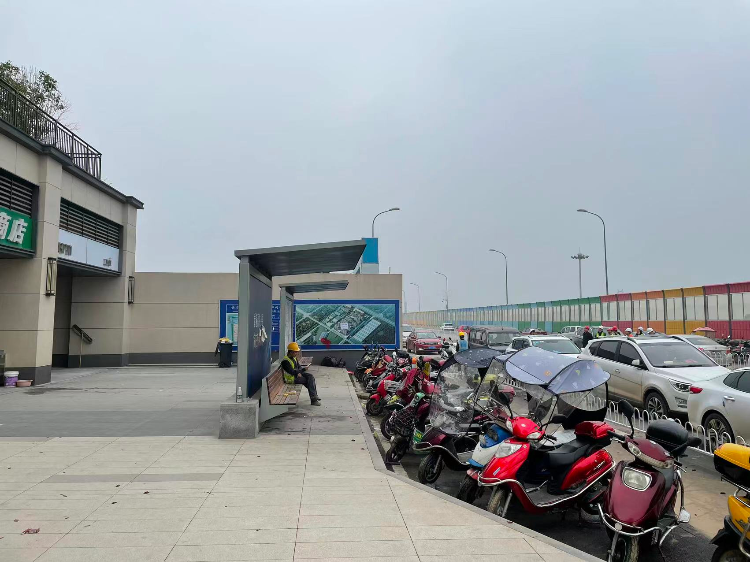
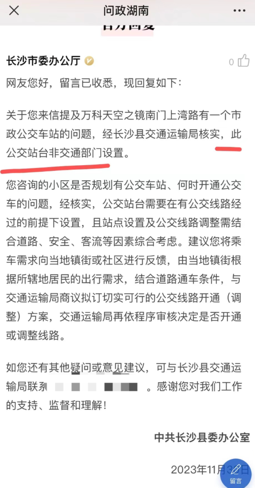

# 长沙一开发商为卖房建“公交站”：业主入住后发现未开通公交线路，市监所介入调查

近日，湖南长沙市长沙县万科天空之境小区业主杨先生很闹心，小区外的公交车站竟然是开发商自行建的。

12月11日，杨先生告诉上游新闻（报料邮箱：baoliaosy@163.com）记者称：“买房的时候就看到小区南侧上湾路桥上有一个已建成的公交车站。后来迟迟没看到公交车，询问得知是开发商未报备自行设立，为卖房开发商是否涉嫌虚假宣传呢？”

_开发商自建“公交站” 。受访者供图_

12月12日，长沙县交通局一工作人员告诉上游新闻记者：“情况属实，此公交站台非交通部门设置，可能是开发商自行设立。”长沙县黄兴市监所工作人员回应：“正在向开发商了解情况，案件正在进一步核实调查中。”重庆执业律师聂炜昌表示：“如果开发商故意误导，那么就涉嫌虚假宣传，市场监督管理部门可以对其作出行政处罚。”

上游新闻记者从杨先生展示的图片看到，在马路边有一个类似公交车站的建筑设施，路边停满了电动车。购房合同中载明：“小区南侧设有1个BUS公交站，可能对相邻住宅产生人流、噪音影响。”杨先生说：“在2020年房屋销售时，告知有一个已建成的公交车站，会有两条公交车线路通过此站，且有一条路线为始发路线。公交车站的信息也在购房合同及沙盘中有标注和显示。然而小区交付马上一年半了，至今未看到开通公交车线路，业主们向市长信箱询问，得知‘合同中规划的东南侧公交车站为开发商自行设立’，得到长沙县交通管理局的答复是，此公交站台非交通部门设置，并未向长沙县交通局报备。”

_交通局查实，“公交站”非交通部门设置。网络截图_

12月12日，长沙县交通运输局工作人员回应记者：“经长沙县交通运输局核实，此公交站台非交通部门设置。公交站台需要在有公交线路经过的前提下设置，目前这里没有公交线路。居民可以将乘车需求向当地社区进行反馈，结合道路通车条件，与交通运输局商议拟订切实可行的公交线路开通(调整)方案，交通运输局再依程序审核决定是否开通或调整线路。”

重庆执业律师聂炜昌分析认为：“《最高人民法院关于审理商品房买卖合同纠纷案件适用法律若干问题的解释》第三条规定，商品房的销售广告和宣传资料为要约邀请，但是出卖人就商品房开发规划范围内的房屋及相关设施所作的说明和允诺具体确定，并对商品房买卖合同的订立以及房屋价格的确定有重大影响的，构成要约。该说明和允诺即使未载入商品房买卖合同，亦应当为合同内容，当事人违反的，应当承担违约责任。在司法实践中，一般认为沙盘也是宣传资料之一。如果沙盘中显示的道路、绿化、楼体外饰和总体布局等内容，如果被视为具体确定的说明和允诺，且对商品房买卖合同的订立和房屋价格的确定有重大影响，那么开发商需要承担违约责任。但是，从现有沙盘的照片看，沙盘中的公交车站属于红线外，不是商品房开发规划范围内，不属于要约，不过具体还是要以合同约定为准。”

聂炜昌律师强调：“如果经相关部门调查后，查实开发商在销售过程中，明知没有公交车站，也没有公交线路经过，但在宣传中却故意误导的，那开发商就涉嫌虚假宣传，市场监督管理部门是可以对其作出行政处罚的。”

上游新闻记者 冯盛雍

