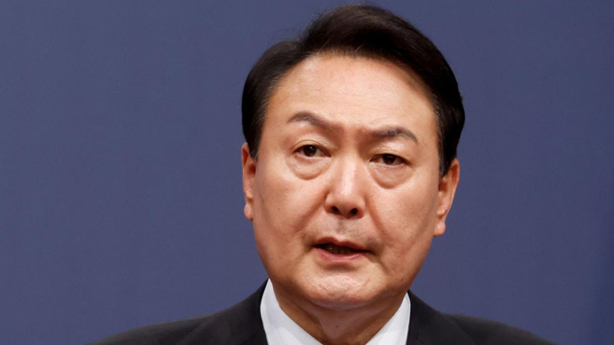

# 韩总统访荷兰：欲推“半导体外交”，却困在“价值观外交”？专家解读

12月11日，韩国总统尹锡悦开启了上任19个月来的第16次出访，距离上月访英法仅半个月之隔，目的地同样是西欧发达国家——荷兰。

这是韩荷两国1961年建交以来，韩国总统首次对荷兰进行国事访问。据尹锡悦介绍，此访最主要目标在于加强两国半导体合作，结成“半导体联盟”。访问期间，他将参观全球最大的半导体设备制造商阿斯麦（ASML）总部，争取吸引荷方对韩国的更多投资。

韩国舆论认为，当总统专机再次从首尔起飞，尹锡悦的心情不会轻松。荷兰是否会加大对韩投资、韩企能否减轻美国半导体出口管制带来的影响，目前仍是未知数。距离明年国会选举只剩四个月，随着国内经济低迷、政治形势严峻，尹锡悦政府的“价值观外交”备受质疑。

高度依赖

荷兰国土面积4.18万平方公里，人口不到1800万，却是世界公认的外贸强国、半导体强国，拥有涵盖半导体研发、芯片设计、设备、成品等环节的集成供应链。其中最著名的阿斯麦公司成立于1984年，目前是全球最大的半导体设备制造商、全球唯一可提供7纳米及以下芯片先进制程的EUV（极紫外线）光刻机设备商。

韩国与荷兰虽相距遥远，却保持着较为密切的联系。荷兰是欧盟内韩国第二大贸易伙伴、第一大投资来源国。两国之间的贸易和投资主要集中在半导体产业。比如，阿斯麦是韩国三星电子、SK海力士等半导体巨头高度依赖的设备供应商。能否抢先拿下阿斯麦的光刻机订单，对于韩企新产品的研发以及韩国半导体产业的整体竞争力至关重要。

正因如此，过去十多年来，三星电子等韩企一直与阿斯麦关系友好、互动频繁。三星电子早前收购了阿斯麦3%的股份，目前仍在持股。阿斯麦正在韩国投资建设一座新的光刻设备工厂。

“半导体是韩国与荷兰合作的关键。”尹锡悦在出访前表示，高科技芯片是现代全球经济的命脉，半导体产业在战略上比以往任何时候都更重要，这使得这次荷兰之行特别有意义。

韩国舆论则将尹锡悦此访称为“半导体外交”。

**中国社科院亚太与全球战略研究院研究员王俊生**
指出，韩国是出口导向型经济体，外贸出口占韩国GDP的40%以上。其中半导体相关出口占据韩国出口总额的逾五分之一。半导体行业的一举一动对于韩国整体经济至关重要。不过，韩国半导体行业的优势主要集中于生产技术，半导体设备的自主生产率低，对于阿斯麦的光刻机依赖较大。因此，尹锡悦此访目标较为明确，旨在从国家层面提供助力，提升两国在半导体等领域的合作水平。

各有考量

与诸多前任不同，尹锡悦是自1961年两国建交以来首位对荷兰进行国事访问的韩国总统。不过，韩荷两国领导人彼此并不陌生。去年11月，荷兰总理吕特曾访问韩国，与尹锡悦签署协议，同意将两国关系提升为战略伙伴关系。今年7月，尹锡悦与吕特又在立陶宛北约峰会期间打过照面。

数月之后再度聚首，根据双方发布的行程安排，尹锡悦此访活动丰富、重点突出。

当地时间12日，他将在阿姆斯特丹参加由荷兰国王主持的官方欢迎仪式、皇家招待会和国宴等活动。当天下午，他将与荷兰国王一同参观阿斯麦总部，讨论两国在半导体行业发展方面的合作。他将成为首位参观阿斯麦光刻机无尘室的外国领导人。三星电子董事长李在镕、SK集团董事长崔泰源等人也将随行。

当地时间13日，尹锡悦将前往海牙，先与荷兰议会两院领导人举行联席会议，再与荷兰首相吕特举行会晤。会后，双方将举行联合记者会和谅解备忘录签署仪式。

韩国舆论认为，尹锡悦此访的“重头戏”是探讨建立涵盖政府、企业和大学的“半导体联盟”，将荷兰的高科技设备与韩国的制造能力相结合，充分发挥两国在半导体价值链上的互补性。

与此同时，双方将讨论把两国战略伙伴关系提升到新的水平，还将讨论共同应对朝鲜核计划、乌克兰危机、中东挑战等问题，加强在人工智能、网络安全等新兴安全领域，以及清洁能源、量子技术、智慧农业等前瞻性行业的合作。此外，韩方还希望通过与荷兰方面的先进技术合作，为国防工业出口创造新的机会。

与韩方相比，荷兰方面此前发布的议题预告较为简短，视野更加开阔。荷方称，此访将聚焦两方面议题，一是加强双边合作，包括可再生能源、农业和高科技产业等领域；二是推进东亚和“印太地区”的稳定与繁荣。

王俊生认为，围绕尹锡悦此访，韩国和荷兰各有考量。

从韩方看，官方提到诸多议题，至少包括军事安全、经济安全、文化交流、尖端科技等四个方面，但最主要的还是建立“半导体联盟”，进一步加强两国半导体领域的合作。不过，值得注意的是，尹锡悦访荷前夕多次提到“经济安全”，希望加强与美国、日本、欧洲国家的捆绑，其背后的指向不言自明。

由此看来，韩方所谓“半导体外交”还是脱不开“价值观外交”的影子。

从荷方看，王俊生指出，作为欧洲国家、北约成员，荷兰加强与韩国的双边合作，其目标并不局限于经贸利益、技术进步。无论荷兰，还是此前尹锡悦到访的英、法，或都希望通过与韩国的合作，找到介入亚太事务的抓手，以此增强自身影响力。自去年以来，北约不断加强与韩、日等亚太国家的合作，以此推进北约“亚太化”。因此，荷兰接待尹锡悦来访，更多还是基于战略层面的考量。

自缚手脚

不过，与半个月前的英法之行相比，踏上荷兰土地之际，尹锡悦及其幕僚“口袋里的石头”要沉重不少。

这是他自去年5月就任总统以来的第16次出访，也是今年的收官之访，发生在釜山申请世博会失利仅10天后，再次引发韩国政界和公众关于“总统出访有效性”的质疑。有评论称，此访的效果能否在荷方加大对韩投资，以及韩国半导体企业谈成更多订单上有所体现，受到外界关注。

尹锡悦希望利用此访进一步与荷兰抱团，还誓言“大力加强与荷兰、美国和日本等主要国家的半导体合作”。但略显讽刺的是，正是由于美国等国泛化国家安全概念，发起不当出口管制，严重阻碍各国芯片及相关设备、材料、零部件企业正常经贸往来，也让包括韩企在内的其他国家半导体企业的利益受到影响。

“韩国希望与荷兰形成联盟、加强合作，但究竟能走多远，仍取决于两方面因素。”王俊生指出，一是上游生产因素，美国仍在很大程度上控制着半导体行业的核心技术。韩国与荷兰的合作绕不开美国。韩国能否在技术领域实现突飞猛进，仍要看美国的态度。二是下游销售因素，全球半导体主要市场在中国。韩国50%以上半导体销往中国。在美国出口管制措施的影响下，韩国的出口市场萎缩，势必会对资金投入产生影响。

王俊生认为，眼下，韩国在半导体领域陷入两难，主要源于尹锡悦政府的“价值观外交”。此前，韩国与美、日、荷一同组建所谓“芯片四方联盟”，主动把自己的产业链与西方捆绑。然而，控制着半导体产业链最高端的美国，不仅不会轻易让韩国取得巨大技术进步，还通过出口管制对韩国芯片销售构成阻碍。从这个角度看，韩国的半导体企业正被“价值观外交”自缚手脚。

深刻反思

若将视线拉长，回首尹锡悦上任以来的19个月，“他所宣扬的‘价值观外交’真的朝着正确的方向在走？他宣称韩美日团结，但为什么上月在旧金山，中美元首会晤四小时、中日领导人会晤一小时，中韩领导人只寒暄了一分钟？尹锡悦是否意识到，美日正把韩国当棋子？”韩国舆论如是问。

在韩国最近的民调中，“外交”成为继“经济民生”后引发对尹锡悦负面评价第二高的问题。有人担心，韩国民众对总统外交能力的不信任可能会蔓延到整个行政系统。

“实事求是地说，自上台以来，尹锡悦政府的外交并不成功，甚至可以说是失败的。”王俊生从内外两方面进行观察。

一方面，外交服务于内政。很多韩国学者认为，韩国目前经济低迷，一个重要原因在于与第一大经贸伙伴中国关系低迷。国际货币基金组织预测，今年韩国经济增速仅为1.5%。人们担心，中韩关系降温将让韩国经济继续恶化。

另一方面，外部支持者寥寥。尹锡悦政府自上台以来一直将与美西方的关系置于优先位置。但除了美西方，世界上还有更多其他国家。尹锡悦出访十余次，却未曾涉足非洲和拉美，处理国家关系以价值观划线。这与世界多极化潮流格格不入。

正因如此，“尹锡悦政府的支持率持续低迷，执政党内部也出现公开挑战的声音。”王俊生指出，越来越多的韩国人对尹锡悦政府的“价值观外交”提出批评，认为此举与韩国出口导向型的经济自相矛盾，敦促政府进行深刻反思。

