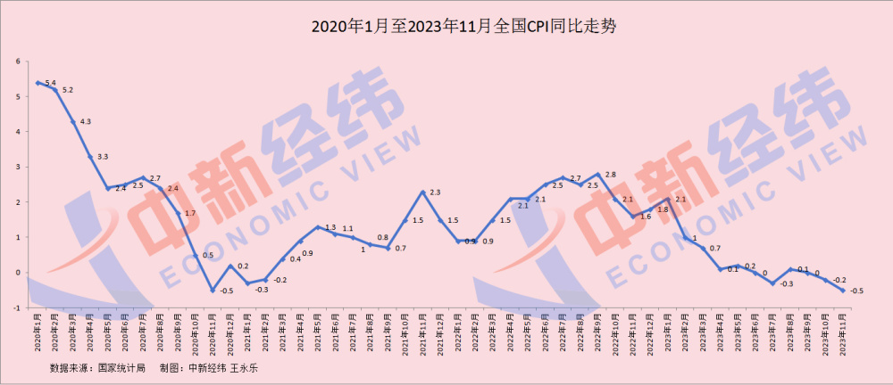
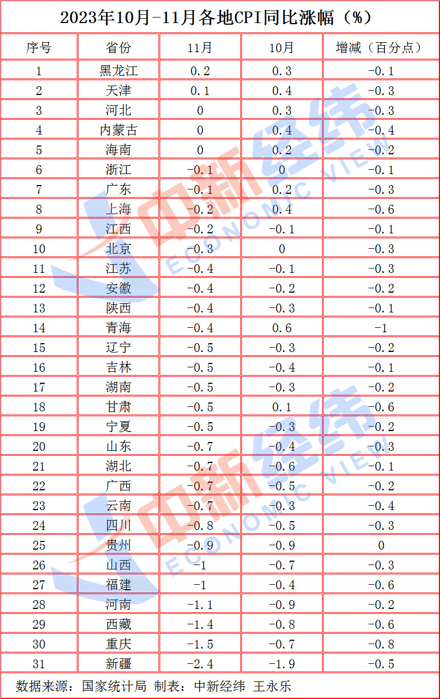

# 31省份11月CPI出炉：26地物价下降，黔豫晋“八连降”

中新经纬12月13日电
(王永乐)日前，国家统计局公布了31省份2023年11月居民消费价格指数(CPI)。中新经纬梳理发现，11月，26省份CPI同比下降。其中，贵州、河南、山西等3省份物价连续八个月回落。

**26省份CPI同比下降 贵州等3地“八连降”**

国家统计局数据显示，2023年11月，全国CPI环比下降0.5%，同比下降0.5%。CPI同比降幅超预期，且二次探底，创2020年12月以来最大降幅。

中新经纬梳理发现，31省份CPI同比“跌多涨少”趋势在11月进一步加强。其中2省份同比上涨，26省份同比下降，涨跌省份较上月分别减少7个和增加6个。

具体来看，黑龙江、天津同比上涨，河北、内蒙古、海南等3省份持平，浙江、广东、上海、江西、北京、江苏、安徽、陕西、青海、辽宁、吉林、湖南、甘肃、宁夏、山东、湖北、广西、云南、四川、贵州、山西、福建、河南、西藏、重庆、新疆等26省份同比下降，其中，贵州、河南、山西等3省份物价连续八个月回落，新疆再次“领跌”且是唯一降幅超2%的省份。

另外，从增减幅来看，除贵州外，其他30省份11月CPI同比均较上月回落。其中青海降幅最大，为1个百分点。

光大证券首席经济学家、研究所所长高瑞东表示，今年以来，国内通胀在持续走弱后，呈现低位徘徊特征。国内物价疲弱，受上游原材料价格下跌、中下游产能去化、消费需求恢复偏弱等多重因素影响。

**未来CPI怎么走？**

展望下阶段物价走势，机构普遍预计CPI同比短期仍将低位徘徊。

高瑞东预计年内通胀仍处在低位，CPI同比较难摆脱负增长区间。但2024年伴随着稳增长政策发力、去库压力减弱，预计通胀有望迎来温和修复。预计2024年CPI同比中枢有望升至0.9%，高于今年的预期同比中枢0.3%。

财通宏观陈兴团队分析指出，从高频数据来看，12月以来，鸡蛋、鲜果和鲜菜价格均有上涨，猪肉价格跌势放缓，国际油价跌势放缓，预计12月CPI环比增速回升、同比增速企稳。

兴业证券宏观首席分析师段超等表示，价格端的修复动能仍不稳固，但结构上仍透露出一些积极信号。消费端而言，居民信心开始回升。生产端而言，内需表现相对稳定，后续基建需求有望带动生产价格回暖。现阶段价格修复仍是曲折式过程，而随着各项稳增长政策效果逐步显现以及居民消费信心底部回升，预计2024年中国通胀或震荡修复。

开源证券宏观研究团队预计12月CPI同比回升至-0.1%左右，2023全年平均同比约在0.3%左右，预计2024年全年平均同比在1%～2%之间。(中新经纬APP)

**(文中观点仅供参考，不构成投资建议，投资有风险，入市需谨慎。)**

**中新经纬版权所有，未经书面授权，任何单位及个人不得转载、摘编以其它方式使用。**

