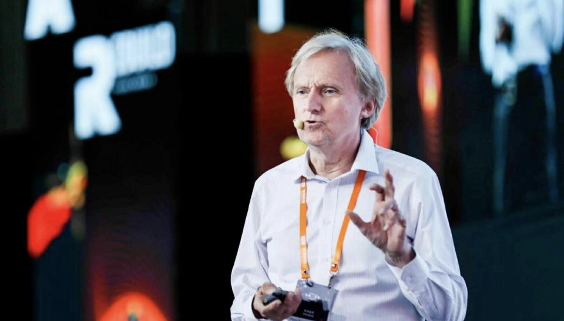
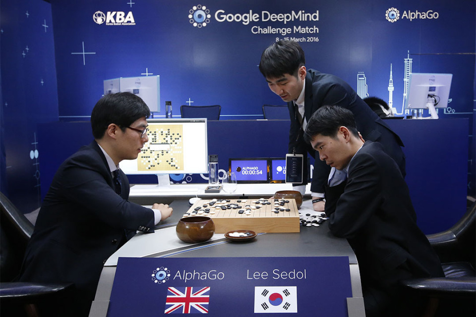
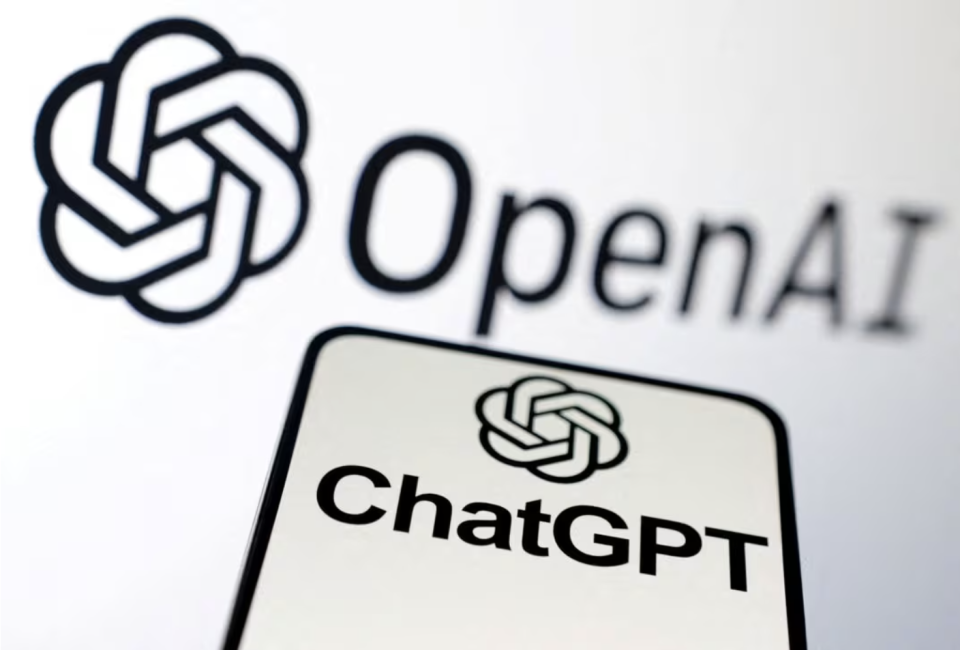
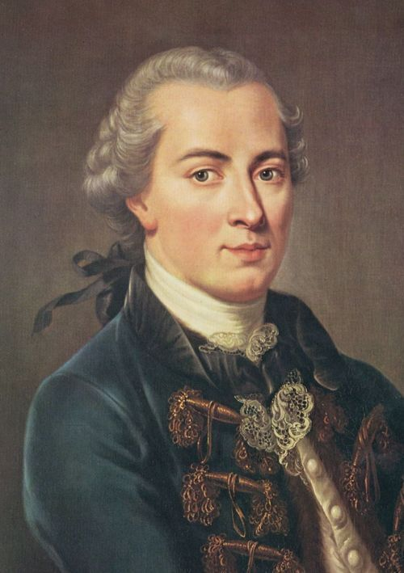

# AI不可或缺？硅谷AI研究院院长：炒作，洗碗机更有用｜对话大师

**核心要点：**

  * _1_ 我们断言GPT-4为超智能前，不妨先暂时观望GPT-4到底能发展出多少新的实际应用。就目前而言，洗碗机似乎更有用，至少它每天都能惠及数百万人。
  * _2_ 人工智能可以帮助我们“提防”人工智能，就像赛博侦探（cyber-detectives，监测互联网违法行为）帮助我们对抗互联网犯罪一样。
  * _3_ 各界炒作让很多人坚信生成式人工智能不可或缺，但事实并非如此。眼下危险的是善良的人们太过信任人工智能了，不远的将来我们可能就需要面临它被坏人滥用的危机。
  * _4_ 生成式人工智能既“愚蠢”又“聪明”，既有局限性又有强能力。我们必须保护社会免受其局限性和利用其能力搅浑水的加害者带来的影响。

近日，OpenAI人事变动风波及其被描述为 **“超越人类的自主系统”、“可能威胁人类”**
的神秘项目“Q*”，让人工智能再次走进大众的视线，并引发了广泛的关注与讨论。

人工智能领域迎来新突破了吗？超人工智能是否已经出现？人类终将被人工智能超越？人工智能可能对社会造成哪些危害……

面对时下热议话题，腾讯新闻《一起来唠科》对话硅谷人工智能研究院院长皮埃罗·斯加鲁菲，试图回答
**人工智能和人类关系的本质以及人工智能未来发展趋势等问题。**

 _皮埃罗·斯加鲁菲（图源：网络）_

一起来唠科：您曾在书籍《人类2.0：在硅谷探索科技未来》中认为人工智能赶超人类是个伪命题，随着GPT-4的推出，您是否还持相同的观点？

**皮埃罗·斯加鲁菲**
：人工智能有很多种：生成式人工智能并没有那么聪慧，它只是像鹦鹉学舌一样镜像反映人类已经创造的内容；AlphaGo基于强化学习，这更类似于人类和其他动物的学习方式；自动驾驶汽车则通常基于卷积神经网络。

总的来说，我认为 **在不同种类的智能间进行比较毫无意义。**
猫在某些方面或许比人类更优秀，但人类在其他方面更优秀；机器在某些方面或许比人类更优秀，但同样的，人类也能在其他方面比机器更优秀。我干不了洗碗机的工作，这难道能说明我的洗碗机比我更聪明吗？细菌和树木的历史比人类长得多，它们有比我们更聪明吗？我觉得这只是智能的不同种类罢了。

**机器只是一种工具，重点应该是探究它们如何有用以及如何有害。**

AlphaGo（编者注：一款由谷歌旗下DeepMind公司于2014年开发的围棋人工智能程序）问世时，媒体曾幻想几年后强化学习的不断发展会创造出超智能代理——七年后，媒体已然忘记了可怜的AlphaGo。现在轮到了GPT-4被誉为所谓的“超智能”（编者注：超智能，是英国教授Nick·Bostrom提出的一种几乎在每个领域都胜过人类大脑的智能）。我猜想，或许媒体七年后又会忘记GPT-4，而新的人工智能技术再次出现。

_2016年3月13日，Alpha GO与李世乭对弈（图源：网络）_

**真正的问题是，时至今日，这些“超智能”系统并未发挥显著作用。**
AlphaGo的技术在这七年间本应彻底革新我们的社会，但七年来我们其实几乎只得到了AlphaFold（编者注：AlphaFold是Google旗下DeepMind于2018年开发的一款蛋白质结构预测程式）。
**我们断言GPT-4为超智能前，不妨先暂时观望GPT-4到底能发展出多少新的实际应用。就目前而言，洗碗机似乎更有用，至少它每天都能惠及数百万人。**

ChatGPT确实正在逐渐发挥作用，人们将其用于润色英文报告或编写简单软件，这无疑令人振奋。但是，润色或编程（尤其是它还经常出错）并不是我们认可GPT-4为超智能的表现，这只能说明ChatGPT未来可以变得与洗碗机一样有用。时间会告诉我们它是否还可以更智能，例如找出治愈癌症的方法或发展广义相对论和量子力学的统一理论。

 _OpenAI 和 ChatGPT 徽标（图源：REUTERS）_

**我不担忧人工智能变成超智能。我担忧的是，深层次来看，如此不智能的人工智能，迟早会引发重大问题**
，就像协和客机坠毁波及整个超音速飞行领域（编者注：“协和”客机自1976年正式投入商业运营以来先后发生了几次重大事故，极大打击民众对超声速客机的信任度，于2003年被永久停飞）。福岛核灾让数个国家终止核能研究一样，导致整个研究领域遭受质疑。

一起来唠科：您之前提到，人工智能的未来需要我们更深入地了解我们的大脑，如何理解这一观点？

**皮埃罗·斯加鲁菲** ： **深度学习、卷积网络和强化学习等都是神经科学发展来的。**
我们对大脑工作原理的了解不断深入，很可能在设计新型人工智能方面为我们注入新灵感。

一起来唠科： **OpenAI创始人说教育一定会适应ChatGPT，人工智能技术发展也会改变教育，您怎么看？您如何**
预判人工智能对未来教育发展方向的改变？

**皮埃罗·斯加鲁菲** ： **生成式人工智能一定会影响教育事业。**

想想看，搜索引擎和维基百科都影响了教育，为什么生成式人工智能不行呢？有很多开创性的方式——我们可以训练类似GPT的系统，涵盖所有已出版的汉代书法书籍，这样我们就创造出一位世界级汉代书法专家，学生可以直接与这位专家互动；我们还可以训练一个覆盖所有关于康德哲学
**著作的系统，学生可以直接与这位“克隆康德”互动。我预计未来笔试也将被在我看来更有意义的口试所取代，类似的可能性无穷无尽。**

_康德为启蒙时代著名德意志哲学家，德国古典哲学创始人，其学说深深影响近代西方哲学。（图源：网络）_

一起来唠科：如果想从事人工智能相关的工作，未来我们应该加强哪些方面的学习？很多人认为跟上人工智能的潮流就应该好好学习计算机科学，对此您怎么看？

**皮埃罗·斯加鲁菲**
：这取决于人工智能的种类。人脸识别、AlphaGo和ChatGPT都是“人工智能”，但它们之间就像汽车和船一样不同。人们曾经关注的是强化学习（AlphaGo），现在更关注生成式人工智能（ChatGPT）。

生成式人工智能制造大量错误信息的能力确实令人担忧。它就像强大版的维基百科：维基百科不可靠是因为我们不知道百科词条由谁编辑，更危险的是它看起来还像是由世界顶尖专家审查过的百科全书（但实际上恰恰相反）。

**ChatGPT不可靠是因为我们不知道它是如何生成回复的，危险之处在于，它看起来无所不知**
（但实际上它掌握的“知识”只是互联网用户们随机发布的内容）。生成式人工智能可能被恶意操控，创造可能造成巨大破坏的聊天机器人（例如传播错误医疗信息的聊天机器人）。

**生成式人工智能既“愚蠢”又“聪明”，既有局限性又有强能力。我们必须保护社会免受其局限性和利用其能力搅浑水的加害者带来的影响。**

一起来唠科： **您强调“要警惕生成式人工智能对社会造成的危害”，在您看来，我们怎么做才能阻止这一危害的产生呢？**

**皮埃罗·斯加鲁菲** ： **实际上我认为人工智能可以帮助我们“提防”人工智能，就像赛博侦探（cyber-
detectives，监测互联网违法行为）帮助我们对抗互联网犯罪一样。**
这就说来话长了，打个比方，人类在监测和打击虚假信息方面做得很失败，但人工智能就做得到。

短期内，我更担忧生成式人工智能的局限性。
**各界炒作让很多人坚信生成式人工智能不可或缺，但事实并非如此。眼下危险的是善良的人们太过信任人工智能了，不远的将来我们可能就需要面临它被坏人滥用的危机。**

一起来唠科：您如何预判人工智能未来的发展趋势？您认为人工智能会改变社会分工的结构吗？

**皮埃罗·斯加鲁菲** ： **理想状态下，人工智能未来会从医疗应用开始产生许多实际应用惠及全民。**

就理论而言，许多研究团队正在努力让更多人“负担得起”AI，毕竟几乎没有几个组织能够在数百万的单元上训练一万亿美元的模型。我期待AI能在“定制模型”方面取得进展，与OpenAI刚刚发布的那些模型类似，但是参数更少，更容易训练，这样一来人人都可以操作。上世纪80年代的个人电脑也是这样，它的功能媲美大型计算机，但成本要低得多。

其实每项技术都会改变社会。 我儿时有专门使用打字机的人，有指挥交通的交警，还有用于寻路的纸质地图。
现在打字机已被人人都能使用的办公软件取代，交警被红绿灯取代，纸质地图也被智能手机应用取代。 **所以社会当然也会随着人工智能的发展而改变**

编译整理：王嘉欣

**版权声明：本文系腾讯新闻《一起来唠科》独家稿件，未经授权禁止媒体转载，但欢迎转发至个人朋友圈。**

