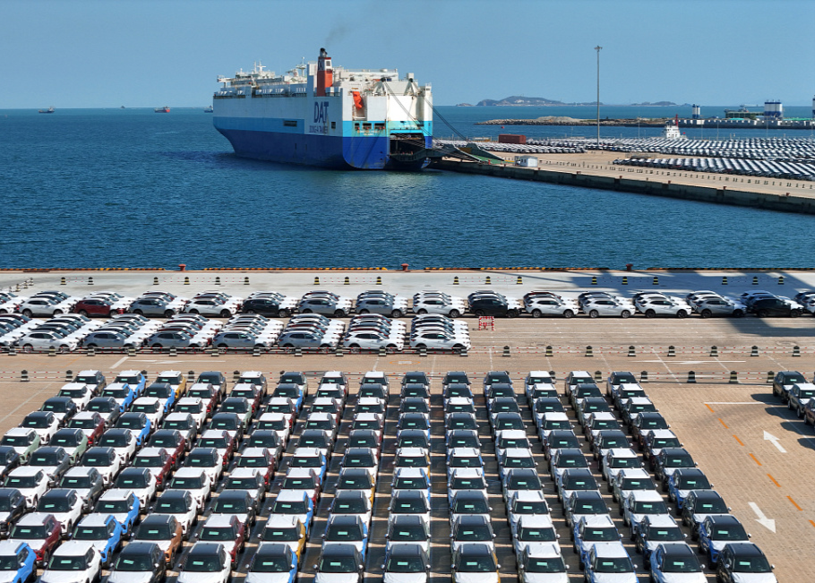

# 第一汽车出口大国的诞生：中国赶超日本，新能源尚未发力

_来源：视觉中国_

作者 ｜ 程潇熠

编辑 ｜ 康晓

出品 ｜ 深网.腾讯小满工作室

世界正在迎来属于中国汽车的时代。尽管2023年尚未结束，但中国将在今年超越日本、首次成为年度世界第一大汽车出口国已是板上钉钉。

据海关总署最新数据预计，今年中国全年汽车出口规模将突破500万辆——这也将创单一国家年度出口规模新高。

“国内产业的世界竞争力提升了。”中国乘联会秘书长崔东树告诉《深网》，前两年开始，中国汽车行业就在加速出口体系的建设。

建立新能源汽车及电池碳足迹管理体系、海外建厂、与海外企业合作铺设销售渠道，中国新能源汽车产业已走在世界前列，想要尽快完成能源转型的国家和企业也会在寻求合作时，第一时间想到中国车企。

“中东国家现在很想把新能源汽车产业链建起来，中东政府高层把与中国的合作以及新能源转型放在更为重要的位置上。”中东新能源汽车转型特聘顾问Emma告诉《深网》，光阿联酋的阿布扎比投资局，对中国市场的投资占比在三年多的时间里从
4.5%（2019年末）飙升至 22.9%（2023年一季度）。

**中国汽车出口进入新阶段，但从出口结构来看，还远未到真正发力的时候。中国汽车工业的优势战场在新能源汽车，而如今近8成中国出口汽车仍为燃油车型。**

2021年至今，在全球疫情影响下海外车企产能受限、俄乌冲突致使欧美日韩车企陆续退出俄罗斯汽车市场时，上汽、奇瑞、长城、吉利等国内传统车企，借由数十年经营的海外工厂及销售渠道，迅速补位抢占空出来的燃油车市场。

其中，上汽集团已连续7年保持国内整车出口第一，奇瑞集团已连续20年保持中国品牌乘用车出口第一。

燃油车补位市场，新能源车抢占高地，中国正迈向世界头号汽车强国，让有百年汽车工业积淀的欧美各国开始焦虑，甚至对中国“严防死守”。

**“炮轰电动车”**

2023年1-10月，中国新能源乘用车占世界新能源车份额高达62%。随着中国新能源车销量占比提升，中国车企的国际品牌号召力也在增强。

J.D.Power Japan 社长山本浩二认为，纯电动车不会立刻夺走所有市场份额，但通过各种调查发现，纯电动车正在形成自己的品牌及品牌号召力，
**“这非常可怕，有可能会影响到燃油车的销售。”**

日本与中国汽车工业的崛起经历相似，同样的从组装业务起家、以市场换技术，到本土市场几乎被外资车企垄断，再到抓住石油危机带来的机会、依托组装代工积累的汽车产业链冲入国际市场，风光至今。

在今年之前，日本是世界上最大的汽车出口国。1980年，日本以1104.2万辆产量首次超过美国（800.9万辆），成为世界上最大的汽车生产国及出口国，一举改变以欧美为中心的汽车工业格局，世界头号汽车强国的位置一坐就是42年。

**日本车企深知汽车品牌号召力的持久度。四十多年来日系车始终是美国家庭偏好的车型，直至2023年上半年，日系车几乎仍占北美前十款畅销车型的半壁江山。**

日本车企虽在燃油车时代撼动世界汽车工业格局，但也要为自己在新能源车时代的战略决策失误买单。

在中国全力进行新能源汽车转型之时，以日本丰田为代表的日本车企“炮轰电动车”，时任丰田集团社长丰田章男极其不看好电动车，他认为电动车只是短期收效快的“捷径”，混合动力和氢燃料电池路线才是该长期走的路线。

市场用真金白银投票，丰田折戟电动化市场，其在中国推出的两款电动车型前9个月销量仅3.11万辆，而比亚迪月销已达20万辆。

丰田章男自认看不懂电动车，掌舵丰田集团14年后，于今年4月卸任社长。丰田章男卸任时承认，自己对汽车有着强烈的热情，但他是个守旧的人。

“我是老一代，也感受到了作为造车人的局限性。我认为有必要在新的时代引退。”

**据日本汽车工业会、中国汽车协会数据，从2018年开始，日本与中国的纯电动车出口规模因战略不同而出现分化。**

中国电动汽车在全球电动汽车出口中的占比从4.2%（2018年）提升至35%（2022年）；而日本则从24.5%（2018年）降至9.3%（2022年）。

**“俄罗斯市场火爆”**

**“中亚和俄罗斯出口市场最近很火爆。”一位汽车进出口从业者告诉《深网》，“汽车出口影响因素很多，价格不会占太多。汽车出口受地缘因素影响较大，要看周边国家的进口税率、市场需求量、跨境运输及国内产能情况。”**

根据海关数据，中国汽车出口在2017年至2020年四年停留在百万辆量级，2021年开始有飞跃式突破。崔东树认为，汽车出口销量与单价的突破，主因是世界疫情冲击和特斯拉国产。

2020年疫情来袭后，全球除中国以外的汽车工厂基本全部停产，据媒体统计，至少120家汽车工厂暂时关闭。

而俄乌冲突则使得俄罗斯这一全球排名前五的汽车市场重新洗牌。

2022年初俄乌冲突开始后，有超20家欧美及日韩车企陆续退出俄罗斯市场。奔驰卖掉了俄罗斯子公司；雷诺、日产、福特挥泪“1元转让在俄资产”，以至于雷诺2022年上半年销量暴跌三成、日产损失近50亿元人民币。

不仅如此，欧美汽车零部件供应商巨头也暂停向俄罗斯市场交付。一辆汽车涉及成百上千个零部件，任意一个缺失整辆车便无法合规生产，俄罗斯汽车工业几近瘫痪，一车难求。

在俄罗斯早有布局的中国车企快速补位欧美及日韩车企空出的市场。2022年，中国汽车整车出口量排名中俄罗斯位居第五。到2023年一季度，俄罗斯已跃升至第一。

据乘联会数据，今年1-10月中国出口俄罗斯汽车销量增速高达611%。今年前三季度，俄罗斯汽车销量前十品牌中有六个是中国品牌，奇瑞、长城哈弗、吉利分列二、三、四位，销量同比增长达312%、267%、302%。

**俄罗斯之后，中国车企在今年又瞄准了东南亚最大的汽车制造国——泰国。今年1-10月，中国出口泰国的汽车销量增速高达104%。**

比亚迪将首个海外乘用车生产基地放在泰国，今年3月，比亚迪投资约36亿元的泰国罗勇府工厂正式奠基，预计2024年开始运营，年产能约15万辆。

广汽埃安今年在泰国成立东南亚总部；上汽集团、长安汽车、长城汽车都选择了在泰国建设工厂。这是因为若车企在泰国设有工厂，泰国政府可为车企提供8年的企业所得税豁免权、在2025年底前免除关键零部件进口税，并承诺补贴车企工厂的电力成本。

**在中国新能源车企尚未铺设好全球渠道时，国产特斯拉撑起了中国新能源汽车出口的半壁江山。**

2021年特斯拉上海超级工贡献了超16万辆的海外交付，占2021年全年中国新能源汽车出口的51%，覆盖欧洲、亚洲等10多个国家。

2022年、2023年上半年，国产特斯拉占中国新能源汽车出口比例降低至40%、34%，但国产特斯拉仍是中国新能源汽车出口的中流砥柱。

中国汽车出口规模突飞猛进，甚至带动了船舶行业发展。

上海安吉物流航运国际业务部市场科负责人石松透露，“国内有产能，国外有订单，现在就难在运输上。如果租船，一条7000个车位的船，日租金达10万美元（约合人民币71万元）。”

于是，继全球买矿之后，车企又开始买船、造船。

截至今年8月，全球范围内待造的170艘汽车运输船订单几乎全部来自比亚迪和奇瑞等中国车企，以及为它们运输汽车的欧洲和新加坡海运公司。英国伦敦海运数据公司VesselsValue汽车运输船负责人丹尼尔·纳什透露。

要知道，在中国开始大量出口汽车之前，每年这种船的订单只有4艘。

12月4日，比亚迪汽车滚装运输船EXPLORER 1 号已在山东烟台完成为期7天的首次试航。此前11月，中国船舶集团旗下广船国际承接的比亚迪 7000
车双燃料汽车运输船（PCTC）项目1号船也已在广州南沙开工。

_比亚迪汽车滚装运输船EXPLORER 1 号_

汽车是规模化产业，比的是谁能拿到最多的市场份额。如今国内汽车市场增长放缓，据中汽协统计，今年1-10月乘用车销量同比增长仅为0.7%，出海已成为中国车企的必选项。

但中国车企在开疆扩土的同时，也需不忘守住阵地。

奇瑞董事长尹同跃提出了一个严肃的问题：“国内市场现在卷得这么厉害，但其实多数车企并没有实现新能源汽车的盈利。我们互相消耗资源，其实是在内耗我们的竞争力、生命力。到最后，中国市场会拱手让与谁呢？”

**​“严防死守”**

12月1日，美国新增纯电动汽车(EV)购买优惠条件，从2024年开始若使用中国电池零部件，该车型不享受优惠；从2025年开始若使用中国的重要矿物，该车型也不享受优惠。

美国对以上“中国产品”的定义也十分宽泛。即便是100%美资企业，但凡会受到中国政府影响，就可能被视为“中国企业”，其产品也被定义为“中国产品”。

比如，福特汽车斥资35亿美元（约合人民币251亿元）在美国建造的全资动力电池工厂，就有被定义为“中国产品”的风险，因为该工厂将接受中国动力电池巨头宁德时代的技术支持。

**欧盟自今年9月起启动对中国电动汽车的反补贴调查，有意对中国电动汽车征收高额关税，保护本土产业。欧盟委员会主席冯德莱恩认为，中国电动汽车之所以极具性价比，“是因为获得了巨额的国家补贴。”**

欧盟国家因较为完备的充电基础设施及优越的电动车政策，被国内造车新势力如蔚来、小鹏汽车等作为出海首站。

目前欧洲纯电动车市场份额前三仍为欧美车企（德国大众、特斯拉、美国Stellantis集团），但中国品牌的市场份额占比正在连年攀升。

**“你要吃人家的饭，就不能砸了人家的锅，而且还要和人家一起种粮，一起分享收获才行。”**
奇瑞集团董事长尹同跃在轩辕学院分享了自己对于欧盟反补贴调查的看法：欧洲人是吃汽车饭的大国，如果我们去争夺人家的饭碗，这是换谁都不能接受的。

奇瑞出海数十年，尹同跃得出的重要心得是，在国际化方面，中国企业要变成当地的优质企业公民，“要学会贡献，才能长期地待下去，不能只是索取。”

对于欧盟与美国而言，与中国汽车工业彻底划清界限，也是伤敌一千、自损八百的做法。

目前全球电动汽车产业高度依赖中国，中国掌握着绝大部分动力电池关键矿物的精炼技术，并且中国动力电池组生产量约占全球的三分之二。

例如，欧盟在用于电池的34种重要原材料中，有11种的开采或加工最大来源是中国。美国锂离子电池高度依赖中国进口。

日本伊藤忠综研的深尾三四郎对日经中文网直言， **“关键不是摆脱依赖，而是如何与中国相处。”**

