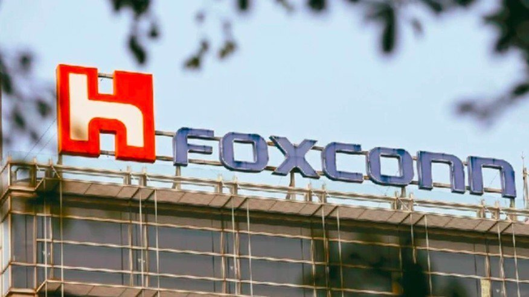

# 传鸿海将在印度追加16.7亿美元投资，进一步扩大iPhone产能

12月13日消息，据路透社报道，印度卡纳塔卡（Karnataka）邦政府于当地时间周二（12日）表示，鸿海将在该邦追加投资1,391.1亿卢比（约16.7亿美元），但没有透露具体细节。

目前，鸿海目前是苹果公司最大的代工伙伴，负责大约70%的iPhone制造，其中以其位于中国郑州厂的产量最多，但受COVID-19疫情及地缘紧张局势干扰，鸿海近年来在苹果的要求下也在持续扩大印度的iPhone制造产能。

今年3月，印度卡纳塔卡邦政府核准鸿海的9.68亿美元投资案，将于当地建造新厂，估计创造50,000个工作机会，目标是2024年4月开始生产iPhone。

今年8月，印度卡纳塔卡邦政府还曾宣布，鸿海将投资3.5亿美元卡纳塔卡省建一座新厂生产iPhone的机壳零件，预计将创造12000个工作机会。

今年11月27日晚间，电子代工大厂鸿海集团代印度子公司Foxconn Hon Hai Technology India Mega Development
Private
Limited发布公告称，将在印度建新厂房，预计投入1,282.09亿印度卢比（约合人民币110亿元，约合15.4亿美元）。外界推测，鸿海此举可能是为了进一步扩大在印度的iPhone产能。

根据之前的报道显示，鸿海目前在印度南部卡纳塔卡邦（Karnataka）建造的第一阶段厂房预计2024年4月就可开始运作，目标是在未来两三年内年产2,000万部手机，其中大部分是iPhone。鸿海也规划打造另一座iPhone生产工厂，规模类似卡纳塔卡邦厂房，但计划还在初始阶段。

分析机构预测，苹果公司打算在未来2~3年内，每年在印度制造超过5,000万部iPhone，之后还计划额外生产数千万部。若顺利达标，印度将在2030年底前制造全球25%的iPhone。

此外，印度还将进行低价iPhone的新产品导入（New Product
Introduction，NPI）流程，预计2025年开卖。苹果团队将与代工厂合作，将产品蓝图、原型转化为详尽的制造计划。截至目前为止，iPhone的NPI流程都只在中国大陆进行。

根据知名市调机构Counterpoint发布的印度智能手机出货量报告显示，2022年，中国小米以市占率20%，稳居印度市场冠军，苹果市占率仅4%。不过，印度拥有14亿消费人口，意味着苹果在印度仍有极大成长空间。

编辑：芯智讯-林子

