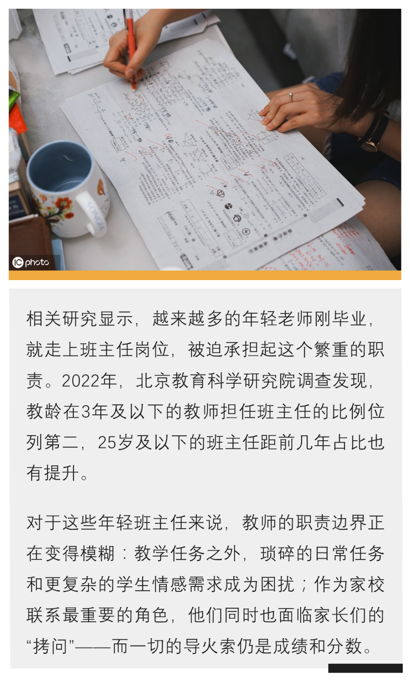
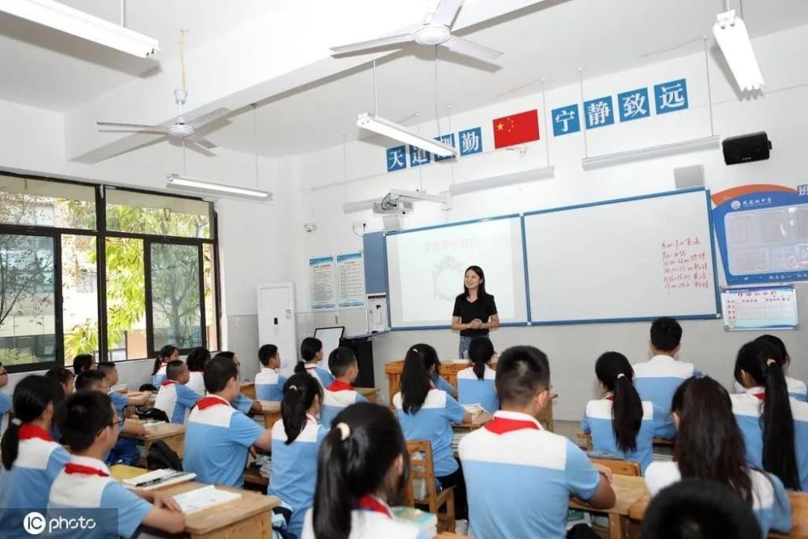
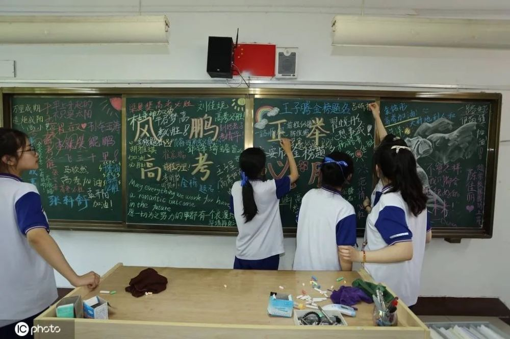

# 夜读｜应届生当班主任后：在讲台上腿发抖，“假扮”严厉的大人

**文|** 李昂‍

**编辑|** 王一然‍‍‍‍‍‍

**假扮一个严厉的大人**

李萱第一次真正以班主任的身份站在讲台上是去年9月，开学前两周，教职工大会宣布新学期教师名单，她才知道自己将成为高一的班主任，脑子里冒出的第一个想法是“完了”。

这所重点高中里，学生们只比她小六七岁，开学第一天，她故意摆出一副严厉的模样，放慢语速，列举学校的规章制度，立下班规。学生们穿着白色校服在底下端坐，李萱认为自己成功地“凶”住了学生。

讲台背后，这个刚毕业三个月的师范生紧张得腿微微发抖，她感觉自己在假扮一个严厉的大人，“像cosplay一样”。

在李萱的学生时代，班主任的形象总是严厉的。开学前，她故意在新生群缩减了回复字数，营造冷漠严肃的班主任形象；一走进教室，她迅速冷下脸，双手交叉抱在胸前，站在门口，一片喧哗就会回归寂静。

可等到学期过半，李萱觉得性格和脾气都被学生们摸清楚了。某节课上，她把睡觉的同学叫起来，男生站起身，眼睛仍然闭着。李萱让他站出去，男生嬉皮笑脸地说，“是是是，你说得对，好好好”，整个班级哄堂大笑。她知道已经快要管不住这群学生了：一个学生公然挑衅老师，很快就会有其他人跟风效仿。

现在，入职第二年，李萱觉得在学生面前已经没有威信可言。学生喜欢叫她“姐姐”，会开玩笑说她在刚开学时像“母老虎”，还有不熟悉的学生当面直呼她的本名。

“小孩会看人下菜碟”，中文系学生宋诚在大四实习时就得出这个结论，无论他在台上怎么喊，学生都当没听见，而只要老班主任坐在教室后面，课堂纪律会很快恢复。

一位教育学本科学生实习时也碰到了类似情况。有次监考英语测试，三年级的小学生在她面前明目张胆地打小抄，还有学生跑出座位去抄答案。上课时，后排学生交头接耳，扔纸飞机，她尝试过停止讲课，整顿纪律，但结果是牺牲了教学进度，所有人都上不了课。

真正接手新班级后，遇到违反纪律的学生，宋诚会马上拉高音量，给学生“做规矩”。他觉得这招很有效，“他们知道谁不好惹”。因为总是要“凶”学生，宋诚在开学第一周就哑了，每天嗓子都像火烧一样疼。其他教师告诉他，多喝点胖大海和罗汉果，习惯就好。

23岁的张婷也本科刚毕业就当上了高中班主任。在大学里，她只上过一节和班主任有关的课程。就算实习时，也只看过“两操”、听过班会。当时，带教老师告诉她，这只是做班主任的冰山一角。

入职后，她才认识到这座“冰山”的全貌：每天看早自习，周一开晨会、周五开班会，常规值周轮岗，主题教育策划、工作汇报……她像报菜名一样背出这些班主任的日常事务，而收学杂费和一系列上传下达的会议和通知，只能被统称为“杂活”。

2022年1月，一篇论文对全国13个代表性省、自治区、直辖市义务教育阶段学校进行抽样调查，发现安全责任压力大、班级管理任务重、工作时间延长、事务性工作太多成为班主任的最主要压力源。99%的班主任回家后还会继续处理班级工作。

而同时，越来越多年轻教师正在成为班主任。《我国中小学班主任工作职责变迁研究》一文指出，在学校担任班主任的，通常是以下几类教师:需要评职称的教师；刚进校的年轻教师；有经验且擅长管理学生的教师。

大多时候，李萱只有在下班后才有时间留给教学。她会呆在办公室学习教学视频。因为住宿资源紧张，李萱和学生住在一栋宿舍楼内。九点半晚自习结束后，学生时常会到李萱寝室聊天，偶尔也有学生在晚上十点多敲门说“身体不舒服想要回家”，李萱又要开始上班，联系家长来接学生。

**被忽视的情绪劳动**

事实上，张婷看到的“冰山”远非全貌，水面下还藏着更隐秘的东西。

一次课间，张婷偶然捕捉到学生手腕上有两道红色划痕，她说自己从没遇到过这种情况，不知道该不该当面戳穿学生，自责又害怕，满脑子想的都是“划了多深？会不会感染？其它地方有没有划？作为师范生，张婷在本科学习过心理学大类课程，但课时量少，内容简单。她只能咨询学校心理老师，找男生谈心，并与任课老师沟通。

她和学生聊了两个多小时，对方解释，“熬夜写作业太困了所以用刀划自己”，并答应她不再伤害自己。

近一个月过去，男生的伤痕变淡了，不过，那个瞬间仍提醒她“没尽到班主任的职责”。在开学组织的心理测试中，她班级里三分之一的学生有不同程度的心理问题。张婷常在班上说“跟老师交流是很正常的事”，鼓励学生找她倾诉。

去年秋天，开学三个月，李萱的班级里也有两个学生因为适应障碍问题休学。其中一个男生父母来学校找过她三四次，每次母亲都会急得哭出来。

害怕有更多学生出现心理问题，李萱选择当“情绪垃圾桶”。但这也意味着，她与那些负面情绪越来越难剥离。

期中考试成绩出来当天，李萱在办公室坐立不安，每当学生走进办公室看成绩，她都要偷偷“看脸色”。如果学生一言不发，李萱就会马上拿包纸巾，带他们出去哭。找来的学生多了，她的反应变得更快，也更机械。看到学生过来，她只剩下一个想法，“上班了”。

那天，李萱上了两节课，和三位学生聊了三个多小时。本来四点半下班，被学生留到了七点多。害怕有第四位学生找过来，她很快就走了。回到家躺在床上刷手机，她一句话都不想说，“我把一个月的话都说完了”。

即便是资深教师，也无法完全妥善处理学生的情感需求。“心理问题是个炸弹，谁碰到谁倒霉。”有八年教龄的刘哲说，在他班级里正式确诊心理疾病的就有六名，抑郁、焦虑、焦躁最为常见，病历单上的有些术语他甚至没听过。

学校处理特殊情况的流程也变得常规化。刘哲每月会定期询问家长，了解学生的心理状态和服药情况，按要求填写表格，上报给心理老师。备案是为了动态跟踪学生治疗，也是老师的一种自我保护手段。

北京教育科学研究院曾调查发现，中小学班主任承受最多的是“安全责任压力”，源于班主任成为学生安全事故责任的主要承担者。此外，班主任最希望通过培训获得“学生心理辅导能力”。

香港中文大学教育学院的尹弘飚教授在研究论文中指出，教师必须按照特定要求管理自己的情绪感受和表达。但过度的情绪劳动可能导致教师情感枯竭，产生职业倦怠等消极后果。2021年，华东师范大学一篇研究论文发现，高情绪劳动水平会增强班主任的离岗意愿；一项基于5065位中小学班主任的问卷调查表明，接近六成不愿意或勉强愿意从事班主任工作。

对这群刚刚毕业的年轻班主任来说，情绪劳动带来的负面影响变得更难排解。一位兼任物理老师的初二班主任几乎每天回家后都会哭，入职三个月后，她确诊了抑郁症，她最大的压力是“要回应每个小孩的情绪”，最后选择辞去了班主任职务。

但李萱依然坚持了下来，她脑子里常常会有两个小人吵架，“有时候会想，什么婆婆妈妈的事都要告诉我，什么都不管了；有时候又会觉得，我是班主任要负责”。最终，她总会选择后者。

**成为家长的“监控摄像头”**

班主任的工作时间被无限延长，除了“教书育人”的职责外，压力也来自家长。多位老师提到，几乎每个学业压力大的孩子背后，都有焦虑成绩的家长。曾有研究院调查显示，家长们缺乏一定的教育辅导能力，害怕孩子学习成绩下降。此外，有的学校不公布学生具体考试成绩和排名，而是按照比例划分为A-
E五档。但学生或家长通常会私下询问老师具体分数。

该调查还发现，教龄在3年及以下的教师担任班主任的比例居第二位，25岁及以下的班主任距前几年占比也有提升。这让年轻班主任几乎刚上岗就要应对更紧密的家校联系。

“孩子在初中时考试成绩很好，为什么到了高中只考了六七十分？”一次期中考试成绩公布后，李萱3天接了11个家长电话。她要分析学生的各科成绩，告诉家长如何提升分数。最让她头大的是，有时下课后看到手机上一连串同一个家长的未接来电。

一位执教十二年、当了近十年班主任的老教师发现，对孩子中高考有明确目标和期望的家长会关注每一次考试成绩，也更加焦虑。每次单元测试后，排名靠前的学生家长会马上咨询任课老师，了解扣分点、知识短板和提升方法——从孩子在家的学习情况、电子产品使用习惯到家庭矛盾，家长都会第一时间寻求班主任的建议。

教龄八年的刘哲在用了一个学期的钉钉后，关闭了提醒通知。为了避免家长加私人微信，刘哲主要用钉钉建立班级群，联络沟通家长，转发事务性通知，进行学杂费收缴等等。

钉钉有“消息已读”功能，刘哲在晚上八九点看到消息提醒时，都只会看弹出横幅显示的前几个字，而不会点进去。但那几个字会一直悬在他头上。关闭钉钉通知后，刘哲才感到自己夺回了一些生活的掌控权。

刘哲认为教师也是“服务性职业”。去年学校上网课半年，家长外出工作，只有学生在家，上早课前，刘哲要提供“宾馆叫早服务”，提前给几个学生打电话，叫他们起床。

_●同一个家长打给李萱的未接来电。讲述者供图_

家长对学校和教师的要求也越来越多。学生请假回到学校后，班主任李萱会马上收到家长的消息，“你帮我看看孩子到了没有？”李萱觉得自己像个“监控摄像头”，家长希望连接她，了解孩子的一举一动。

宋诚本科毕业就兼任小学一年级语文老师和副班主任，教学生笔画和拼音，并通过抄写默写巩固。有位学生的父母在某所三级甲等医院任职，曾在微信给他发过一篇学术论文，主题是“快乐教育”。这位父亲说，一年级学生理解不了抽象的文字，希望老师将符号背后的故事教给学生，而不是重复地练习。

宋诚无法理解，“笔画是直接写的，解释一个笔画是怎么造出来的，有意义吗？”

2023年，一篇对“双新”背景下新教师的研究论文指出，超过90%的新教师尚未很好地完成角色适应，并认为与家长进行有效沟通的挑战较大。李萱经常只能委婉地劝说家长，她觉得自己作为小辈，不能“教人做事”，“我一个入职一年的小老师哪敢呢？”

一位教育学硕士生认为，家校矛盾一定程度上源于沟通错位：家长希望孩子获得优质教育，而老师很难关注到每一位学生。“这应该是双方互相体谅的过程，而不是互相找茬、互相挑刺的过程。”

**房间里的大象**

连着两个学生休学后，李萱开了一次特殊的班会。她把两块黑板和各种颜色的粉笔交给学生，让他们用任意颜色、大小的字符，在黑板上肆意发泄情绪。

“想家、考试排名低、讨厌学校、讨厌xx老师、作业好多……”黑板上密密麻麻地画着学生五颜六色的烦恼。李萱鼓励大家说出心中不满时，教室内一片寂静，直到一个学生说出，讨厌某个布置作业太多的老师，学生们开始接连吐出内心深处的想法。

李萱感到欣慰，“一方面他们信任我，接纳我；另一方面，他们讲完后会开心很多，让我觉得我还是有用的。”她决定继续做好一名倾听者。升入高二后，她仍是班主任，只不过分班后面对的几乎是全新的学生。第一节课，李萱不再故意装出一副严厉模样，而是成为亲切的“大姐姐”。她说，只要她在班里不上课，女生们就围到她身边聊天。

在陌生的学校，张婷最有归属感的也是她的班级。尽管学生大大小小的问题都会第一时间找她，但她认为这是“教育者和受教育者之间的连接”。

这种连接或许正延伸到所有教师，自2020年起，上海试点推行“教师人人是导师、学生人人有导师”的中小学全员导师制。孙蕾所在的高中，这一制度已经落地。每位老师等比例担任十几位学生的导师，每两周定期开展一次导师活动，由心理老师提供主题。导师可以自由选择形式，聊天、看电影、学长学姐答疑解惑、玩游戏等等。

活动结束后，导师需要填写表格，记录活动形式和具体开展情况，这算在德育工作考核范围内。

课余时间，学生也会找导师沟通学习、情绪、生活等各方面问题。孙蕾说，每周都有七八位学生多次找她聊天，她能感受到学生聊完焦虑有所缓解，但如果成绩没有显著提升，这种情绪仍会蔓延恶化，最终“治标不治本”。

今年是孙蕾入职的第二年，她在体检中第一次查出了结节。与她一同进入学校的还有四位老师，其中两位与她一样是小叶增生和甲状腺结节，另一位老师是肺部结节，有40%左右的癌变几率。她平淡地接受了这一事实，“这是教师必长的三大结节”。她说，身边老教师的结节更多。

张婷的高中也即将推行“全员导师制”。她认为这属于“育人”范畴，但也对教师提出了更高的要求。

一篇研究教育政策的论文指出，“双减”聚焦立德树人，坚持学生为本，减轻作业负担，立足学生身心健康。但是，短时间内评价导向难以扭转。当前，“唯分数”录取方式没有彻底改变，教育评价方式仍以考试分数和升学率为主。

资深教师刘哲用一句话解释，“高考没有减，你不还得补起来？”在他看来，社会越来越“卷”，人也越来越“内耗”，而这种压力最终会落到每一个学生、家长和一线教师的头上。

在李萱的学校，虽然学生成绩不会影响教师薪资，也没有领导施压，但她知道，成绩是学生、家长和老师焦虑最大的导火索，它将带来一场无声的“爆炸”。她今年带纯文科班，学生选的是普遍印象里只需要背书的副科，被其他老师开玩笑称为“笨蛋班”。他们的成绩也始终处于全年级下游——每次查成绩前，李萱都会回到自己的学生时代：紧张、心跳加速，却又强装镇定，直到最终看到班级排名，她的心才落下。

（文中讲述者为化名，本文为极昼大学生写作课项目指导作品）

版权声明：本文所有内容著作权归属极昼工作室，未经书面许可，不得转载、摘编或以其他形式使用，另有声明除外。

