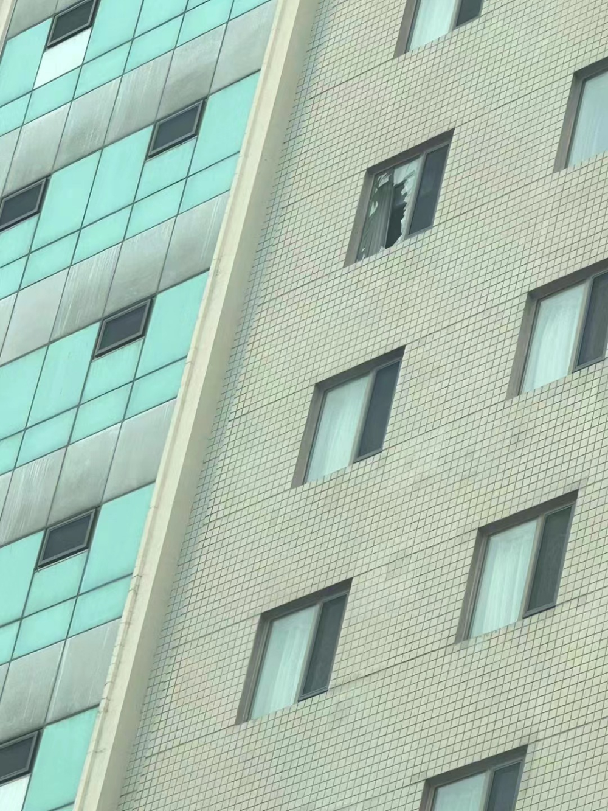

# 大连一酒店有人裸身坠楼？警方：处理中，坠楼男子已无生命体征

12月13日，网传大连市沙河口区国航酒店有一人裸身坠楼。

 _△ 网传视频截图_

网传视频显示，停靠在该酒店前方的一辆小车上，有一人卧在车顶。车顶已有明显塌陷，酒店高层有一扇窗户破裂。

据发布该视频发布者称，“看见一人没穿衣服把一辆车砸了，现场不让我乱拍”、“我路过时警察已经去了，腰部已经砸车里了”。

_△ 网传图片_

当日下午2时许，潇湘晨报（报料微信：xxcbbaoliao）记者就此事致电该酒店前台，工作人员表示无法告知，需询问警方；目前酒店正常营业。

记者随后致电星海湾派出所，值班人员表示需致电上级分局。分局工作人员表示不了解，需致电市公安宣传科。

大连市公安指挥中心工作人员告诉记者，此事目前已经在处理，以后续官方通报为准。据初步掌握，坠楼者为男性，已无生命体征。

潇湘晨报记者 吴陈幸子

