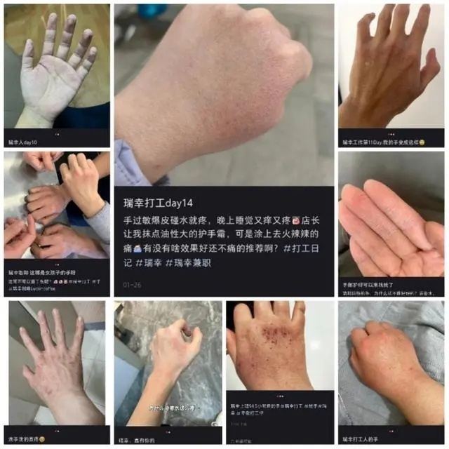

# 探访“烂手”风波中的瑞幸门店：店员全程戴手套，一小时洗手两次

近日，咖啡师的手备受关注。东方网·纵相新闻记者卧底一家咖啡店，工作第二天就出现了手指干裂、脱皮的情况。近一百个工时后，记者确诊手部湿疹。网络上，还有更多的发帖者讲述自己在咖啡店工作后，手部脱皮、皴裂的经历。

据估算，在瑞幸做咖啡师，按工作8小时算，一名员工每个班至少洗8次手，清洗抹布22次，触碰消毒水22次。

12月12日，九派新闻以消费者的身份来到武汉一家瑞幸咖啡店，试图记录一小时内，咖啡师清洗手部的频率。

据观察，店里的三名店员全程佩戴手套。一个小时里，一名店员戴着手套清洗手部两次，擦拭工作台两次，擦拭后需要手搓抹布。其余的时间，每做几杯咖啡，她都会清洗器皿，这时大多是靠水冲刷和浸泡，她拿着器具边缘，手和水的接触较少。

而在星巴克咖啡店里，店员说，这样的清洁要求在食品行业并不少见。他们也有每隔半小时清洁一次手部的要求。

_武汉一家瑞幸咖啡店内。图/九派新闻 王佳箐_

**【1】食品行业里洗手要求不少见，长期接触消毒水，伤口更不易愈合**

工作日的上午，瑞幸咖啡店里新订单的提示音断断续续地响起。偶尔也会有几分钟的空闲，店员们可以商量中午吃什么。

更多的时候，三位店员交替制作咖啡，清洗器皿和工作台。粗略统计下，一位店员在半小时里至少5次在洗手台作业，主要是冲洗制作咖啡的器皿。这个过程中，她拿着器皿边缘，尽量减少手和水的接触。

记者在店里的一个多小时，视线所及的地方，三名店员全程戴着半透明的手套。即使是外出买盒饭，回来时也不曾摘掉手套。

到了中午，其他店员进仓库吃饭，一位店员留在工作台继续制作咖啡。除了擦拭工作台，冲洗量杯、搅拌棒和抹布外，她两次清洗手部，隔着手套，将洗手液揉搓出泡沫，洗了大约半分钟。随后，她先用纸将手擦干，隔着纸关上水龙头。

店员小菲（化名）说，她的手并不像网上描述的那么严重，但工作久了，会觉得手很干。对此，她们并没有更好的办法，只能靠自己涂护手霜进行保护。

在武汉一家星巴克门店，店员说，食品行业里，瑞幸咖啡店的洗手要求并不少见，“可以去奶茶店、咖啡店问问看，他们也都是这样的。”在星巴克，店员被要求每隔半小时就清洗手部。除此之外，如果接触到污染物，也需要立即洗手。

一名店员伸出双手，他说，自己工作后，手变得粗糙了，伤口似乎也愈合得更慢些。好在，他对消毒水和清洁剂暂时没有过敏反应。

当被问及手部防护措施时，店员说公司有配发手套。但实际上，在这家星巴克里，没有一位店员佩戴手套。关于原因，他没有多说。

东方网的报道中提到，在瑞幸咖啡店，公司没有规定一盒手套需要用多久，但“损耗率不能太高”。除此之外，戴手套工作会影响拿取物品，降低工作效率。为了完成工作量，员工常常顾不上保护双手。

_社交平台上发帖者们发布的“烂手照”。图/社交平台截图_

**【2】店内所用洗手液、消毒粉不建议徒手使用，员工认定工伤后有权向公司索赔**

因为频繁洗手和长期接触清洁剂、消毒液而导致皮肤病是否属于工伤？

根据东方网·纵相新闻的报道，华东理工大学化学与分子工程学院教授、博士生导师王利民称，该咖啡店员工所使用的洗手液和消毒粉都不建议直接接触手部皮肤。“这两类含氯产品长期使用会对皮肤敏感人群造成手部过敏。”

但在现实中，职业性皮肤病诊断较为复杂，且需要企业的配合。上海皮肤病医院过敏性皮肤病诊疗中心负责人邹颖接受采访时表示，劳动者申请职业病诊断后，用人单位要提供盖有公章的劳动者职业史和职业病危害接触史，包括在岗时间、工种、岗位、接触的物质等。

广东至信忠诚律师事务所律师董亚民表示，依据《中华人民共和国职业病防治法》第七十二条规定，生产经营单位必须为员工提供必要的、安全的劳动防护用品。此外，正确佩戴和使用劳动防护用品也是员工必须履行的法律义务，可以有效避免或减少作业中的人身伤害。

他进一步指出，瑞幸员工遇到此类问题时，可以向瑞幸推荐合适长度和材质的手套，并要求瑞幸提供适合工作岗位的劳保用品，包括手套、护肤乳等；并建议瑞幸按照工作岗位不同灵活处理洗手问题；当因为工作需要治疗手部皮肤问题时，员工可主张医药费应由瑞幸承担。

北京盈科（合肥）律师事务所汪伦律师告诉九派新闻，若“瑞幸咖啡”门店的员工被认定劳动关系，在工作中手受到伤害，变成“烂手”，根据《工伤保险条例》第十四条规定：职工有下列情形之一的，应当认定为工伤：

（1）在工作时间和工作场所内，因工作原因受到事故伤害的；

（2）工作时间前后在工作场所内，从事与工作有关的预备性或者收尾性工作受到事故伤害的；

（3）在工作时间和工作场所内，因履行工作职责受到暴力等意外伤害的；

（4）患职业病的；

（5）因工外出期间，由于工作原因受到伤害或者发生事故下落不明的；

（6）在上下班途中，受到非本人主要责任的交通事故或者城市轨道交通、客运轮渡、火车事故伤害的；

（7）法律、行政法规规定应当认定为工伤的其他情形。

完全符合在工作时间和工作场所内，因工作原因受到事故伤害，属于典型的工伤情形，故用人单位应当承担工伤赔偿责任。

主张工伤赔偿应先向劳动行政主管部门申请工伤认定，再到市级劳动能力障碍鉴定委员会申请劳动能力障碍鉴定，后向劳动人事争议仲裁委员会申请劳动仲裁，任何一方不服可以法院起诉等程序主张劳动权利。

若没有被认定劳动关系，这些兼职员工可以依据民法典第一千一百九十二条：“个人之间形成劳务关系，提供劳务一方因劳务造成他人损害的，由接受劳务一方承担侵权责任。接受劳务一方承担侵权责任后，可以向有故意或者重大过失的提供劳务一方追偿。提供劳务一方因劳务受到损害的，根据双方各自的过错承担相应的责任。”由用人单位承担赔偿责任，可以向法院起诉主张损害赔偿责任。

**九派新闻记者 王佳箐 湖北武汉报道**

**编辑 杨臻 任卓**

【来源：九派新闻】

版权归原作者所有，向原创致敬

