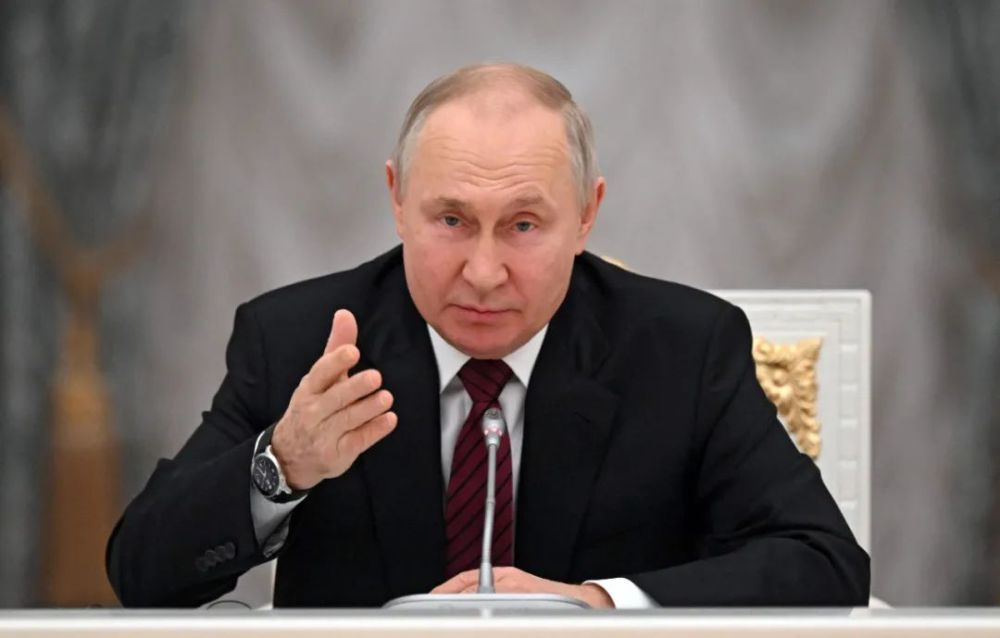
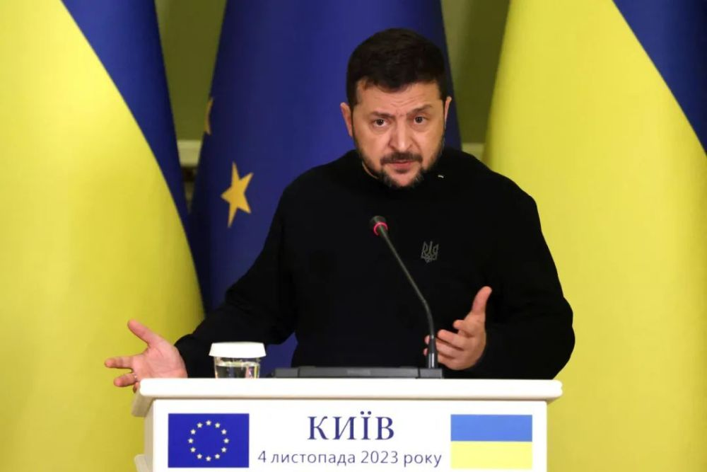

# 普京参选，泽连斯基“不选”

俄乌冲突即将进入第三年之际，是否如期在2024年3月举行总统选举，俄罗斯总统普京和乌克兰总统泽连斯基做出了不同的选择。

普京12月8日表示，将参加明年3月的总统选举，寻求第五个总统任期。1999年的最后一天，普京被叶利钦任命为俄罗斯代总统，随后赢得2000年总统选举。自那时开始，除了2008年到2012年和梅德韦杰夫进行了一次“总统-
总理轮替”，普京一直连选连任。2020年，俄罗斯国家杜马投票通过宪法修正案，使今年71岁的普京可以再竞选两届总统，每届6年。

 _普京。图/视觉中国_

根据独立民调机构列瓦达中心的数据，持续时间接近两年的俄乌冲突不仅未使普京的支持率降低，反而巩固了他的民意基础，其支持率从2022年1月的69%上升到2023年11月的85%。被“共同敌人”激发的共同立场，持不同政治看法者大量移民，西方制裁未能阻止俄罗斯今年约3.5%的经济增速……分析人士从不同视角给出不同的解读。但绝大多数评论都确信，普京将轻松赢得又一个六年任期。

另一边，乌克兰原本也应在明年3月大选。但今年11月，乌克兰最高拉达各党派达成共识：战争结束前不进行总统选举，未来，乌克兰将在战时状态结束6个月后再进行最高拉达和总统选举。一些乌克兰国内批评人士指责泽连斯基在利用“长期战争”走向威权统治，但多数评论认为，泽连斯基的“不选”是为了保持战时国家稳定的无奈之举。

“选”与“不选”，都是为了“保持稳定”，但也各有挑战。对于俄罗斯，外界关心的是：普京在获得又一次选举胜利后，是否会调整自己的执政班底？

俄罗斯国防、安全等事务领导层已经十多年没有大的变动，国防部长绍伊古、内政部长科洛科利采夫都是2012年上任的，政府其他高层大多也是从2016年一直履职至今。但是，今年6月，俄罗斯私营军事实体瓦格纳组织的“叛乱”，将“特别军事行动”期间俄军指挥体系的问题暴露在公众面前。

俄罗斯国际事务委员会前总干事科尔图诺夫曾指出，作风强硬的普京，不会在瓦格纳“叛乱”之后就更换遭到“叛乱者”攻击的绍伊古等官员。但如果在2024年选举后组建新政府时进行人事调整，则一切顺理成章。值得注意的是，普京是在“祖国英雄日”颁奖典礼上透露将参选总统的，而当时和他对话的，就是从私营军事实体领导人成为俄控顿涅茨克地区负责人的佐加。

此外，卡内基俄罗斯欧亚中心的评论指出，随着战事趋缓，俄罗斯国内的军事工业需求或将大幅下降，这可能放大西方制裁对俄罗斯经济的影响。是否需要调整班底应对冲击，也是普京需要考虑的问题。

_泽连斯基。图/视觉中国_

另一边，泽连斯基正在担心自己的“金字招牌”。从去年底到今年年中，乌克兰政府一直未能成功推动欧美盟友就长期对乌军援形成制度性安排。在国际焦点转移、美国将迎来大选年之际，即使乌克兰近期将求援目标从“升级军援”降级为“维持军援”，依然未能得到盟友的一致支持。

12月6日，占美国众议院多数的共和党人否决了对乌克兰的610亿美元援助方案。此前一天，泽连斯基原本被安排在美国国会投票前发言，却被临时取消。拜登政府警告称，这意味着美国对乌援助资金将在“几周内”被耗尽。

在此背景下，泽连斯基12月12日开启今年第二次美国之旅，并特别安排了和众议院新任共和党议长约翰逊的会晤，试图通过游说国会共和党人同意610亿美元拨款，向乌克兰国内证明自己依然具有广泛的国际号召力。

分析认为，乌克兰政界以“不选”求稳，前提是泽连斯基在国际上的“金字招牌”使他能够团结国内主要政治派系；如果泽连斯基的“招牌”不再灵验，“不选”反而会成为引发各派系相互攻击的不稳定因素。

由于被占领区选举暂停和一些亲俄议员被剥夺资格，目前，应有450人的乌克兰最高拉达只有约400名成员，所有缺额都还没有举行过补选。与此同时，在泽连斯基执政党内，越来越多的议员开始公开表达对军事领导层的不满，要求“不论是否大选，防长都应换人”。

记者：曹然

