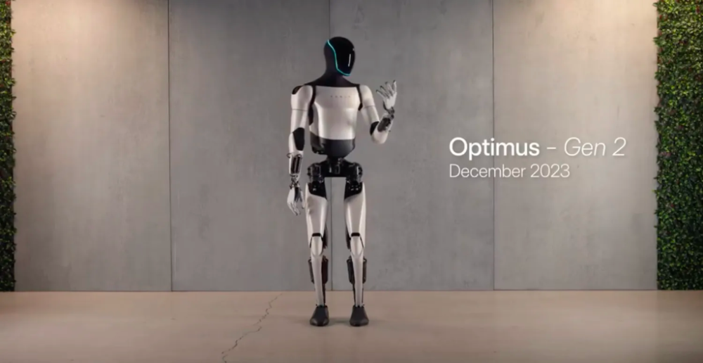
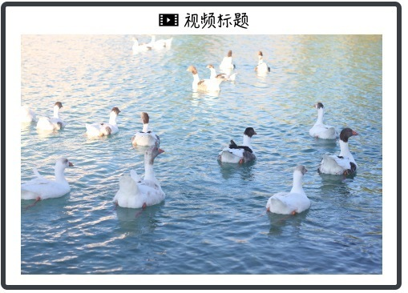
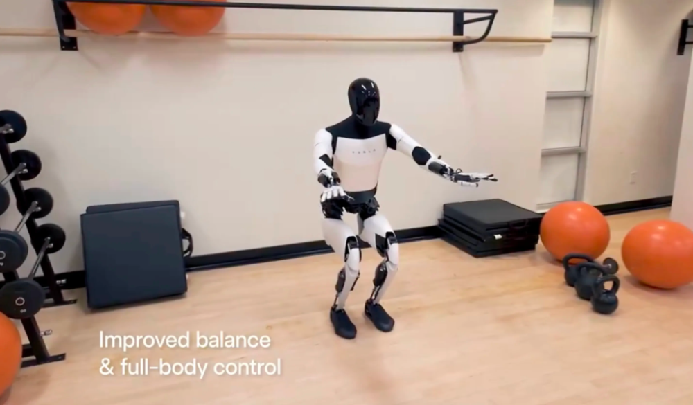

# 特斯拉人形机器人Optimus第二代亮相：更快更轻，轻松拿捏鸡蛋

12月13日，特斯拉在X上放出特斯拉人形机器人“擎天柱2代”（Optimus Gen2）的新演示视频。

相比早前展示的原型，Optimus
Gen2似乎在重量、灵活性等方面都有显著进步。有分析人士认为，以目前的速度迭代下去，Optimus机器人可能很快就能在许多领域取代人工。

更精致、更灵活的人形机器人

相比看起来像半成品、只能勉强走路和挥手的初代Optimus机器人，Optimus Gen2造型十分精致。

特斯拉表示，Optimus Gen2的行走速度提高了30%，虽然在视频里面看还是有些步履蹒跚，但特斯拉展示的稳定行走能力或已经可以在商业场景中派上用场。

此外，特斯拉还表示，Optimus Gen2在提高平衡性的同时，重量减轻了 10 公斤。

在视频演示中，可以看到 Optimus Gen 2 一边完成深蹲动作一边保持平衡。

制造人形机器人最大的挑战就是手。机器人的手需要足够强大，能够支撑相当大的重量，同时又能够足够精确地处理精细任务。

Optimus Gen 2似乎对手部进行了一次全面升级，手臂和双手可以像人类一样移动，而且动作精准，甚至能处理鸡蛋等易碎物品，如下图：

商业化落地进程有望加速

中信证券指出，Optimus
Gen2使用了全新的足部力及力矩传感（该机构推测是六维力矩传感器）以及全新11自由度灵巧手，响应更快，同时还具备了手指触觉传感器，相比Gen1灵活性大幅提升，商业化落地进程有望加速。

马斯克此前曾表示，Optimus机器人的价值被市场“极度低估”，他预计需求量可能高达 100 亿至 200 亿台。

他甚至自信地预测，Optimus 将占据“特斯拉长期价值的大部分”。

特斯拉目前计划现在自己的制造业务中使用Optimus机器人，然后再逐步推广到更大的市场上。

至少从目前展示的视频来看，马斯克的愿景并不算遥远。在未来几年里，Optimus就可能会拥有跳跃能力，能爬楼梯、搬更重的物品，在更强大的人工智能加持下，特斯拉在慢慢完成AGI的一块重要拼图。

