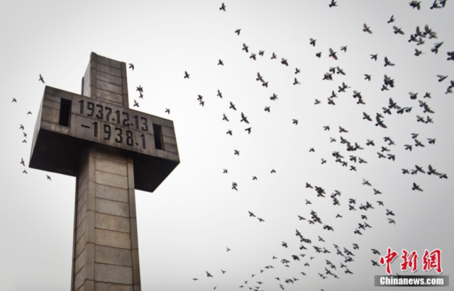
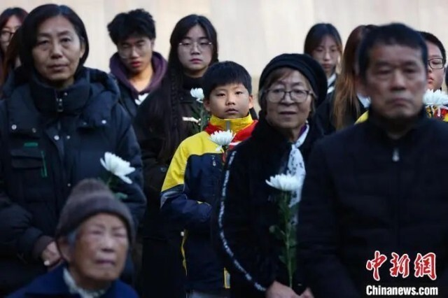
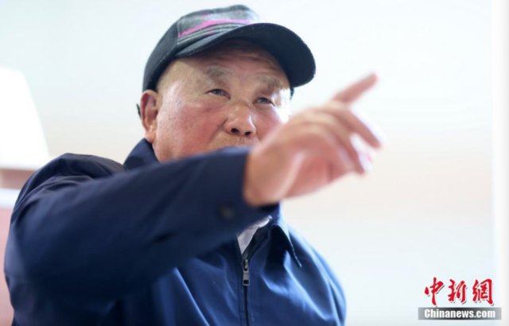
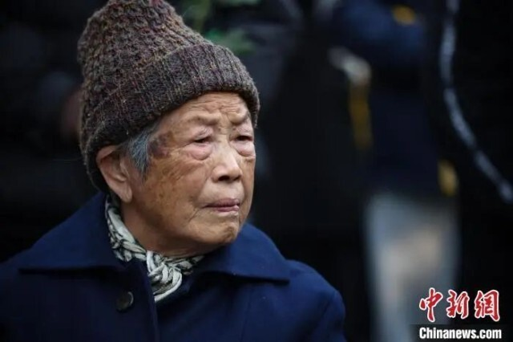
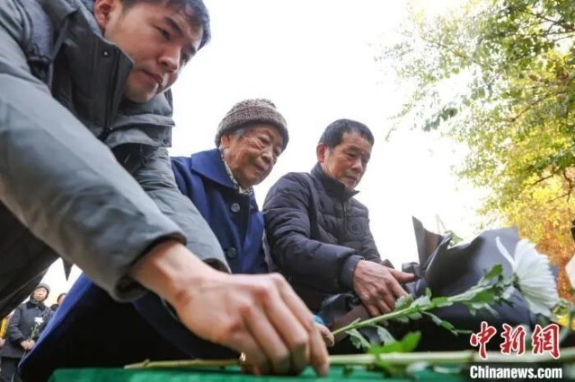
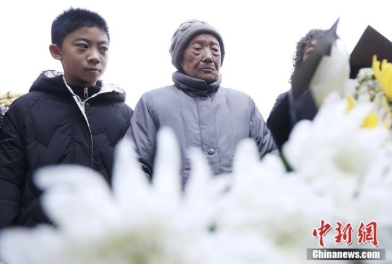
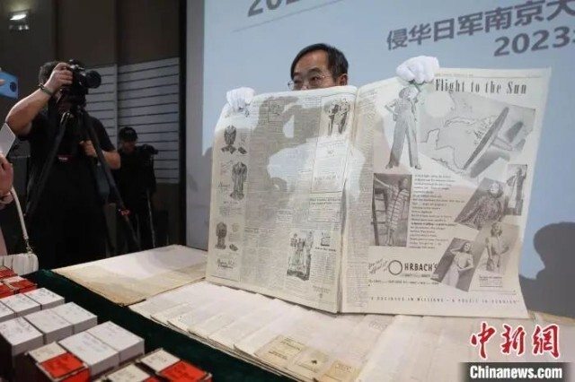
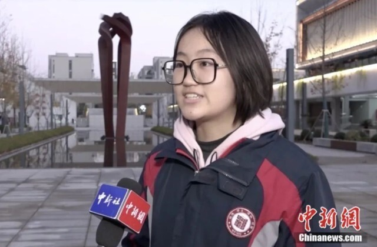

# 第十个国家公祭日，他们有话要说

2023年，是南京大屠杀惨案发生86周年。

86年前的“12·13”，是国殇，是中华民族近代史上沉重一页。

**86年过去了，那段历史不能忘！不敢忘！**

_侵华日军南京大屠杀遇难同胞纪念馆纪念碑。泱波 摄_

今年的12月13日，是第十个南京大屠杀死难者国家公祭日。

年复一年的国家公祭，人们抚慰伤痕，铭记不能忘却的痛。 **我们采访了10位相关人士。**

**他们中，有的在南京大屠杀中失去至亲、身负伤痛，却始终致力于传递历史真相、播撒和平之种；**

_12月3日，南京大屠杀死难者家庭祭告活动举行。泱波 摄_

**有的身为幸存者后人，听着家族的悲痛故事长大，如今选择背负历史前行，把历史记忆传承下去；**

**有的大力推动南京大屠杀死难者祭奠，上升为国家公祭仪式，以国之名悼念遇难同胞；**

**有的坚持近20载在海外打捞真相，搜寻南京大屠杀的史实铁证……**

他们以实际行动告诉世人： **铭记南京大屠杀史实、祭奠南京大屠杀死难者，是家事，是国事，更是天下事。**

**12·13**

**南京大屠杀幸存者夏淑琴**

**“我想告诉年轻人，和平、和平、和平，永远要和平！”**

 _南京大屠杀幸存者夏淑琴。泱波 摄_

86年前的冬天，侵华日军在南京烧杀抢掠、大肆屠戮，夏淑琴一家九口人中的七口人被残忍杀害。夏淑琴被日本兵用刺刀刺中，至今身上留有伤疤。

**夏淑琴数十载坚持为历史真相奔走。**
1994年，夏淑琴前往日本，成为战后第一位赴日控诉南京大屠杀暴行的幸存者。2006年，因日本右翼作家污蔑其是“假人证”，老人愤慨赴日应诉，并当庭反诉对方侵犯名誉权，官司最终大获全胜。

夏淑琴日前在接受中新社记者采访时说：“九年前为‘国家公祭鼎’揭幕的时候，想到那些死去的同胞们，我心里像刀绞一样，很难受，说不出话。我还要好好活下去，谢谢大家帮助我们，把南京大屠杀的历史讲给更多人听，我就能对得起那些死去的同胞们。”

**12·13**

**南京大屠杀幸存者刘民生**

**“我要把这段悲惨历史讲给后代听，讲给不知道这段历史的人听。”**

_南京大屠杀幸存者刘民生。泱波 摄_

南京大屠杀惨案发生时，刘民生年龄虽小，却依稀记得那段惨痛的记忆。“父亲被抓走的时候，幼时的我根本没想到，这竟是最后一面。”

“在难民区，父亲抱着我，母亲抱着妹妹。当时在户外，天气又冷，我就哭了，结果日本兵端着刺刀，在我腿上刺了一刀，至今右腿上还留有伤疤。”

刘民生说：“我们要共同把这段历史记住，共同捍卫世界和平。 ”

**12·13**

**南京大屠杀幸存者艾义英**

**“国家越来越好，就是靠你们年轻人，希望你们珍爱和平。”**

 _南京大屠杀幸存者艾义英。泱波 摄_

南京大屠杀期间，艾义英的 **6位亲人被日军杀害，其中包括她的父亲。**

“日本兵来抓人，我当时哭着抱着爸爸的腿，说‘爸爸你不能走，你走了我怎么办’，但是后来，他再也没能回来。”

今年南京大屠杀死难者国家公祭日前夕，在侵华日军南京大屠杀遇难同胞纪念馆遇难者名单墙前，艾义英献花时几度哽咽，
**“我年纪大了，以后不一定能来了，我来不了，下一代会代我来，一直都会来。”**

**12·13**

**南京大屠杀幸存者艾义英之子黄兴华**

**“家事也是国事，我们的责任是把家庭这段历史讲给更多年轻人听。”**

_黄兴华（右）与艾义英（中）向南京大屠杀遇难者名单墙献花。泱波 摄_

**往后，会代替艾义英来的，是她的儿子黄兴华。**

随着时光流逝，南京大屠杀历史记忆传承的重任落在后人的肩上。2022年8月，首批共13名南京大屠杀历史记忆传承人获得认证，黄兴华是其中之一。

**黄兴华说，作为南京大屠杀历史记忆传承人，自己有责任把这段家里的历史向后代、向社会讲述，不让历史悲剧重演。**

**12·13**

**南京大屠杀历史记忆传承人曹玉莉**

**“我们会永远牢记历史、不忘过去。”**

_南京大屠杀历史记忆传承人曹玉莉。泱波 摄_

**曹玉莉是南京大屠杀幸存者夫妇曹洪泰、张翠英的女儿，也是第二批南京大屠杀历史记忆传承人之一。**

曹玉莉回忆，“每每想起这些伤心往事，父母就悲痛欲绝，哽咽不止。幼年的经历对他们来说是一辈子都挥之不去的恶梦。”

**曹玉莉说：“我们肩负责任和使命，要让更多的人了解南京大屠杀史实和真相。”**

**12·13**

**南京大屠杀幸存者夏淑琴的外曾孙李玉瀚**

**“我有责任把我们家的故事、南京大屠杀的历史，讲述给更多的人听。”**

_南京大屠杀幸存者夏淑琴和其外曾孙李玉瀚。泱波 摄_

**南京大屠杀幸存者夏淑琴的外曾孙李玉瀚是首批13名南京大屠杀历史记忆传承人中年纪最小的。**
尽管刚满13周岁，他已经在侵华日军南京大屠杀遇难同胞纪念馆当了好几年的讲解员。

这个自认为已是小男子汉的孩子感到肩上担子很重， **“我有责任把我们家的故事、南京大屠杀的历史，讲述给更多的人听。”**

**12·13**

**国家公祭日首倡人赵龙**

**“使世界永不忘记，让国人永世铭记，正是南京大屠杀死难者国家公祭日的意义所在。”**

 _国家公祭日首倡人赵龙 。受访者供图_

首个提出设立南京大屠杀死难者国家公祭日的，是时任全国政协常委、江苏省人大常委会副主任的赵龙。
**他在2005年全国两会期间，向大会提交了《关于将每年的12月13日定为国家公祭日的提案》。**

2014年2月27日，第十二届全国人民代表大会常务委员会第七次会议通过决定，将12月13日设立为南京大屠杀死难者国家公祭日，每年12月13日举行公祭活动，悼念南京大屠杀死难者和所有在日本帝国主义侵华战争期间惨遭日本侵略者杀戮的死难者。

**在赵龙看来，使世界永不忘记，让国人永世铭记，正是南京大屠杀死难者国家公祭日的意义所在。**

**12·13**

**美籍华人鲁照宁**

**“夜深人静时，当我翻看南京大屠杀资料图片，就像走进历史隧道，情绪很不好，有时会放声痛哭。”**

_12月8日，美籍华人鲁照宁展示捐赠的报纸资料。泱波 摄_

南京大屠杀死难者国家公祭日前夕，鲁照宁再次来到南京，将在海外新搜集的史料捐给侵华日军南京大屠杀遇难同胞纪念馆。
**捐赠，对他来说已是“停不下来”的惯性之举。据其统计，近20年来，他向纪念馆捐赠了近20次，捐赠史料超过两千件(套)。**

1937年侵华日军攻入南京，大肆屠戮，鲁照宁的二爷爷鲁葆寅被日本兵开枪打死。家族中还有多位亲人在侵华战争中死去。

打捞真相如在历史隧道中“追光”。2004年，他通过中新社记者牵线搭桥，第一次向馆方捐赠了其在海外搜集的南京大屠杀史料，自此一发不可收拾。

**“2024年，将是我捐赠生涯的第20个年头，也是我的退休之年，我退休后希望能发挥余热，到纪念馆当志愿者、做英文翻译，与更多国际友好人士一道‘追光’。”鲁照宁说。**

**12·13**

**南京市长江路小学英语教师杨筱艳**

**“在侵华日军南京大屠杀遇难同胞纪念馆，展厅中的照片无论看过多少次，依然带给我极大的心理震撼。”**

_南京市长江路小学英语教师杨筱艳展示她创作的《宁生，宁生》书籍封面。朱晓颖 摄_

“1937年冬，南京沦陷之前，一对年轻的夫妇带着孩子和所有行李从江边登船，离开南京。这对夫妇就是我的外公、外婆。”杨筱艳说，她是南京大屠杀亲历者的后代，也是教育工作者，为此感觉责任重大：
**要向下一代讲述南京大屠杀史实，鞭策他们莫忘国耻、传承记忆、自强不息，在孩子们的心中播下和平理念之种。**

杨筱艳认为，历史是最好的教科书。 **这些年来，她切身感受到，孩子们对南京大屠杀惨案的了解越来越多，南京大屠杀死难者国家公祭日的知晓度也越来越高。**

**12·13**

**曾领诵《和平宣言》的南京高中生**

**“对80多年前侵华日军在南京犯下的滔天罪行，我通过影像资料看到同胞遇难、文明罹难，内心非常悲痛。”**

_曾领诵《和平宣言》的南京高中生乐筱懿。朱晓颖 摄_

2022年南京大屠杀死难者国家公祭仪式上，南京市中华中学雨花校区高中学生乐筱懿是《和平宣言》朗诵团的领诵。
**她表示，自己通过朗诵“走进”了那段历史，心中种下了捍卫人类正义之梦。**

**“和平是多么宝贵，每个人的生命都应当被尊重、温柔以待。”**
乐筱懿说，她未来想成为一名法律工作者，为守护世界和平、捍卫人类正义、捍卫每个人的美好生活尽绵薄之力。

_学生为名单墙上的名字描新。泱波 摄_

**昭昭前事，惕惕后人。**

**国行公祭，法立典章。**

**永矢弗谖，祈愿和平。**

**中华圆梦，民族复兴。**

**吾辈当自强！**

来源：中国新闻社

