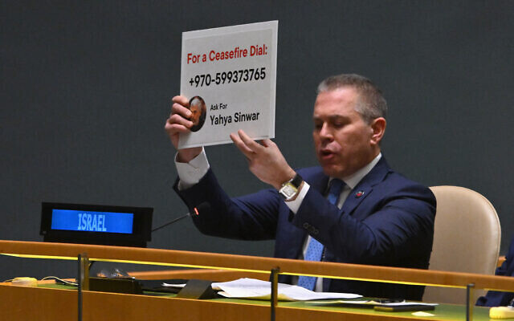

# 联大通过停火决议，以代表投票前亮出哈马斯电话号码：想停火找他们！

【环球网报道】联合国大会12日召开紧急特别会议，以153个国家支持、10个国家反对和23个国家弃权的投票结果通过一项决议，要求在加沙地带立即实现人道主义停火。而反对的10个国家中，包括美国和以色列。《以色列时报》报道称，以色列常驻联合国代表吉拉德·埃尔丹在投票前发言时亮出一块看板，上面写着一个据称是哈马斯在加沙办公室的电话号码。他表示，想要“真正”停火，就打电话去找哈马斯。

 _埃尔丹12日在投票前发言时亮出一块看板，《以色列时报》配图_

据报道，埃尔丹称，“停火只意味着确保了哈马斯的生存”，抨击“决议不仅没有谴责哈马斯的反人类罪行，甚至根本没有提及哈马斯”。他说，如果联合国成员国想要“真正的停火”，他们应该给哈马斯在加沙的办公室打电话。他举起一块看板，上面写着电话号码和哈马斯在加沙地带的领导人辛瓦尔的名字。“（打电话）告诉哈马斯放下武器，自首并释放我们的人质。这将带来永久的全面停火。”埃尔丹说。

《以色列时报》强调，尽管该决议在12日晚些时候通过，但决议并没有约束力。

当地时间12月12日，联合国大会第十届紧急特别会议召开，并以压倒性票数通过决议，要求巴以冲突双方立即停火。联大对阿拉伯国家联合提出的新加沙局势决议草案进行表决期间，153国赞成，23国弃权，以色列、美国等10国反对。由于决议草案达到三分之二多数赞同，因此得到通过。该决议呼吁要求立即实行人道主义停火；再次要求所有各方遵守其根据国际法包括国际人道法所承担的义务，特别是保护平民的义务；要求立即无条件释放所有人质，并确保人道准入。

