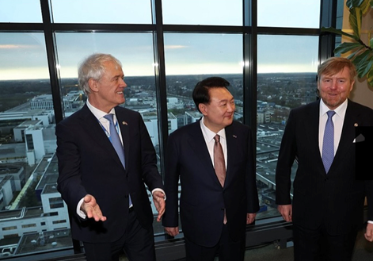

# 韩国首次？韩媒：尹锡悦将与荷兰首相宣布两国结为“半导体同盟”

【环球网报道 记者
姜蔼玲】韩联社13日报道称，韩国总统办公室当天透露，正在荷兰进行国事访问的韩国总统尹锡悦当天将同荷兰首相马克·吕特举行首脑会谈并发表联合声明，宣布两国正式结为“半导体同盟”，设立经济、安全、产业领域的双边协商机制。

报道称，韩国国家安保室第一次长金泰孝12日在阿姆斯特丹新闻中心举行的记者会上表示，韩国和荷兰决定在半导体领域加强常态化特别合作，两国将致力于构建一个在供应链危机发生时，能提供立即且高效解决方案的同盟关系。金泰孝表示，两国通过紧密合作在共同声明中写入了“构建半导体同盟”的表述。

_当地时间12月12日，在荷兰光刻机生产企业阿斯麦总部，韩国总统尹锡悦（中）同阿斯麦首席执行官彼得·温宁克（左）、荷兰国王威廉-亚历山大听取企业介绍。
图源：韩媒_

报道介绍称，两国将通过发表联合声明，商定共同努力缩小技术差距，共同应对供应链危机。为此，两国外交部门将定期举行经济安全对话。此外，两国商务部门还将设立对话机制，协调芯片政策，并建立基于关键品目供应链合作的谅解备忘录（MOU）。

报道提到，韩国总统府另一名高级官员在接受记者采访时表示，这可能是韩国政府首次宣布与特定国家结为“半导体同盟”，相信对荷兰来说也是第一次。

据此前报道，韩国总统尹锡悦11日启程前往荷兰，开启其为期四天的访问。韩国媒体报道称，尹锡悦此访重点放在提升两国经济合作水平方面，并将走访荷兰阿斯麦公司（ASML）。出访前一天，尹锡悦接受法新社采访时声称，经济与安全是同义词。他将在访荷期间重点讨论全球半导体供应链问题，并构建系统性的制度框架。访问阿斯麦将成为“韩国与荷兰半导体同盟”关系的重要转折点。值得一提的是，全球存储半导体巨头三星电子会长李在镕和SK集团会长崔泰源将陪同访问。

对于尹锡悦此次访荷，上海对外经贸大学朝鲜半岛研究中心主任、教授詹德斌7日告诉《环球时报》记者，韩国半导体设备的自主生产率很低，而阿斯麦是全球唯一一家能够供应7纳米及以下芯片所需的EUV光刻机的厂商。尹锡悦希望利用此次访问荷兰的机会，获得稳定供应并提高韩国半导体设备的自主生产能力。詹德斌称，如今的武器装备越来越智能化，而智能化依靠的是从设计到生产先进芯片的一系列能力。因此，半导体对于韩国的军工力量来说也非常重要。对于法新社、韩国《中央日报》等媒体曾在相关报道中暗示上述合作有针对中国之意，詹德斌表示，韩国想利用美国主导的所谓先进技术供应链，“抓住”荷兰，提高半导体设备的自主生产能力，对中国没有直接影响。

