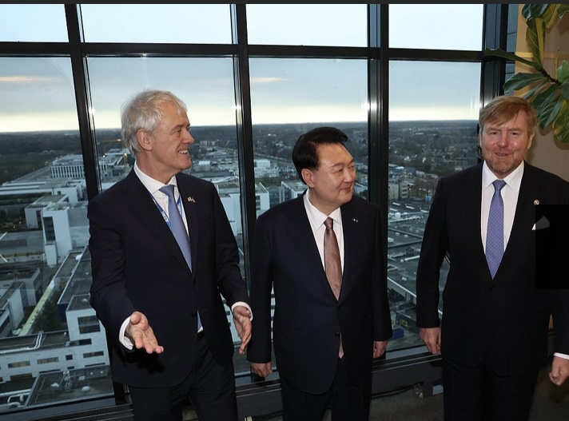

# 韩媒：韩国总统与荷兰首相发表联合声明，两国商定构建“半导体同盟”

【环球网报道】据韩联社最新报道，正在荷兰访问的韩国总统尹锡悦同荷兰首相吕特当地时间13日发表联合声明，其中提到两国商定构建“半导体同盟”，新设并隔年举行外交和产业部门“2+2”部长级对话协商机制，进一步深化战略伙伴关系。

此前，韩国总统室已提前透露了韩国荷兰将结成“半导体同盟”的消息，引发多家韩国媒体关注。

韩联社13日最新报道称，此次访问是尹锡悦首次对荷兰进行国事访问，他与吕特在海牙举行了单独会谈，并达成一份包含20项内容的联合声明。

_当地时间12月12日，在荷兰光刻机生产企业阿斯麦总部，韩国总统尹锡悦（中）同阿斯麦首席执行官彼得·温宁克（左）、荷兰国王威廉•亚历山大听取企业介绍。
图源：韩媒_

韩联社当天早些时候介绍称，两国将通过发表联合声明，商定共同努力缩小技术差距，共同应对供应链危机。为此，两国外交部门将定期举行经济安全对话。此外，两国商务部门还将设立对话机制，协调芯片政策，并建立基于关键品目供应链合作的谅解备忘录（MOU）。

此外，韩国国家安保室第一次长金泰孝12日在阿姆斯特丹新闻中心举行的记者会上表示，韩国和荷兰决定在半导体领域加强常态化特别合作，两国将致力于构建一个在供应链危机发生时，能提供立即且高效解决方案的同盟关系。

韩国总统尹锡悦11日启程前往荷兰，开启其为期四天的访问。韩国媒体报道称，尹锡悦此访重点放在提升两国经济合作水平方面，并将走访荷兰阿斯麦公司（ASML）。出访前一天，尹锡悦接受法新社采访时声称，经济与安全是同义词。他将在访荷期间重点讨论全球半导体供应链问题，并构建系统性的制度框架。访问阿斯麦将成为“韩国与荷兰半导体同盟”关系的重要转折点。值得一提的是，全球存储半导体巨头三星电子会长李在镕和SK集团会长崔泰源将陪同访问。

