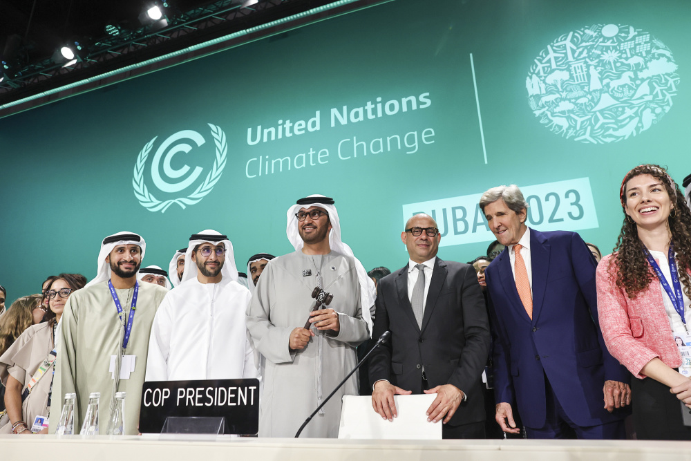

# COP28达成历史性协议，“摆脱化石燃料”首次写进文本

（观察者网讯）当地时间12月13日，在阿联酋迪拜举行的《联合国气候变化框架公约》第二十八次缔约方大会（COP28）闭幕。据阿联酋通讯社消息，大会达成一项“历史性协议”，首次将“摆脱化石燃料”写入文本，呼吁缔约方尽快实现净零排放。

但路透社报道称，在沙特阿拉伯和其他多个石油生产国的反对下，最终协议调整了措辞，删除了此前草案中有关“逐步淘汰化石燃料”的呼吁。

198个缔约方的代表在会上同意了气候变化领域的“阿联酋共识”，呼吁世界各国尽快摆脱化石燃料，在关键的十年里加快行动，到2050年实现净零排放，将全球升温控制在1.5摄氏度以内。协议还呼吁在2030年前将全球可再生能源产能增加2倍，将能源效率的年增长率提高1倍。

阿联酋工业和先进技术部长、COP28主席苏尔坦·贾比尔表示，这项具有里程碑意义的协议为世界指明了正确的方向，“我们努力地工作，以确保我们的人民和地球拥有一个更美好的未来。我们应该为历史性的成就感到自豪。”

当地时间12月13日，COP28闭幕，近200个缔约方达成“阿联酋共识” 图源：视觉中国

法新社指出，最终协议在措辞上有所调整，没有提及西方国家、太平洋岛国和拉丁美洲国家代表所要求的“逐步淘汰化石燃料”。但这是联合国气候峰会举行近30年来，世界各国首次一致同意从化石能源转型。

美国总统气候问题特使约翰·克里表示，协议向世界发出了“非常强烈的信号”，标志着饱受战乱蹂躏的世界可以为了共同的利益而团结起来，“我想每个人都同意，这是比以往更强烈、更明确的对1.5摄氏度温控目标的呼吁。我们将继续推动迅速的能源转型。”

俄罗斯总统气候问题特使鲁斯兰·埃德尔格里耶夫对达成协议表示欢迎，称协议呼吁世界各国共同为能源转型作出贡献。但他强调，世界不应该“混乱地拒绝化石燃料”，“我们不能忽视世界各地民众的多样化需求，包括对可负担且可靠能源的需求。”

沙特阿拉伯称赞会议取得“巨大的成果”，对缔约方达成协议表示“感谢”。沙特官员阿尔巴拉·陶菲克重申其作为石油生产国的立场：“我们必须尽一切可能减少碳排放，无论其来源是什么。我们必须利用所有技术来实现这一目标。”

法新社称，作为石油生产国，沙特一直支持减少化石燃料的碳排放，但反对限制化石燃料。在沙特阿拉伯等多个石油国家的明确反对下，COP28最终协议删除了此前草案中有关“逐步淘汰化石燃料”的措辞。

不过，一些发展中国家代表担心，协议未能解决发展中国家面临的严峻挑战。据《日经亚洲》报道，太平洋岛国对协议表示了不满，萨摩亚代表认为，协议没有采取足够有力的措施来应对气候变化。马绍尔群岛代表说，“我们像是建造了一艘脆弱、漏水、满是漏洞的独木舟，但我们还是把它放进了水里。”塞内加尔环境与可持续发展部负责应对气候变化的官员表示，协议只是反映了最低目标，并且“凸显了发展中国家需求和可用资金之间的巨大差距”，但“协议未能对这一挑战做出可信的回应”。

联合国环境规划署估计，发展中国家每年适应气候变化所需资金约为2150亿美元至3870亿美元，但目前的资金缺口却达到1940亿美元至3660亿美元，适应气候变化的项目几乎处于停滞状态。

据央视新闻报道，COP28中国代表团团长、生态环境部副部长赵英民在会后表示，本次会议在开幕式首日通过了“损失与损害”基金决议，大会还完成了全球盘点、通过了全球适应目标框架和公正转型路径工作方案等一系列重要成果，展现了当前国际社会共同应对气候变化的努力。中方认为本次会议基本达到了预期，为下一步全球气候治理进程指明了方向。

赵英民指出，发达国家在自身的减排以及对发展中国家的资金、技术等承诺的兑现方面还有严重不足。期待国际社会能更加团结合作，共同应对气候变化。

**本文系观察者网独家稿件，未经授权，不得转载。**

