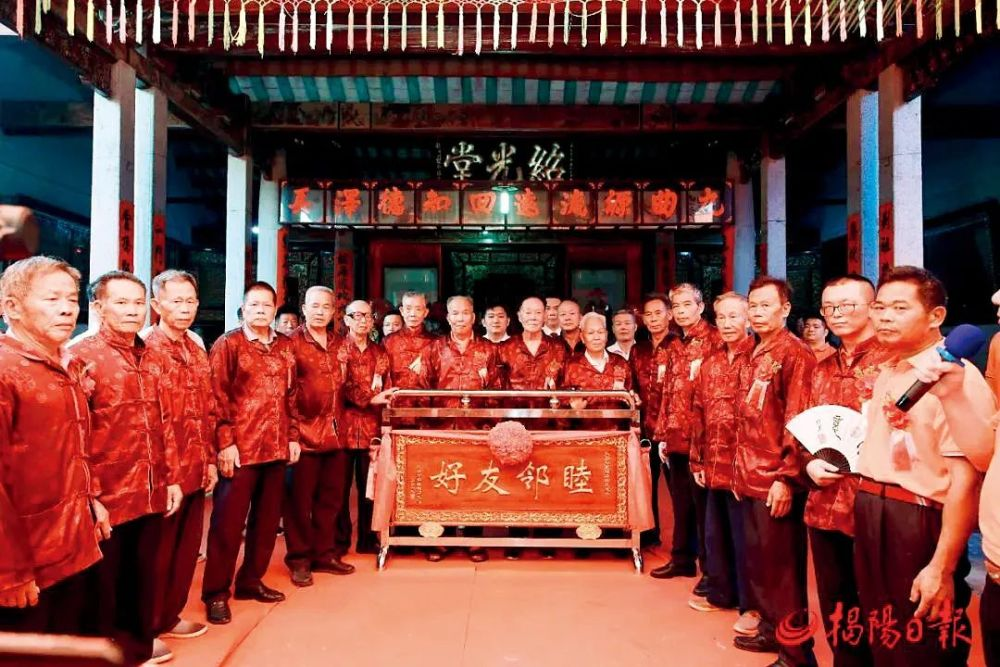
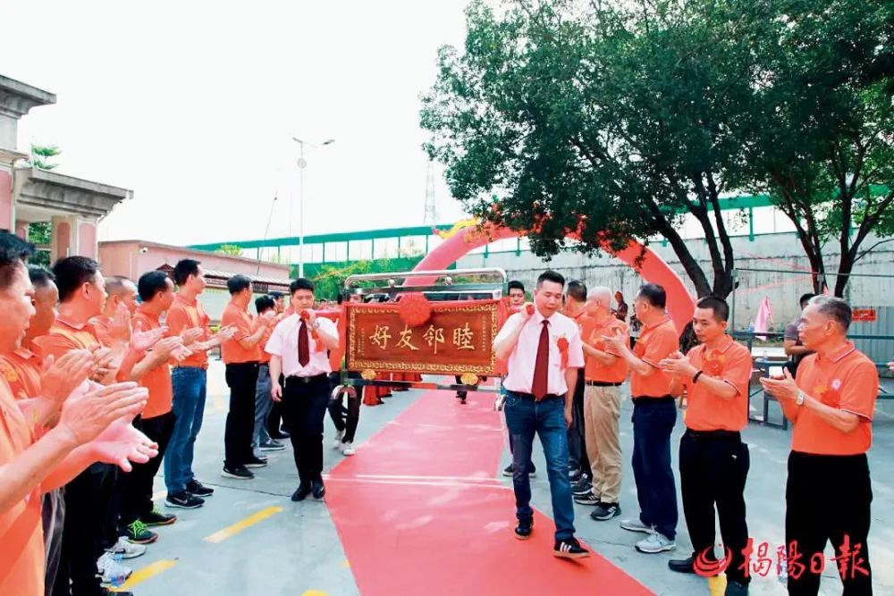
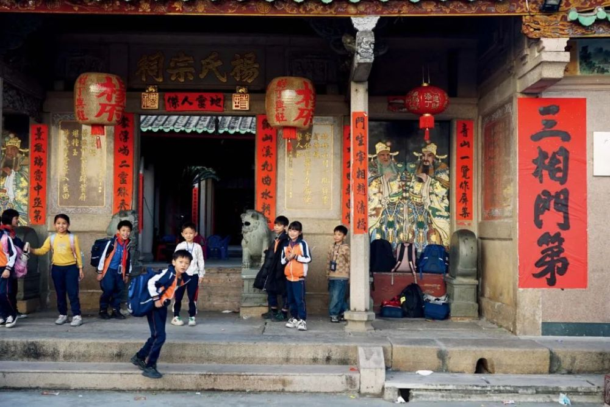
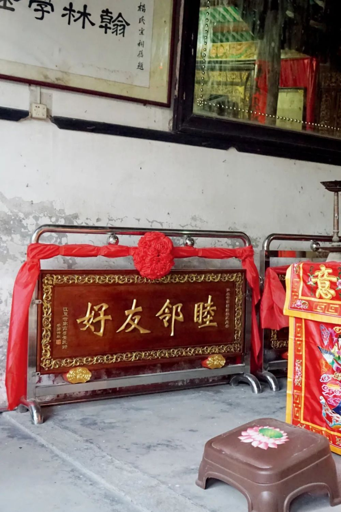

# 两个百年世仇村决定和解

无人机在槎桥村的杨氏宗祠上方盘旋，画面里，一切都是红色的。

祠堂的天井被红色的天幕覆盖，大红的地毯从杨氏宗祠向东铺展，经过仙桥学校门前的空地，延伸到村口。男人们统一穿着红色的Polo衫，在红色的充气彩虹门下往来穿梭。年轻人敲锣打鼓，四个人列成两队，扛起一块刻着“睦邻友好”的牌匾。

一辆丰田考斯特在彩虹门前停了下来，16名身着暗红色唐装的高美村黄姓老人下了车，前往200米外的杨氏宗祠。行进路线是几天前就确认过的，要符合“左青龙、右白虎”的风水讲究。

无人机拍不到的地方，片区民警和交警在周边巡逻。这天是2023年10月1日，国庆节。日期是精心选定的，两个总计拥有三万多人口的潮汕村庄——广东省揭阳市榕城区槎桥村、高美村——要在这天化解祖先在两百年前结下的仇怨，从此可以通婚。

同一时间，16名穿着同样暗红色唐装的槎桥村杨姓老人也正在行向高美村的黄姓宗祠。“对等”是双方必须严格遵守的规则。前几天，有村子试图用价值百万的豪车运载访客，被勒令禁止，大家这才把车辆统一换成丰田考斯特。

仪式的每一个细节都经过了反复的推敲，无论是仪式的时长步骤、老人们的服装、彩虹门的尺寸、伴手礼的价值抑或往来的人数。对他们来说，这是个大事。

结成世仇

杨燕填是槎桥村党委书记和村委会主任，协调槎桥7个自然村、1.2万村民的公共事务（其中有1.1万人都姓杨）。大宗族的事又多又琐碎，到杨燕填家找他议事的村民络绎不绝，三四个不同的议题，同时聚在他家的茶桌上，等他开口。

他也曾在生意场里翻滚过。篮兜村紧邻槎桥，拥有揭阳城乡接合部最繁忙的一条街。当地人自诩这里曾是中国最大的废弃金属回收加工聚落，如今仍密密麻麻地排布着各种为小型加工厂配套的机电产品铺面。杨燕填的铺子挤在其中，代理产自上海的电焊机。做了村干部，他分不出更多精力，生意交给了妻子打理。

53岁了，人生走了半辈子的杨燕填还能清楚地记得父亲向他发出严肃警告的那个下午。这个为了村里事务常常皱着眉头、一双眼睛瞪得滚圆的男人，脸上出现了罕见的迷茫。

放了学，孩子们在一起玩，邻村高美的黄姓小孩也在其中。父亲突然走近：“可以跟她们一起玩，但婚姻就不要了。”还在读小学的杨燕填懵懵懂懂，但能感知到禁忌中夹带的恐惧。长大后，他遇到过不少高美村的黄姓女孩，从没动过恋爱的念头。

等杨燕填这代人成了父亲，违逆和反抗依然不可想象。每个人都能说出几个“棒打鸳鸯”的故事，杨燕填记得大龄未婚的弟弟难得喜欢一个女孩，媒人去说和，女孩答复：“我是高美的黄姓哦，婚姻恐怕不行吧。”

每个人也都能说出几个“某某执意嫁到高美，姻缘最终不得善果”的事例。没人会将之归咎于伴随“世仇”自然发生的社会排斥，他们更愿意相信，“不得善终”恰恰应了祖宗的毒誓和诅咒。

相信和顺从之下，很少有人会问“为什么”。杨燕填碰到过一个例外。数年前，读高二的女儿突然把一个高美村的男孩带回家，男孩离开后，杨燕填告诉女儿：“可以交朋友，不能谈婚姻。”女儿当时有什么情绪？杨燕填的记忆里一片空白。

“伤心哦，当然伤心了。可是没办法，跟那边通婚的很少，嫁过去都没有好结果的。”妻子郑拥华坐在丈夫身旁，一张脸皱作一团。

“那个男孩子不错的。”杨燕填不觉得自己做错过什么，但语气里透着惋惜。“后来他又来过我这里两三次，一坐就好长时间，一直问，叔叔，为什么？为什么？为什么？”

杨燕填也没有标准答案。槎桥村上一任村党委书记杨继波曾翻查过两方的族谱和其他历史资料，都没能找到关于仇怨何以结成的记载。但大家有一个模糊的共识，“当年就是为了争一点儿土地，或者一个灌溉水源”。

_2023年10月1日，广东揭阳市榕城区槎桥村、高美村举行和解仪式。图/揭阳日报_

在他们的认知里，世仇实在是潮汕相邻村落之间再普遍不过的现象。揭阳人欧俊勇是韩山师范学院历史文化学院的副教授，他长期在家乡调查研究宗族社会的运作机制。他发现，结成世仇的，通常是一村一姓的单姓村。

欧俊勇告诉《中国新闻周刊》，数百年前，为了避免聚落内部发生矛盾，方便自我管理，潮汕地区的宗族构建者们逐渐选择了一村一姓模式。但清朝乾隆和嘉庆年间的人口快速增长，给一村一姓模式带来了新问题。“宗族最关键的目标就是繁衍。土地是有限的，而人口持续增长，人与人之间的接触更多，村落之间的边界就紧张了。”

欧俊勇发现，单姓村落矛盾形成的模式有四种：资源争夺、家庭纠纷、大姓对小姓的压制以及卷入历史大事件。不过，根本原因还是人地矛盾。

“环境变化了，现在的人可能很难理解当时的情况。当年村子之间的矛盾，实质就是对生产资料的争夺。用来灌溉的水源，被你截过去，我这里可用的就少了，就会影响我的水稻产量。在我小的时候，村民晒稻谷也要分区域，如果你占了我的场地，也会产生矛盾。”仙桥街道党工委副书记、榕城区驻仙桥街道帮扶工作队队长杨贵彬告诉《中国新闻周刊》。

“究其因由，乃当时之朝廷、官府腐败，官师乏力控制乡村社会，乡村缺乏正统文化的劝导训诲，族与族间百姓有不平事时，未能得到及时公平劝导化解，发生小摩擦小纷争，又乏和解劝处，导致东起西火，甲唱乙和，纷争搅扰难以止息，因小忿而害大义，构怨而毁其联婚之约。据《潮汕史》记载。宋、元、明、清时期，整个潮汕地区均有类似情况出现。”杨继波这样理解。

资源有限，人口众多，宗族要争夺对周边的控制权，冲突最激烈的地方，曾经出现过异姓宗族之间使用火炮等武器的械斗。欧俊勇说，一些村庄为了避免族人伤亡带来赡养孤寡的麻烦，会从外部雇佣不被父母在乎的“浪仔”。“浪仔”伤亡，向其父母赔钱了事。

而有世仇的两村也并非完全隔绝，限制仅加诸后代的婚姻，“没有婚姻，就断绝了两边人家形成紧密关系的可能性。两边争斗，就少了许多麻烦和顾虑。”欧俊勇告诉《中国新闻周刊》。

和解受挫

两百多年过去了，农田已经变成密密麻麻的钢材、塑料和鞋服加工厂，壮年男性依靠办厂获取财富，养活一家老小。在槎桥村和高美村，还依赖农耕生存的人不多了，让祖宗在祠堂里立下毒誓的资源争夺早就不重要了。事实上，由于被拆分成了美西与美东两个行政村，就连高美村也早就不存在了。

越来越多的世仇村和解了。普宁市的北山村与果陇村、揭东区的池渡村与山美村、汕头的家美社区和西岐村⋯⋯欧俊勇的头脑中有一个长长的世仇村和解名单。

但据欧俊勇观察，年轻人的情感需求从来都不是推动世仇村和解的主要原因。改革开放后，借助区位优势，粤东地区有许多村庄都发展起自己的轻工业，不再依赖山林土地。已经致富的乡贤们深刻地认识到，交流、合作能带来难以估量的资源和财富。

“过去认为是根本矛盾的东西不存在了，伴随城镇化，村与村的边界也越来越模糊，相邻的村庄之间反而可以优势互补。大家一起发财，世代恪守的祖训自然就要被废除了，和解是历史发展的必然。”欧俊勇告诉《中国新闻周刊》。

_槎桥村杨氏宗祠外景。摄影/本刊记者 王宇_

在槎桥，杨继波是最早公开提出和解的人。2014年9月，杨继波受邀参加揭西县杨氏宗亲参与的杨、林、侯三姓“睦邻友好”庆典。曾结下世仇的宗族一起敬告祖宗，互赠“睦邻友好”匾额。

杨继波受到启发，彼时他刚调任槎桥村党委书记和村委会主任半年。槎桥人口众多，7个自然村人心不齐，这个曾任仙桥街道文化站站长的槎桥人正为如何管理村落而犯愁。“这样的事情百利而无一害。”杨继波自信找到了一条归拢人心的捷径。

他找到杨氏宗祠理事会会长杨东河，话刚起了头，就遭到了对方的反对。杨东河觉得，这是槎桥与高美的事，而明明槎桥村内部还面临着更多更紧迫的问题，他最想解决的是村内祭祖队伍的行进路线受到干扰的问题。

繁衍至今已历四十代，最让杨氏族人引以为傲的，就是始祖杨绘。杨氏宗祠中，供奉着这位被苏轼亲切地称作“元素兄”的朝廷大员的牌位和画像。

每年冬至日前三天，上午巳时，族人在杨氏宗祠开始一年一度的祭祖盛事。杨东河告诉《中国新闻周刊》，除了留在槎桥的族人，分散在东南亚、香港及潮汕其他区域的杨氏族人数量有百万之众，而他们正是依靠杨氏宗祠来确认自己的来处和归属。因此，祭祖不仅是槎桥杨氏族人的盛事，也是所有认祖归宗的杨姓族人的盛事。

“对于一个传统村落，最重要的就是祭祖、拜神的活动。”欧俊勇说，在识字率很低的传统社会，经验是宝贵的资源。只有亲身参与过仪式的年长者，才掌握宗族的发展历史和祭祀的礼仪。在潮汕地区，像杨东河这样在村中拥有威望、掌管宗祠祭祖事务的老人群体，被称为“老人头”。

“在村庄里，话语权掌握在辈分高的人手里。有声望、有文化、公道正派的长者，往往扮演宗族公共事务决策者的角色。”欧俊勇发现，两委干部、代表传统的老人组和乡贤群体，如果这三种力量配合得好，一个村落很快就可以发展起来，但如果他们之间存在纷争，村落的发展就会有一些问题。

杨东河想解决的问题，主角是槎桥村内的两个自然村，东光、斗门，两村内部有许多矛盾，磕磕绊绊至今，斗门的村民不允许祭祖的队伍经过斗门，而东光的村民则以不允许斗门老人出殡的队伍经过东光的方式反制。

矛盾也延伸到了宗祠理事会。杨东河来自东光，一位来自斗门的“老人头”与他曾发生争执，两方各不相让，互不来往。对方拒绝参加宗祠理事会会议很久了。杨东河希望这一局面能有人出面化解。

因此，当杨继波提出要与高美村和解时，杨东河反问：“家里的事情都搞不好，怎么搞外面的事？”可在杨继波看来，世仇和解是以整个村庄和宗族的名义，打破祖宗的誓言和解，获得“老人头”的支持是必须的，“一句话就把我给堵回去了”。事情就此搁置。

再提和解

九年后，再次将世仇和解提上议程的，是仙桥街道党工委副书记杨贵彬。

杨贵彬也是槎桥人，两年前，从榕城区调任仙桥街道，他的另一重身份，是驻仙桥街道帮扶工作队队长，负责乡村振兴工作。今年7月，揭阳市委、榕城区委第三巡察组到仙桥巡视，提出要“为民办实事”。仙桥街道领导班子开会时，杨贵彬在众多事项中挑中了促成两村和解。

“过去我们到基层走访多少有所耳闻，街道领导班子内部也曾沟通过，所以等我再提出来，也得到街道主要领导的支持。”杨贵彬告诉《中国新闻周刊》。“一些党员干部会认为这是民众自己的事，我不这么认为。基层治理涉及日常生活的方方面面，如果村子能有一个和谐的氛围，就能促进我们基层治理继续做实一些事。软环境是非常重要的支撑。”杨贵彬有自己的判断。

_杨氏宗祠内，摆放着高美村赠送的“睦邻友好”牌匾。摄影/本刊记者 王宇_

杨贵彬听说2014年曾有过尝试，于是他着手了解，当年究竟“堵”在了哪里，“潮汕地区的老人家受宗族观念，特别是祖训的影响非常大，对于咒语，他们不敢轻易打破。此外就是大村内部的一些小矛盾。还有一些干部会认为，这是老人的事，宗族的事”。

得知杨东河的事，他请杨继波推荐一个“既与老人家亲近、思想上又能与我们接轨的人”，杨继波举荐了杨东河的侄子杨少育，他是当地蓝天救援队的队长，又是揭阳市人大代表。

“这当然是一件好事。”作为蓝天救援队队长，杨少育要协调600名不同背景、性格的队员，深知合作的价值和矛盾带来的内耗。“这次是政府牵头帮我们办和解，我们不能错过这次机会。”杨少育目标明确，与叔父见面前就想好了一整套理由，他甚至告诉杨东河，“这一次如果卡在你这个环节，以后世世代代的子孙都会说你是罪人。”

第一次沟通，杨东河便妥协了。与理事会其他“老人头”商议后，杨东河提出了新的建议：仅靠老人的力量，很难承担和解的重任，应该有“两委”干部参与其中，共同承担责任。此外，对于其他持反对意见的老人，应该靠党政的权威来说服。

杨贵彬也发现，其他村落会自发推动的好事，在槎桥困难重重。“开会的时候他也说好，你也说好，但就是没人干。”尽管街道多次开内部会议协调，又组织各村“两委”干部沟通，但一个多月过去了，干部们依然只是观望。“村干部们以前有很多失败教训，工作遇到困难，他们会看我们的决心，所以在这种关键时刻，我们就要给他们推力。”杨贵彬告诉《中国新闻周刊》。

街道决定成立一个协调小组，由街道党工委书记担任组长，镇长、党工委副书记担任副组长。这还不够，各个村子也成立了类似的专项工作小组，人员以“两委”干部为主，当地的乡贤、有影响力的群众也得参与。“工作有了实际的抓手、一系列整体的运作，氛围才慢慢形成。”杨贵彬说。

“和解变成党政的事情，我们好像就有了一个令牌，才比较好办事。”柚园村的“两委”干部杨清量告诉《中国新闻周刊》。

对于和解的仪式，街道定下四个原则：氛围浓烈，以便感染村民，让“睦邻友好”的改变深入人心；不请客、不做大戏、仪式从简、避免浪费；强调平等，照顾小村；自筹资金，公开透明。

“要避免浪费，但是该有的隆重和礼仪必须得有，因为对老人家而言，仪式是必需的。强调平等，是因为我们不希望在这个过程中还存在比胳膊粗细的问题，造成新的矛盾。双方互访时，规模更大、财富更多的村子应该在人数、礼物价值等方面迁就小村。”杨贵彬告诉记者。

接下来就是槎桥和高美互相沟通推动了，平衡始终是最核心的抓手。每个自然村和宗祠的“吉日”都不同，究竟选哪个日子举办“睦邻友好”庆典。最后大家达成一致：“国家最大，国庆日才是大节，庆典要与国同乐。”

行政村内部有小的自然村，村与村之间也需要平衡。比如高美这一侧，大宗祠年久失修，仪式的举办地点成了问题；四个自然村，却同时祭拜三个先祖，老人们为请哪位祖宗见证和解争论不已。有人建议，三个祖宗都要轮流接受祭拜。最终，他们选择辈分更高的江夏公，为此，还特意到隔壁的潮阳市请来先祖。

9月下旬，庆典已经成为两村内部将要办理的最重要的一件事，两村提前互访、彩排、校准所有细节、查漏补缺。“这一出戏，剧本由我们街道协调小组来写，戏台由我们搭，导演也是我们做，角色要请老人们来演。”杨继波向《中国新闻周刊》总结。

困扰和答案

庆典之后，一些正反馈来了，“我们的判断没有错，‘睦邻友好’后，高美与槎桥之间的排污问题顺利得到解决。”杨贵彬说。

但对两村党委书记而言，世仇村的和解远远无法解决他们当前面临的困难。黄潮明今年58岁，从1999年就开始担任村委会的干部职务，担任美西村党委书记已有15年。面对记者，他很坦然，“‘睦邻友好’解决的是传统风俗层面的矛盾，而不是社会矛盾。”

槎桥的经济落后于周边村落，这已经成为村民的共识。与槎桥隔一条榕池路，篮兜村是当地经济繁荣的代表，道路两侧吸引了周边各村像杨燕填这样头脑灵活的人在此经营门店。沿着门店旁边的街巷向内，村民们借助自家的宅基地建起了制鞋工厂、轧钢厂等加工企业。而在槎桥，目前仅有零星的鞋服和塑料加工企业。

“槎桥总体没什么收入。过去人心不齐，错过了土地开发的最后时机。”杨燕填感到遗憾。

他羡慕高美后来分化的两村之一，美西村。美西村在改革开放后不久就得到开发，在基本农田管理并不规范的年代，不少集体所有的土地都被转换成工业用地，支撑了当地小型轧钢厂、鞋厂的发展。这是槎桥错失的“发展机遇”，也是杨燕填梦寐以求的发展状态。

他把最新的希望寄托在旅游开发上。采访期间，槎桥村获批成为广东省第八批古村落之一，这意味着来自政府的保护和潜在的资源支持。不过，杨燕填认为，资源和希望最终还是来自杨氏庞大的宗亲网络。“曾经有一个香港商人为了保护他们宗族的古村落，捐资千万，重修了一座祠堂。”他有这样的期待。

确实，欧俊勇也认为，“宗族社会有强大的华侨群体作为支撑，他们在外面赚到钱，就会通过为宗祠捐资、建立基金会等方式支持宗族发展。”在他调研的村庄中，村庄领导者不仅能平息村内争端，还能从海外的华侨宗亲等地源源不断争取资源、资金支持，使宗族得以继续发展。

但杨燕填已有本能的危机感，“我们父亲那一辈没有能力建设村子。我们孩子这一辈，我不希望限制他们出去发展。建设村子必须在我们这一代完成。”

所以，巡视组想促成两村和解是不可错过的时机，即使这并不是当前两村最需要解决的问题。而百年前困扰他们和邻村的生产资料争夺，如今换了形式，仍然存在，困扰着村内的人。出路在哪里？他们还没有找到答案。下一个外力介入的窗口期会是什么时候，谁也说不好。

但杨燕填还是会说起对未来的期待，在那个想象中，杨氏宗祠的香火很兴旺，村内的几股力量形成合力，槎桥村在向上走，“我希望大家知道，槎桥已经有1000多年的历史了，‘未有揭阳城，已有槎桥村’。”

发于2023.12.18总第1121期《中国新闻周刊》杂志

杂志标题：世仇村和解背后

记者：王宇

