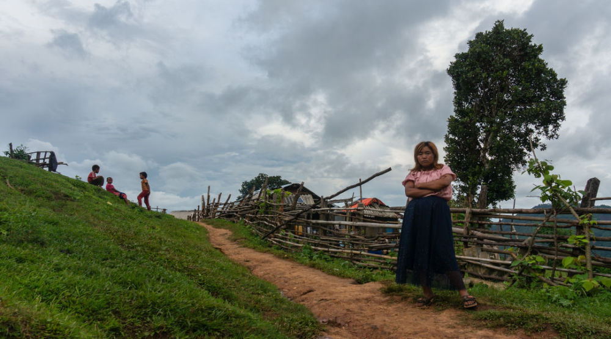
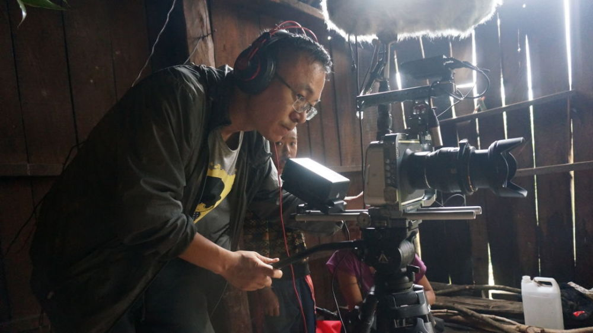
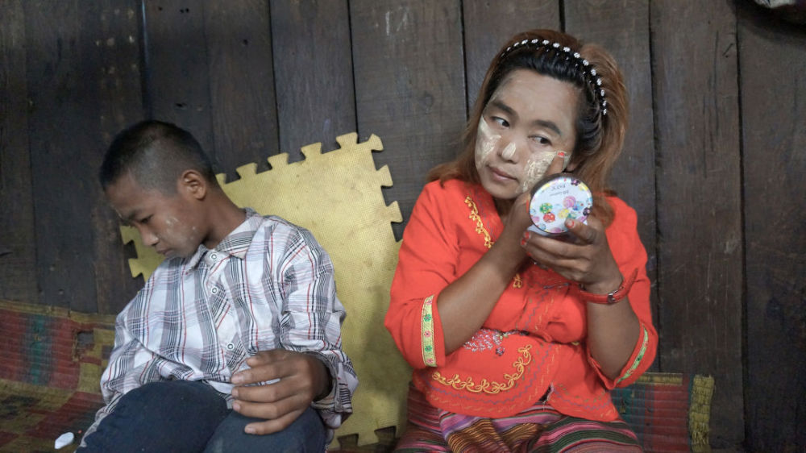
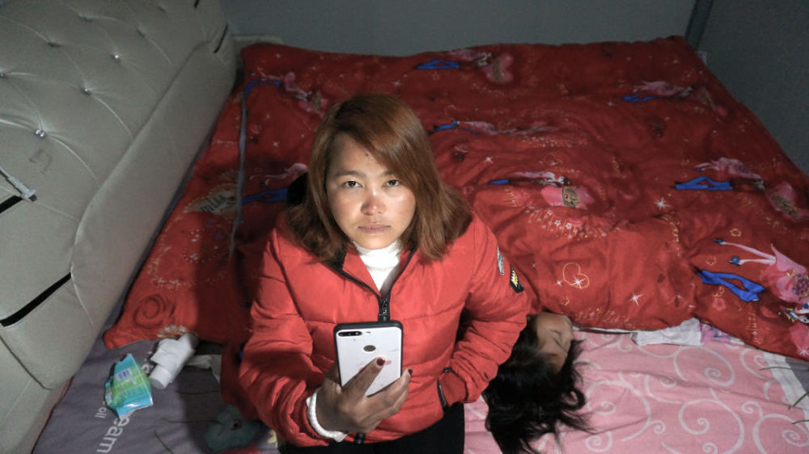
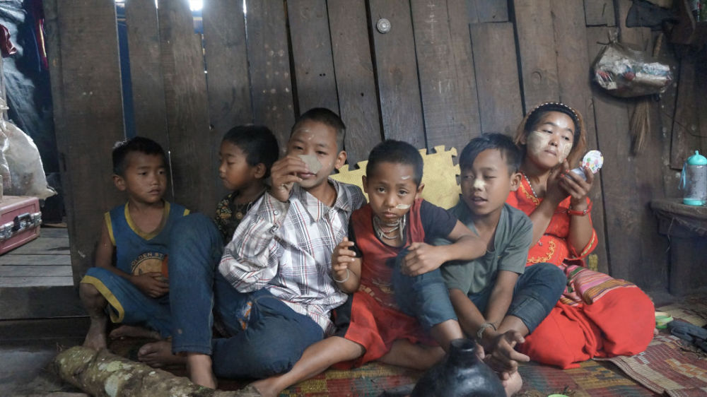

# 从缅北高地买来的新娘：一个女人逃离的一生

_纪录片《缅北高地来的女人》拍摄了缅北女性拉瑞的生活，她经人介绍嫁到山东农村一户人家，生下一儿一女后逃跑，几经波折又回到了山东。（受访者供图）_

纪录片导演王秀岳最开始拍摄的主人公是自己的远房亲戚。亲戚是80后，2016年，他经别人介绍，拿着彩礼，前后花了约十万元娶了一个云贵地区的妻子。三个月后，对方卷钱消失。

亲戚的邻居告诉王秀岳，相隔五十公里外的隔壁县，有户人家的缅甸妻子也逃跑了。“怎么现在还会发生这种事情？”王秀岳暗自寻思。他是70后，老家在山东，小时候听家中的长辈或邻居聊起过某个镇或县外来媳妇的事。那是1990年代，她们有些来自西南地区，有些来自缅甸、越南一带。

带着对外来新娘生活状况的好奇，王秀岳扛着机器驱车前往那户人家。男主人名叫胡大海，是个收废品的。他家很好识别，周围都是二层小楼，只有他家是低矮破烂的平房。王秀岳初次见他时，他将近五十岁，穿得破破烂烂，整个院子几乎堆满了废品，看起来一片狼藉。

胡大海一直在到处打听女主人拉瑞的下落。十五六岁时，拉瑞被胡大海从缅甸买走，而后跟他孕育了两个孩子，一男一女。胡大海一见王秀岳，以为他是电视台的，想请他帮忙寻妻。

王秀岳则好奇，为何两人共同生活了十多年后，拉瑞会选择离开。他留了下来，试图通过拍摄寻找答案。他本以为最后只能拍出一个特殊家庭里的留守儿童影像，但就在拍了一年多以后，拉瑞突然回来了。

王秀岳开始走近拉瑞的世界。她不到三十岁，已经有三段婚姻、四个孩子。“她的一生就像浮萍一样漂泊不定，哪儿都不是家，哪儿好像都是家，哪儿都生孩子，但孩子好像都不是自己的，没有在身边，最后她还担心自己死在哪儿。”王秀岳告诉南方周末记者。

而像她这样命运跌宕的女性，在她的老家缅北并非个例。拉瑞慢慢在生存之余，学会期待和追求那一丝丝的浪漫与幸福。

2023年10月20日，纪录片《缅北高地来的女人》在广州放映后，一位女性观众表达了自己对拉瑞的解读，“她不只是一个‘被卖的’、一个被动受害者，也有她的主动性，她知道怎么让自己的生活变得更好……呈现了一个女性真正的困境”。

这个家庭每天都上演“要钱大战”

拉瑞不知道自己出生的具体年份。她去街边算命，算命师傅问她年份，她答不上来，师傅只能给她看手相，边看边解析，其中一句仿佛谶语——师傅说，你的婚姻，没有多顺当。

拉瑞十五六岁时，姨妈让到缅甸做生意的胡大海将她领走。那时的拉瑞瘸了一条腿，据说是以前上山砍柴摔断的，当地医疗条件差，只用了两根小棍固定，落下了病根。她已经有一个六七个月大的孩子，嗷嗷待哺，第一任丈夫后来因吸毒被抓。

对拉瑞来说，一切都是未知的。她不知道要去的地方是什么样的，也不知道将来会如何。她只知道，有一个从另一个国家来的男人，是姨妈介绍的，要把她领走。当地实在太穷了，吃不上饭，难以过活，为了生存，在胡大海花了三千元之后，拉瑞跟着他来到山东。

在王秀岳看来，在那种境况下，尽管有买卖的成分在，拉瑞也没有丧失她自己的主动性，算是“一种主动出逃，或者是一种为了活命、为了生存找个活口，找个营生（的方式），反正就是出去”。

他们共同生活了十来年，2016年王秀岳去拍摄时，他们的两个孩子已经上小学了。在当时村里人的眼里，拉瑞成了一个抛夫弃子的“狠女人”。王秀岳也问过两个孩子，想不想妈妈回来，弟弟带着有点恨恨的语气回答：不想。

姐姐的言语则有些躲闪，既想，又不想，流露出微妙的难过。王秀岳观察到，姐姐会将妈妈的相片放到窗台上，有灰了就擦一擦。实际上，孩子口中的否定，或许是周围大人驯化的结果。

拉瑞回来前的一段时间，跟胡大海恢复了线上联系。她已再嫁，生了一个女儿圆圆，六个月大。圆圆父亲是个残障人士，打工时被机器切断了手指，不能干重活。后来王秀岳了解到，拉瑞是被自己的缅甸老乡撺掇过去的。对方介绍他们在网上认识、聊天，实际上是想从拉瑞再嫁一事中获利。

拉瑞出走的导火索是胡大海打了她，他曾将怀孕的拉瑞绑在树上打。

这种暴力并非孤例。华南农业大学教授万蕙2011年开始关注外籍新娘这一群体，曾多次前往云南、广西、广东一带做田野调查。据她观察，买卖婚姻关系中的男性，一般年龄较大，家境也较差，在当地属于“婚姻困难户”。

他们大多数身体不太健全，或是有智力障碍，家人只能替他们买外籍新娘。而有的人家怕新娘逃跑，也会采取一些非常手段。万蕙访谈过的一位新娘，婆家怕她逃跑，将她关起来，只给她喝粥。

 _纪录片导演王秀岳的老家在山东，他小时候常听家中长辈或邻居聊起某个镇或县的外来媳妇。（受访者供图）_

在经年累月的不满中，拉瑞一直想走却总囿于钱不够，这次她决定不再忍耐，去了圆圆父亲家。与胡大海不同，圆圆父亲年轻，和她聊得来，会给她做早餐、嘘寒问暖，虽然生活艰难，但拉瑞挺喜欢他，生下孩子后两人关系更好了。

在与自己和胡大海的一儿一女视频时，拉瑞总跟他们说自己回不来。王秀岳猜测，一方面是她自己不想回来，另一方面可能圆圆父亲也不想她回山东，怕她逃跑。拉瑞最后重新回到胡大海家，助力者是她母亲。

在拉瑞嫁给胡大海的第二年，拉瑞母亲因治病需要被接到山东，后来没钱回去，只能选择嫁人，胡大海把拉瑞母亲卖给了隔壁县一个有眼疾的老头。与女儿恢复联系后，拉瑞母亲偷偷去看过她，觉得圆圆父亲家生活条件比胡家差，一次拉瑞陪她回山东时，她把拉瑞扣下。

圆圆父亲等了拉瑞三个月，见她没回来，再娶了。拉瑞断了念想。胡大海虽然一直希望拉瑞回来，但更多是出于面子以及照顾孩子的需要。这段十几年的婚姻，始于买卖，在拉瑞回归后，这层的交易底色愈发凸显出来。

王秀岳参加过很多个城市的映后谈，几乎每一场都有观众问他，片中为何会出现这么多与金钱相关的画面，是否刻意为之。事实上，王秀岳已经剪去了更多这样的片段。在拍摄过程中，他观察到，这个家庭几乎每天都在上演“要钱大战”。

胡大海严格控制每天给出的金额，一般只有五十元左右，这包含整个家庭一天的日常支出。对拉瑞来说，除去家用，自己很难有其他消费，比如买衣服等，存钱更是难上加难。胡大海担心拉瑞有钱后离开。

他一般不会主动给拉瑞钱，拉瑞只能以各种方式向他要，有时会很强势，直接对胡大海说“给我钱”，有时又会用可怜的语气求胡大海，“给我一点钱花花吧”。

“钱太重要了，是维系他们关系的一个关键因素。至于说控制，肯定也有，这样他就能把拉瑞留在身边，她就跑不了。”王秀岳告诉南方周末记者。

_跟着第二任丈夫外出打工期间，拉瑞见过大城市，学会了化妆，她喜欢画上艳丽的口红。（受访者供图）_

“我不会再一家一家地嫁人了，也不会跑了”

拉瑞肤色偏黑，她喜欢化妆，能稍微显白一些。大多数时候，出现在镜头里的拉瑞，嘴唇颜色总是艳丽的，或是大红色，或是芭比粉，身上常穿着一件红色羽绒服。

王秀岳曾问过她，之前也会这样打扮吗，拉瑞否认了。刚来山东的时候，她基本不敢出门，穿的衣服是胡大海从集市上给她买的，比如8元一条的裤子。当时的她根本想不到要穿好看的衣服，更别提化妆。学会当地语言后，她接触面也广了一些，有时会自己去逛集市，买衣服。

更大的转变来自和圆圆父亲生活的那三年。圆圆父亲去山西、四川打工，拉瑞也跟在身边，她慢慢学会用QQ、微信聊天。以前的她囿于胡大海那一座小院，而现在她已见过大城市，看到别人穿好看的衣服，化漂亮的妆，她心理也产生了变化。

在王秀岳看来，拉瑞其实是成长了，她有了生存之外的欲望，会渴望一些浪漫的东西，但胡大海难以满足她的需要，包括情感上的。于是，在深夜的镜头里，常常能看到拉瑞坐在床上，跟不同的男性网友聊天，她有时会毫不避讳地当着孩子和王秀岳的面外放语音。

拉瑞最常用的网名是“快乐宝贝”，这也是她的微信签名。很多男网友一聊天便会直呼她“宝贝”。王秀岳推测，“她可能很想听到这两个字，人家一喊她就开心”。聊天中，网友会直白地表达对她的喜欢，“想死你了”“你这么美，心地又善良，说话又好听……嫁给我吧！”

拉瑞也会向他们倾诉自己的不悦，“有没有老公都一样，像没老公一样的……天天心烦”。她否认网友对她是“好女人”的奉承，“我也不是好人，好人还出来聊天啊？”王秀岳问过拉瑞，一直跟不同的网友聊天，她是认真的吗？拉瑞总说，自己是聊着玩的，解闷。

王秀岳跟踪了好几个男网友和拉瑞的聊天情况，想知道聊到最后会不会有什么结果。站在一个男性的视角，他觉得有些网友明显就是骗人的，但拉瑞容易当真，她有时问王秀岳，某个网友是认真的吗？

王秀岳记得，有一个男网友称要给拉瑞买金项链和手镯，给她快递过来。拉瑞相信了，还问王秀岳怎么还没寄到。王秀岳告诉她自己的判断，对方是骗人的，拉瑞不相信，又等了两天。后来她去问男网友，对方称路上下大雪，快递车没法送到，她才知道被骗。

王秀岳觉得，拉瑞其实是一个感情缺失的人，在胡大海那里得不到情感满足，希望通过网络聊天来弥补，“她真真正正想找一个别人喜欢她、她也喜欢别人的对象，一辈子生活下去，她自己嘴上不说，但内心还是渴望能真正遇到一个人”。

_拉瑞不到三十岁时，已经有三段婚姻、四个孩子，她仍期盼稳定的爱情和家庭。（受访者供图）_

拉瑞曾让王秀岳帮她再找一个男人。王秀岳在上海大学上海电影学院教书，她不知道上海在哪，只是问他那边找媳妇要花多少钱。王秀岳没有正面回应。之后，他很认真地问拉瑞，到底想找一个什么样的男人。

拉瑞也认真回答，“我想找一个喜欢我的、疼我的、能够爱我一辈子的男人，我不会再一家一家地嫁人了，也不会跑了”。王秀岳突然理解了她的出逃以及她的渴望，“她非常非常渴望稳定的家庭，或者稳定的爱情”。

拉瑞是聪明的，作为婚姻买卖关系中的一方，她清楚自己的价值在于生育，她渴望的那种稳定的感情或许要建立在她能生育的前提上，当她年老不能再生育，再想找一个男人爱她就不可能了。她曾说过，“我找其他人得给人家生孩子，不生孩子人家不愿意。”

万蕙做田野调查时，发现由于丈夫病弱，很多外籍新娘其实承担了家庭的大部分生计。她们变得较有话语权，主观能动性也更强，家里的布置和装饰几乎由她们做主。

而拉瑞没有工作。在外界眼里，她也许好吃懒做，王秀岳却理解她。拉瑞没有户口，不识字，找工作难，还会因为外来身份遭受歧视。她之前试过打工，结果对方说得办证，她没法提供身份证明，前面相当于白干，她很受打击。

而像村里收头发这种较为轻松的工作，当地人不愿让她干，刷盘子之类的累活，赚不了太多钱，她自己不太想去。这种情况下，“你（很难）再要求她去干多少活、挣多少钱。”王秀岳说。

她担心自己的养老问题，虽然有四个孩子，但没有一个一直陪在她身边，而自己又没有收入来源。刚与拉瑞认识那会，拉瑞就对王秀岳说，我老了以后怎么办，死在哪里？王秀岳一开始不理解，她还不到三十岁，怎么就开始考虑这样的问题？

随着拍摄的推进，他越来越理解拉瑞，她嫁到山东，又随着圆圆父亲辗转各地，没有身份户口，“什么都没有，她的漂泊感肯定很强烈，不知道落在什么地方”。在她的认知里，在她的缅北老家，死亡是一件非常容易的事情。

拉瑞给自己起了个中文名叫“如萍”，那是《情深深雨濛濛》里的一个角色。王秀岳觉得，这个名字太贴切了，他原本打算将这两个字作为片名，因为“她的一生就是浮萍的状态”。

“只能通过这种方式离开那个地方，活下来”

拉瑞一直想离开山东。她想回一趟缅北老家，之后在云南边境生活，那里离老家近，饮食习惯相似，生活条件较好，如果能再找到一个喜欢她的人就更好了。但她一直没能攒够路费。

为了回去，她铤而走险，帮表姐做起了“领人”生意，买方负担她回去的路费，回中国的路费就要取决于领人是否顺利。她趁机回了缅北。王秀岳一直很想到她出生的地方看一看，了解她生活的环境和她的家庭，2019年夏天，他们一起踏上了前往缅北的路途。

拉瑞买了七袋大米、蔬菜、两只鸡和一些日用品带回去。他们先是到了缅甸掸邦第二特区佤邦的首府邦康市，再花七百元租了辆车回到老家村寨。村寨坐落在深山老林，因为下雨，山路难走，车子只能停在山脚，后来来了五辆摩托车，是拉瑞的亲戚，将他们送上山。

王秀岳慢慢了解到拉瑞以往的生存条件。村寨只有二三十户人家，住着破旧的吊脚楼。村里人种一些水稻，但产量不多。拉瑞姐姐家便种了一些，只够吃半年，吃完就向其他亲戚或村民借。拉瑞带回去的七袋大米，一下还了四袋。

当地打工也很难，下趟山不容易。有人外出去中国，大多只能打黑工。许多人家都有三四个孩子，难以成活的据说更多。为了谋口饭吃，当地有些女性只能将孩子遗弃，主动逃离，哪怕其中附上了交易色彩。

“这是她们谋生的方法、手段，是一个出口，没有看到希望，只能通过这种方式离开那个地方，活下来。”王秀岳告诉南方周末记者。

王秀岳见到了拉瑞的第一个孩子，男孩已经十几岁了。与他交好的另一个男孩是拉瑞的亲弟弟，两人年龄相仿，拉瑞母亲生下她弟弟时已年过四十。当初要再嫁山东，拉瑞母亲在结婚现场大哭大闹，想回去，但最终还是无奈留下。她深知，留下意味着生存，但心里总归是念着家乡。

更令王秀岳意外的是拉瑞的姨妈。大约三十年前，她嫁到山东，生下两个女儿。1990年代，大批东南亚女性进入中国台湾、大陆等地，她们有些是被人诱拐，有些是经人介绍。拉瑞姨妈或许也是通过这些途径去往山东。

在山东生活三十多年后，拉瑞的姨妈离开那个家，之后认识了胡大海，两人共同生活了两三年。后来拉瑞姨妈被遣返，无法再回中国，才将拉瑞介绍给他。王秀岳后来问过拉瑞，如果一开始知道姨妈和胡大海的关系，她还会跟胡离开吗？拉瑞说，不会。

 _回到缅北老家后，拉瑞要照顾自己和姐姐的孩子。（受访者供图）_

在缅北拍摄的过程中，王秀岳的镜头还捕捉到一场葬礼，逝者是拉瑞前夫的父亲。拉瑞前夫的哥哥三个月前去世，他的妻子也来参加，她用当地方言问了王秀岳一个问题，问完后和拉瑞两个人笑了起来。

王秀岳听不懂，后来拉瑞翻译，她是在问王秀岳是否喜欢自己。王秀岳明白了，她想让自己带她离开。她家中的两个男人都已去世，独自带着三个孩子，难以过活。王秀岳笑不出来，他觉得难受，村寨里像她这样的女性还有不少，“她们没有办法了”。

纪录片剪辑期间，王秀岳回想起缅北高地上那些女性的生存境况，产生了一股强烈的冲动，要向她们致敬，无论是那些为生活所迫而选择逃离的，还是如今仍留在当地的女性，“在那种境况下还能够努力地活着，还能笑得出来，我觉得这是一种勇气”，他说。

于是，他在片尾处加了一句话：“致敬缅北高地那些追求幸福的女性同胞。”他也由此真正理解了拉瑞，为何她一直想要离开山东，去追求自己的幸福。多数时候，追求幸福对她们而言是一种奢侈品，她们一直挣扎在生存边缘。像拉瑞这样的女性，努力生存下来了，之后才慢慢想到，要去追求自己的爱情和幸福。

拍摄结束后，王秀岳回国，拉瑞暂时留在当地。2019年冬天，王秀岳了解到拉瑞在邦康市的一家服装店看店，她在存钱，也许想找机会过境到云南，她还是想留在云南边境。

疫情结束后，王秀岳再次联系上拉瑞。拉瑞依旧在缅北，她的姐姐因难产已去世，她留在那里帮忙照顾对方的孩子和自己的儿子。

王秀岳觉得，拉瑞内心的那股劲头一直没变，“很顽强的生命力，到哪个地方就要生存、就要活下来”。他相信，未来如果有机会，拉瑞一定会去到她一直向往的云南生活。

（胡大海为化名。）

南方周末记者 翁榕榕

责编 李慕琰

