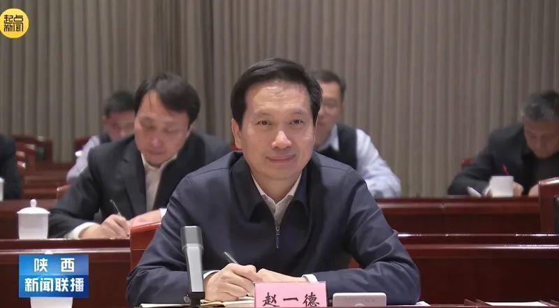
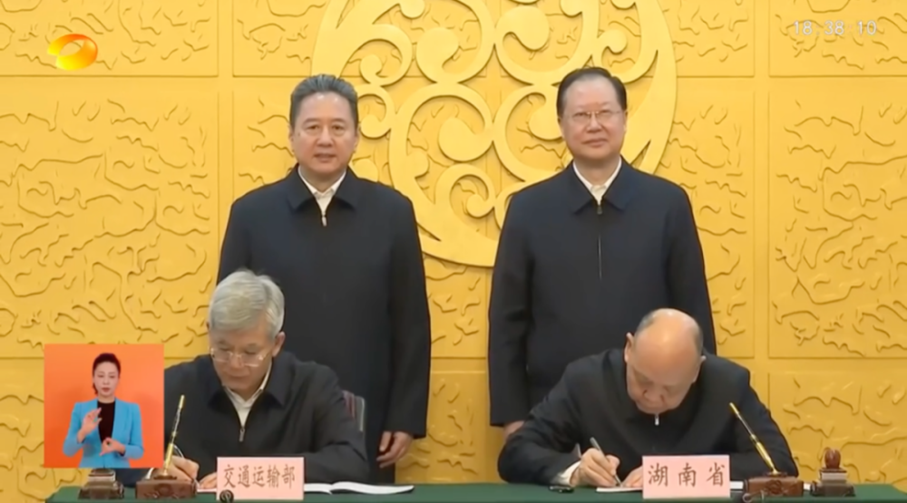
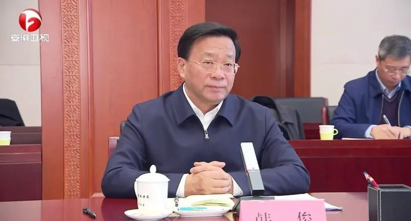

# 在京参加中央会议后，多位省委书记、省长，没有立刻离京

**撰文丨余晖 高语阳**

12月11日至12日，中央经济工作会议在北京举行。中共中央总书记、国家主席、中央军委主席习近平出席会议并发表重要讲话。

中共中央政治局常委李强、赵乐际、王沪宁、蔡奇、丁薛祥、李希出席会议。

据《新闻联播》画面显示，各省、自治区、直辖市和计划单列市、新疆生产建设兵团党政主要负责人都在京参加了会议。

在开完中央经济工作会议之后，多位省级党政一把手并未立即离京。

**前往国家部委**

12月12日至13日，陕西、湖南、山西、安徽、河南、内蒙古、宁夏等多地的省级党政一把手在北京有公开活动。

其中，多位省级党政一把手前往国家部委。

12月12日，陕西省与教育部举行座谈会并签署战略合作协议，陕西省委书记赵一德、省长赵刚，教育部党组书记、部长怀进鹏出席。

12月12日下午，湖南省政府与交通运输部举行会谈，湖南省省长毛伟明，交通运输部党组书记、部长李小鹏出席并见证签约。

12月12日至13日，山西省省长金湘军带队拜访财政部、交通运输部、农业农村部、国家市场监督管理总局。

12月13日上午，安徽省委书记韩俊、省长王清宪与国家能源局党组书记、局长章建华举行工作会谈。

陕西聚焦的是教育。

在与教育部座谈中，陕西省委书记赵一德提到，“希望教育部一如既往关心支持陕西工作，指导帮助陕西深化教育领域改革开放、加快构建高质量教育体系”。

湖南聚焦的是交通。

12月12日，湖南省政府与交通运输部签署了《关于加快建设交通强国服务支撑湖南实现“三高四新”美好蓝图的合作协议》。

湖南省省长毛伟明表示，湖南将“加快推动部省合作共建事项落地见效，科学制定交通强国建设湖南篇章评价指标体系，努力为交通强国建设贡献湖南力量”。

他说，“希望交通运输部在建设国家重点实验室、典型试点示范等方面加大政策支持力度，助力湖南加快构建内畅外联、协同高效的现代化综合交通运输体系”。

安徽是华东地区重要的能源基地。此次在北京，安徽省委书记韩俊、省长王清宪与国家能源局党组书记、局长章建华举行了会谈。

此次会谈，意在“就加快建设新型能源体系进行工作对接”。

韩俊提到，“希望国家能源局在推进陕电入皖及蒙电送华东工程、抽水蓄能电站开发建设、能源综合改革创新等方面给予更多支持。”

山西省省长金湘军，利用两天时间，先后带队在北京拜访财政部、交通运输部、农业农村部、国家市场监督管理总局，并分别举行工作会谈或签约。

据当地媒体报道，财政部党组书记、部长蓝佛安，交通运输部党组书记、部长李小鹏，农业农村部党组书记、部长唐仁健，国家市场监督管理总局党组书记、局长罗文出席了相关座谈。

金湘军提到，希望国家有关部委一如既往关心支持山西发展，在能源革命、产业转型、乡村振兴、重大基础设施建设、生态治理等方面给予更多指导和支持。

“我们将按照国家部委要求，用好抓落实制度机制，以更大力度推动各项工作在山西落地见效。”

**赴央企**

还有一些省份的省级党政一把手，到了央企。

12月13日，河南省委书记楼阳生与中国机械工业集团有限公司党委书记、董事长张晓仑在北京举行工作会谈，河南省省长王凯出席并介绍省企合作有关情况。

中国机械工业集团有限公司是中央直接管理的国有重要骨干企业，是一家多元化、国际化的综合性装备工业集团。

楼阳生提到，河南是重要的工业大省、经济大省、科教大省，区位交通优越，工业体系完备，内需市场广阔。

他说，国机集团作为国内机械工业重要的科研开发与装备制造企业，与河南合作正当其时、空间巨大。

“希望以此次会谈为契机，双方抢抓新一轮科技革命和产业变革历史机遇，在制造业关键领域、关键技术、关键环节等方面，加强战略对接，持续深化合作，实现共赢发展，打造央地合作典范，为服务国家重大战略实施、推动经济高质量发展作出新的更大贡献。”

当日，河南省委和省政府还与中国科学院举行了工作会谈。

楼阳生说，“恳请中国科学院在重大科技平台布局、科技成果转移转化、人才交流合作等方面持续加大对河南的支持力度，推动双方合作深化、拓展、提质、增效，开创省院合作新局面，携手共进向未来。”

**两个自治区在京签署协议**

还有一些省级党政一把手，在北京进行了签约。

12月12日，宁夏回族自治区政府、内蒙古自治区政府在北京签订能源专项合作框架协议。

宁夏回族自治区党委书记梁言顺、内蒙古自治区党委书记孙绍骋深入交流并见证签约。宁夏回族自治区主席张雨浦，内蒙古自治区主席王莉霞代表两地签约。

报道显示，此举是为了落实“四个革命、一个合作”能源安全战略部署。

政知君注意到，党的十八大以来，习近平总书记提出“四个革命、一个合作”能源安全新战略，指的是推动能源消费革命、能源供给革命、能源技术革命、能源体制革命，全方位加强能源国际合作。

2016年7月，习近平总书记在位于宁夏银川市郊的宁东能源化工基地，考察正在建设的400万吨煤制油项目。同年12月，在神华宁煤煤制油示范项目建成投产时，习近平指出，希望不断扩大我国在煤炭加工转化领域的技术和产业优势，加快推进能源生产和消费革命。

今年6月，习近平总书记在内蒙古调研时指出，推动传统能源产业转型升级，大力发展绿色能源，做大做强国家重要能源基地，是内蒙古发展的重中之重。

最新报道显示，宁夏是我国能源加工转化和战略储备基地，内蒙古是我国重要能源和战略资源基地，按照“优势互补、互利共赢、加强合作、绿色发展”的原则，签订两地能源专项合作框架协议。

根据协议，两个自治区将在多个领域开展深入合作。

此外，双方要建设以大型风光电基地为基础、以周边清洁高效先进节能的煤电为支撑、以稳定安全可靠的特高压输变电线路为载体的新能源供给消纳体系，打造宁蒙毗邻地区统筹合作发展示范区。

**资料｜新华社 央视 各省党报等**

**【版权声明】本文著作权归政知新媒体独家所有，未经授权，不得转载。**

