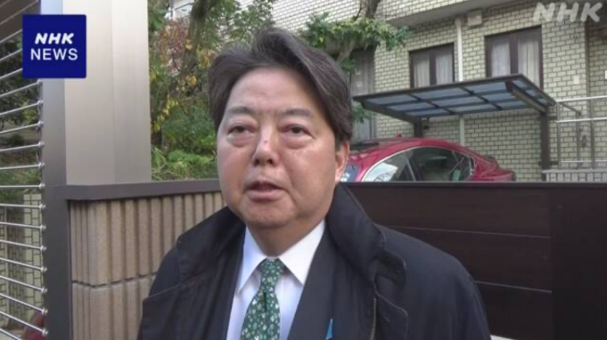

# 岸田内阁4人因丑闻辞职，候任内阁官房长官林芳正：“真可谓是晴天霹雳”

【环球网报道】据日本广播协会（NHK）报道，自民党“安倍派”丑闻持续发酵，日本内阁官房长官松野博一等4人14日向岸田提交辞呈。即将接任松野的前外相林芳正用“晴天霹雳”一词描述当前的情况。

 _林芳正14日接受记者采访。图自NHK_

报道称，14日早些时候，林芳正就当前的情况向记者表示，“这真可谓是晴天霹雳”。“岸田跟我说：‘在严峻的情况下，能否得到你的支持？’”林芳正表示，“将诚心诚意做出努力，以发挥自己的全部能力。”据报道，林芳正等人将于14日傍晚在皇宫认证仪式结束后正式履职。

报道称，由于“安倍派”丑闻被曝光，松野博一与经济产业大臣西村康稔、总务大臣铃木淳司、农林水产大臣宫下一郎14日向岸田递交辞呈。岸田将起用林芳正担任内阁官房长官，斋藤健担任经济产业大臣，松本刚明担任总务大臣，坂本哲志担任农林水产大臣。此外，多名“安倍派”的副大臣、自民党高层14日也因丑闻辞职。

今年11月，日本一大学教授向检方举报，自民党5个派阀在截至2021年的4年间未将总计4000万日元（1元人民币约合19.8日元）政治资金派对收入登记到政治资金收支报告中，涉嫌违反《政治资金规正法》。

随后，此事迅速发酵。自民党最大派阀“安倍派”被曝出向所属议员下达销售指标，要求他们出售政治筹款派对券。如果超过销售指标，多出的资金将有机会返还给议员，成为他们的额外收入。这些将不在派阀收支报告和议员政治资金收支报告上登记。但派阀内部有文件记载超售派对券收入及返还议员姓名、金额等。

“安倍派”丑闻对岸田政府造成严重打击。据时事通讯社报道，该媒体8日至11日实施的民调结果显示，岸田内阁支持率降至17.1%，是自民党2012年12月重新成为执政党以来的最低点。

