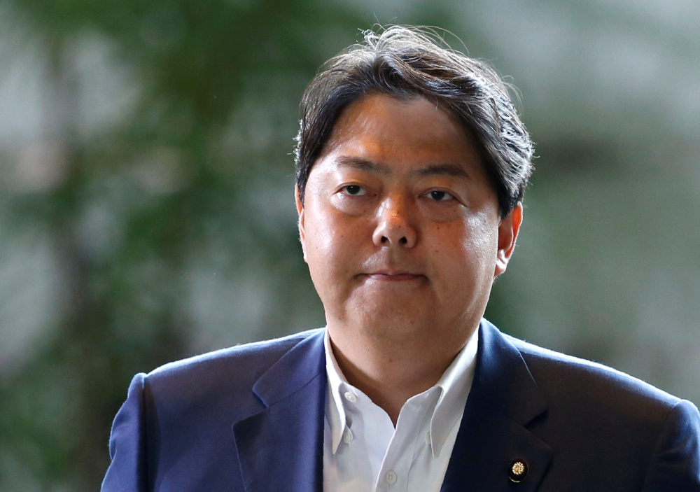

# 日本多名内阁官员辞职，前外相林芳正接任内阁官房长官一职

据央视新闻援引日本共同社当地时间12月14日消息，因卷入政治献金丑闻，日本多名内阁官员当天向日本首相岸田文雄递交辞呈，包括日本经济产业大臣西村康稔、首相辅佐官上野通子、日本内阁官房长官松野博一、日本农林水产大臣宫下一郎、总务大臣铃木淳司和自民党政务调查会长萩生田光一。

_日本前外相林芳正 澎湃影像 图_

据报道，岸田文雄于今早宣布，隶属岸田派的前外相林芳正接任内阁官房长官一职。前法务部长斋藤健接替西村康稔，出任经济产业大臣。松本刚明接替铃木淳司，再次出任总务大臣。前地方分权改革部长坂本哲志接替宫下一郎，出任农林水产大臣。值得注意的是，松野博一，西村康稔，铃木淳司，宫下一郎均属安倍派，取而代之的林芳正，斋藤健，松本刚明，坂本哲志则分别来自岸田派，无党派，麻生派和森山派。

“公众对政治资金的怀疑围绕着我，这导致了对政府的不信任。调查正在进行，我想要拨乱反正”，日本经济产业大臣西村康稔表示。

自上任以来，由于居高不下的通货膨胀率以及自民党近日来不断发酵的政治资金丑闻，岸田文雄的支持率持续下降，成为自民党2012年重新执政以来民望最低的首相。对此，岸田文雄表示，他将“正面”处理这些指控，带领自民党恢复公众对政府的信任。

据央视新闻此前报道，自民党最大派系“清和会”（又称安倍派）曝出秘密资金丑闻，包括松野博一等在内的核心成员涉入其中。该派系向所属国会议员下达销售指标，要求他们以每张2万日元（约合989元人民币）的价格出售政治筹款集会入场券。如果销售所得超过指标，相关议员可获得回扣。至少从2018年至2022年，该派系未按规定把相关收入入账，秘密资金累计总额约1亿日元（约合494万元人民币）。东京地方检察厅特别搜查部已经以涉嫌违反《政治资金规正法》启动调查。

今年9月，岸田文雄对内阁进行了改组，并宣布了一项金额为17万亿日元（1170 亿美元）的经济刺激计划，以提振疲软的经济并缓解物价上涨带来的影响。

