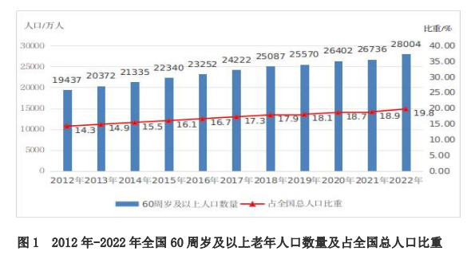
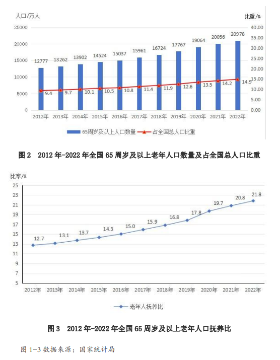

# 民政部：截至2022年末，全国65周岁及以上老年人口抚养比21.8%

**经济观察网讯**
据民政部网站消息，民政部公布《2022年度国家老龄事业发展公报》显示，截至2022年末，全国60周岁及以上老年人口28004万人，占总人口的19.8%；全国65周岁及以上老年人口20978万人，占总人口的14.9%。全国65周岁及以上老年人口抚养比21.8%。

公报显示，养老保险覆盖范围继续扩大。截至2022年末，全国参加基本养老保险人数105307万人，比上年末增加2436万人。全国参加城镇职工基本养老保险人数50355万人，比上年末增加2281万人，其中，参保职工36711万人，参保离退休人员13644万人，分别增加1794万人和487万人。全国参加企业职工基本养老保险人数44402万人，比上年末增加2174万人。全国参加城乡居民基本养老保险人数54952万人，比上年末增加
155万人，其中实际领取待遇人数16464万人。

企业年金稳步发展。截至2022年末，全国有12.80万户企业建立企业年金，参加职工3010万人。医保制度运行总体平稳。截至2022年末，全国基本医疗保险参保人数134592万人，参保率稳定在95%以上。

