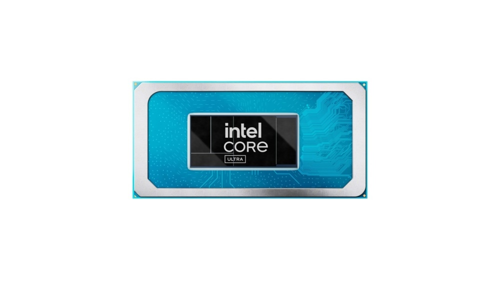
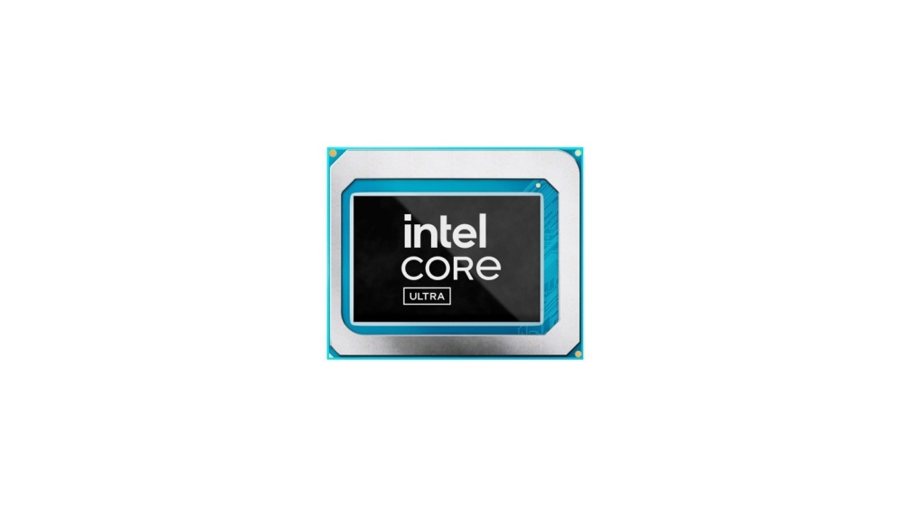
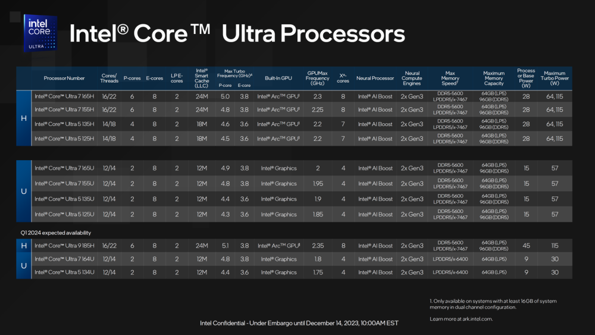
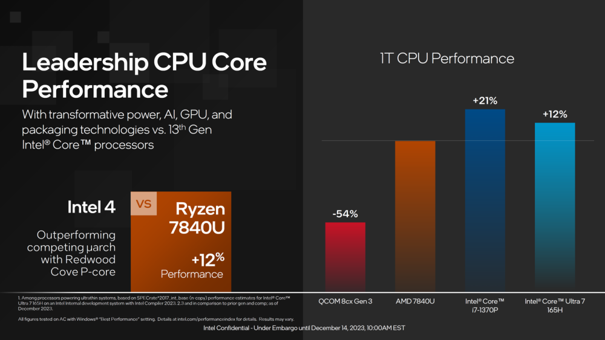
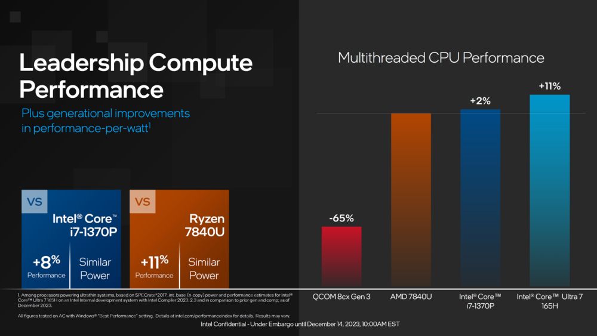
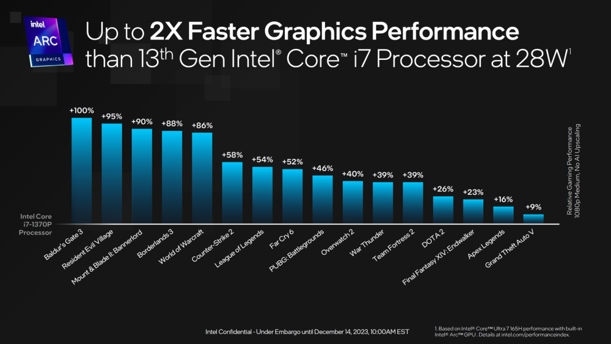
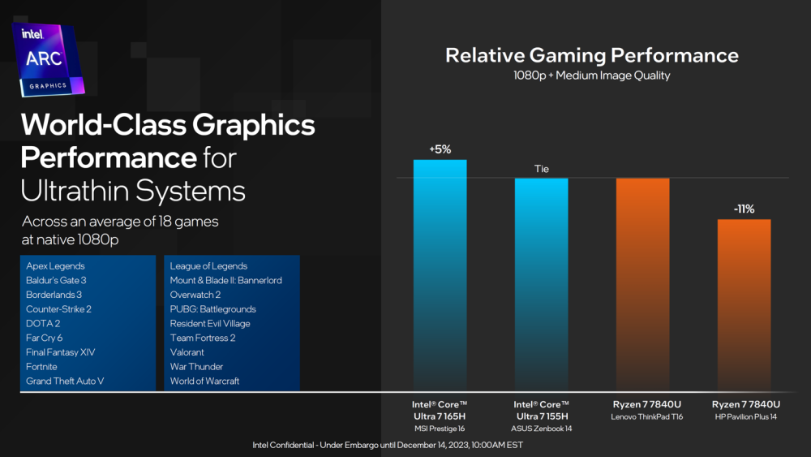

# 英特尔酷睿 Ultra 移动处理器发布：Intel 4 工艺，核显性能翻倍

IT之家 12 月 14 日消息，在今日举行的“让 AI 无处不在”活动上，英特尔发布了初代酷睿 Ultra 移动处理器。

官方表示，酷睿 Ultra 是首款基于 Intel 4 制程工艺打造的处理器，代表着英特尔 40 年来最重大的架构变革。英特尔酷睿 Ultra
处理器采用了英特尔首个用于客户端的片上 AI 加速器“神经网络处理单元（NPU）”，将高能效 AI 加速提升到了新的高度，带来 2.5
倍于上一代产品的能效表现。

英特尔表示，正与 100 多家软件厂商紧密合作，为 PC 市场带来数百款 AI 增强型应用，这些极具创造力、生产力和趣味性的应用将变革 PC
体验。对于消费者和商用客户来说，这意味着更广泛的 AI 增强型应用将能够在英特尔酷睿 Ultra 平台上流畅运行，例如，使用 Adobe Premier
Pro 的内容创作者将享受到出众的体验。

明年，英特尔酷睿 Ultra 处理器将为全球笔记本电脑和 PC 制造商的 230 多款机型带来 AI 特性。到 2028 年，AI PC 将占 PC 市场的
80% ，并为我们的工作、学习和创作带来新的工具。

英特尔首批酷睿 Ultra 系列处理器包括 U 和 H 两个系列，基础功耗分别为 15W 和 28W。U 系列为 2+8+2 核心规格，最高 4Xe
核显。H 系列最高 6+8+2 核心规格，最高 8Xe 核显。明年第一季度，英特尔还将发布基础功耗 45W 的 Ultra 9 旗舰型号，6+8+2
核心规格，8Xe 核显。

详细参数如下：

英特尔官方数据显示，首批上市的酷睿 Ultra 系列处理器中的旗舰型号 Ultra 7 165H 单线程性能不及老款 i7-1370P，超竞品 7840U
12%；多线程性能超 i7-1370P 8%，超竞品 7840U 11%。

核显方面， **Ultra 7 165H 所搭载的 8Xe 核显性能是上代的两倍** ，相对游戏性能小超竞品 7840U。

