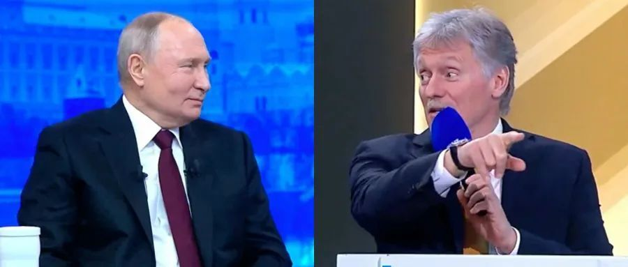
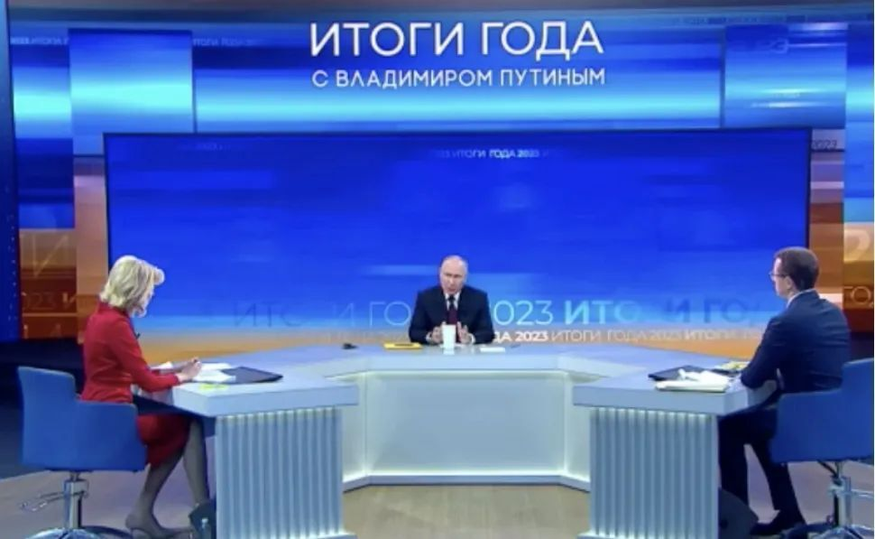

# 记者会上佩斯科夫让《纽约时报》记者提问，普京打断：让新华社先问

12月14日，俄罗斯总统普京在莫斯科举行年度记者会。综合“今日俄罗斯”（RT）、“News.ru”新闻网等多家俄媒报道，当记者会现场多名记者举手提问时，主持人俄罗斯总统新闻秘书佩斯科夫让美国《纽约时报》记者提问，但被普京打断，普京要求先让中国新华社记者提问。

RT报道中的现场视频显示，当现场多名记者举手想要提问时，
**佩斯科夫说，“我看到了《纽约时报》（记者）”。他接着要求工作人员把话筒递给《纽约时报》的记者。就在这时，普京打断佩斯科夫，要求先让新华社记者提问，然后再让《纽约时报》记者提问。**

_主持人俄罗斯总统新闻秘书佩斯科夫（右）让美国《纽约时报》记者提问，但被普京打断，普京要求先让中国新华社记者提问。（俄媒视频截图）_

俄罗斯媒体说，普京随后回答了中国记者关于中俄关系的提问。

据俄新社报道，此次记者会持续时间超过4小时，普京回答了多个问题，涉及俄罗斯内政、中俄关系、俄乌关系等多个话题。

_12月14日，普京在年度记者会现场。图源：俄新社直播画面截图_

来源：环球网/张江平

