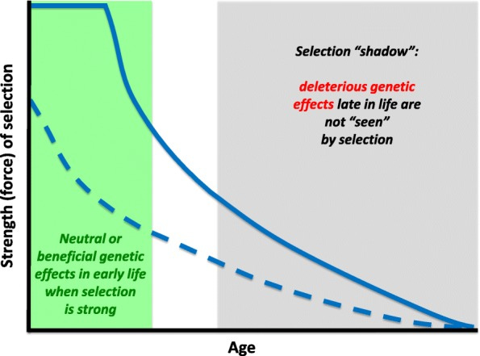
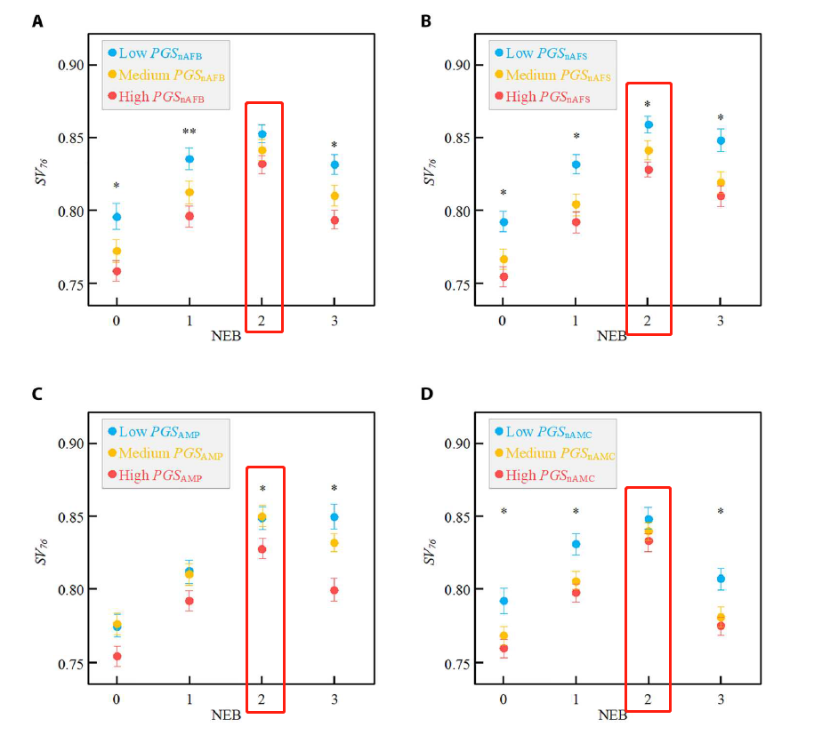
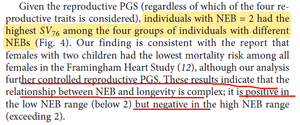

# 较真丨研究称生两个孩子最有利于长寿？考虑生二胎的朋友先别急

**较真要点：**

  * _1_ 这项研究发现，生殖能力越强的人群，活到76岁的几率要小于生殖能力弱的群体。研究人员还观测到，二孩人群活到76岁的几率比不生、生一孩、生三孩的人群高一些，但并没有得出“生两个小孩有利于长寿”这样的结论。
  * _2_ “生两个孩子”与“长寿”之间的关联存在其他解释，比如生二孩的家庭社会经济条件更优越，有更多的社交接触等等。也有研究显示这种关联不存在甚至相反。总而言之，“生两个孩子有利于你长寿”这个说法是尚未证实的，可别轻易相信了。

**查证者：凌之浩 ｜德国马克斯普朗克研究所生物信息学博士**

近期一项发表在《科学进展（Science
Advances）》的研究结果引起了很大的关注，研究人员基于英国生物样本库（Biobank）中超过27万多名参与者的基因、生殖和死亡等表型数据进行了分析。其结论佐证了衰老的拮抗多效性（antagonistic
pleiotropy）假设。 **简单来说，即生殖和寿命在遗传层面呈强烈的负相关性，意味着促进生殖的基因突变往往会缩短寿命。**

而论文中的一项数据更是引起来社会层面的广泛关注，该数据显示，在参与者中，生了两个小孩的群体，比起生育了其它数量小孩的群体（0个，1个或3个），能活到76岁的概率是最高的。这甚至上了热搜，表述就是“研究称生两个孩子最有利于长寿”。这让很多朋友产生联想：是不是意味着生两个孩子，是最有利于长寿的？生的孩子越少或越多，都会缩短寿命？

具体该如何解读这项研究，这篇文章咱们就来详细解析一下。

**衰老拮抗多效性（AP：antagonistic pleiotropy）假说**

为了便于后续的理解，我们有必要了解一下这项研究的初衷——基于大型的队列群体数据，能否得到支撑或否定衰老拮抗多效性假说（1957年由进化生物学家George
Williams提出）的结论。这个假说是目前进化领域对于衰老的主流认知。其主张颇有点“天下没有免费的午餐”的韵味。Williams认为基因的多效性决定了，基因变异的结果可能会在生命不同的阶段发挥不同的效用，可能是好的可能是坏的，是一个相对的概念。而之前的一些研究就发现，有一些基因层面的变异能够促进生命更早地生育或产生更多的后代（基因的繁衍）。虽然同时会促进衰老，但自然选择对这些变异的保留却是正向的，比如2013年的一项研究就发现，参与研究的女性群体中，生孩子的数量越多，寿命相对越短[1]。

对此现象，学界目前的解释是，有些基因的变异虽然在早期对生命体有益而晚期有害，自然选择依然会倾向于保留这些对早期生命体有益的变异，因为无法预知晚期的危害，而对生物基因的本性而言，仿佛能够让自己的基因更多更早的繁衍，就是最大的益处。

**生殖与寿命的负遗传关联性**

那这项研究发现了AP假说的佐证了吗？是的，他们发现了。研究人员首先选择了四个指标作为生殖情况的体现，分别是：(i) negative age at
first birth (nAFB, 负第一次生育年龄), (ii) negative age at first sex (nAFS,
负第一次性行为年龄), (iii) negative age at menarche (nAMC，负初潮年龄), (iv) age at menopause
(AMP，绝经年龄)。“负”只是一种数学处理，大家只需要知道，前面三个指标都是年龄越小，生殖的机会越多，生多胎的几率越大，最后一个指标是年龄越大，生殖机会和多胎几率越高。而基于这几个指标加上生过的小孩数量（number
of children ever born
:NEB），以及DNA数据，研究人员进行了基因组关联性分析（GWAS）。简单来说，就是通过统计学的方法，找到那些对于上述指标变化有显著性贡献的DNA突变。最终，他们一共找到了583个突变位点与生殖能力显著相关。随后，他们用这些关联位点对每一位参与人群，进行了生殖能力的计算，用PGS（polygenetic
scores for reproduction，生殖多基因评分）来表示最终的结果。 **大概就是这个分越高，说明你的生殖能力越强，繁衍的后代可能越多。**

然后呢，他们建立了一个模型来计算每个参与者活到76岁的几率（SV76）。他们得到下面几个结果：

生殖能力越强的参与人群，活到76岁的几率要小于生殖能力弱的群体（0.8 vs
0.839，低了4个百分点），这就佐证了AP假说。论文作者也讨论了这一假说成立的潜在生物学原因，认为值得一提的理论是：生物体的资源有限，因此对生殖进行更多投资将导致对DNA修复维护的投资减少，从而导致体细胞突变和衰老的积累。

把nAFB, nAFS，nAMC，AMP这四个指标拆开来单独看，依然都与上述结论相同。

第三点很有意思，就是他们发现从基因层面来看，参与人群的年龄组别越小，生殖能力越强，处于稳定上升的趋势，这可能就是自然选择对于提升繁衍力的一种持续诉求（可以理解为，因为近代人越生越少了，基因自己都看不过去了，给人们创造了更多生殖的机会）。

**有两个小孩的人群，寿命最长？**

我们先不妨看看这个说法是怎么衍化来的。为了进一步了解AP假说在参与队列人群中的情况，研究人员作了进一步的细分，根据生育小孩的数量把人群划分成了0,1,2,3四个组别，那么为什么没有4孩组呢？因为即便是英国，生四个小孩的家庭也很少，所以不具有统计学效应。分组后，把SV76和PGS一关联，研究人员自己也可能也“懵”了。什么情况啊？虽然每个组群的SV76几率，依然都是按生殖能力低（low
PGS）到中到高来排序的（反映在下图中每组人群自上而下基本都是蓝色黄色红色，并且ABCD四项生殖指标基本都是如此），但整体来看，二孩人群活到76岁的几率都要比其它组别高一些！巧合的是，在之前的另一项研究中，也发现有二孩的女性相对来说是死亡风险最低的组别[2]。难道二胎父母真是天选之人？

看上去研究人员自己也有不解，所以他们对PGS做了更严格的过滤（但具体怎么调整的文章里没有细说），然后在少于2个小孩的组别和大于2个小孩的组别中，观察到了相反的关联关系，所以后面也跟着下了一个NEB和寿命之间的关系是很复杂的结论。
**总而言之，研究者是没有得出“生两个小孩有利于长寿”这样的结论的，而仅仅是观测到了数字上的关联。**

**对于关联性结果的理解**

我个人认为，之所以这个连论文作者都比较摇摆的研究结果会被放大，一定程度上是因为，人们天然就容易认为两个关联的结果，是存在因果关系的。然而，关联性不代表就是因果性。

举个例子，疫情初期，有一个模型对于地区疫情的预测要比公共卫生机构的预测快速准确的多，它是怎么做到的呢？其实这个模型只是提取了同一时间不同地区在网上搜索发热，发烧等关键词的频率，因为疫情爆发的区域，肯定伴随着相关的搜索量急增，但很显然搜索关键词并不会导致疫情的发展。这也是为什么后来，当疫情已经全球普及后，这个模型就再也没办法进行准确的预测了。

同样的局限性在这项研究中也存在，目前的结果只能说明，在参与研究的人群中，生有两个孩子的群体能活到76岁的几率更高（但最多也只是高从几个百分点），同样，即便参与人群，也并非二胎父母就都比其它组群活的更久，只是一个统计学上的平均情况。

另外，研究本身也没有办法排除一些干扰因素，比如没有办法排除，是否入组的二胎父母家庭本身在社会经济方面就有更好的条件；再比如，一位论文作者在媒体上提到，有其他研究指出“有孩子的人往往有更多的社交互动”，而“
更多的社交接触与更长的寿命有关”。作者自己也承认，入组Biobank的人群（即参与本项研究的人群），本身在死亡率和癌症患病率上就要低于普通人群，同时由于基因的种族特异性，结论并不一定在其它人群也能同样复现，
**比如2020年，对于中国年纪最大的一个群体进行的类似研究，就得到了相反的结论（这群最长寿的人群，生育数量低于平均数，生育年龄也大于平均年龄）**
[3]。最后，这项研究的寿命模型只是计算到了76岁，而我们知道，这个岁数如今也只是人群的平均年龄了，作者也强调，对于超过76岁的年纪，起作用的基因位点可能跟他们发现的完全不同，所以这项研究的结论只适用于活到76岁的概率，至于这个年纪算不算长寿，对于更长寿的模型是什么情况，就需要以后的进一步分析了。

所以，对于研究的结论，咱们还是需要理性分析看待，既看到亮点，也要知其不足之处，更重要的是，不要被热搜标题给轻易误导。

**版权声明：本文系腾讯较真版权稿件，未经授权，禁止转载。欢迎个人转发至朋友圈、家族群。**

