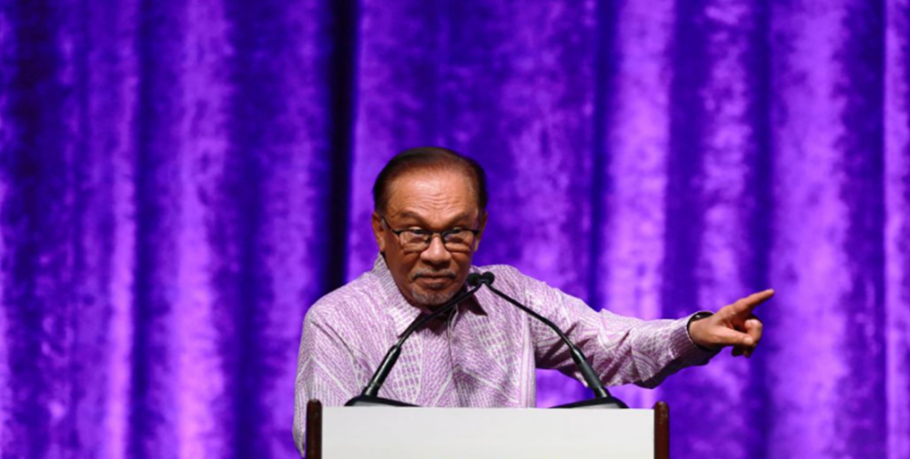

# 马来西亚总理安瓦尔宣布改组内阁，31名部长集体降薪20%

【环球时报综合报道】执政满一周年的马来西亚总理安瓦尔12日首次宣布内阁改组，任命多名新部长，并表示部长集体减薪20%的政策维持不变。

_马来西亚总理安瓦尔，资料图_

据路透社报道，安瓦尔在内阁改组中表示自己将继续兼任财政部长，并宣布增设第二财政部长职位，由马来西亚雇员公积金局负责人阿米尔担任。安瓦尔在新闻发布会上表示：“财政部除由我领导外，还必须拥有一支强大的专业团队，以确保我们走在正确的轨道上，并专注于经济发展。”

报道称，由于出口下降，马来西亚今年的经济增长率较2022年的8.7%大幅放缓。尽管该国通胀情况有所缓和，但国内对消费成本上升的担忧依然存在，因为马来西亚林吉特是今年亚洲表现最差的货币之一。人们对经济、通货膨胀和改革步伐缓慢的担忧，使得近几个月来安瓦尔在民意调查中支持率下滑。根据独立组织默迪卡民调中心11月发布的数据，安瓦尔的支持率从去年12月的68%下降至50%，政府支持率则从54%下降至41%。

安瓦尔领导的马来西亚团结政府去年12月对部长采取集体减薪措施。安瓦尔12日表示减薪措施持续，不因内阁重组改变，这次共有31名部长每月少领20%薪水，即少领3000林吉特（约合4577元人民币），相当于马来西亚普通家庭一个月的开销。安瓦尔称，他不会被减薪，因为总理没有领薪水。安瓦尔去年11月就任总理后即宣布不领薪水。

此外，安瓦尔重组内阁后，一些政府部门部长进行了职位互换：原国防部长穆罕默德·哈桑调任外交部长，原外交部长赞比里转任高等教育部长，原高等教育部长穆罕默德·哈立德·努尔丁调任国防部长。安瓦尔还将两个部门拆分：原通信和数字部拆分成通信部、数字部。原天然资源、环境及气候变化部拆分为能源转型及公用事业部、天然资源及可持续发展部。原人力资源部长西华古玛因涉助理的贪污案被替换，该职位由原财政部副部长沈志强接任。美联社称，安瓦尔办公室表示，部长人数从之前的28人增加到31人，内阁总规模从55人扩大到60人。（文简）

