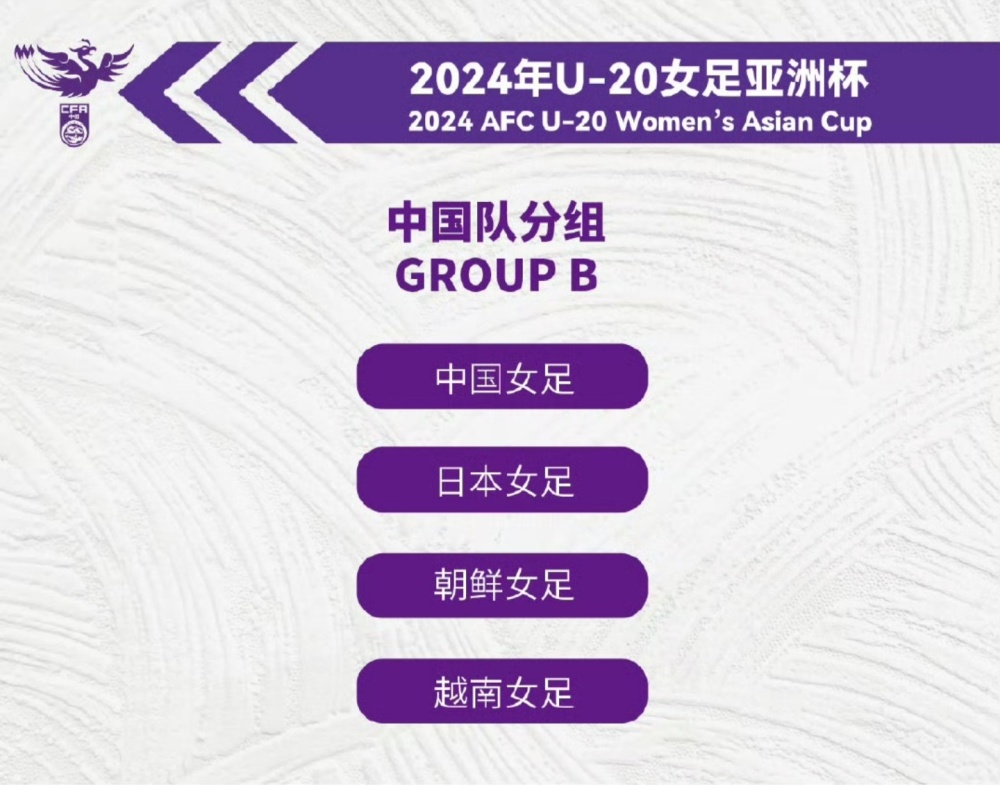
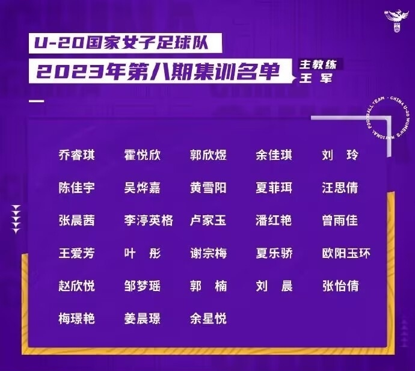
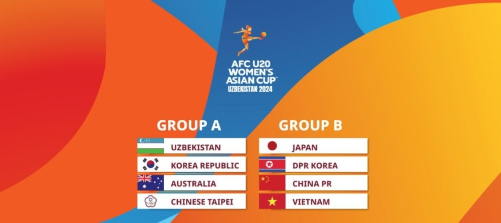

# U20女足亚洲杯抽签：太死亡！中国PK日本朝鲜越南 出线就进世青赛

北京时间12月15日，2024年乌兹别克斯坦U20女足亚洲杯抽签举行，中国U20女足与日本、朝鲜、越南同组。

U20亚洲杯将于明年3月3日-16日举行，一共有8支球队参赛，分为两个小组，每个小组的前两名出线，晋级半决赛，而四强就可以拿到明年在哥伦比亚举行的U20世界杯，也就是世青赛的参赛资格。

中国女足国青位于第三档，最终抽到了B组，同组对手包括日本、朝鲜和越南，想要出线，难度很大。日本队曾6次夺得U20女足亚洲杯冠军，中国和朝鲜都曾1次拿到冠军。

A组方面，则有乌兹别克斯坦、韩国、澳大利亚、中国台北。

