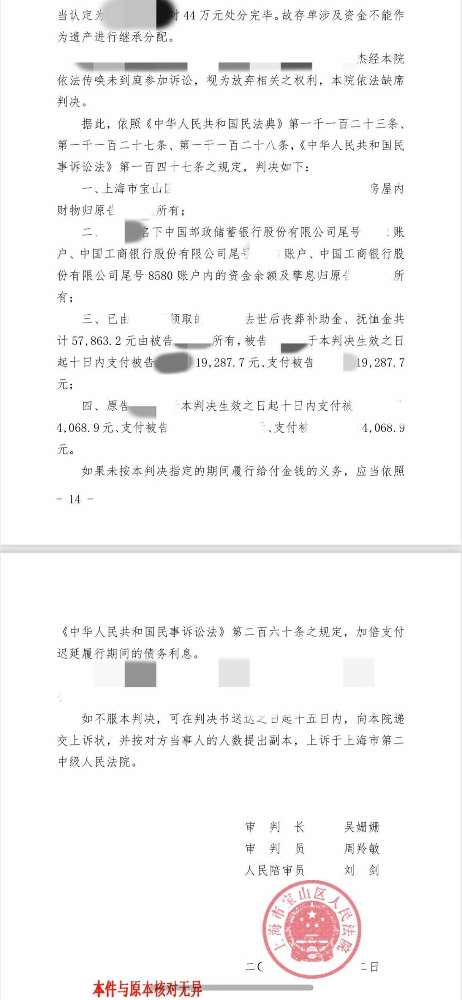
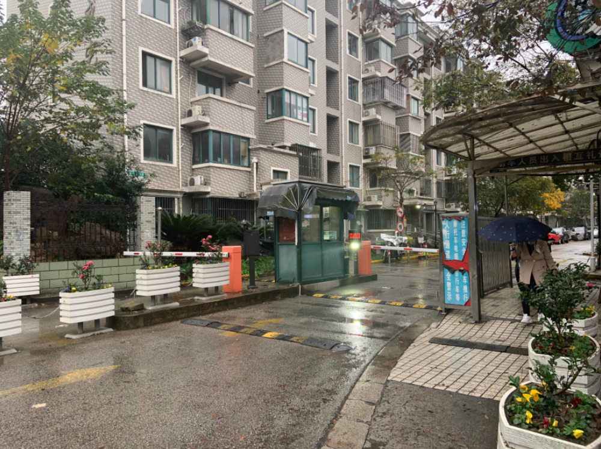

# “上海老人将房产送给水果摊主案”落槌：涉案房屋归水果摊主

“上海老人300万房产赠水果摊主案”有最新进展。

12月15日，澎湃新闻记者从水果摊主的诉讼代理人高明月律师团队处获悉，12月14日，该团队收到上海市宝山区人民法院的《民事判决书》。一审判决书显示，涉案房屋及房屋内财物归原告（水果摊主刘某）所有。

_高明月律师团队提供的上海市宝山区人民法院的《民事判决书》。_

此前据多家媒体报道，上海宝山区一名老人的老伴和儿子均已去世，一人独居，生活上受到小区水果摊主刘某一家颇多照料。

之后老人决定把自己的晚年和遗产都托付给刘某，其中包括自己价值300万元的房产，相关扶养协议进行了公证。

2021年12月31日，老人去世，老人的妹妹等家属对遗产分配提出异议，双方对簿公堂。

**300万房产赠送水果摊主引争议**

澎湃新闻了解到，该案原告为水果摊主刘某，被告为老人的妹妹和外甥等多人。原告主要诉讼请求为：1.请求判令上海市宝山区某房产及房屋内财产由原告所有；2.请求判令老人名下银行存款余额及孳息归原告所有。

被告不同意原告诉请。

老人的妹妹辩称，2017年之前，其兄长已经出现精神障碍，行为能力应当受限；2017年7月住院时，老人被诊断出脑梗塞、老年痴呆等情况，后续由于刘某带走老人，无法进行进一步确诊，老人签署《遗赠扶养协议》时不具备完全民事行为能力，签署协议当属无效。

 _2020年11月25日，上海宝山区，老人所住的小区。澎湃新闻记者 邓玲玮 资料图_

法院审理认定，2017年8月，老人（甲方、遗赠人、被抚养人）与刘某（乙方、受赠人、抚养人）签订《遗赠扶养协议》。

上述协议约定，甲方愿意将协议第一条中所有的个人财产遗赠给乙方，并由乙方承担抚养甲方义务；乙方愿意承担抚养甲方义务，并愿意接受甲方遗赠的财产。

根据协议内容，老人财产包括宝山区房产一套、存款以及房屋内财物。刘某负责老人的吃、穿、住、行、医疗、
养老等抚养义务，指在生活上照顾、经济上给予帮助，精神上给予慰藉。

关于遗赠财产所有权的转移，乙方在甲方生前不得转移、处置甲方个人财产，乙方应在甲方去世之后30日内办理遗赠财产的所有权转移手续。

2019年3月12日，上海市普陀公证处就该份《遗赠扶养协议》进行了公证，并出具了《公证书》。

《公证书》内容显示：经查，2017年8月《遗赠扶养协议》在订立协议时双方均具有法律规定的民事权利能力和民事行为能力，意思表示真实。

对于遗赠扶养协议公证录音录像，原告认为可以反映老人的真实意思表示，被告则认为老人在录音录像中有多处逻辑混乱、与事实不符的表达。

审理中，原、被告确认系争房屋属于老人个人财产，房屋价值330万。

**老人生前身体状况如何？**

判决书显示，老人曾于2017年7月因肺炎住院。当时的《病程记录》显示，患者有间断胡言乱语发作，故申请神经内科会诊。会诊意见记录为：“患者有间隙性胡言乱语，神志清、对答切题，老年痴呆，暂无特殊处理。”2020年6月，老人还因摔伤入院。

2021年4月，司法鉴定科学研究院出具《司法鉴定意见书》，鉴定意见为：“患有器质性精神障碍，目前应评定为无民事行为能力。”

2021年5月，经法院判决，老人被宣告为无民事行为能力人。

此外，法院还先后委托上海市精神卫生中心司法鉴定所、司法鉴定科学研究院、复旦大学上海医学院司法鉴定中心、上海枫林司法鉴定中心就老人在2019年3月的民事行为能力进行鉴定，均因超出鉴定机构能力范围或所需材料不充分而不予受理。

对于办理公证时老人的状态，公证处相关公证人员调查笔录显示：“我办理公证的时候审查的是公证办理时老人的状态，老人的意思表示能力是否足够和真实，这个老人脑梗是2017年，协议是2017年签的，我接触他是2019年，老人恢复得不错，讲话思路很清晰，对于为何要公证，为何这样做，为何要给刘先生夫妻扶养和监护，生老病死托给谁，财产不给自己亲戚，讲得很清楚、很坚定......当事人在
2019年3月对2017年8月签的遗赠扶养协议进行追认，这也没有问题，在公证业务中也非常常见的。”

**法院判决：老人房屋及房屋内财物归刘某所有**

上海市宝山区人民法院认为，继承开始后，按照法定继承办理，有遗嘱的，按照遗嘱继承或者遗赠办理；有遗赠扶养协议的，按照协议办理。公民可以与扶养人签订遗赠扶养协议，扶养人承担该公民生养死葬的义务，享有受遗赠的权利。遗赠扶养协议系双方法律行为，本案所涉遗赠扶养协议内容合法，遗赠扶养协议亦在公证处进行了公证，其外在形式要件符合法律规定。

法院指出，虽然2021年5月老人被宣告为无民事行为能力人，但无证据证明其在签订遗赠扶养协议期间即已经处于限制民事行为能力或者无民事行为能力，故该协议是双方真实意思表示，依法具有法律约束力。被告举证的就医住院诊断等证据无法得出老人在签署遗赠扶养协议时行为能力受限之结论，也无证据证明遗赠扶养协议并非老人的真实意思表示。

法院表示，被告所举现有证据无法达到民事证据优势盖然性的证明标准，应当承担举证不利的后果。该院对被告关于遗赠扶养协议无效的意见不予采纳，并认为应尊重被继承人的意愿和其所享有的财产处分权，对涉案遗赠扶养协议的效力予以认可。

2023年12月12日，法院一审判决，老人的房屋、房屋内财物以及其名下3个账户的资金余额、孳息归原告刘某所有。

高明月律师表示，意定监护协议有效，水果摊主承担了监护人职责。遗赠扶养协议有效，水果摊主履行了生养死葬的义务。

在他看来，上海老人有法律意识，未雨绸缪为自己做好意定监护以及遗赠扶养的法律安排，捍卫自己的自由和尊严，也实现了自己财富的意定传承。并且，公证文件经受住了严苛的质疑和挑战。高度对抗的家事司法实践充分说明：不论是意定监护文件，还是意定传承文件（如遗嘱、遗赠抚养协议、信托协议等），最好都通过公证文书的方式来呈现，这是对当事人最负责的建议。

