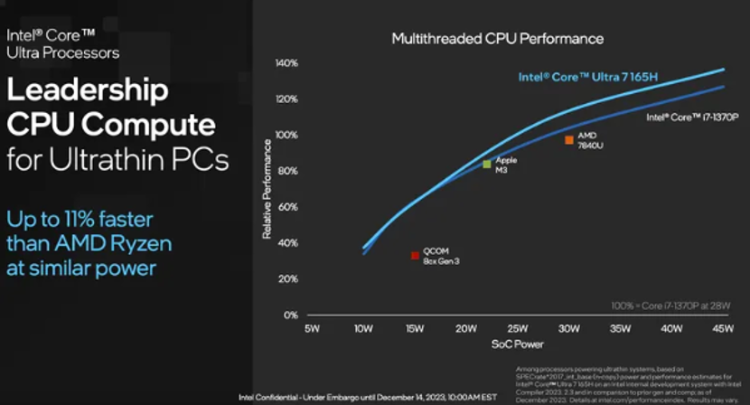
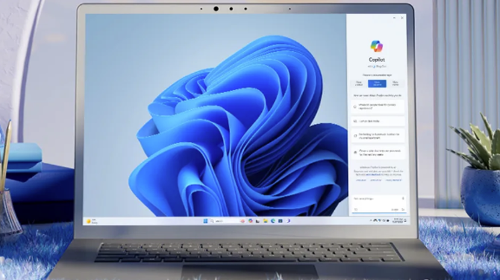
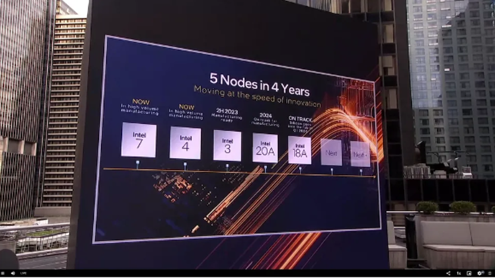
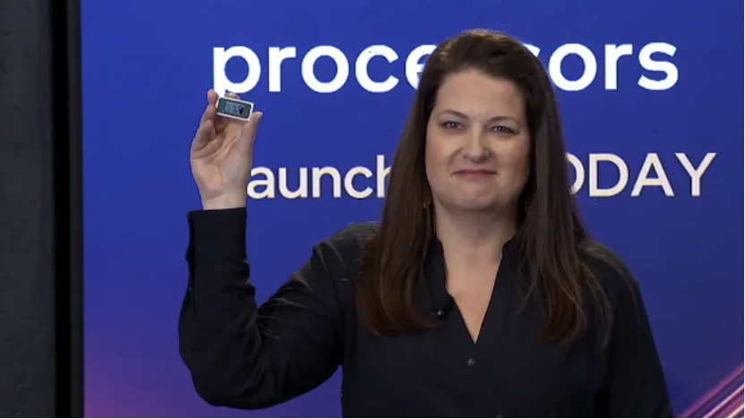
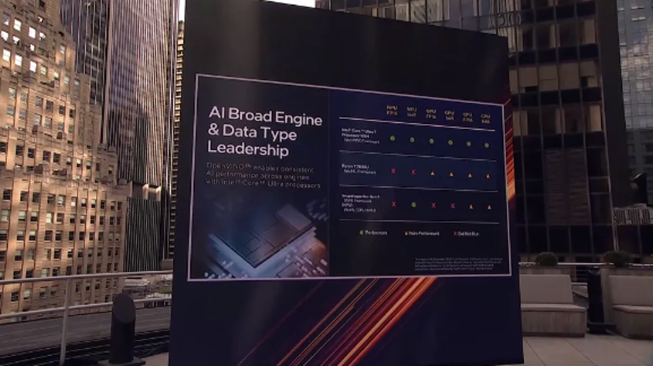
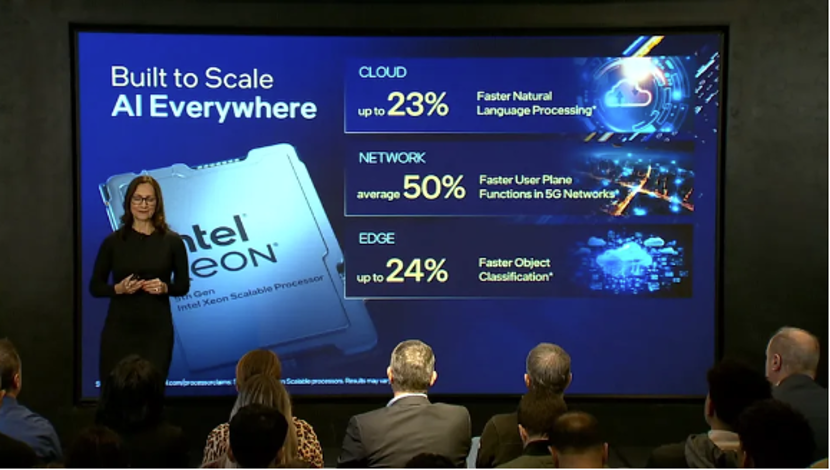

# 一文读懂英特尔发布会：新型酷睿Ultra处理器发布，核显性能翻倍

**划重点：**

  * _1_ 英特尔正式推出了AI PC处理器，即代号Meteor Lake的新型酷睿Ultra处理器。
  * _2_ 酷睿Ultra处理器分为三种不同配置，包括酷睿Ultra 5、酷睿Ultra 7和酷睿Ultra 9。
  * _3_ 酷睿Ultra处理器有三大改进，可以提供更好的视频通话、更好的图形和更长电池续航。
  * _4_ 酷睿Ultra系列是基辛格推动英特尔重现昔日辉煌的重要举措，希望能帮助提振笔电销售。

腾讯科技讯 12月15日消息，据外媒报道，继宣布启动人工智能个人电脑（AI PC）加速计划后，英特尔于美国当地时间周四在纽约举行的“AI
Everywhere”活动上奉上了新的AI硬件，正式推出了AI PC处理器，即代号Meteor
Lake的新型酷睿Ultra处理器。这款处理器专为支持人工智能技术而设计的，这可能会提升英特尔作为人工智能热潮受益者的地位，并与英伟达和AMD等对手展开竞争。

01 新处理器分三种不同配置

英特尔揭开了下一代中央处理器的神秘面纱。在周四举行的“AI
Everywhere”活动上，该公司发布了酷睿Ultra移动处理器的所有细节。由于采用了一种新的设置，可以将任务拆分到不同的芯片上，因此有望提高能效和性能。

酷睿Ultra处理器将有三种不同的配置，分别是酷睿Ultra 5、酷睿Ultra 7和酷睿Ultra 9。英特尔表示，与AMD Ryzen 7
7840U、高通骁龙8cx Gen 3和苹果自研M3芯片等笔记本电脑处理器相比，酷睿Ultra 7
165H芯片的多线程性能提高了11%。与之前的英特尔酷睿i7-1370P相比，它的功耗降低了25%，比AMD的Ryzen 7 7840U的功耗降低了79%。

英特尔的所有新CPU还将配备NPU，即神经处理单元，提供“低功耗人工智能加速和CPU/GPU卸载”，能够执行人工智能驱动的任务，如背景模糊、眼动追踪和图片框架等。与英特尔的上一代芯片相比，这种集成应该能提高运行像Stable
Diffusion这样的人工智能模型的效率。

虽然英特尔主要强调了其酷睿Ultra 7 165H芯片的优势，但旗舰产品英特尔酷睿Ultra 9
185H将是这一领域的领导者，它拥有16核22线程。在这16个核心中，包括有6个性能(P)核心和8个效率(E)核心。

还有两个低功耗(LP-E)内核位于芯片的“低功耗岛”上，这是一个新的部分，用于处理要求较低的工作负载，以提高效率。酷睿Ultra 9
185H拥有高达5.1GHz的增强时钟，以及内置的Arc GPU, 8个Xe内核运行频率高达2.35GHz。新的Xe
LPG架构允许在更低功耗下提高性能，并且还增加了对英特尔XeSS升级技术和光线追踪的支持。

在微软推出首款搭载英特尔NPU的Windows笔记本电脑几个月后，这款NPU就出现了。这家软件制造商并没有解释除了通常的Windows
Studio效果之外，NPU将如何在Windows中发挥作用。但很明显，英特尔正在为更大的人工智能功能奠定芯片基础，这些功能可能会在下一个版本的Windows中出现。

虽然英特尔的酷睿Ultra 9 185H处理器要到2024年才会上市，但它的大多数其他Meteor
Lake芯片都在今天发布，其中包括英特尔第二强大的芯片酷睿Ultra 7 165H，具有16核22线程和高达5.0GHz的增强时钟。

还有酷睿Ultra 7 165U、酷睿Ultra 5 135H、酷睿Ultra 5
135U以及其他一些不如英特尔旗舰产品强大的选项。值得注意的是，只有英特尔的H系列芯片配备了内置的Arc
GPU，因为该公司的U系列CPU只提供集成的英特尔图形处理器。

02 英特尔新处理器有三大改进

Meteor Lake处理器有三大改进：更好的视频通话、更好的图形和更长的笔记本电脑电池续航时间。

这些芯片通过集成NPU和低功耗核心，保证了更好的视频通话质量，这些核心针对“人工智能”任务进行了优化，比如过滤背景噪音和模糊背景，而不会在视频通话期间对CPU造成负担。

更高端的Meteor
Lake笔记本电脑芯片有望带来更好的图形效果，它将集成带有英特尔Arc显卡品牌的GPU，并支持光线追踪、超采样等现代图形技巧。它们仍然无法与独立的英伟达GeForce
RTX 4090竞争，但它们应该现有笔记本电脑现在所能做的要好。

更长的电池续航也是Meteor
Lake芯片的主要卖点之一，这将体现在将任务分流到低功耗NPU的省电模式中。此外，英特尔正在使用新的fooveros封装技术将这些芯片堆叠在一起，使单个芯片可以随意打开或关闭，而不会影响其余部分，所以我们可能会看到笔记本电脑的续航时间更长，因为它们足够智能，可以在你在Windows
11中移动文件或观看YouTube时关闭大多数耗电组件。

03 大量笔电将采用新处理器

大量新款笔记本电脑已经采用了新的英特尔酷睿Ultra芯片。首先，MSI推出了高端的Prestige 16 AI
Studio笔记本电脑，重1.59千克，但配备了许多令人印象深刻的规格，包括英特尔的酷睿Ultra 9
185H处理器和英伟达的4070笔记本电脑GPU。有一款13英寸的Prestige AI Evo，配备了英特尔酷睿Ultra 7
155H处理器。MSI的16英寸Prestige AI Studio笔记本电脑起价为1899美元，而Prestige 13 AI
Evo的起价为1049美元以上。

华硕也在其笔记本电脑上增加了英特尔酷睿Ultra高功率的规格。它推出了一款轻薄的Zenbook 14 OLED笔记本电脑，配备了英特尔酷睿Ultra
7芯片和英特尔Arc显卡。这款笔记本电脑起价1299.99美元，“额外配置”可能包括英特尔酷睿Ultra 9芯片，最早将于2024年初上市。

与此同时，联想发布了三款配备新芯片的笔记本电脑，包括第12代ThinkPad X1 Carbon、第9代ThinkPad X1二合一本和IdeaPad
Pro 5i。这三款机型都相当昂贵，新款ThinkPad X1 Carbon“限量配置”起价2989美元，联想IdeaPad Pro
5i起价1149.99美元。ThinkPad X1 2合1起价2639美元，将于2024年3月上市。

此外，宏碁也加入了英特尔酷睿Ultra的行列，推出了新的Swift Go 14和专注于游戏的Predator Triton Neo 16。其中，Swift
Go 14笔记本电脑配备了英特尔酷睿Ultra 7
155H处理器，电池续航时间高达12.5小时，LPDDR5X内存高达32GB，起价为999.99美元。Predator Triton Neo
16将于2024年3月推出，配备英特尔酷睿Ultra 9 185H芯片和英伟达RTX 4070 GPU，起价为1499.99美元。

虽然采用英特尔改进芯片的笔记本电脑很多，但多数人可能要等到明年英特尔发布酷睿Ultra 9后才能买到顶级机型。

04 为未来打造行业标准

基辛格表示：“人工智能创新有望将数字经济的影响提高到全球国内生产总值的三分之一。英特尔正在开发技术和解决方案，使客户能够在所有应用程序中无缝集成和有效运行人工智能，包括在云中以及越来越多地在本地个人电脑和边缘设备上生成和使用数据。”

基辛格还展示了英特尔广泛的人工智能足迹，从云和企业服务器到网络、批量客户端和无处不在的边缘环境。他还强调，英特尔正按计划在四年内推出五个新的工艺制程节点。

基辛格在发布会前表示：“如果你仔细想想，大多数生成式人工智能都是围绕着这些非常令人印象深刻的高端训练环境进行的，但训练人工智能的人并不多。英特尔认为这是一个将人工智能集成到客户每天使用的个人电脑和其他边缘设备中的机会。”

他补充说：“我们希望将人工智能带入未来的每台个人电脑上，并能够让每台个人电脑都支持人工智能，每台边缘设备都支持人工智能，每个企业数据中心都支持人工智能。人工智能无处不在。考虑到英特尔的销量，我们推动标准和生态系统的方式——这是我们为这次聚会带来的独特之处。”

英特尔计划推出一款由人工智能半导体芯片驱动的新型个人电脑，该公司认为这将成为未来的行业标准。

基辛格解释说：“我把这款人工智能个人电脑定义为迅驰式（Centrino，英特尔专门用于笔记本电脑的处理器技术）的时刻，有些人可能还记得迅驰。你们知道，WiFi这个想法是几年前才出现的，而我帮助这个行业创造了WiFi。但当迅驰作为一个平台出现的时候，突然之间，所有的笔记本电脑都有了WiFi连接。咖啡店需要有WiFi基础设施。每个企业都摆脱了有线连接器，这重新定义了个人电脑。人工智能个人电脑也将如此。”

他接着称：“安迪·格罗夫（英Andy
Grove，特尔公司前CEO）称个人电脑是有史以来最伟大的达尔文式设备。我认为人工智能个人电脑将是下一个达尔文进化，新的应用程序将出现爆炸式增长，彻底改变我们的沟通方式。想象一下，你下一次与人进行Zoom通话时，你将获得实时转录、翻译、身体的细微差别以及上下文信息，这一切都是因为个人电脑内的人工智能加速器。”

“在这个领域，我们将发挥音量播放器的作用，”基辛格解释道。“我们已经研究这些芯片很多年了。你知道，当我宣布推出人工智能个人电脑时，所有人都说：‘哦，是的，让我们也加入这场游戏吧！’我们宣布产品类别，为之努力，推动行业发展，这就是领导者的工作。”

基辛格补充说：“有些人会做些高端和小众的产品，但我们会把它带到任何地方。我们将交付数亿台这样的设备。我们已经有超过100个不同的应用开发商签约加入我们正在推进的人工智能个人电脑项目。英特尔希望使其成为一个开放的行业，因为我不知道所有的创新会是什么，但我可以告诉你，我们将成为使这些创新出现的平台。”

05 能否帮助重振昔日辉煌？

新型酷睿Ultra处理器将于今天开始在新款笔记本电脑上使用，为英特尔带来了许多重大的首创。这一切都发生在其首席执行官帕特·基辛格（Patrick
Gelsinger）试图重振这家半导体巨头昔日辉煌之际。

英特尔酷睿Ultra处理器采用了所谓的芯粒（Chiplets，或称小芯片），这是一种将单个芯片分解成不同组件的方法。这些组件可以根据需要轻松地进行交换。酷睿Ultra系列由计算模块、图形模块、I/O模块和SoC模块组成。所有这一切都是为了让英特尔的酷睿Ultra芯片更强大、更节能，从而从AMD
等公司手中夺回市场份额，并缓解高通和苹果带来的压力。

不过，芯粒并不是全新的概念。AMD已经在自己的处理器中使用了这种技术，但这对英特尔来说是一项重大举措，可能会提振该公司的销售，因为它试图证明自己可以像竞争对手一样快速创新。英特尔2022财年的收入为631亿美元，而2021财年的收入为790亿美元。

芯粒本身具有许多有趣的功能。计算模块包含芯片的性能核心和效率核心，前者专注于能耗高的任务，后者则负责运行要求较低的程序。与此同时，SoC芯片采用了英特尔新的Low
Power Island技术，可以运行需要更低功耗的任务。

这款SoC芯片还配备了英特尔的NPU，符合此次活动的“AI
Everywhere”主题。NPU旨在处理一些板载AI任务，但不要指望直接在笔记本电脑上运行ChatGPT之类的聊天机器人。这种功能仍然属于流程密集型任务，并且必须在云中执行。值得注意的是，AMD、高通和苹果已经在它们的处理器中提供了NPU。

就性能而言，英特尔表示，其高端酷睿Ultra 7165H芯片在多线程性能方面击败了AMD的Ryzen 7 7840U芯片、苹果的M3芯片、高通的8cx
Gen 3芯片以及自己的酷睿i7-1370P。该公司还表示，Ultra
7165H在执行从流媒体Netflix到观看4K视频和浏览网页的所有操作时，都比AMD的Ryzen 7
7840U耗电更少。此外，由于Ultra的板载Arc图形处理单元，游戏性能也得到了提升。

酷睿Ultra系列是基辛格推动英特尔重现昔日辉煌的重要举措。到目前为止，该公司的2023财年表现不佳，第一财季收入下降了36%。自那以来，该公司已经弥补了这一跌幅，第二财季和第三财季的收入分别下降了15%和8%。

与其他芯片制造商一样，英特尔也一直在努力克服电脑销量急剧下降的局面。疫情爆发时，消费者需要新电脑在家工作和娱乐，促使电脑销量激增。但随着这些系统中的许多组件开始老化，芯片制造商预计消费者将再次寻找新的笔记本电脑和台式机，从而再次推动销售增长。

2024年将有许多芯片制造商在市场上徘徊，它们都在稳步侵蚀英特尔在芯片行业的主导地位。AMD刚刚推出了自己的Ryen 8040“Hawk
Point”笔记本电脑芯片，该芯片将于下个月开始在笔记本电脑上出现，高通的新骁龙X
Elite芯片将于2024年中期出现在笔记本电脑上。当然，苹果就在上个月推出了自己的新M3芯片，AMD和苹果都在他们的芯片组中使用了类似芯片设计和NPU，这比英特尔早得多。

为什么英特尔今天这么大张旗鼓地推出Meteor
Lake处理器？部分原因是该公司正在迎头赶上。说到人工智能个人电脑时代和人工智能笔记本电脑将如何彻底改变世界，英特尔似乎已经迟到了，基本上Meteor
Lake处理器所能做的一切都已经被其他公司的芯片在手机、平板电脑和笔记本电脑上完成了。

我们今天要开始回答的问题是：英特尔的入场是否能成功？这真的是我们开始看到并理解为什么我们希望设备上的人工智能成为笔记本电脑主要功能的拐点吗？还是我们会觉得这只是英特尔的一个噱头，用来推动个人电脑行业在疫情后拼命销售更多的电脑？这些问题还有待观察。

同时，英特尔还在与作为人工智能巨头崛起的英伟达展开竞争。后者已成为人工智能加速器的首选芯片开发商，这也推动该公司股价今年迄今截至周三飙升逾228%。AMD的股价上涨了113%，而英特尔的股价上涨了68%。（编译/金鹿）

