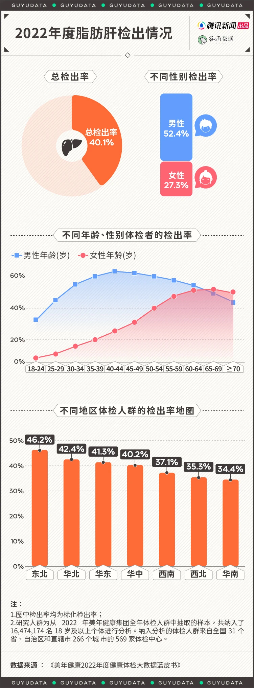
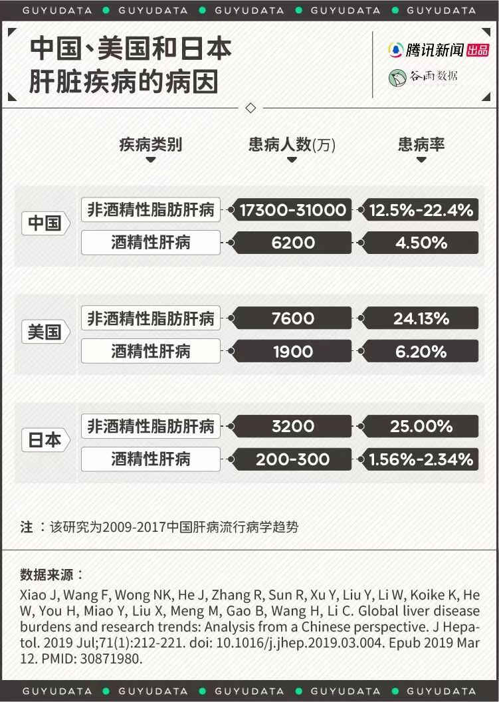
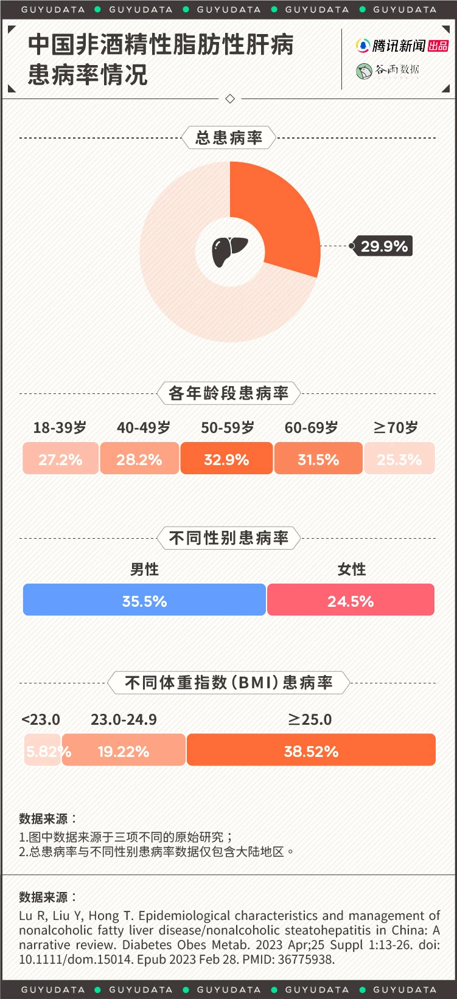
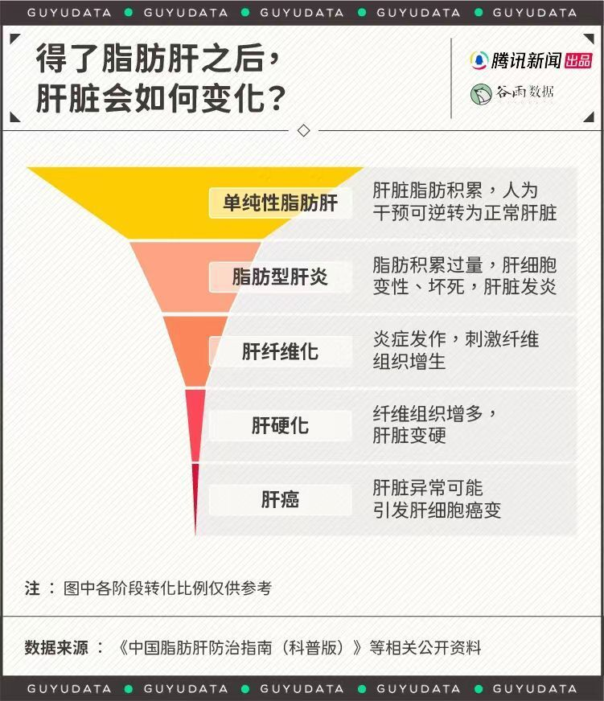
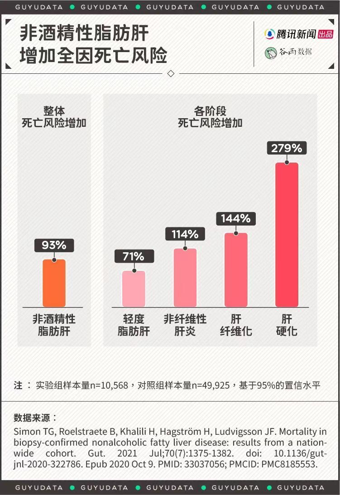

# 中国第一肝脏大病，为什么不是乙肝而是它

“当医生说我有脂肪肝时，我震惊了，我才23岁啊！ ”

在媒体平台上，有数不清的年轻人拿到体检结果后，对着“脂肪肝”三个字陷入沉思。

这几年来，脂肪肝越来越频繁地出现在人们的视野中。《中国脂肪肝防治指南（科普版）》指出，脂肪肝已经取代病毒性肝炎，成为中国居民第一大肝脏疾病。

根据美年健康数据显示，2022年度脂肪肝检出率已经达到了40.1%，多发于中年男性与老年女性，且超过半数的男性体检都查出了这种疾病，比例远高于女性。从地区检出率来看，东中部明显高于西部，东北检出率为46.2%。

“我不喝酒，怎么会得脂肪肝”

脂肪肝是“酒鬼常见病”，但不喝酒的人也会得脂肪肝。

肝脏是人体脂肪代谢的“中心枢纽”。当肝脏出现代谢异常时，肝细胞中的脂肪堆积，超过一定限度就会形成脂肪肝。这是一种常见的肝脏病理改变。

一般来说，脂肪肝分为两大类——酒精性脂肪肝病（ALD）和非酒精性脂肪肝病（NAFLD）。

前者顾名思义，由长期大量饮酒导致。当肝脏为了分解酒精而“加班”，没有余力去处理应该分解的脂肪，就会导致脂肪堆积。而后者的成因则更为复杂，肥胖、营养不良、药物中毒等，都有可能诱发非酒精性脂肪肝。

据中国酒业协会统计，中国有4.5亿饮酒消费者，其中26%的人存在过量饮酒行为——即男性日均纯酒精摄入量超过30克，女性超过20g。

世卫组织发布《2018全球酒精与健康报告》显示，北京302医院每年有超过4万名肝病患者就诊，2002-2013年中酒精性肝病的比例翻了一倍多，其中约98%为男性。中国有6%的男性和1%的女性居民死于酒精相关疾病，酒精性肝病流行率正以惊人的速度上升。

一项针对2009-2017年中国肝病流行病学趋势的研究显示，无论是哪种脂肪肝，中国的患病率都已经与美国持平，在酒精性脂肪肝这块儿，已经远远赶超日本。

但要说到普遍性，在非酒精性脂肪肝的庞大患病人数面前，酒精性脂肪肝还是得败下阵来。

非酒精性脂肪性肝是全球最常见的肝病，全球患病率约为25%。中国是亚洲最高发的国家，且患病率增长较快，达到了西方国家的两倍多。

2009到2017年，中国非酒精性脂肪肝的患病率还在12.5%~22.4%，而另一项研究中，2015-2018年，这一数字就已经涨到了32.3%。

与喝酒无关的脂肪肝，正在困扰着近三分之一的中国人。

“胖人很危险，瘦人很安全”

什么样的人更容易患非酒精性脂肪肝？

根据北京大学第三医院团队整理的数据来看，非酒精性脂肪肝的患病率随着年龄的增长而增加，在50至59岁年龄组达到峰值；男性的患病率达到35.5%，远高于女性的24.5%；还有数据显示，绝经后妇女的患病率是绝经前妇女的两倍，同时也高于同龄男性。

与大众认知一致的是，胖人更容易得脂肪肝。非酒精性脂肪肝患病率会随着体重指数（BMI）的增加，在BMI超过25的人群中，患病率高达38.52%；另一项研究数据显示，在BMI超过28的人群中，这一数字达到了惊人的66.2%。

**四肢纤细、腰腹突出的“中心性肥胖”也是脂肪肝的重灾区。**

根据中国疾控中心的标准，一般男性腰围超过90厘米，女性腰围超过85厘米就可以定义为中心性肥胖。这种隐形的肥胖反映了内脏脂肪堆积的程度，是脂肪肝的主要危险因素之一。

**胖的确会加剧脂肪肝的风险，但瘦也并不是绝对安全的“金钟罩”。**

根据《柳叶刀》子刊2020年的一项Meta分析，在非酒精性脂肪肝患者中人群中，19.2%为瘦人（亚洲地区BMI＜23，亚洲以外地区BMI＜25），40.8%为非肥胖者（亚洲地区BMI＜27.5，亚洲以外地区BMI＜29.9）。在中国大陆地区，44.3%的患者都是非肥胖的。而普通人群中，瘦和非肥胖人群的非酒精性脂肪肝患病率分别为5.1%和12.1%。

**可能会让很多人大跌眼镜的是，有些脂肪肝正是“瘦”出来的。**

不久前，福建一名25岁女生通过严格控制饮食在半年成功减重20公斤，结果却查出了重度脂肪肝。

像这样因为减肥而患上脂肪肝的案例并不罕见。

长期饥饿的状态下，人体就会将体内贮存的脂肪运输至肝脏转化为葡萄糖，但因为缺少必要的酶类、维生素等物质，肝代谢能力下降，多余的脂肪组织就会在肝脏中沉积。

同时，营养不良还会导致蛋白质不足，无法及时将脂肪运转至其他部位，于是肝脏只能“雪上加霜”。

“常见小病而已，不用担心”

最开始的单纯性脂肪肝并不会对身体造成太大影响，绝大多数患者都没有任何症状。正是因为脂肪肝的“不打扰”，许多人秉承着“感受不到就是不存在”的态度，选择对这一问题置之不理。

脂肪肝初期是可逆的，只要调节生活方式，就能够甩掉这些多余的脂肪。但如果任由其加重，可能就会出现皮肤瘙痒、食欲减退、恶心呕吐等症状。

当脂肪继续积累，造成肝细胞坏死，就会进一步演变为肝炎、肝纤维化，甚至导致肝硬化和肝癌。一旦发展为肝硬化，肝脏就几乎不能再逆转为正常状态了。

**根据多项研究数据来看，无论是胖人还是瘦人，脂肪肝发展为脂肪性肝炎的概率，都超过了40%。**

另外，脂肪肝的癌变可能与严重程度并不是成正比的。即使是轻度脂肪肝，也存在着直接癌变的可能。

除了对肝脏本身的危害，脂肪肝还会影响其他器官，增加其他疾病的发病风险。

根据一项中国一项为期4.6年的研究来看，非酒精性脂肪肝会明显增加糖尿病、慢性肾炎和心血管疾病的发病率。

另一项研究显示，55.5%的非酒精性脂肪肝患者同时患有颈动脉硬化，47.1%的患者同时患有高血压，冠心病的并发比例也达到了40.9%。

2019年《生物医学科学》发表的一项研究也证明，非酒精性脂肪肝的严重程度与尿石症风险有关。

更为危险的是，脂肪肝还会加重全因死亡风险。

瑞典一项涉及六万人的全国性研究显示，对患有脂肪肝的人来说，整体死亡风险增加了93%。即使只患有轻度脂肪肝，对比健康人群来说，其死亡风险也增加了71%。

虽然这项研究是观察性研究，只显示脂肪肝与死亡风险之间的关联，并没有表明因果关系，但这样强的关联性还是足以为我们敲响警钟。

脂肪肝就好像是冰山，海平面之上的外显症状可能并不骇人，但藏匿于暗处的危险却隐秘而庞大。

所以，只要“脂肪肝”三个字出现在体检报告上，无论轻度还是重度，都同样值得警惕。

“年纪轻轻，脂肪肝能多可怕？”

脂肪肝越来越普遍，也越来越“年轻”。

在过去10年里，中国年轻群体的非酒精性脂肪肝发病率已经逐渐接近老年群体，办公室里的打工人成为了脂肪肝的经常光顾的对象。目前，中青年人脂肪肝的检出率可达到20%以上。

同时，儿童脂肪肝的流行性也并不乐观。

目前儿童脂肪肝在普通儿童中的发病率高达8%-12%，其中70%左右是肥胖儿童。有调查显示，在中国，12-17岁肥胖青少年中，45%患儿患有脂肪肝。

不健康生活方式是脂肪肝年轻化最重要的原因。高脂肪高热量的饮食结构、久坐不运动的日常习惯，都成为了脂肪肝滋长的温床。

不少人认为，年轻的时候得脂肪肝更好。不仅恢复能力强，还能给以后几十年预警。但最近首都医科大学附属北京世纪坛医院一项研究表明，
**脂肪肝患病年龄越小，日后患癌的风险就越高。**

经过10多年的随访，研究人员发现，小于45岁时就患上非酒精性脂肪肝的人，其患癌风险远远高于那些55-64岁才患病的人，前者达到了后者的四倍。

而相比于非脂肪肝患者，年轻脂肪肝患者的患癌风险也有大幅增加。如果非酒精性脂肪肝患者的年龄小于45岁，其整体患癌风险要比非患者增加52%。其中肝癌的患病风险增加最多，达到了166%，而消化系统癌症、肺癌、结直肠癌的患病风险也是非脂肪肝患者的两倍多。

**确诊脂肪肝时年龄小于45岁的参与者，大约有17.83%的癌症风险可归因于脂肪肝；如果不接受干预和治疗，随后的癌症风险会更高。**

研究人员认为，非酒精性脂肪肝患者在生命早期可能会出现代谢紊乱，并伴有持续的肝损伤，这或许是导致患癌风险增加的原因之一。

瑞典另一项研究则发现，患有非酒精性脂肪肝的年轻群体总体死亡风险也更高，全因死亡风险较之非患者增加了488%，癌症死亡风险更是达到了非患者的15.6倍。

年轻是逆转脂肪肝的有力武器，却也更容易被脂肪肝影响。为了更长远的健康考虑，最好的选择仍然是防患于未然，从最开始就杜绝脂肪肝的可能。

得了脂肪肝，我该怎么办？

如果真的确诊了脂肪肝，也无需太焦虑。

虽然脂肪肝目前还没有针对性的药物，但通过生活方式干预，就能达到非常明显的好转。

对于肥胖人群来说，减重就是最有效的干预手段。《胃肠病学》杂志上一项为期52周的研究显示，若体重减轻5%以上，58%的脂肪肝患者症状得到减轻；若体重减轻10%以上，脂肪肝缓解率达到90%，纤维化逆转率达45%。

如果是饮酒人群，那方法就俩字：戒酒。

而日常的饮食干预与保持运动强度对所有患病人群都非常必要。近日《自然》子刊总结了成人脂肪肝患者健康生活方式干预的最新策略，包括遵循地中海饮食结构、减少在外就餐频率、避免食用加工肉类、适量饮用咖啡等。

当然，最重要的还是及时就医。除了超声检测外，也要到消化内科，听听专业医生的建议。毕竟互联网上的千言万语，也抵不过医生面对面的那一句“你得当回事儿啊”。

作者｜夏洛克 设计丨镝数卢瑞丰 编辑丨赤耳 出品丨腾讯新闻 谷雨工作室

腾讯新闻出品内容，未经授权，不得复制和转载，否则将追究法律责任。

