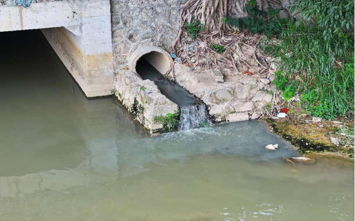
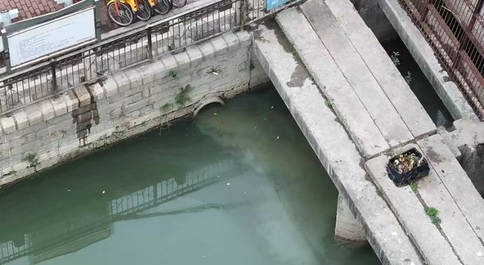
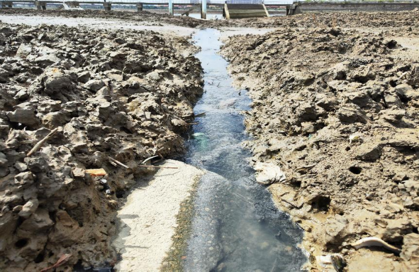

# 中央环保督察：福建龙岩、泉州城区生活污水处理不到位，直排现象多发

12月15日，据生态环境部微信公众号12月15日消息，中央生态环境保护督察集中通报5个典型案例。其中，2023年12月，中央第一生态环境保护督察组督察福建省发现，龙岩、泉州城市环境基础设施短板问题突出，生活污水收集处理不到位，直排等现象多发。

典型案例通报称，福建省一些城市环境基础设施短板多，其中龙岩和泉州城区污水处理提质增效工作推进不力，直排、漏排和溢流现象依然存在，城市内河仍有黑臭，问题较为突出。

主要问题：一是污水处理提质增效工作推进不力，管网排查工作比较滞后。2019年4月，国家有关部门印发《城镇污水处理提质增效三年行动方案(2019—2021年)》(以下简称《三年行动方案》)要求，全面排查污水管网等设施功能状况和错接混接等基本情况，实施管网改造、更新和破损修复等工程。2022年3月，国家有关部门印发《深入打好城市黑臭水体治理攻坚战实施方案》(以下简称《实施方案》)要求，加快老旧污水管网改造和破损修复。福建省制定细化方案要求于2022年底前完成城区市政管网深度排查和建档工作。督察发现，龙岩市污水管网建设改造工作不到位，老旧城区和40个城中村合计14.9平方公里区域雨污不分，占建成区总面积比例达20%以上，雨季大量污水下江入河；江山名筑、印象天悦等小区管网混错接问题突出，龙物小区等三个小区污水一直未接入管网，长期直排。

督察还发现，泉州市有关部门未认真组织开展污水管网排查工作，2020年和2021年合计仅排查中心城区管网3.5公里，直到2023年初才启动全面排查工作，致使管网改造和修复工作滞后，目前完成管网混错接修复、结构性缺陷修复和功能性缺陷修复的点位，仅分别占排查出的问题点位的0.8%、13.2%和24.1%，污水漏排渗排问题严重。

二是污水处理能力不足，污水收集率偏低。龙岩市中心城区的铁山污水处理厂早在2019年就已满负荷运行，且收集区域内污水产生量不断增加，但相关部门推动污水处理厂扩建工作进展缓慢，直到2023年6月才开工建设。督察发现，大量生活污水通过铁山污水处理厂进水总管的溢流口直排龙津河，2023年1—10月溢流量达220万吨，监测结果显示，化学需氧量、氨氮和总磷浓度分别为75毫克/升、17.6毫克/升和2.1毫克/升，分别超地表水环境质量Ⅲ类标准2.8倍、16.6倍和9.5倍。

 _2023年10月20日，督察组暗查发现，铁山污水处理厂溢流口溢流生活污水。 本文图均为 生态环境部微信公众号 图_

《三年行动方案》和《实施方案》分别要求，到2021年城市生活污水集中收集效能显著提高，到2025年城市生活污水集中收集率力争达到70%以上，福建省细化方案明确了各市的阶段性目标。督察发现，泉州市推动污水集中收集处理工作进展缓慢，阶段性目标任务没有完成，2021年泉州市集中收集率应达到58.5%，实际仅为45.1%；2022年泉州市集中收集率目标为60%，实际仅为42.8%。

三是污水直排问题突出，部分水体存在黑臭现象。2022年龙岩市上报城区无黑臭水体，但督察发现，龙岩市长期将漳龙铁路雨水沟（石埠合流沟渠）作为截污沟，收集红炭山、红梅等多个居民区生活污水，形成长约2公里的黑臭沟渠，监测结果显示，水体氨氮浓度高达43.8毫克/升，为重度黑臭。龙津河及其部分支流两岸分布多个生活污水直排口和雨污混排口，对龙门溪龙岩大桥桥下排口、龙门溪双洋农贸批发市场排口等采样，监测结果显示，化学需氧量、氨氮、总磷浓度最高分别达326毫克/升、44.4毫克/升和8.2毫克/升，分别超地表水环境质量Ⅲ类标准15倍、43倍和40倍。

_2023年10月18日，督察组暗查发现，龙岩大桥下排口直排污水进入龙门溪。_

泉州市鲤城区和丰泽区大量生活污水通过550多个排口和一些管道破损点直排漏排进入中心城区的70条内河，督察组现场检查发现，笋浯溪江滨北路临漳水闸桥处、田淮渠宏源商务酒店边均有污水直排入河。鲤城区和丰泽区在晋江沿岸17条入江河流中有11条水质为劣Ⅴ类，另有部分生活污水通过穿堤排口排入晋江，导致晋江入海的蟳埔国考断面水质不能稳定达标，个别月份甚至下降为Ⅴ类，在美山路、南威软件园等附近的穿堤排口均发现污水直排晋江。2023年国家有关部门在泉州市鲤城区和丰泽区监督检查，共发现9条内河存在局部黑臭情况。2023年以来，泉州市着力推动生活污水收集处理工作，污水直排和水体黑臭问题有所缓解。

_2023年12月7日，督察组现场督察发现，泉州市生活污水直排城市内河田淮渠。_

_2023年12月7日，督察组现场督察发现，泉州市生活污水通过美山路附近的穿堤排口直排晋江。_

针对上述情况原因，督察组认为，龙岩、泉州市和地方有关部门对城市环境基础设施建设重视不够、统筹谋划不足，城镇污水处理提质增效工作启动滞后、推进缓慢，污水直排污染环境、水体黑臭问题仍较突出。

督察组将进一步调查核实有关情况，并按要求做好后续督察工作。

