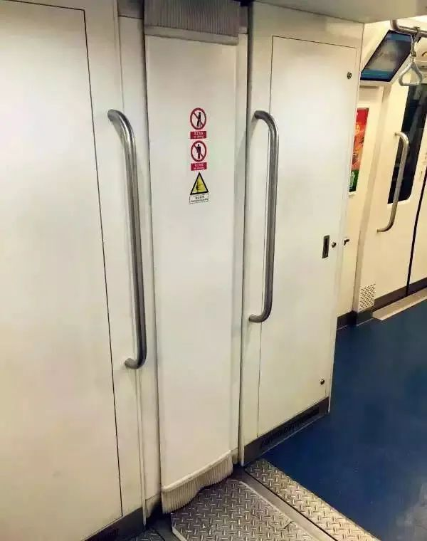

# 乘地铁为什么不建议站在车厢连接处

搭乘地铁，一些乘客喜欢移步至两节车厢连接处，但这样并不安全。车厢连接处有一个“高大上”的学名： **贯通道。**

贯通道是连接两节车厢的重要部分，能够起到安全防护作用，为乘客提供一个安全可靠的通道，同时起到隔声、防尘、防雨的作用。

列车行驶过程中，车厢之间的运动是相对的，这就导致连接处晃动较大， **乘客很容易站不稳或摔倒。**

连接处一般都没有供乘客抓握的拉环，只有扶手，那么在离心力的作用下，站在这里的乘客在列车进入弯道或发生紧急刹车时很难掌握重心。另外，车厢连接处都有折叠风挡，起到转弯、缓冲的作用。列车转弯或上下坡时，挡板会发生挤压变形。原本拉伸的地方随时可能压缩，如果孩子在风挡上玩耍或者乘客的手不小心放在上面，
**都容易被夹伤。**

因此， **请勿在贯通道处长时间停留、勿在此处放置行李物品、勿倚靠侧板以免被夹伤。如需片刻停留，请站稳扶好。**

如不慎将物品掉落在贯通道缝隙内，要牢记车厢位置， **及时告知工作人员，切莫用手或其他物品自行勾取，** 避免造成人身伤害。

（来源：央视网）

