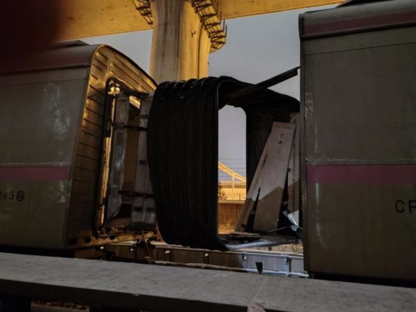
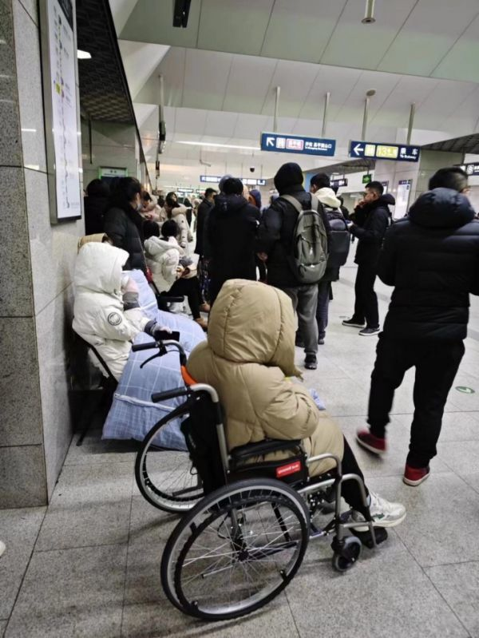

# 北京地铁昌平线雪夜事故

**经济观察网 记者 陈奇杰 任晓宁** 12月14日晚21点26分，北京市交通委官方微博“北京交通”发布通告：18:57，地铁昌平线西二旗站-
生命科学园站上行区段一列车车厢脱离，迫停区间。事故发生后，应急、消防、卫健、交通等救援力量立即响应，到达现场，迅速开展救援。目前已发现30余人受伤，无人员死亡，伤员正陆续送往医院治疗，现场正在积极处置。事故原因正在调查中。

当日晚间，记者在现场看到，西二旗地铁站附近已实行交通管制。大量警车、工程抢险车和救护车抵达。现场有广播称，昌平线暂停运营，西二旗站暂停运营。

21时56分，地铁站工作人员告诉记者，目前仍有乘客有待从车厢被救出。

 _（地铁西二旗站外 记者陈奇杰/摄）_

多位乘客对记者称，他们在事故中不同程度受伤。由于地铁故障后车厢停电近一小时，有人感觉憋气，选择将车窗敲碎；八点半左右，救援人员到来引导乘客下车，车上乘客沿着铁轨向西二旗地铁站方向步行出站。

当日晚间，北京地铁官方微博发布多条通报消息称，地铁昌平线西二旗站已采取封闭措施。 北京地铁官微称，昌平线为车辆故障，工作人员正在组织紧急救援和疏散。

有事故列车乘客对经济观察网描述，晚上七点前，其所在的列车车厢停了大概两三分钟，随后他自己感觉列车被追尾。这位乘客称，“我们那节车厢跟最后那一节车厢也有点分离了，但是分离的车厢是后面那辆列车的一段车厢。”不过，官方通报尚未提到追尾事件。

_（接近分离的地铁车厢 受访者供图）_

**被困与疏散**

12月14日，是北京暴雪黄色预警的第二天，雪在当日午后由南向北持续增大。气象台发布黄色预警时称，昌平、门头沟、房山等个别地区可达大暴雪。

坐上从西二旗到生命科学园的地铁时，娇娇怎么也没有想到自己乘坐的地铁会发生故障。她形容事发当时的状态，“瞬间双脚离地，膝盖痛到不敢动，车厢很闷，车上的男士真的很棒，稳住了慌乱的大家。”

另一位事故列车的乘客告诉经济观察网，地铁故障后列车还停电近一小时，座位旁边的玻璃围挡还被震碎了。车厢内有很多乘客出现不同程度受伤，“有人骨折，有人眼睛受伤，也有人头部受伤”。

还有一位事故列车乘客对经济观察网记者表示，事故发生时，他感觉到了明显的冲击力，车厢里有人摔倒。随后，整个车厢陷入停电状态。大概因为距离事发车厢较远，他们车厢没有人受伤，事发后大家都在刷手机，希望得到新的消息。

因为停电，整个车厢空气不流通，有年长者在一段时间后开始表示自己喘不过来气。乘客们将车窗敲碎，这才让车厢内的空气流通。这位老年乘客所在的车厢在大约八点半左右等到了救援人员到来。

_（分离的车厢 受访者供图）_

_（事故列车乘客被疏散到地铁车厢外 受访者供图）_

西二旗站现场，另一位乘客告诉记者，他所在车厢虽并非事故车厢，但感受到的冲击比较大，这位乘客的腰部也被撞伤，车厢多处玻璃碎裂，有女孩子手脚被割伤。

记者在西二旗地铁站进站口看到，已经有伤员被抬上救护车。西二旗站地铁工作人员告诉记者，有不少受伤乘客出去。还有急救人员推了一辆小车进去救人。

 _（一位坐在轮椅上的年轻人在地铁里撞了头，目前正在等待救援 记者陈奇杰/摄）_

**罕见的地铁事故**

北京地铁昌平线始建于2009年，建设时的规划是一条郊区地铁线路。但随着后来西二旗周边成为国内互联网公司的聚集地，这条线路常年处于较高人流量状态。

据悉，昌平线为SFM13型列车的6B编组，属于DC750V上触式第三轨供电，定员1468人，运营速度为100km/h。

同济大学铁道与城市轨道交通研究院教授孙章告诉记者，从视频看，似乎是两节车廂之间联接处断开了，他结合北京地铁公布的消息初步分析说，接触轨（供电轨）断电，以及车辆故障都有可能导致问题的发生，也可能是突然失电导致快速运行中的列车各节车厢之间发生挤压。再需要有更多的消息和调查取证。

孙章说，车辆在处于高速运行当中时，第三轨断电导致列车失去动力，在这种情况下，失去动力的列车将以很高速度作惯性运动，质量大的车厢与质量小的车厢之间就会产生较大的拉力或挤压力，当这种拉力超过连接处的耐受力时，就可能会产生断裂。

孙章提到，断电故障是偶然发生的事，概率是极小的，因为轨道交通供电具有类似并联电路的双保险机制，如果有一条供电线路发生故障，就有第二条线路自动切换继续供电。这次他猜测，如果原因是断电，很可能是双电路同时发生问题，才会发生列车失去动力的情况。

他指出，在城市轨道交通中出现电路故障时，如果运行速度慢，车辆会缓慢停下来。昌平线是城郊线路，速度比市区内地铁高，而且出事故的地点处在两个车站之间，此时列车运行速度接近最高运营速度，如果突然失电，列车的惯性力大，各节车厢之间的拉力或挤压力也大，因此可能导致车厢联接处断裂。

一位不愿具名的交通部下属单位城市轨道交通专家告诉记者，他觉得很意外，之前没有听过类似地铁车厢断裂事件。一般而言，地铁是需要定期进行安全监测、评估的。

从过往资料看，2021年1月6日，地铁昌平线因信号设备发生问题，导致部分列车晚点。当日晚上8时，北京地铁官微发布消息称地铁昌平线受巩华城至沙河上行区间信号设备故障影响，造成部分列车晚点。有乘客表示当日称作地铁昌平线时多次发生紧急制动，他所乘坐的车辆暂时停车最长时间超过了二十分钟。

2019年，《铁道机车车辆》杂志刊发了一篇名为《北京地铁昌平线制动系统总风欠压故障分析与探讨》，文中针对北京地铁昌平线发生的总风欠压导致车辆紧急制动的故障,进行详细的故障原因分析。

（经济观察网记者陈月芹、钱玉娟、石震方对本文亦有贡献）

