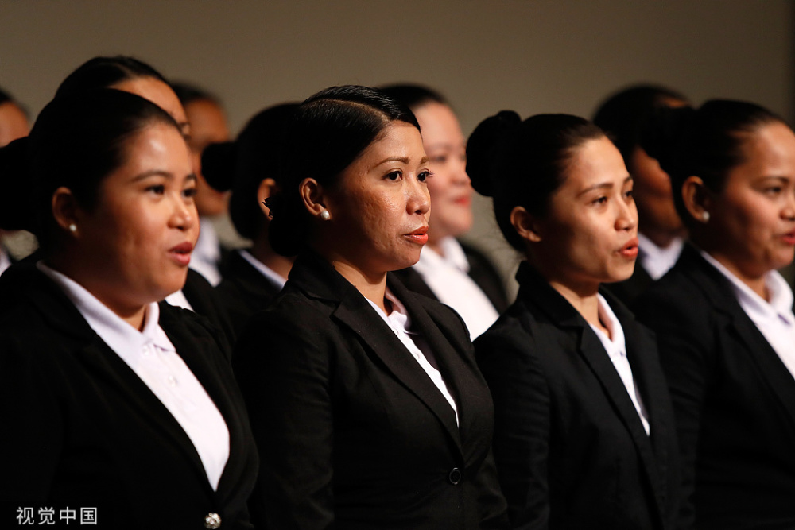

# 印尼未来五年将向日本派遣10万名劳工，印尼官员：能解决两国的社会问题

（观察者网讯）为解决各自面临的劳动力问题，日本和印度尼西亚正展开合作。

香港《南华早报》12月15日报道，印尼人力资源部秘书长安瓦尔预计，印尼在未来5年将向日本派遣10万名劳工，并将推出专门的申请系统，帮助印尼求职者在日本找到与自己技能相匹配的工作。

据日本国际协力机构（JICA）2022年的一份报告，到2040年，日本将需要引进约670万名外国劳工，才能实现其预期的经济增长率。

近年来，日本推出一些列政策吸引外国工人，缓解因人口老龄化导致的劳动力短缺问题。例如在2019年4月，日本创设了一种名为“特定技能劳动者（SSW）”的新在留资格，旨在接收能直接走上工作岗位的外籍人才在日本的特定行业领域工作。创设更早的“技能实习生培训项目（TITP）”也吸引了不少寻求进入日本劳动力市场的外国年轻人。

对印尼来说，该国也渴望从其“人口红利”中获益。

《日经亚洲评论》称，印度尼西亚拥有超过2.7亿人口，是世界第四大人口国，长期以来希望将工人派往中东、中国香港和韩国等地，以增加外汇收入并抑制国内失业率。

在11月28日印尼人力资源部和日本国际协力机构举办的首届联合人力资源论坛上，印尼人力资源部长伊达表示，印尼正在进入人口红利期，“我们面临的挑战是如何为广大人群，尤其是15至64岁的工作年龄段人群提供就业机会，防止失业率上升。”

日本驻印度尼西亚大使金杉宪治（当时已被任命为驻华大使）在论坛期间表示：“
**通过让印尼的人力资源在日本社会中发挥积极作用，两国的社会问题都可以得到解决。** ”

印尼驻大阪总领事馆负责经济事务的领事多迪对《南华早报》表示，印尼是日本最大的外国劳工来源国之一，“这一趋势很可能会继续下去，并在未来大幅增长。”

日本法务省出入国在留管理厅数据显示，2022年通过TITP和SSW计划进入日本的外国劳工有32.5万人，其中54%来自越南，14.1%来自印度尼西亚，菲律宾占9%。

_2017年3月21日，日本东京，人力派遣公司为新招募的菲律宾工人举办欢迎仪式 图源：视觉中国_

伊达说，日本是“印度尼西亚人，尤其是年轻一代非常感兴趣的目的地”。

来自中爪哇省的卡图尔正在与日本企业签订第二份工作合同，27岁的他一毕业就在日本寻找工作机会，“我认为这比在国内找工作更好”。

卡图尔表示，他在日本的工资扣除每月300万印尼盾（约合人民币1370元）的基本生活费后，还能剩下800万印尼盾（约合人民币3660元）。相比之下，他家乡的最低工资刚超过200万印尼盾（约合人民币915元）。

不过，在日本的工作机会来得并不轻松。《南华早报》称，想在日本工作的印尼劳工需要先支付给培训机构3000万至7000万印尼盾的培训费，以确保他们掌握日语和符合雇主要求的工作技能。

卡图尔就为此花费了3000万印尼盾（约合人民币13700元）以及6个月的培训期。卡图尔还从朋友那里听说过劳工被中介克扣工资的例子，不过他自己没有经历过。

《南华早报》称，截至今年5月，印尼人力资源部已向362家机构发放了向海外派遣劳工的许可证，但自2015年以来，也有248家机构因不当行为被暂停了许可证。

另一方面，印尼约87%的人口信奉伊斯兰教。有印尼学者表示，日本若想吸引外国劳工，还必须创造足够有吸引力的生活条件。卡图尔希望日本的穆斯林设施能更完善，包括清真食品的供应。报道称，这是印尼劳工在日本面临的一个较普遍的问题。

不过日本同志社大学博士、移民问题学者马克西米利安认为，日本政府对外国劳工让步的可能性很小。“岸田文雄首相从2022年春天开始大规模接收外国工人，但他一直在犹豫，没有勾勒出长期接纳外国工人并使其融入社会的广阔愿景。”

马克西米利安认为，历届日本政府的政策是矛盾的，依赖于SSW、TITP 这样的“偏门”，“主要接纳低技能外国工人，并合法地否认他们的存在。”

**本文系观察者网独家稿件，未经授权，不得转载。**

