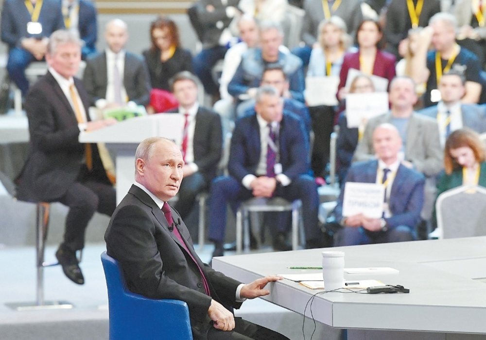

# 回应经济民生关切，介绍俄乌冲突进展，普京记者会回答了67个问题

【环球时报驻俄罗斯特派记者 肖新新 环球时报特约记者
柳直】“目前，俄罗斯的主要任务是巩固国家主权，加强边境安全，确保公民的权利和自由。”俄罗斯总统普京14日在年度大型记者会开始时如是说。俄新社称，整场活动共持续4小时4分钟，普京回答了67个问题，涉及俄乌冲突进展、俄中关系和俄经济发展等话题。普京首次召开年度记者会是在2001年，本次是普京任总统期间出席的第18次年度记者会，也是俄乌冲突爆发后，普京首次出席该活动。上一次普京举行年度记者会是在2021年12月，当时记者会有两种不同的形式：直播连线互动和大型新闻发布会，今年则采取两种形式相结合的方式。俄新社14日援引俄战略发展基金专家委员会主席沙特罗夫的观点报道说，普京就俄乌冲突、特别军事行动等问题表明坚决态度，再次指出西方国家在造成这一局面中应承担的历史和现实责任。普京关于俄国内社会经济等领域状况的表态，展现了俄总体发展积极态势，向俄社会和外界传递了信心。

**“俄军形势在整条接触线上均有改善”**

“胜利将属于我们”，普京在记者会上谈及俄乌冲突进展时表示，和平将在俄罗斯达成特别军事行动目标之时出现。俄特别军事行动的目标没有改变，即确保乌克兰的中立地位、“去纳粹化”和“去军事化”。“乌克兰不想就其非军事化的问题展开谈判，因此俄罗斯被迫采取军事手段。”普京称，自乌军发动反攻以来，俄军已击毁747辆乌军坦克和2300余辆装甲车。“从本质上讲，俄罗斯人和乌克兰人是一个民族，现在发生的事情是巨大的悲剧，类似于兄弟分道扬镳后发生的内战。”

普京表示，截至13日，俄罗斯已有超过48.6万人和国防部签署了服役合同，目前有24.4万名被动员人员在特别军事行动地区，加上私营军事集团人员，在乌特别军事行动地区共计有61.7万名俄罗斯军人。对于是否会有第二波动员，普京表示尚无必要。

 _俄罗斯总统普京14日在莫斯科举行年度记者会，并进行连线互动。（法新社）_

普京强调，俄罗斯的胜利是“显而易见和不可避免的”，“谦虚地说，俄军在乌特别军事行动区形势几乎在整条接触线上均有改善”。不过普京同时提到，前线的长度接近2000公里，特别军事行动的参与者并不总能得到所有必要的东西，包括无人机，“为了解决这些问题，国家、国防部和工业界正在共同努力，因此出现了各种新的武器系统，包括电子战系统”。关于乌克兰的“反攻”，普京称乌军在任何方向都没有成果，基辅正在把自己的人民赶尽杀绝，“连乌克兰军人自己都说，这是一条不归路”。

谈及乌克兰总统泽连斯基近期访问西方多国，普京表示，他们的目的是“要到额外资金”，以满足武器装备需求等，为此乌方试图展示反攻“成绩”。乌克兰正在接收大量武器，但这些武器很快就会用尽，俄军在不断摧毁这些武器。

**普京让中国记者先问**

普京表示，俄罗斯同中国的合作水平“达到空前高度”。今年的贸易额将超过2000亿美元，与去年相比增加30%。同时，俄中各领域合作都在发展，其中包括基础设施和高科技领域。普京表示，俄中关系是维护世界稳定的重要保障，“俄罗斯和中国不结盟，我们的友谊不针对第三方国家”。普京指出，习近平主席今年3月的访问为推动两国关系发展注入强大动力，当时双方就8个重点方向发展两国关系达成共识。对于有记者问及中国汽车在俄“扩张”问题，普京表示，这种现象不是俄罗斯特有的，中国制造商也在积极开拓其他市场，“与此同时，他们的汽车质量在不断提升”。

有俄媒注意到，记者会上出现了一个小插曲，普京将优先提问权给了中国媒体。据俄《论据与事实》周报网站报道，当负责选择提问人的俄总统新闻秘书佩斯科夫决定让美国《纽约时报》记者提问时，意外遭普京打断：“不，先是新华社（提问），然后是《纽约时报》。”

就俄罗斯与美国的关系，普京表示，俄罗斯准备改善和发展与美国的关系，但目前尚不具备条件，“（美国的）帝国主义政策阻碍了两国关系的发展”。普京认为，美国必须开始尊重其他国家，寻求折中办法而非实施制裁，那时才能开始改善关系。普京表示，俄罗斯不拒绝使用美元，但是开始控制美元与欧元的结算问题。截至今年9月，卢布在俄罗斯对外贸易中所占份额增至40%，人民币增至33%，美元和欧元降至24%。

普京表示，与欧盟的关系正常化不仅仅取决于俄方，“不是我们破坏了正常关系，而是他们试图排挤我们”。普京特别提及，他与法国总统马克龙有过良好的工作关系，“我们愿意继续与法国方面接触，但从某个时候起，法国总统本人中止了这种关系。如果（法方）有兴趣，那我们准备好会晤，没有兴趣的话我们也无所谓”。

**“早上能吃10个鸡蛋”**

关于俄罗斯经济情况，普京在记者会上表示，由于社会的高度整合和国家金融体系的稳定，俄顶住了压力。俄罗斯2023年国内生产总值（GDP）预计增长3.5%，摆脱低迷。加工工业预计增长7.5%，失业率首次降至2.9%，年底通货膨胀率可能达7.5%至8%。普京说，俄罗斯金融系统保持稳定，国家债务呈下降走势，俄罗斯国家外债规模已从460亿美元降至320亿美元，固定资产投资增长10%。此外，俄罗斯企业利润已增长24%，居民实际工资预计增长8%。普京表示：“3.5%是一个很好的指标，它意味着我们已经从去年的下跌中恢复过来，我们已经向前迈进了一大步。”

在记者会上，普京为俄罗斯鸡蛋价格上涨表示歉意，他表示，市场对鸡蛋的需求增加，但产量却没有跟上，且进口没有及时开放，这是政府工作的失误。普京表示，他很喜欢吃鸡蛋，“当年我早上一下子就能吃10个”。俄塔社14日称，今年年初以来，俄国内鸡蛋价格上涨了36.54%。据俄卫星通讯社报道，俄农业部13日表示，预计下个月鸡蛋价格将会稳定。

