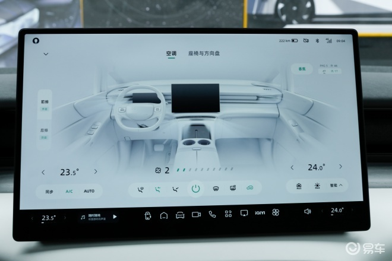

# 小鹏X9将于2024年1月1日上市 预售38.8万元起

**易车讯** 我们从小鹏汽车官方获悉，小鹏汽车首款MPV小鹏X9将于2024年1月1日正式上市。新车已经在今年广州车展开启预售，预售价38.80万元起。

小鹏X9将首搭XOS天玑智能座舱系统，并且还是目前全球唯一标配后轮转向的MPV。

外观方面，小鹏X9前脸保留了家族化设计风格，贯穿式灯带具备非常高的辨识度。灯带下方的大灯造型看上去非常犀利，配合下包围的网格状格栅，使得前脸看起来非常年轻运动。外后视镜位于车门上，下方为贯穿式的车身腰线从车头一直延伸至车尾，体现出不俗的力量感。

此外，新车配备了大尺寸的低风阻轮毂，兼顾了美观并可以有效的降低能耗，提高续航里程。车身尺寸方面，新车长宽高为5293/1988/1785（mm），轴距为3160mm。

来到尾部，小鹏X9后车窗有着较大的倾斜角度，让其看上去与众不同，或许别致的造型正是何小鹏口中打开“年轻态”MPV市场的关键。此外，新车还配备了贯穿设计的尾灯组，正好与前脸灯组相呼应。需要特别注意的是，尾部的英文标识可与贯穿式尾灯一同点亮，科技感十足。

内饰方面，小鹏X9的内饰采用了与小鹏G6相同的最新家族化设计风格，悬浮式中控屏占据C位，同时还配备嵌入式设计的液晶仪表、双辐式方向盘、无线充电板及两个前排杯架。

小鹏X9采用了三排座椅布局，套内面积达到7.7平米。此外，新车中央通道宽度达到180mm，虽然采用了动感的溜背设计，但新车第三排依然有宽裕的头部空间，第三排进出高度大大1315mm。同时，第三排座椅支持一键电动魔术收纳，进一步扩充内部空间。

而小鹏X9第二排配备了独立座椅，并在车顶处配备了大尺寸娱乐屏和车载冰箱，大幅提升了后排乘客的舒适性。同时，新车在第二排座椅还配备了小桌板功能。此外，新车在车顶配有环形灯带，相信在夜间点亮后拥有不错的视觉效果，氛围感十足。

动力方面，新车配备了前后双电机，最大功率分别为前235kW后135kW。电池容量方面，小鹏X9配备84.5kWh与101.5kWh电池组，CLTC纯电续航里程分别为610km、640km与702km。

