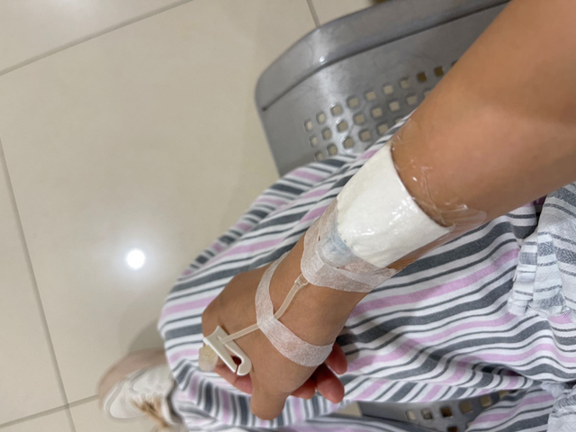
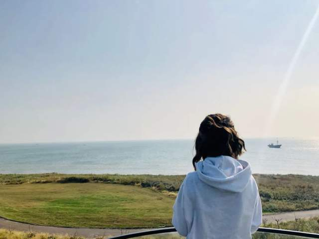

# 当年轻人带癌上班：领导的每一句关照都像在暗示，未来我升职希望渺茫

四年前被诊断出直肠癌的周璐是一名会计师。工作多年，她的业务能力受到公司上下认可，还被交托了大量事务性工作。两年治疗期结束后，她赶紧回到公司，却发现自己骤然清闲下来。领导很客气，只是每一句对她身体的关照都像在暗示，她未来升职的希望渺茫。

近年来，癌症逐渐年轻化。2020年，一项发表于《临床肿瘤杂志》的论文明确指出了这一趋势。以15-39岁年轻人为研究对象，结果显示，在2007-2016年这十年间，各年龄段年轻人的癌症发病率都在不断上升。

很多年轻人不得不“带癌上班”。复杂而残酷的现实是，他们背负着癌症治疗费用这块巨石，很多患者上有老下有小，对自己和对家庭的责任缠绕在一起，让他们不敢停。

他们无法像老年患者那样缩小自己的世界，一定程度上与社会断开联结。他们必须在职场挤出一方生存的空间。

职场上，一个罹患癌症的年轻人可能遭受到哪些阻碍和隐形歧视？生活中，他们的人际联结又会发生怎样的变化？他们该如何消解漫长的孤独和耻感？

更本质地，癌细胞如同一枚潜藏在身体里的炸弹，改变了生命的刻度，也改变了一个人看待世界的眼光。

《健闻咨询》和三位年轻的癌症患者聊了聊。以下是她们的故事：

"迟早要屈服于现实”

和同龄人一样，陈晨经历了一个艰难的求职期。癌症患者的身份，给她更添了许多不易。

去年夏天，她从北京一所重点大学毕业。她的不少同学已经带着一份堆满了大公司名字的简历，搬进了金融机构和互联网大厂的格子间。

陈晨没有这块敲门砖。18岁时，她确诊乳腺癌，做了右乳全切手术。大学几年，她的时间被上学、看病和做家教切割。她也跟风去大厂实习过，没做多久就辞职了。原因很简单，大厂的实习工资一天一百，而做家教一个小时就有一百四。同学劝她，实习是为了积累经历。治病费用压在身上，她想，经历算什么，我要的是钱。

但她也做不到像很多同龄人那样“卷”——身体吃不消。不加班，是她找工作时最看重的一点。毕业后，她在一家颇有名气的咨询公司工作过。加班是日常，区别只在于加到几点。偶尔因为身体原因请假，隔天她一定会被经理叫过去说一顿，绩效也会被打低分。

连续多日加班到凌晨一点后，又是一个半夜，陈晨顶着经理的怒视走出公司，很快提出离职。现在她在一家日企工作，日企的文化更有人情味，哪怕只是表面上的。月薪几千块，她挺满意，找到工作就行，有钱就行。

毕竟，对于罹患癌症的人来说，当前的求职季堪称“地狱级”难度。癌症降临的那刻，职场上很多扇门倏地关上。

首先确定无疑的是，“铁饭碗”端不上了。《公务员录用体检标准》第八条明文规定，恶性肿瘤不合格。而对大多数企业而言，对癌症的歧视已变成一种默认的规则，招聘方和应聘者对此皆心知肚明。

对正常人来说只是走个过场的入职体检，却是一道癌症患者难以逾越的障碍。陈晨透露，走投无路之下，一些患者到网上购买伪造的体检报告，也有人奔向组织体检代检的机构。

近年来，被癌症击中的年轻人越来越多。一项发表于《临床肿瘤杂志》的论文指出，癌症正呈现年轻化趋势。研究结果显示，2007年至2016年，40岁以下各年龄段的癌症发病率均持续上升。

疾病带来的痛苦不分年龄段。但和老年患者不同的是，年轻人即使罹患癌症也无法淡出社会生活。他们有着更漫长的人生，有着更为复杂和现实的压力，必须在职场挤出缝隙。

工作资历不同的人，遇到的困难也不同。陈晨要撬开紧闭的职场大门。更多患者则是在工作期间查出癌症。他们中的一些人积累了多年工作经验，是团队负责人，是高管。治疗结束后重回公司，他们要面对的是职场环境在生病前后的巨大落差。

四年前被诊断出直肠癌的周璐是一名会计师。工作多年，她的业务能力受到公司上下认可，还被交托了大量事务性工作。两年治疗期结束后，她赶紧回到公司，却发现自己骤然清闲下来。领导很客气，只是每一句对她身体的关照都像在暗示，她未来升职的希望渺茫。

李漾曾经周密的职业规划也被癌症打乱。她在一家银行总行任HR，确诊乳腺癌前，手下管着一个不小的团队。治疗结束后，她去几家互联网公司面试过，但每次到了最后环节，她都“迈不出这条腿”，因为知道自己有所谓的既往症，很难通过体检。她已经很久没有更新过简历，对大厂生活的想象成为遥远的记忆。

不仅如此，留在原单位的她不得不面对一个变得更加苛刻的上司。从前做惯的工作现在经常被挑刺，“说我这个不够全，那个不够细”。她因此怀疑过自己的能力，后来终于意识到一个残酷的事实：领导知道她没有退路了。

之后的一连串事件印证了她的判断。公司进行架构调整，领导给李漾增加了一大块工作内容，但没给她增派人手。推选后备干部时，她意外落选。去年年底绩效考核的低分又是一次打击。

她记得“图穷匕见”的那刻。一次开会时，她因为身体不适告假提前离开。听同事说，她刚走出去领导便说了一句，“迟早要屈服于现实。”

职场可以残酷到何种程度，没有人比癌症患者更了解。他们有过不甘心，也大多产生过强烈的想要离职的念头。但最终，他们只能劝慰自己接受现状。

不敢不工作

纵使在职场遇到诸多不公平，癌症患者也要紧紧抓住这根稻草。首先也是最重要的原因是，癌症治疗费用这块巨石太重。

曾有亲戚建议陈晨不要工作，好好在家养身体。她觉得好笑又无奈：不工作，她哪来的钱养身体？

面对这块巨石，不是每个患者都有经济条件良好的家庭可以提供支持。陈晨在单亲家庭长大，与母亲相依为命。治疗期间，仅医疗费就花了十五万，母亲将家中存款尽数投进来也只是刚刚够用。此外还有一大笔生活费用。母亲从家乡到北京陪她看病，一个月房租就接近五千。

那两年，陈晨几乎天天打工，甚至化疗期间也会去，“因为真的很缺钱”。

即使工作多年的人，有着稳定的收入和一笔存款，一朝确诊癌症，也会人生瞬间倾覆。

36岁的周璐有时想，人生怎么就到了这一步。得了癌症后，她多了很多不敢，最大的不敢就是不敢不工作。丈夫的收入不高，她的父母也已经退休，靠养老金度日。家中的经济重担，她卸不掉。

她不敢细想生病以来花了多少钱，基本治疗费就有小几十万，更不用提在营养品和营养针上的开销。她也不敢细想之后还要花多少钱。医生说，基于现在的病情，后续她可能还要用到一款靶向药，一个月至少一两万。

她甚至不敢细想自己的年纪。身边同龄人都在努力挣钱，她花钱如流水，用朋友的话说，之前那么拼，挣的钱全交给医院了。与此同时，升职无望，薪水碰到天花板。每每思及此，她压力陡增。

而当一个人有了子女，肩上的担子变得更具象，也就更加不敢停。

周璐原本个性散漫，女儿的出生彻底改变了她。她一下子意识到自己是母亲了，要承担起责任了。这些年，周璐一边工作一边带孩子，还跟朋友一起做了点小生意，每天不超过晚上12点不会睡觉，全年无休，就连坐月子的时候也不例外。

得知自己患上直肠癌的那一刻，周璐“整个人哭都不会哭”，愣在那里。但有时，她看着孩子，觉得生活似乎也没有太大变化。她每天照顾孩子衣食起居，辅导功课，忙碌依旧。所谓孟母三迁，她总想给孩子一个更好的教育环境，那就需要一个位置更好的房子。这个问题不能想，一想就焦虑，她焦虑存款不够，也焦虑房贷供不起，哪有本钱停下来？

周璐加的几个病友群中女性居多，其中很多都是妈妈。她们互相鼓励时最常说的是，“一定要强，自己强了才能保护孩子。”

“正是上有老下有小的年纪，不能颓废。”周璐强调，“都是责任。”

两枚炸弹：复发与耻感

带癌上班如同随身携带炸弹。第一枚是癌症的复发和转移。

治疗结束不等于治愈。前者只表示病灶部位的癌肿已被切除，病情得到缓解和控制，处于相对稳定的状态。临床治愈的标准则高很多，要求患者在治疗后生存超过五年，且没有任何复发迹象。病人即便捱过五年，也不意味着可以高枕无忧。复发和转移如同一柄达摩克利斯之剑，终日悬于癌症患者头顶，令其惶惶。

迄今，周璐已被这枚炸弹砸到过三次。第一次最难熬。手术仅两个月后的一次检查结果显示，肿瘤转移到了肝上，已经长了四颗。得知消息时，周璐几近绝望。她问医生为什么，手术时淋巴结清扫得不是很干净？医生也给不出一个答案。

之后又出现过两次转移。这两年，每次一听到指标不好，她的心就悬起来。确诊四年了，癌反反复复就是断不了根，好像一只打不完、干不尽的怪兽，刚被打走一回，生活好不容易恢复一点平静，它又来了。周璐筋疲力尽。

_图1：周璐在接受治疗。_

还有一枚炸弹是耻感，无声，却一样不容忽视。

住在小城市，周璐觉得自己脸上好像贴了一个“癌”字，别人看她的眼神都变得不一样。熟人见到她总会多问一句，最近身体怎么样，听得她心里难受，“每天都在讲癌癌癌，那个字特别恐怖。”

刚回到单位那段时间，周璐整夜睡不着，经常惊恐发作，脾气变得暴躁，大把大把掉发。她到医院一查才知道，自己患上了焦虑症。

焦虑的重要来源在她身上——她失去了肛门。刚确诊时医生就告诉她，肿瘤的位置离肛门很近，考虑切除肛门。她试过保肛，为此增加了放化疗次数，随之而来的是体重的急速下降，以及服用大量止痛药剂才能勉强缓解的剧烈疼痛。

但肛门最终还是没保住。手术前医生让她自己选，保肛还是保命。当天平的另一端是性命，她只能舍弃肛门。医生将一段可用肠管拉出，缝在腹壁上，从此她的肚脐左边留下了一个永久性的造口，以及一个每天贴在身上的造口袋，用于收集排泄物。

身上多了一个造口，周璐的神经时刻紧绷着。她不敢用力，所以不再搬运重物。她也怕挤压到造口，所以再没穿过紧身的衣服。

更尴尬的是，她的排便变得没有规律，无法控制时间和地点。她可能在开会，可能在作报告，可能在吃东西，同时就在排便。虽然每天次数不是特别多，但也有她处理不好的时候，会漏气或漏味。她觉得自卑和苦闷，但不知能对谁诉说。

也有人主动选择不“隐身”。很多乳腺癌患者会在结疗后做乳房重建，陈晨没有，她找不到这样做的理由。这不是一个能够轻易做出的决定。所有人都劝她：做乳房再造吧，这是为你好，你的生活质量会更高，你也会更有信心。家人这样说，恋人这样说，主治大夫也这样说。

陈晨没有被动摇。身体的残缺在别人眼中可能显得可怕，但她自己不在意。她活着不是给别人看的。

孤独的，隐身的

最伤人的往往不是制度性的歧视，而是来自身边人的不理解。患病后的种种痛苦，健康人很难真正共情。

得病后，李漾只休过三个月的病假。她考虑过辞职养身体，但父母一听就强烈反对，怎么可以不上班，没有社保怎么办。她的父母都在体制内工作，思维传统，在他们眼中，李漾所在的银行总行是稳定、体面的代名词，这么好的单位能留就留。

为了工作的事，她和父母吵过不知多少次。今年年初，又一次激烈的争吵后，父亲让她去精神卫生科看看。她去了，做了全套的心理测评，结果显示一切正常。李漾只能慢慢练习隔绝父母的声音，“他们是控制欲很强的人，没办法。”

令癌症病人更心寒的是家人朋友嫌弃的目光。在封建观念中，一个人罹患癌症，会被认为沾染了晦气，变成了不吉利的象征。

陈晨的姥姥关心她，但自她生病后，姥姥的心中便长了一根刺。她觉得陈晨丢了她的脸，拖了家族的后腿，让她被街坊邻居瞧不起，让她这辈子都没办法再在朋友面前炫耀了。

还有一个她从小认识的好朋友，知道她生病后态度大变，明明在一个地方生活，但“怎么叫都不出来”。多年情谊冷淡下来。她心里明白，现在的人都是向上社交，你病了，人家就觉得你是个没用的人了。

被家人嫌弃，被朋友疏远，陈晨一开始会“揪在里面”，想不开。癌症又不是传染病，她也不是因为做了坏事才生的病，为什么要被这样对待？

后来她逐渐意识到，除非有过类似的经历，否则旁人很难对患癌的苦痛感同身受。今年，她一个朋友的父亲确诊胃癌，朋友一个人忙前忙后，近距离感受到父亲患病时承受的巨大痛苦，后来对她感慨，现在才知道原来她这么不容易，原来抗癌这么艰难。

有时，社会对癌症的歧视还会包裹着一层“为你好”的外衣出现。

大三那年，陈晨拿到了保研资格。辅导员劝她放弃，理由是读研究生的压力大，不适合她。她想反问，不适合读研，那么她就适合996的生活吗？但她不想闹得难看，毕竟大学四年辅导员帮过她不少。最后，她签下了放弃保研的承诺书。

这种“关照”浸润大多数患者的日常生活。病史被别人得知后，他们被同情，被怜悯，与此同时，他们也被隔离出了正常人的生活。

想要被视作正常人，患者首先要调整自我认知。有的病友回去上班后会“玻璃心”，理所当然地觉得自己应当被照顾，李漾不认同这种心态，毕竟公司不会因为关怀个别员工而将业务进度滞后。重回单位后，她怀疑过自己的能力，但看到其他同事能做的事她也都能干，还能干得挺好，她的自信心逐步恢复。

_图2：公司同事表示，会尽量照顾重回单位的李漾。_

重回正常人世界的渴望，使得疾病成为一个秘密。在陈晨的公司，没有人知道她生过病。每月一次的例行开药是个麻烦事，每次请假时她都要绞尽脑汁编理由，想到这个她就头疼。

守住这个秘密，因为“不必”，也因为“无用”。“毕竟，最后都得靠自己爬出来。”陈晨说。

当人生无法被规划

癌症治疗结束后，患者大多需要每半年做一次复查。生命的刻度自此改变。

长期的职业规划不再现实，取而代之的是重重的忧患意识。李漾放弃了跳槽去互联网大厂的打算，但银行也并非朝阳行业。

李漾心里有数，得为自己找好后路。她曾在小红书发布过几条有关治疗的博文，没想到收到了许多点赞。她意识到其中有赚钱的空间。这两年，她考下了三级公共营养师证，学运营，练文案，狂补各种专业知识，现在，她经营着一个主打身心食疗的自媒体账号。

这条路不好走，但至少她已经上路。李漾盘算，万一哪天退岗回家，她还有一技之长，可以养活自己和孩子。

被疾病改变的还有金钱观。受家中女性长辈影响，李漾最大的爱好就是买衣服。生病后，她把衣服全部理出来，跟自己说，就这么多了，真的穿坏了洗坏了才可以扔掉。

到底是努力攒钱还是及时行乐，更多的人在这两个选项之间摇摆横跳。

比如陈晨。大多数时候，她在吃穿用度上能省则省。在北京，她不想把大半工资都花在租房上，于是另辟蹊径——住青旅，这样即使住在朝阳区的繁华地带，一晚也只要七十元。但有时她很舍得。她喜欢看电影，一张电影票的价格低则四五十元，高则八九十元，付款时她很少犹豫。

她的存款小目标是十万元。至于什么时候才能实现，陈晨决定“随缘吧”。

人生正是满怀抱负的阶段，突然遭遇劫难，平静实现起来并不容易。

为缓解焦虑，李漾加入了几个心理陪伴营，“能量”成为她生活中的高频词。微信群中大家互相夸赞，这被“身心灵”同好称作“加持能量”。遇到新朋友，如果发觉对方的“正能量”很低，她会主动减少接触。

今年夏天，李漾托朋友找大师算了一个星盘，想知道自己何时转运。对面发来一条简单的消息：2029年。

后来，在很多个她感到焦虑的时刻，她都会想起那个预示着遥远未来的星盘。

她安慰自己，“反正要等到2029年，现在都是积累期，不着急。”

当生命以半年为期，重要和不重要的事找到了全新的坐标。

有时想到戛然而止的职业道路，周璐觉得灰心。这种时候，她会想想那些经历战乱的国家，无数的妇女儿童流离失所甚至被虐杀，反观自己生活在一个没有战争的国家，她觉得自己应该知足。

她教育女儿，人的一生会发生太多意外，能健康平安活到老，这已经是很大的本事了。从前，她希望女儿门门功课都要考到90分以上，现在，她会让女儿多运动，出去玩。

 _图3：周璐和女儿在火龙果园_

李漾也是如此，她对孩子教育的重点从追求高分转为对健全人格的培养。她希望儿子成为一个会沟通、有责任心、能够正确面对生活挫折的人。

在家楼下的小花园，李漾总能看到几位老人凑在一块拉家常，夏天摇着蒲扇，冬天戴着毛线帽，话题无非是今天烧的菜，昨晚看的电视剧。

从前的她只会匆匆走过。现在她常不自觉地驻足，感慨道，这样的生活真好。

（应受访者要求，陈晨、周璐、李漾为化名。）

作者后记

癌症在陈晨18岁那年不由分说地闯入她的生命。无法避免地，她比从前更多地思考生死，更容易感到悲伤。但同时，残酷的命运也重塑了陈晨看待世界的尺度，将她雕刻成了一个更柔软的人。这是癌症留在她生命里真正的印记。

我忘不掉陈晨初见我时说的一番话。那日，她一落座便抛出问题，“对你来说，死亡是什么？”

她很快自问自答，“对我来说，死亡是一个人身上散发的混合着药水和体液的味道，死亡是数不清的CT片子和病理报告单，死亡是医生的一句叹息，死亡是社会的歧视和家人的不理解，死亡是最后变成一个自己都不认识的人。”

“在你的世界，死亡可能是一个抽象的、遥远的概念，但对于我，死亡就是这么具象，如影随形。”

她叹了一口气，指着桌上的香薰蜡烛，放缓语速，“我的生命就像这只蜡烛。我知道它会燃尽，甚至燃尽前每一刻的样子，我都可以想象。问题在于，一个人知道死亡的形状后，应当如何度过剩下的一生？”

这个镇静地谈论死亡的女孩，是如何做到消解命运的残酷，如何做到伤感但不悲怨？在之后的交谈中，我找到了答案。那些经历过的冷眼和歧视，淬炼出了一颗更柔软的心。

陈晨坦言，患病前，她对弱势群体缺乏真正的同情。现在不一样。比如，她走路时会格外留意观察盲道，如果注意到盲道设计有问题，是断头路，或是发现盲道被占用，她马上就会打12345反映。

“只有变成了弱势群体，才能真正理解其他的弱势群体。大家都是当前社会结构下的弱者。”陈晨说。

只是，探出头关照世界的时刻如彗星划过夜空，更多的时候，她不得不埋头处理自己生活中的苦痛和挣扎。

那日临近分别时，我们一同走进地铁，表情淡漠的面孔从我们身边鱼贯滑过。

“有时候觉得，我的生活像一潭死水。”陈晨的声音很低。

她随即自嘲，“你说我前两年怎么没想过这种问题呢，只想着怎么活下去了。还是太闲了，日子过得太好了。”

沉默间，两列地铁几乎同时来到。我们走向反方向，她对我挥手告别。

_图4：陈晨在秦皇岛_

撰稿｜乔雨萌

责编｜钟文

