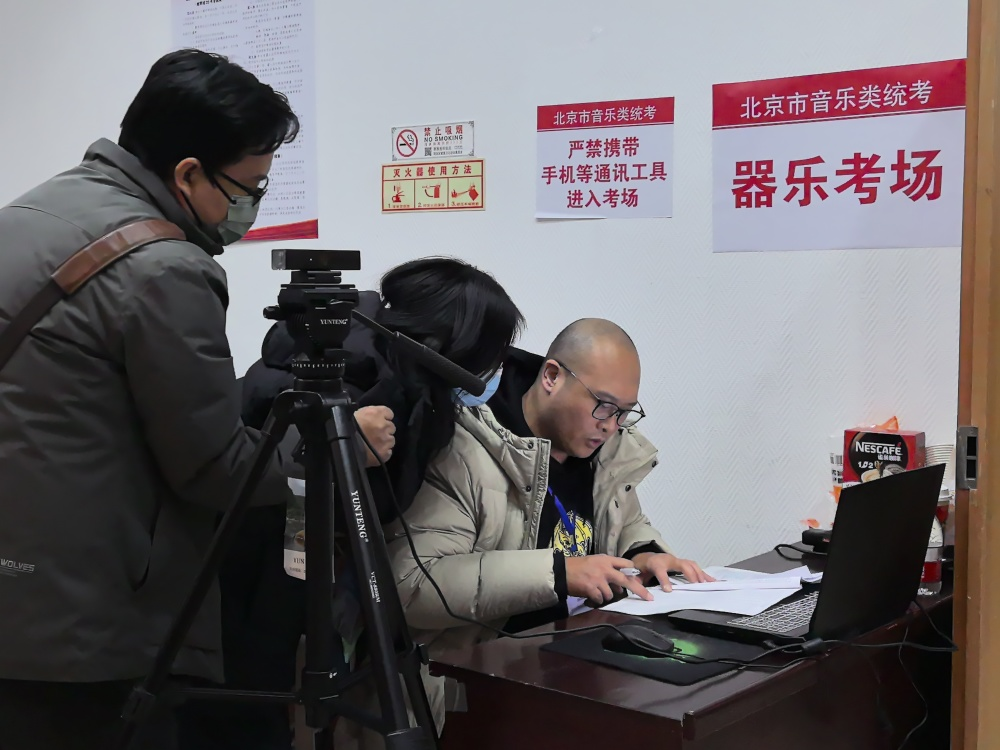
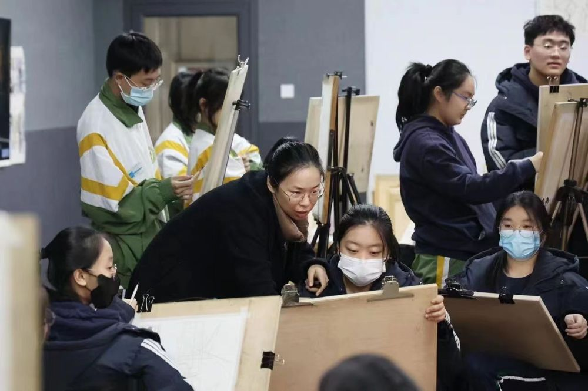
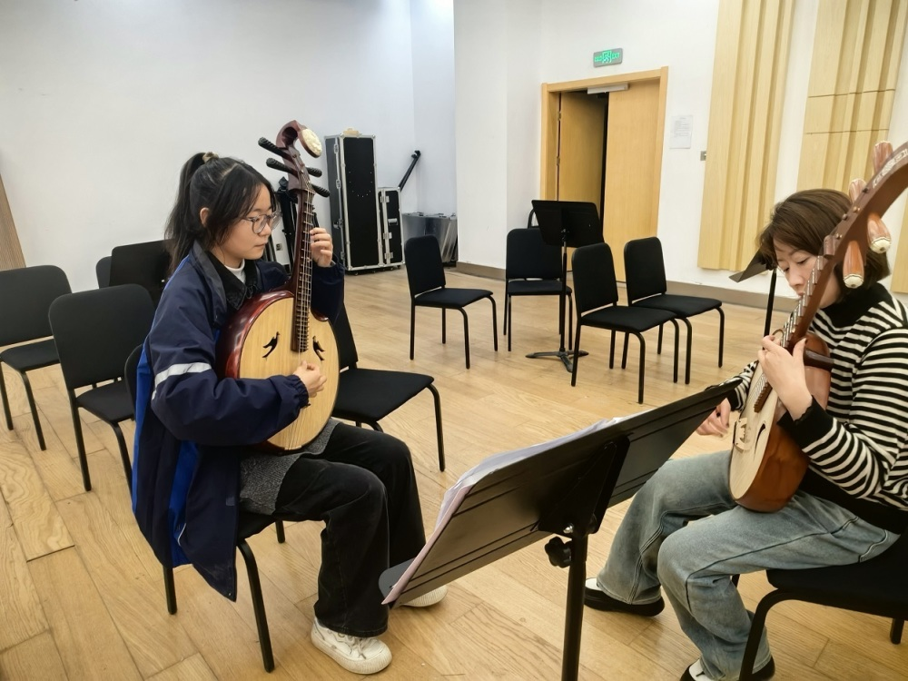

# 新华视点｜艺考改革全面落地，变化几何？

近期，各地陆续进入艺术类专业考试时间。20多个省份开启统考，一些省份部分科类考试结束。

2021年，教育部启动了艺考招生改革，2024年是艺考改革全面落地的第一年。如何挤干艺考“水分”？艺考呈现出哪些新变化、新特点？“新华视点”记者采访了业内人士。

**“文化课成绩不行靠艺考上大学”的路走不通了**

在原有艺考模式下，一些考生入学后因文化综合素养不足，专业发展受限。特别是部分明星文化课成绩明显低于普通考生，受到公众质疑。重视文化课是近年来艺考改革的总要求，也是新一轮改革的重要内容。

按照要求，使用省级统考成绩作为专业考试成绩的专业，2024年起，高考文化课成绩所占比例原则上不低于50%。同时鼓励高校进一步提高高考文化课成绩录取要求。

以往，山东省美术类专业文化课成绩占比为30%，浙江省舞蹈类专业文化课成绩占比为40%，河北省音乐类专业文化课成绩占比为30%，2024年都按50%执行。

北京考生小董是复读生，今年在文化课方面投入更多时间和精力。“文化课比重提升后，备考压力和难度增加了，两边都要考好才行。”小董说。

此外，艺术史论、艺术管理、非物质文化遗产保护、戏剧学、电影学、戏剧影视文学、广播电视编导、影视技术等8个艺术类专业不再组织专业考试，直接依据考生高考文化课成绩、参照考生综合素质评价，择优录取。

“对报考这几个专业的考生来说，文化课成绩高更有优势。”辽宁省实验中学美术教师赵旭波说，这样一来，相关专业的录取分数可能会被拉高。

广东考生林林说，有同学原本想报考相关专业，新要求出来后，因为文化课成绩不理想，就放弃了。

据东北师范大学美术学院教授王辉宇观察，文化课成绩好的学生，入校后能够较好适应美术专业学习，综合素质和能力也更为突出，在就业市场上体现出较强的竞争力。

**省级统考覆盖六大科类，规则趋向全国统一**

_12月2日，2024年北京市艺术类专业统考拉开帷幕。在中央民族大学音乐类考点，考务人员在进行人脸识别系统确认和考生信息核验。（中央民族大学供图）_

12月2日上午，北京市音乐类统考在中央民族大学举行。报考音乐教育专业的小曹感觉发挥正常，“音乐类是第一年统考，本来备考时还有些焦虑，后来发现考得比较简单。”

2024年起，各省艺术类统考一般分为音乐类、舞蹈类、表（导）演类、播音与主持类、美术与设计类、书法类等六大科类，戏曲类实行省际联考。此前，省级统考“各自为政”：北京市只有美术类统考，河北省美术类、音乐类和舞蹈类进行统考，一些省份设有编导类统考，湖南省统考大类多达10个。

甘肃省教育考试院普通高校招生处单招科科长何长福说，以往各省考试科类、内容设定、考试规则和标准规范不一。从各省发布的2024年考试说明来看，省级统考基本覆盖六大科类，考试内容、满分分值、具体要求等趋向全国统一，公平性、规范性提升。

统考进一步加强，对应的是校考规模和范围持续缩减。据统计，共有38所高校的部分艺术类专业开展校考，而2019年组织校考的高校有近百所，更早时期校考院校数量一度超过300所。

长春市柏辰艺术中学教学副主任宋闪算了笔账：改革前，学生参加完省统考后，还需要到多地参加校考，考试往往持续一周，报名费、食宿费、交通费至少上万元，时间、精力、金钱成本都很高。

吉林省考生付佳宁的意向学校取消了校考。“只参加省统考就没那么折腾，也减轻了家里的负担。”付佳宁说。

不过，也有少数考生和家长担心，一旦省统考没考好，可能无缘理想院校。中央美术学院招生办负责人对此表示，校考范围和规模逐渐缩小，更加聚焦于选拔具有突出艺术天赋的学生。少数校考院校和校考专业实行更精细化、多元化选拔，有助于解决艺术教育中特殊性和个性化的问题；在保障艺术类专业招生考试公平性的同时，兼顾了人才选拔的科学性。

**未来如何备考？**

艺考改革后，一些地区部分类别的省统考报名人数有所减少。安徽省教育招生考试院数据显示，2024年美术与设计类、音乐类和播音与主持类报名考生分别为2.4万人、0.49万人和0.18万人，2023年则为3.19万人、0.7万人和0.3万人。有艺考培训机构统计，四川省2024年艺术类考生规模近6万人，较2023年下降约10%。

兰州市第五十三中学美术教师王克蓉表示，以往因文化课成绩不理想而选择艺考的考生能占到80%，改革后艺考不“易”，想以此为捷径上大学越来越难，“这部分学生数量会逐渐减少”。

变化之下，该如何应对？

_11月，长春市柏辰艺术中学美术专业学生在备考。新华社记者李双溪摄_

长春市柏辰艺术中学舞蹈教师王月告诉记者，针对吉林省艺考省统考变化，学校在专业课方面加强了学生的基本功训练，增加一些舞蹈类型的练习，以适应即兴科目考试。“中国舞、芭蕾舞、国际标准舞、现代舞等都要熟悉，这样不管考什么，都可以随机应变。”王月说。

鉴于艺考改革对学生的综合素质、文化素养、生活观察能力提出更高要求，多位受访人士建议，考生平时要多积累、多观察、多收集素材，不能一味模仿，更不要死记硬背“模板”。

记者注意到，一些艺术类高中优化了专业课和文化课的教学时间配比，考生每周有更多时间学习和巩固文化知识。一些地区开始探索在艺考省统考、校考结束后，对考生提供不同类型的文化课程或进行集中辅导。

在兰州市第十四中学，音乐班招生时，老师会先问家长一个问题：孩子未来想做什么？该校音乐教师钟静说，学校会提前向家长讲清楚音乐类艺考的考试趋势、就业方向。她发现，因为文化课成绩不佳而学音乐的情况越来越少。

 _12月14日，兰州市第十四中学老师在给音乐班学生上课。（受访者供图）_

21世纪教育研究院院长熊丙奇表示，扎实的文化素养和艺术天赋同等重要，考生和家长要转变“以艺考为跳板”“曲线高考”的功利思维，不盲目跟风。

北京一所艺术类重点高校的招生办负责人建议，考生要提前了解考试新形势和新要求，对照本人兴趣特长、文化课成绩和专业课成绩，评估判断是否要参加艺术类考试。“一定要立足自己的兴趣，提早准备。真正喜欢艺术才适合去参加艺考。”

受访专家认为，艺考是选拔培养艺术专业人才的重要途径，新一轮艺考改革的全面落地，进一步纠偏“重专业轻文化”“临时速成”等功利化思维，逐步挤干艺考“水分”，有助于让更多真正热爱艺术、确有培养潜力的艺术人才脱颖而出，也将对艺术人才高质量发展产生积极作用。（记者宋佳、魏梦佳、李双溪、白丽萍）

