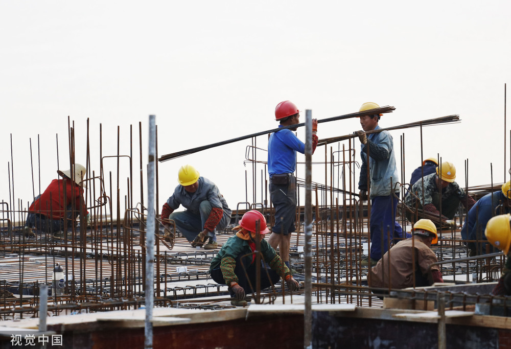

# 西南农民宁可在家养猪也不打工，华北农民为儿子结婚“喝稀饭就馒头”

**核心要点：**

  * _1_ 鄂西和西南地区的农民更重视对当下生活的享受，在家庭经济生活均衡还能维持的情况下，更愿意留在家乡。访谈中有父亲不愿意外出打工挣钱，在村里养几头羊和两头猪，过自己的生活，儿子因为家里经济困难，33岁还未结婚。
  * _2_ 华北农民迫于家庭责任和村庄舆论压力，在儿子未成年时就开始为他的婚姻大事谋划，储备结婚的经济资源，这些资源通常需要夫妻二人打工近十年才能攒够。他们外出务工时也更加吃苦耐劳，干最累的活，却喝稀饭就馒头。
  * _3_ 网友对鄂西地区农民“得过且过”的生活态度心有戚戚焉，很可能跟现在社会流行的“躺平”情绪有关。如果不是因为家庭责任下需要经济积累，大多数农民是不会出去打工的。躺平的年轻人也排斥工厂和写字楼里的异化劳动。

近日，武汉大学贺雪峰教授一篇题为[《秭归农民的消费》](https://news.qq.com/rain/a/20231211A07HHT00)的文章在腾讯新闻引发热烈讨论，文章提到鄂西农民在进城务工和返乡消费之间的特殊选择：常常出门打工四五个月就回来，回来后醉心于吃用和人情消费，“（村民）对打工都有一种半心半意，很少有人全年打工，更少全家出去打工”。

这样的生活态度和大众印象中农民吃苦耐劳肯做肯干的形象大相径庭，网友对此也反应不一，有人觉得打工后及时消费，自给自足无负担的生活很值得羡慕；有人则认为这是一种得过且过的懒汉行为，毫无人生规划，本质上是对人生的一种浪费。

为何贺教授笔下的农民工抱持这样的生活态度？是当地特有的现象还是全国普遍存在？如何理解不同区域和代际之间的农民工的人生选择以及相应的结果？

**腾讯新闻知识万象** 邀请海南大学公共管理学院 **吴海龙** 老师进行分享，以下是他的讲述。

**鄂西农民能不打工就不打工，满足当下生活的享受**

贺教授文章中提到的现象确实是湖北西部地区农民的生活态度。

农民工首先是农民，中国农民主要受家庭观念影响，一个地区农民的家庭观念强不强，家庭责任在性别和代际之间的分配决定了农民的工作和生活态度。

包括鄂西在内的西南地区农民的家庭观念相对薄弱，家庭绵延的传宗接代观念较弱，父辈们认为子代的婚配责任主要在于他们自己，而不是父代的义务，父代的责任是有限的，仅提供力所能及的物质支持。

在被问及儿子的结婚是谁的责任时，当地的中老年人大多会说：“下人结婚当然是他们自己的事情，他结婚又不是我结婚，肯定要靠他自己。我们农民家庭就是这么个情况，他有本事就不花钱自己找一个回来”。

相比于死后家庭的流传绵延，当地农民更重视对于当下生活的享受。我们曾经访谈过一位农民，他直截了当地说：“你们说这个世界上还有什么比吃和喝还要让人享受的事情呢！”。

相比于厚重的家庭责任意识，他们更注重自我的物质满足和进行轻松愉快的社交。他们在外打工时也更懂得享受生活，老乡们经常聚在一起吃饭，他们认为外出打工挣钱这么辛苦，再不享受生活，那人生就太没奔头了。

我们在调研中发现一个比较典型的案例，被调研人是湖北秭归的，33岁，初中文化，在江苏打工，每月四千元左右。他还比较会与人交谈，为人踏实肯干，每年能攒两三万。母亲因为生病，干不了重活，而父亲追求潇洒的生活，不愿意外出打工挣钱，在村里养几头羊和两头猪，过自己的生活，不操心儿子的婚事。因为经济困难，被调研人至今未婚。

**华北农民为儿子赚彩礼钱：干最累的活，喝稀饭就馒头**

和鄂西及西南地区形成对照的是华北地区。

华北地区彩礼较高，家庭经济条件在婚姻市场中起到决定性作用。华北农民为了完成人生任务，在儿子未成年时就开始为儿子的婚姻大事谋划。儿子上学后父母就要开始为儿子储备结婚的经济资源，包括农村的一栋楼或者城里的一套房，以及十几到几十万的彩礼。这些钱加起来有几十万，对农民而言数额不菲，通常需要夫妻二人打工近十年才能攒够。

在父辈积极主导的婚姻观念和实践下，村庄社会形成了较为一致的舆论观念，认为儿子结婚就是父母的事情和责任。当家庭出现儿子打光棍，父母就会承受巨大的心理和村庄舆论压力。村庄舆论会批评父母，批评他们没有尽到做父母的责任，不管儿子的人生大事。

在强经济负担下的华北农民对外出务工有着更长的规划，同时务工时也更加吃苦耐劳。我们在发达地区调研农民工时常发现，来自华北的农民工天天干最累的活，但是却喝稀饭就馒头，而隔壁贵州邻居工作三天打鱼两天晒网，还经常邀约朋友到家里吃大餐吃火锅。

相比于华北地区农民要承担婚姻的高额经济成本，西南地区的农民也就少了来自婚姻需求的建房和彩礼的几十万元支出。因为婚姻和村庄舆论压力，华北建楼房或者买房是刚需，而西南地区经济条件好的可以盖楼房，经济条件不好的把土房子修一修住着也很舒服。

西南地区农民因为少了华北农民这几十万元的婚姻成本支出，他们外出务工的主要动力就来自家庭生活中计划外的大额支出，比如生病、子女上大学、盖房子欠债、务农经商失败欠款，或者是在西南地区最常见的人情开支。

因此，在西南地区农民工身上应急性的临时务工表现比较突出。

东部地区的农民又是另一番景象，他们确实比较能吃苦耐劳。

我们调研中发现江苏张家港的农民已经有几套房子了，但是六七十岁的老人退休后普遍都在外打小工，两个老人一个月还能赚好几千块。

东部地区经济发达，农民家庭之间的经济阶层分化也大，所以不同于中西部地区为了完成家庭延续再生产，东部地区农民的经济压力主要来自阶层竞争，在家庭再生产基础上进一步发展和相互比较。

此外，发达地区之所以能成为发达地区和人的勤劳也是分不开的，家里哪怕衣食无忧也还是在天天工作，如果一天不工作就感觉生活缺了点意义感。

总体上西南农民“想得开”，人生没有什么是必须要完成的任务，华北农民则认为人生就是一场苦行，人生就是在履行一个个家庭任务中展开。

访谈中有两个画面给我留下了深刻印象：

第一个画面：我们住在贵州遵义一农户家，这家儿子刚中学毕业没工作，每天不着家，天天带着刚交的女朋友在外面耍。有一天我们正在吃饭，儿子带着女友回家看了眼家里的饭菜，然后转头又带着女友进城下馆子了。我们问这个父亲，父亲说：“年轻人爱耍好嘛！”

第二个画面：我们在关中平原访谈了一个红白喜事的总管，他指着刚从篮球场上回来的儿子说：“儿子还不成熟，每天高高兴兴嘻嘻哈哈的，他还不懂得人生的苦，懂得人生的苦才成熟。”

这两个父亲对子女和人生的态度一定程度上也体现了西南地区和华北地区的差异。

**农民工“得过且过”和年轻人“躺平”**

贺教授的田野调查发生在2015年前后，经过这么多年，尤其是脱贫工作的开展，这些地区农民进城务工和返乡生活的态度有什么变化吗？

从目前调研的情况看，脱贫工作对农民工打工和生活态度的影响不大。在这个巨变的时代，农村社会也发生了翻天覆地的变化，但这种变化主要发生在代际之间，同一代人的观念和价值观很难改变。

由于年轻人外出打工形成了全国通婚市场，当地女性外嫁，开始大量出现因经济条件不好而结不了婚的光棍，一些先知先觉的年轻父母，为了给儿子在县城买房，长时间外出打工。这些父母主要是三四十岁，他们的孩子至少还要十年才会结婚，但是看到村里这么多光棍后，他们开始着急了。

整体而言，这还只是当地少数先知先觉的父母的率先行动，目前还未形成如华北农村那样的村庄舆论——儿子未婚是父母的责任。

为什么很多网友对鄂西地区农民“得过且过”的生活态度心有戚戚焉？这可能跟现在社会流行的“躺平”情绪有关。

中国的95后00后生长在中国加入WTO后的经济高速增长期，但在他们成年后却兴起躺平文化，躺平文化也是一种后现代文化，都是对劳动异化的反思和抵制。

享受着工业文明物质成果长大的人，成年后未必喜欢工业文明中的劳动异化，并且工业文明成果还带给他们反对工业劳动异化的条件，市场经济中的自我意识强化，广泛联系的社会化大生产带来了开放多元的文化。

最重要的是年轻一代不用为了钱被迫接受进一步地劳动异化，西方是福利制度，年轻人享受的是前人和后人的物质财富，中国则是经济资源的家庭代际传递——啃老。工作躺平的年轻人放弃市场经济中的单一经济目的后可以在生活中开发很多兴趣爱好，他们或是逃避或是追求更丰富的人生。

对于鄂西及西南地区的农民来说，农业劳动比农民工的工厂劳动更具有丰富性和劳动主体性。如果不是因为家庭责任下需要经济积累，大多数农民是不会出去打工的。

包括秭归农民在内的西南地区农民在家庭经济生活均衡还能维持的情况下，更愿意留在家乡。还有些农民工出去打工几年厌倦打工生活后，通过返乡流转土地或者经商获取和在外务工差不多的收入。

躺平的年轻人也排斥工厂和写字楼里的异化劳动，不过他们还想在城市生活。秭归农民和躺平的年轻人都不喜欢城市的异化劳动，不过他们逃避的方式不同。

当然还有很多农民都向往城市生活，除了工业文明的异化劳动外，农民向往小农经济和个体户生产（大多数农民工都有创业梦）的劳动主体性，也向往城市的物质文明。

**第一代农民工和新生代农民工**

在更广泛的意义上，不同代际的农民工的思想观念和行为逻辑也发生了变化。

和早期农民面临的在农村吃不饱饭、没钱修房子的绝对贫困状况不同，当前绝大多数农民家庭通过外出务工或是经营新农业基本都过上了小康生活。新生代农民工更是在老一辈农民工的努力奋斗下过上了较为从容的物质生活：一方面他们不需要像父辈一样较早地承担较多的家庭经济压力，另一方面他们也缺乏那种吃不饱饭的危机感。

成长于这种家庭环境中的新生代农民工从小就不需要为家庭承担过多的劳动责任，他们中的很多人甚至从未干过农活。在家庭生活中，新生代农民工更多是作为一个受惠者存在，他们是被家庭抚育的对象，其主要责任就是努力学习、健康成长、发展自己。

也正是这种宽松和无须过多承担家庭责任的环境，使得新生代农民工的家庭责任意识相对较弱，形成了以自我为中心的价值观和以个体体验为中心的生活习惯。

他们初始的外出务工逻辑，尤其是未婚前的外出务工逻辑与老一辈农民工存在较大的差异，具有很强的自我体验特征。当然，在成家尤其是生育之后，新生代农民工在家庭经济压力驱使下也会逐渐像父辈一样勤勉。

**版权声明：本文系腾讯新闻知识万象独家稿件，未经授权，禁止媒体转载。欢迎个人转发至微信朋友圈。**

