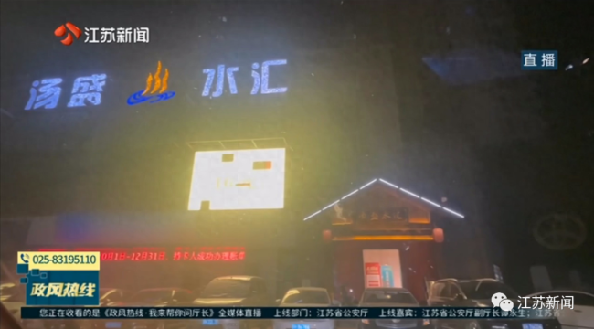
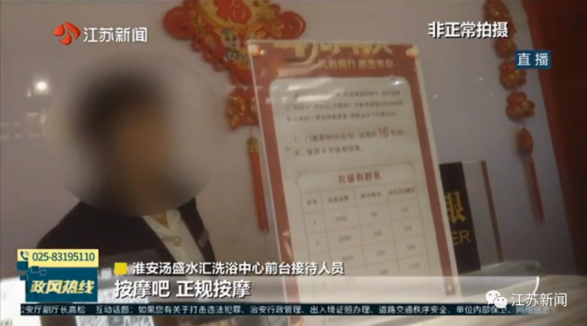
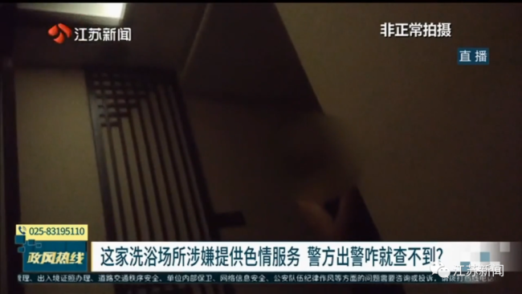
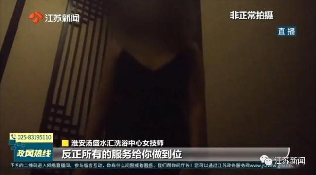
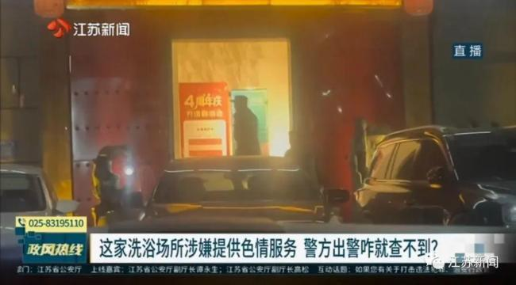
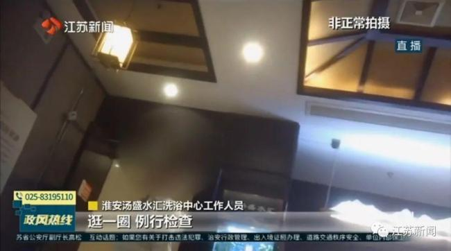
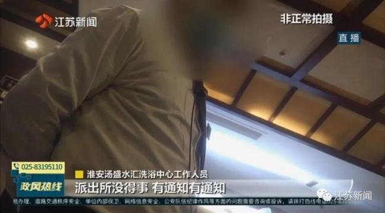
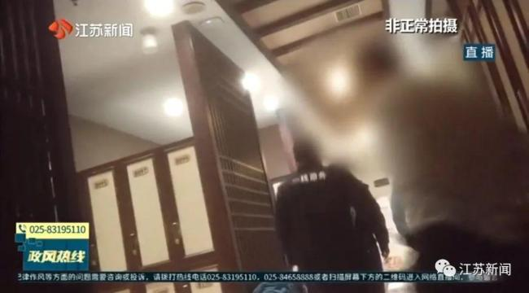
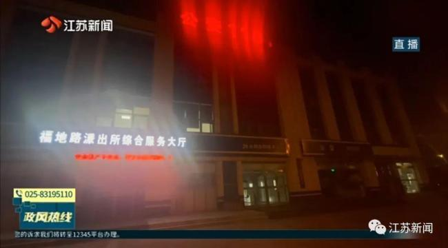

# 记者举报洗浴中心，警方出警无收获，派出所：做什么要向举报人交代吗

最近，有淮安市民反映：当地生态新城区有一家洗浴场所，长期违法提供色情服务，经营期间曾被市民举报，警察也曾经上门调查，但该场所却一直能够正常经营。

这究竟是怎么回事呢？

“汤盛水汇正常营业的，里面可以洗澡的，洗完澡了拿一身衣服给你，你就可以上楼，上楼了以后就有人给你安排，安排色情服务就来了，都是违法的。”知情人表示。

知情人还介绍，这家洗浴场所已经开了好几年，一直以开澡堂为名提供色情服务，而且这里距公安局就一两公里，只要一报警老板就知道，“他都知道了，内部有人员报信，他都知道了还怎么查。”

事实情况真的如此吗？11月28日晚上21时许，记者以消费者的身份来到这家“汤盛水汇洗浴中心”，在入口处的醒目位置，店方打出了：店庆四周年，门票原价58元，现价16元的广告。

淮安汤盛水汇洗浴中心前台接待人员表示，澡资16元，还有足疗、采耳，按摩也是正规按摩。

记者简单洗浴之后，来到了二楼休息区，很快被服务人员安排到了一间单独的包间。一名衣着暴露的女技师推门而入，堂而皇之地向记者介绍按摩项目。记者询问是否有项目的名单可以浏览，该技师表示没有单子，只有两个价格。

在攀谈中，另一位女技师向记者介绍，为了避免洗浴消费价格过高，引人怀疑，一般都是通过小费的方式，用微信等工具直接向女技师支付。

“反正所有的服务给你做到位，就是付200元小费给我们，我们给你所有的服务做到位，我出去给你打消费单子，打319元的单子就行了，然后包间里面你付200元小费就行了，扫微信也行，总共519元。”

核实情况之后，当晚22点15分，记者拨通当地110报警电话举报此事。但是令人意外的是，属地所在的福地路派出所相距该洗浴场所仅仅两公里左右，但是民警却在21分钟之后，也就是22点31分才来到该场所执法检查。

面对警察的到来，现场工作人员却显得无所谓，还催促记者到楼下与女技师会合，去场所之外提供色情服务。

“技师在楼底下等你呢，没得事，例行检查，逛一圈例行检查，有事的话怎么来两个人呢，一个辅警一个正式警察，人家来例行检查。”

“警察正常是一个月来一次，没得问题，到这里查的是派出所，派出所没得事，有通知有通知，今天肯定通知了。”

记者注意到，一位民警和一位辅警到场检查5分钟之后，22点36分离开了该洗浴场所。

23点14分，记者拨通了出警到场的福地路派出所了解查处情况，却被告知到现场的人还没有回来。当记者想要一个最终答复时，也遭到拒绝，“
**为什么要给你一个答复呢，我们做任何事情还要向你们报警人做交待啊** ，到现场发现了该怎么处理就怎么处理，如果没发现那就是没发现知道吧。”

当晚23点47分，记者再次拨打福地路派出所值班电话，追问调查结果，“检查得怎么样，你到我们派出所来，你把这个情况直接向他咨询一下，你问一下民警为什么没发现好不好？”

当记者询问是否有办公电话可以咨询时，得到了“没有”的答复：没有，你要么就到我们派出所来好吧。

据海峡网

