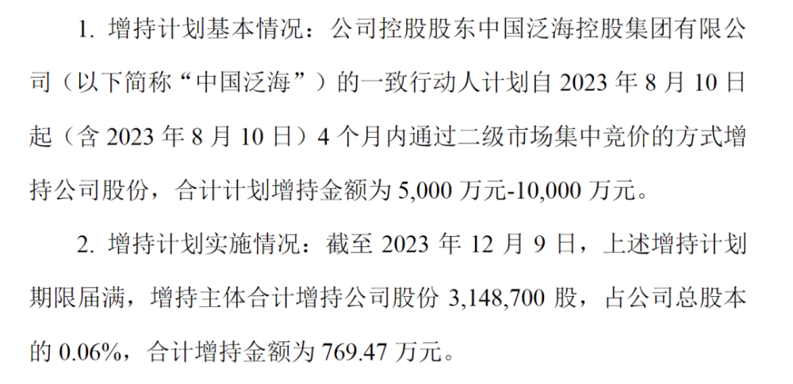
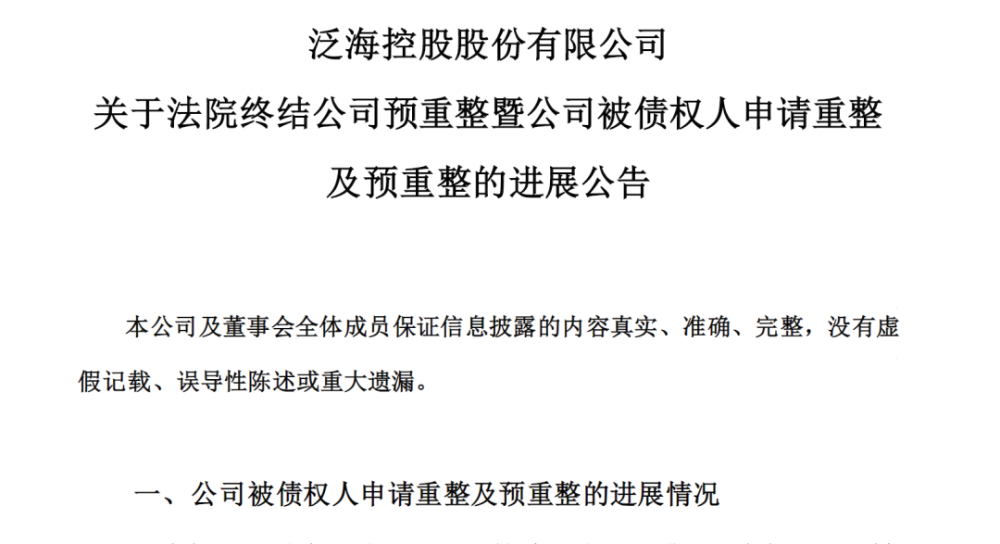

# 3年亏了340亿，千亿地产巨头泛海控股锁定退市，老板身家曾力压许家印

7年前还是中国前十大富豪，身家一度力压许家印的地产大佬卢志强及其一手打造的“泛海系”最终还是没等来好消息。

*ST泛海（以下简称泛海控股）近日公告称，公司预重整期间，临时管理人北京市中伦律师事务所经调查发现，泛海控股作为上市公司已不具备重整可能，并申请北京市一中院终结泛海控股预重整程序。据此，北京市一中院决定：终结泛海控股预重整。

预重整失败，再加上泛海控股三季度末的财务数据并未改善，使该公司股票面临的退市风险大增。从2020年到2022年，泛海控股归母净利润分别亏损46.2亿元、112.5亿元、115.4亿元，总资产从1800多亿元下降到1052亿元。今年前三季度，泛海控股归母净利润为亏损68.9亿元。从2020年至今3年多的时间里，泛海控股已经亏损超340亿元。三季报显示，截至2023年9月末，归属于母公司股东的净资产为-120.54亿元（未经审计）。

不过，在触及财务类退市指标前， **泛海控股已提前锁定了面值退市** 。而 **卢志强本人如今也已成为被执行人，被限制高消费** 。

**打了大半年“1元保卫战”终失败**

**已提前锁定面值退市**

泛海控股自11月30日以来，已连续11个交易日收盘价低于1元面值，最新收盘价报0.59元/股，总市值跌至30.66亿元。

按照交易所规定，如果公司股票连续20个交易日每日收盘价均低于1元/股，交易所将终止其股票上市交易。以12月14日收盘价0.59元为基准，在剩余的9个交易日内，公司股价即使每日涨停也无法重返1元。这意味着，
**泛海控股已提前锁定面值退市** 。

15日开盘，泛海控股再次跌停。

今年以来，泛海控股已经历了多次惊心动魄的面值保卫战。

4月14日，泛海控股股价首次跌破1元面值，短短9个交易日，股价一度触及最低点0.77元。面对“连续20个交易日成交价低于1元”的退市生死线，泛海控股管理层多次出手护盘，将股价生生拉回到1元以上。

5月4日，泛海控股公告称，公司股票收盘价连续11个交易日低于1元/股。与此同时，公司部分董事、监事、高级管理人员计划自5月5日起（含）3个月内，通过二级市场集中竞价的方式增持公司股份，拟增持金额合计不低于3000万元。

增持的原因，是基于对公司资产价值的高度认可和未来发展前景的坚定信心，为支持公司相关工作开展，同时为增强广大投资者信心。

增持的高管分别是董事长栾先舟（不低于600万元），副董事长、总裁兼财务总监刘国升（不低于600万元），以及臧炜、潘瑞平、李书孝、赵英伟、冯壮勇、罗成（均不低于300万元），均为公司董事、监事或高级管理人员。同时，控股股东中国泛海的一致行动人通海置业、华馨资本同步增持2500万元~5000万元。

5月11日，泛海控股的股价重新站上1元生死线。此后数月中，管理层和大股东陆陆续续真金白银地定格增持，一度打消了外界质疑，泛海控股的股价完全脱离了1元生死线。

但事情似乎从9月25日晚开始发生了一些变化。当日晚间，泛海控股公告称，于9月22日（百慕达时间）在百慕达法院进行的聆讯上，百慕达法院对中泛控股颁布清盘令，后者系泛海控股境外子公司。到10月31日，泛海控股公告，由于截至2023年9月末的资产负债率为108.26%，超过90%，触发了投资者保护机制。

11月24日，根据公告，泛海控股原计划将10月份美元债剩余本金约2.102亿美元延期至2023年11月23日前兑付，考虑到公司目前流动性安排和资产优化处置进展，上述债券未能如期于2023年11月23日兑付。公司将继续与债券持有人就10月份美元债偿还方案进行友好协商，筹集资金争取尽快支付10月份美元债截止到2023年11月23日的利息，并计划将10月份美元债进一步延期至2024年5月23日前兑付。

截至11月28日，除已披露过的诉讼、仲裁案件外，泛海控股及控股子公司连续12个月内累计诉讼、仲裁涉案金额合计56267.24万元，占公司最近一期经审计净资产（绝对值）的10.30%。

此后，泛海控股的股价便一路向下，再难回头。

雪上加霜的是，公司之前公布的增持计划也未能如期完成。

此前，公司控股股东中国泛海控股集团有限公司的一致行动人计划自2023年8月10日起（含2023年8月10日）4个月内通过二级市场集中竞价的方式增持公司股份，合计计划增持金额为5000万元-10000万元。然而12月11日，泛海控股公告称，截至2023年12月9日，上述增持计划期限届满，受自身资金压力及融资渠道不畅等因素影响，本次计划增持主体在承诺期限内增持金额未能达到增持计划的金额下限，合计增持金额仅为769.47万元。

**重整宣告失败**

**分析人士：可能面临破产的命运**

今年4月21日，狮王资产以泛海控股不能清偿到期债务，资产不足以清偿全部债务且明显缺乏清偿能力，但具备重整价值为由，向北京市一中院申请对公司进行预重整。4月27日，北京市一中院决定对公司启动预重整。

6月30日晚间，泛海控股公告称，公司预重整工作全面有序推进，正在积极开展债权申报与审查、财产调查、审计与评估、主要债权人沟通、重整投资人公开招募等事项，已有13家意向投资人提交报名材料。公司下一步将配合缴纳保证金的合格意向投资人开展尽职调查，并积极开展投资方案磋商等相关工作。

然而，12月1日晚间，泛海控股公告称，根据北京市一中院出具的《决定书》，预重整期间，临时管理人经调查发现泛海控股作为上市公司已不具备重整可能，并申请北京市一中院终结泛海控股预重整程序。据此，北京市一中院决定终结泛海控股预重整。

据21世纪经济报道，分析人士认为， **这也基本宣告了泛海的终局，即可能面临破产的命运** 。

与此同时，深交所向泛海控股董秘陆洋发出监管函，指其对泛海控股相关违规行为负有责任，主要包括泛海控股重大债务逾期未及时披露，部分债务融资信息披露不完整、不准确且决策程序不符合相关规定，未及时披露子公司股权质押的情况等。

**实控人曾是中国前十大富豪**

**身家一度力压许家印**

作为“泛海系”的掌舵人，卢志强1952年出生于山东威海，1985年“下海”创业。1998年，卢志强旗下的光彩事业投资集团有限公司借壳上市。此后，经过股权变更，公司股票简称从光彩建设变为泛海建设。

房地产一度是泛海的主营业务。到2013年，泛海建设的房地产销售收入为人民币58.44亿元，公司项目分布在北京、武汉、上海、深圳、杭州、青岛、大连及美国洛杉矶等多个国内外城市。

2014年初，泛海控股董事会作出企业战略转型发展的决策，由单一的房地产上市公司向涵盖金融、房地产、战略投资等业务的综合性控股上市公司转型，公司名称也变更为泛海控股。

此后，泛海便开始不断购入金融资产。仅2014年，泛海便收购了民生证券约73%的股权（后来持股比例一度达87.65%），发起成立民间投资平台公司中民投，并参与增资大股东旗下信托平台民生信托，间接持有25%股权。在香港市场，泛海控股则收购了李嘉诚旗下的和记港陆71.36%股权，即后来的中泛控股。2015年，泛海控股收购香港上市公司时富金融服务集团有限公司40.71%股权，并以不多于17.85亿元收购民安财产保险有限公司部分股权，进军保险业。2016年，泛海又斥资75亿元增持民生银行，并投资设立民生金服控股、增资民生期货等。

短短三年间，泛海已涉足银行、证券、信托、保险等行业，金融板块初具雏形。

卢志强重返台前，也展现了泛海控股发力金融领域的决心。2014年1月，卢志强的泛海建设董事长任职期满，韩晓生接任，期限为三年。但仅仅一年多后的2015年5月，卢志强重新当选董事长。同时，来自银行、证券、保险等金融领域背景的多名高管进入董事会。

新董事会对泛海控股的机构设置进行了调整，设立十一个职能管理部门及八个产业集团总部。其中，八大产业集团涵盖互联网金融、保险、证券、信托银行、资本投资、电力、房地产开发和不动产投资管理。时值中国企业“出海”热潮，泛海也加码海外资产，陆续收购了美国洛杉矶、夏威夷等地的地产项目，及印尼电厂项目、美国通用金融公司（Genworth）、美国国际数据集团（IDG）等。在此过程中，泛海减少了在国内房地产领域的新增投资。

从收入规模及构成看，彼时泛海的转型是成功的。2014年，房地产业务营收占总营收的比重超75%，金融证券业务占比则为20.4%。2017年，金融板块营收首次超过房地产板块。到2020年，房地产业务营收占比一度下降至15.19%。截至目前，泛海控股的营业收入构成为保险行业占比56.15%，房地产开发与经营业占比42.72%，信托行业占比0.59%，证券行业占比0.31%。

2014年到2020年，泛海控股的营收规模从80.8亿元增长至140.6亿元。而卢志强的个人财富也随之水涨船高，
**在2015和2016年连续进入《胡润百富榜》前十，身家力压许家印** 。截至2020年，卢志强身家依然高达620亿元，排名第66。

“奢侈”的收购行为也伴随着高昂的代价。自2014年转型以来，泛海控股的负债总额快速攀升，并在2018年底达到了1836.7亿元。虽然当年泛海的资产规模超过2000亿，但其资产负债率仍然保持在80%以上。

2017年，泛海布局的房地产和金融业都面临政策环境的变化。当年年初，房地产调控深化，市场交易随后降温。同时，随着对各种金融乱象的打击，严监管成为金融领域的主题，并延续到2018年。

此时，泛海控股的资金状况也出现问题。受政策环境影响，2017年泛海控股筹资活动产生的现金流量净额大幅减少74.2%。到当年年末，泛海控股的短期负债（一年内到期）约为335亿元，公司现金流仅为180亿元。

祸不单行。踩雷武汉金凰珠宝80亿元假黄金案，加剧了泛海的困难，也被认为是公司债务危机的导火索。2020年5月，民生信托收到武汉金凰珠宝质押黄金检测结果，一桩83吨假黄金案由此揭开。金凰珠宝凭借这些表面镀金、内部成分为铜合金的假黄金共获取了金融机构约200亿元融资，其中民生信托涉及40.74亿元。在多方压力下，民生信托及其他涉事信托机构对投资人进行垫资兑付，这也导致泛海控股2020年度计提约25.2亿元信用减值损失，占其利润总额的比重达56.1%。叠加对海外部分项目及商誉计提减值准备、武汉房地产项目受疫情影响收入未达预期、汇兑损失，泛海控股于2020年由盈转亏。

此外，民生信托还多次“踩坑”，遭遇了“中建五局萝卜章事件”、新华联债券逾期、宝能信托违约等一系列事件。

除去“踩坑”的因素外，泛海旗下的金融业务盈利能力并不理想。例如，2019年至2020年，保险业务是其最大的营收来源，但该业务毛利率分别为1.59%、2.82%，远低于其他业务板块。随后两年，这一指标则为负值。2021年初，泛海控股旗下的民生财富出现到期无法兑付的情况，宣告“爆雷”。

为缓解资金压力，泛海控股很早就开始出售资产进行回血。2019年初，泛海控股将“捂”了十几年的北京泛海国际居住区1号地块和上海董家渡项目出售给融创，彼时泛海称，这标志着“公司地产业务去化进入实质性阶段”。但明眼人一望便知，回笼资金才是其更迫切的需求。2021年初，武汉的一宗项目被转让，总价为30.66亿元。此外，泛海控股还将浙江项目及多个海外项目出售。金融资产也被出售。以被视为“泛海旗下最优质金融资产”的民生证券为例，由于泛海控股对山东高速的12.6亿元债务逾期未还，今年3月，泛海控股持有的民生证券34.71亿股股权上架法拍平台，起拍价约58.65亿元，最终国联集团以91.05亿元拍下。叠加此前的主动出售行为，截至今年6月底，泛海控股持有的民生证券股份占比已降至31.23%。
另外，泛海控股持有的民生信托、民生银行等金融资产股份也主动或被动地进行了出售，但也是杯水车薪。

随着控股子公司武汉公司、民生信托、亚太财险等公司的部分股权或其名下部分财产被法院采取冻结、查封等措施后，泛海控股的自救在一定程度上已被打了死结。

**曾经风光无限，身家力压许家印的卢志强如今也已成为被执行人，被限制高消费** 。而今年的《胡润百富榜》中也已经找不到他的名字了。

**编辑|** 段炼 易启江 杜恒峰

**校对|** 程鹏

每日经济新闻综合自上市公司公告、证券时报、每经网（记者：陈梦妤）、21世纪经济报道、胡润百富、企查查、公开资料等

每日经济新闻

