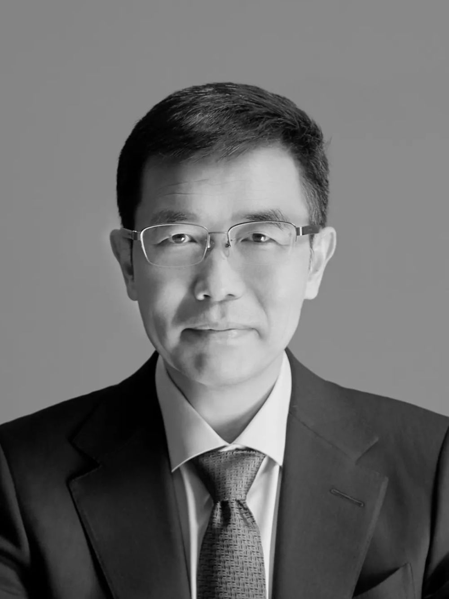

# 一线｜中国AI领军人物、商汤科技创始人汤晓鸥因病离世，享年55岁

腾讯新闻《一线》 作者 刘鹏

**17点14分更新：**

**讣告：汤晓鸥因病救治无效去世**

12月16日下午，商汤科技发出讣告。[详细>>>>](https://news.qq.com/rain/a/20231216A065K900)

我们怀着无比沉重的心情，向大家宣布一则令人悲痛的消息：我们敬爱的创始人、人工智能科学家、浦江实验室主任、上海人工智能实验室主任、香港中文大学教授汤晓鸥因病救治无效，于2023年12月15日23时45分，永远离开了我们。

汤晓鸥教授是我国人工智能领域的杰出代表。他学识渊博、治学严谨、求真务实、开拓创新，富有家国情怀和战略眼光。他甘为人梯、奖掖后学、矢志创新、勇担重任，把全部精力奉献于计算机科学研究，积极推动原创技术发展，为我国人工智能领域科技事业发展做出了卓越的贡献。他二十多年来悉心培养学生，桃李满天下。他们将传承汤晓鸥教授的精神和理念，在发展人工智能的道路上勇往直前。

在这个悲伤的时刻，我们向汤晓鸥教授的家人表示最深切的慰问！汤晓鸥教授的智慧、热情和对科学无尽的探索，将永远激励着我们不忘初心，砥砺前行。他制定的公司使命“坚持原创，让人工智能引领人类进步”将激励所有商汤人，勇攀高峰，去完成他未竟的事业。愿汤晓鸥教授安息！

**睡梦中不幸离世**

12月16日，腾讯新闻《一线》从多方信源处了解到，商汤科技创始人、人工智能科学家汤晓鸥于12月15日在睡梦中不幸离世，享年55岁。

汤晓鸥的不幸离世也引来业界人士纷纷哀悼。12月16日下午，商汤科技香港公司总经理尚海龙发朋友圈称，巨星陨落，天妒英才，沉痛悼念。

**中国人工智能领军人物**

根据公开信息介绍，汤晓鸥1968年出生于辽宁鞍山，香港中文大学信息工程学系教授、工程学院杰出学人，主要从事计算机视觉相关领域的研究，包括多媒体、计算机视觉、模式识别及视频处理，是全球人脸识别技术的“开拓者”和“探路者”，亦是商汤科技创始人。

他的个人经历主要为：

1990年从中国科学技术大学毕业；1991年获得美国罗切斯特大学硕士学位；

1996年获得麻省理工学院博士学位，之后进入香港中文大学工作；

2001年创立了香港中文大学多媒体实验室；

2005年至2007年在微软亚洲研究院工作，担任视觉计算组主任；

2008年在深圳先进技术研究院多媒体集成技术研究室工作，担任主任和研究员。

根据介绍，2009年，他依托深圳先进技术研究院搭建联合实验室，被电机及电子工程师学会（IEEE）推选为会士。同年，汤晓鸥与他的博士研究生何恺明，以及微软亚洲研究院的孙剑博士，凭论文《基于暗原色的单一图像去雾技术》获得顶尖国际会议IEEE计算机视觉与模式识别大会（CVPR）该年度的“最佳论文奖”。这是该会议创办25年后，首次有亚洲学者获得这项最高的荣誉。

2014年3月，汤晓鸥团队发布研究成果，基于原创的人脸识别算法，准确率达到98.52%，首次超越人眼识别能力（97.53%）。2016年，汤晓鸥领军的中国人工智能团队，入选世界十大人工智能先锋实验室，成为亚洲区唯一入选的实验室。

根据公开信息，汤晓鸥文艺天分也很强。一篇文章介绍他称，在微软亚洲研究院期间，汤晓鸥被一致推选为研究院文工团团长，兼团委书记，连续三年出任研究院年度文艺晚会主持人。他的演艺生涯开始于研究院，也是在研究院达到顶峰，为此，他为自己起了个艺名叫“小o”。小o的名言是：“看事物要一分为二，任何事物都有两个方面，有可笑的一面，同时也有更可笑的一面”。

**人工智能领域桃李满天下**

在2023年7月的世界人工智能大会开幕式发言中，汤晓鸥分享了三名学生王晓刚、何恺明、林达华在深度学习领域追梦的故事，强调了中国年轻学者在人工智能大模型研究中所作出的原创贡献。

从历史事件来说，2018年度三位图灵奖获得者，共同开启了深度学习的大门；而按下第一声门铃的是2011年在深度学习语音识别上划时代的突破，此后2012年在图像识别比赛中取得了另一个划时代的突破。

2011年到2013年深度学习刚刚开始的时候，汤晓鸥和他的学生在做什么，他想起的第一个学生是王晓刚。

据汤晓鸥介绍，王晓刚本科是中国科大少年班和00班的第一名，硕士期间在汤晓鸥实验室就读，博士期间在MIT（麻省理工学院）读书，2009年毕业后回到香港中文大学，在汤晓鸥实验室做教授。2011-2013年CVPR（国际计算机视觉与模式识别会议）和ICG（计算机视觉国际大会）两个视觉领域最重要的会议上，全球共有29篇文章涉及深度学习，其中有14篇出自汤晓鸥的实验室。

“我们有18项工作在全世界第一次将深度学习用到视觉问题上，包括人脸识别、人脸检测、人脸重建、物体检测、人体姿态、图像超分、三维形状识别等计算机视觉最核心的问题。在深度学习的大门上，我们按了18次门铃。”汤晓鸥说到。

他也介绍，王晓刚做的第二项工作，他在人脸识别方面，让机器做的人脸识别超过了人的眼睛，这比Facebook做得还要早。第三项工作，2015年王晓刚带队取得了中国学者第一个ImogeNet（一个基于图像分类和物体识别的国际竞赛）世界冠军，当年他们的对手是谷歌的团队。

第二个学生是何恺明，据汤晓鸥介绍，何恺明是2003年广东高考状元，本科就读清华大学物理专业，博士在香港中文大学汤晓鸥实验室取得，他在2009年发了第一篇文章，取得了CVPR最佳论文，这是该会议25年历史上从亚洲出来的第一篇最佳论文。

“我跟何恺明开玩笑，你一出手就到了巅峰，从此以后你的学术生涯就只能往下走了。结果他去微软和Facebook工作以后就一路走高。”汤晓鸥说。

何恺明的第一项工作是在MSR（微软研究院）做的。汤晓鸥称，在2015年之前深度学习最多只能训练到20多层，但何恺明在网络的每一层引入了一个直联通道，从而解决了深度网络梯度传递的问题，获得了2016年的最佳论文。在这之后可以有效的训练超过百层的深度学习，把网络打的非常深。

汤晓鸥表示，在大模型时代，以Transformer为核心的大模型，包括GPT系列，普遍采用了这个结构，以支撑上百层的堆叠。“我想总结起来，何恺明把网络做深了，谷歌把网络的入口拉大了，才成就了今天的大模型。”

何恺明的第二项工作Mask R-CNN，是在Facebook做的，首次提出了一个真正高性能的物体检测和算法框架，获得了ICCV
（计算机视觉国际大会）2017年最佳论文。

汤晓鸥称，何恺明应该是世界上唯一一个在毕业不到十年内，三次以第一作者的身份获得CVPR、ICCV最佳论文的人。他首次把基于原码的自编码思想用于视觉领域的非监督学习，开启了计算机视觉领域自监督学习大门，并被推广到三维、音频甚至是AI领域。

第三个学生是林达华。据汤晓鸥介绍，他本科就读于中国科大，硕士是在香港中文大学，博士是MIT。2010年在MIT读博士期间，林达华获得NIPS最佳学生论文，2014年回到汤晓鸥的实验室做教授。

林达华的第一项工作是OpenMMLab。汤晓鸥表示，他们在2018年从一个小团队开始，在没有推广投入的情况下，以口口相传的形式成为国际上最具影响力的视觉算法开源体系，目前用户遍及全球140多个国家和地区。

他的第二项工作是“书生·浦语”。汤晓鸥介绍，这是国内首个正式发布千亿参数、8K的多语种大语言模型。

林达华的第三项工作是LandMark，其是全球首个城市级实景三维大模型，有2000亿参数，覆盖100平方公里。

“我想回头看，王晓刚在深度学习兴起的最初几年，洒下了很多原创的种子；何恺明将深度学习的根基打的非常牢、非常深；林达华通过开发大模型，让它枝繁叶茂。”汤晓鸥评价。

让他非常欣慰的是这棵大树已经开始开花结果，汤晓鸥说，就在两周前，他们自动驾驶大模型从9155篇文章中脱颖而出，获得了CVPR2023年的最佳论文奖。根据谷歌学术统计，这是改革开放40多年来第一篇全部由中国学者完成的国际计算机视觉三大顶会的最佳论文。

